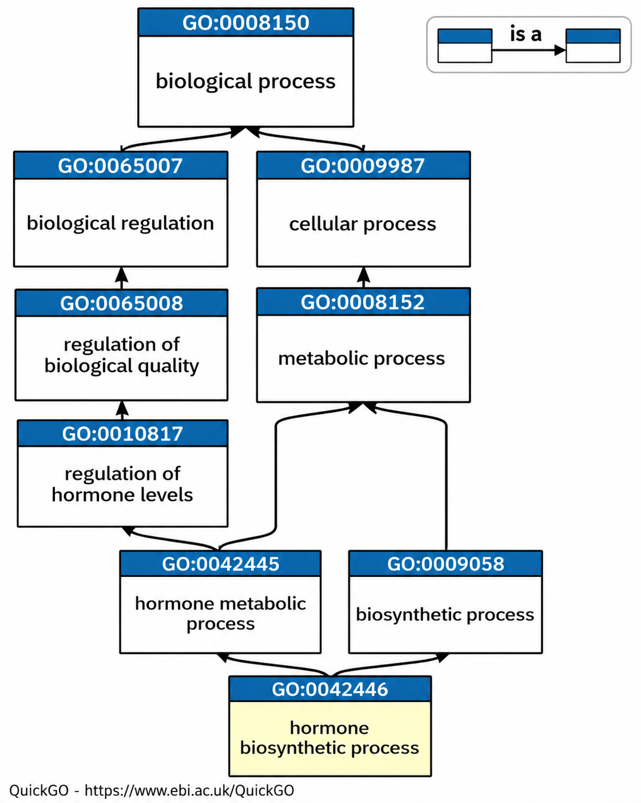
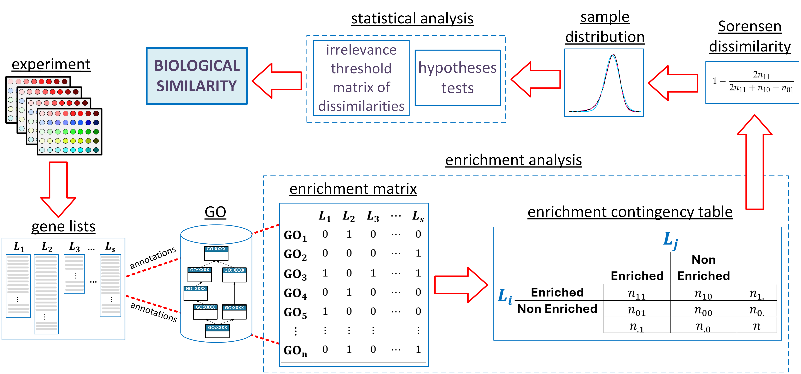
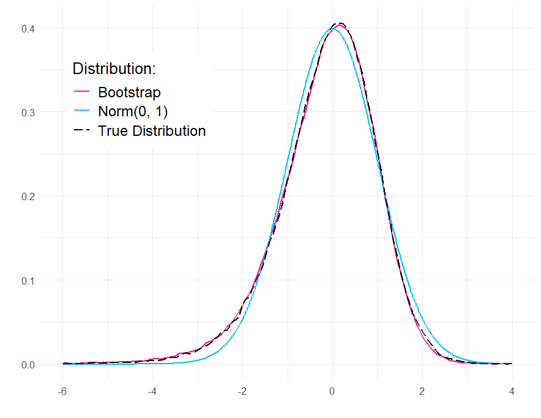
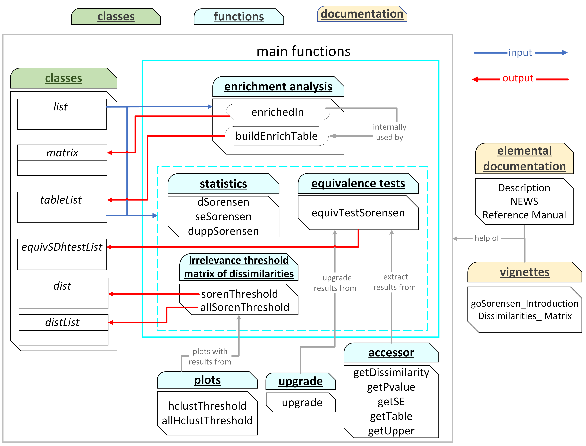
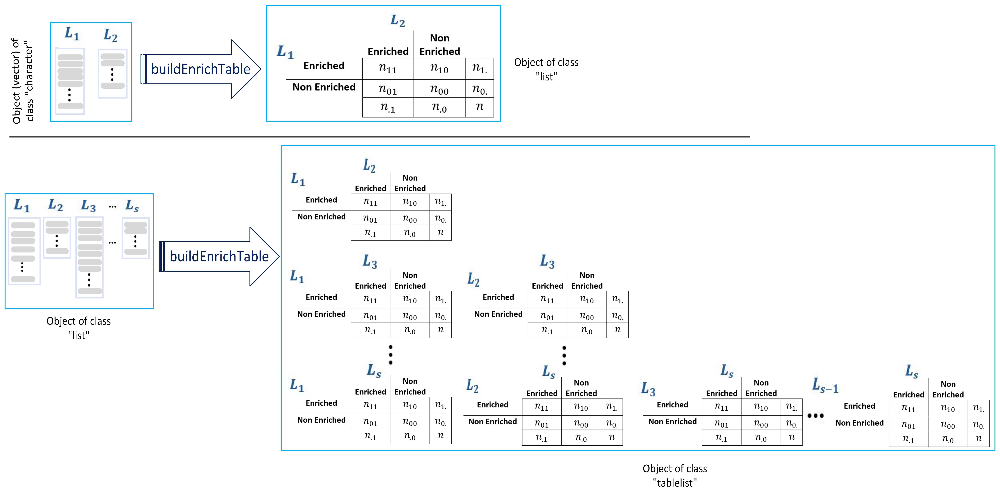
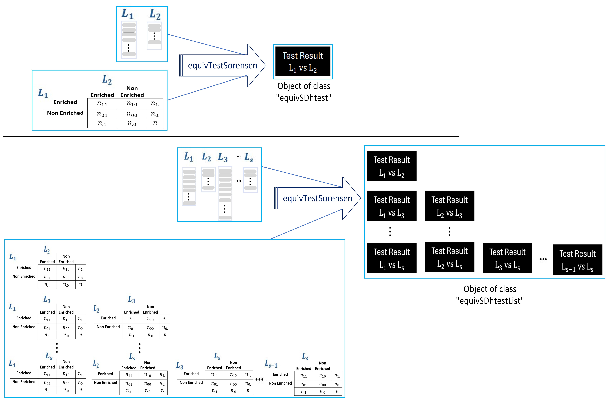
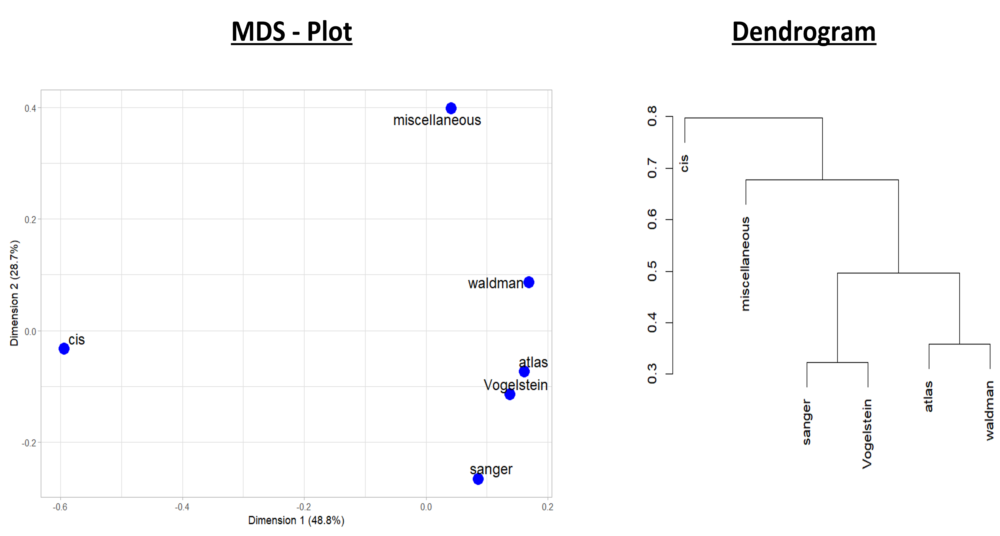
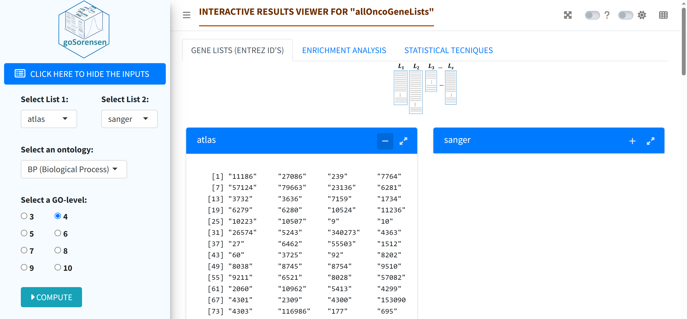

```{r setup, include=FALSE}
knitr::opts_chunk$set(echo = FALSE, warning = FALSE, message = FALSE)
library(goSorensen)
library(org.Hs.eg.db)
library(plotly)
library(htmltools)
library(DT)
humanEntrezIDs <- keys(org.Hs.eg.db, keytype = "ENTREZID")
```

# Introduction

Since the introduction of microarrays [@schena1995quantitative; @nguyen2002dna], high-throughput omics technologies have advanced substantially, leading to the development of more advanced technologies such as RNA-seq [@chu2012rna; @van2019rna], single-cell sequencing [@jovic2022single], and other recent ones, which have transformed modern biology and medicine [@lee2023principles; @negi2022applications].
These high-throughput experiments allow us to study the behaviour of hundreds or thousands of genes (or proteins, metabolites, etc., often referred to as  "features" in a general way) under different experimental conditions, resulting in lists of these features (e.g., a list of differentially expressed genes in a health condition) with critical information to solve relevant problems, such as the detection of bio-markers, drug development, molecular sub-classification of cancer, clinical applications, personalised medicine, among many others [@climente2017functional; @cieslik2018cancer; @pedersen2016clinical; @jain2004applications].

Although obtaining feature lists is an important first step, a comprehensive study should also include a functional analysis to elucidate the biological significance of these data. External biological knowledge databases, such as Gene Ontology GO [@ashburner2000gene; @gene2023gene], Kyoto Encyclopedia of Genes and Genomes KEGG [@kanehisa2000kegg; @kanehisa2025kegg], Reactome [@jassal2020reactome], etc., serve as foundational resources for this purpose, enabling researchers to associate features in the lists with biological concepts or pathways and thereby gain meaningful insights into underlying mechanisms.

In particular, the \BIOpkg{goSorensen} R package focuses on the functional comparison of gene lists using the Gene Ontology (GO) as a framework for representing biological knowledge. The GO is a structured, standardised representation of biological knowledge in which biological concepts, known as GO terms, are connected through formally defined relationships. It is designed to be species-agnostic, allowing gene products, such as the proteins or functional RNAs encoded by genes, from different organisms to be annotated using a common vocabulary and facilitating the comparison and integration of functional information across biological databases.

The GO is organised into three aspects, or sub-ontologies: Molecular Function (MF), Cellular Component (CC), and Biological Process (BP). Molecular Function terms represent molecular-level activities performed by gene products, such as catalytic or binding activities. Cellular Component terms capture the cellular location where a molecular function takes place, including cellular structures, membrane-enclosed compartments, and protein-containing complexes. Biological Process terms represent larger biological processes or programs accomplished by the concerted action of multiple molecular activities. Thus, the three GO aspects provide complementary descriptions of the activities performed by gene products, the cellular locations in which these activities occur, and the broader biological processes in which they participate.

Within each aspect, GO terms are organised hierarchically. The GO is structured as a graph in which terms are represented as nodes and the relationships between them as edges. Child terms are generally more specialised than their parent terms, although a term may have more than one parent. Consequently, the GO hierarchy is not a simple tree but a directed acyclic graph (DAG). Terms representing more general concepts connected to a given term are referred to as its ancestors, whereas more specialised terms below it in the hierarchy are its descendants.

Each of the three GO aspects is represented by a separate root term. GO defines several types of relationships between terms; in this work, particular attention is given to the _is a_ relation, which represents subclass relationships and defines the basic hierarchical structure used by the method. Since a GO term may have more than one parent, several paths can connect a term to the corresponding root. 

Throughout this work, we define the _GO level_ of a term as the length of the shortest path composed exclusively of _is a_ relationships connecting that term to the root of its corresponding GO aspect. Under this operational definition, larger GO levels generally correspond to more specific biological concepts.

```{r geneontology, out.width = "35%", out.height = "30%", fig.cap = "An example of GO terms in the BP ontology and their relationship to their ancestor terms.", fig.align='center'}

```

For example, Figure \@ref(fig:geneontology) illustrates the multiple inheritance of the GO term [GO:0042446](https://www.ebi.ac.uk/QuickGO/term/GO:0042446) in the Biological Process ontology through _is a_ relationships with its ancestors. The shortest _is a_ path connecting this term to the root has length 4; accordingly, the term is assigned to GO level 4.

Gene products are associated with GO terms through _annotations_, which link a gene product to a biological concept represented in the ontology. Given a gene list obtained from an experiment, enrichment analysis can be used to identify GO terms that are represented more frequently than expected under an appropriate reference model [@Hosack2003]. These enriched terms provide a functional summary of the biological characteristics represented in the gene list and constitute the basic information used by \BIOpkg{goSorensen} to compare gene lists from a functional perspective.

When the goal is to identify similarities across two or more gene lists, it is typically more informative to compare the biological concepts associated with the genes (annotations) rather than the genes themselves as simple elements. Some methods developed for this purpose include the Semantic Similarity [@pesquita2017semantic] or the PANTHER web tool [@mi2017panther]. These approaches often use comparison metrics, such as the Resnik, Lin, or Jaccard indices, to quantify similarity based on the overlap of annotations between lists. However, these methods generally overlook that the gene lists represent a sample derived from an experiment (e.g., from RNA-Seq), which may vary across repetitions or samplings. So, studying the sampling distribution associated with these metrics can provide a valuable complement, allowing one to assess whether an observed biological similarity is statistically significant or simply the result of chance.

One of the few methods introduced in the scientific literature to address these statistical aspects to provide significant functional comparison results is \BIOpkg{goProfiles}. For each gene list, this method establishes a vector of annotation frequencies across all GO terms at a given GO level, referred to as an annotation profile. A distance metric is then defined between annotation profiles, and its sampling distribution is evaluated to develop tests for significant functional similarity. While \BIOpkg{goProfiles} represents a robust statistical framework, it also has certain limitations. In particular, including GO terms with low or zero frequency, or assigning equal weight to both enriched and non-enriched terms, may introduce unnecessary noise into the distance metric.

To address these issues, we have developed a method for comparing feature lists, available in @phdThesisPabloFlores and @flores2022equivalence, which we hereafter refer to as the _goSorensen method_. The fundamental guiding principle underlying this method is that two lists can be considered biologically similar if there is a significant prevalence of shared enriched GO terms in both lists compared to non-shared enriched GO terms. We assess the prevalence of this proportion using a dissimilarity measure derived from the Sorensen-Dice index [@sorensen1948method], whose sample distribution was studied and implemented, allowing for more general conclusions regarding the biological similarity between lists. The \BIOpkg{goSorensen} R package  [@goSorensenRPackage], implements this novel method within the R/Bioconductor ecosystem. Its design integrates enrichment analysis, statistical testing, and visualisation in a unified workflow, ensuring full compatibility with widely used packages such as \BIOpkg{clusterProfiler} [@clusterProfiler1], \BIOpkg{goProfiles} [@goProfiles], and different databases of functional annotation. By formalising the entire analytical process into a coherent, object-oriented structure and offering extensive documentation and vignettes, \BIOpkg{goSorensen} enables researchers to perform statistically grounded and reproducible functional comparisons of gene lists efficiently. 

This article provides a comprehensive overview of how the \BIOpkg{goSorensen} package manages the data flow (genes, GO annotations and enrichment analysis, statistical analysis, etc.) involved in the _goSorensen method_ to compare gene lists, providing the user with an easy-to-understand and use environment. The following section briefly explains the theoretical framework of the _goSorensen method_. The third section describes the general design of the package, elucidating its structure and leading advantages. In section four, we present an application of the package using real gene lists, and finally, section five is devoted to the relevant conclusions.

# The \BIOpkg{goSorensen} method

```{r cycle, out.width = "100%", out.height = "25%", fig.cap = "Sequential flow of the goSorensen method to detect biological similarity between feature lists", fig.align='center'}

```

Figure \@ref(fig:cycle) illustrates an overview of the sequential steps involved in the _goSorensen method_, which are detailed in @flores2022equivalence and @phdThesisPabloFlores. As discussed above, the first step in comparing the $s$ gene lists derived from a high-throughput experiment involves annotating each element of these lists in the $n$ GO terms of a specific ontology (BP, CC, or MF) and level for performing an analysis to detect the enriched and non-enriched GO terms by each of the lists. The `r ifelse(knitr::is_html_output(), '<a href="#fig:cycle">enrichment matrix</a>', '\\hyperref[fig:cycle]{enrichment matrix}')` compiles the results of this enrichment analysis. In Figure \@ref(fig:cycle) the enriched terms of the matrix are shown with a number $1$ and the non-enriched terms with a $0$ but, in fact, in package \BIOpkg{goSorensen} this is a logical matrix, of `TRUE/FALSE` values.

The $2 \times 2$ `r ifelse(knitr::is_html_output(), '<a href="#fig:cycle">enrichment contingency table</a>', '\\hyperref[fig:cycle]{enrichment contingency table}')`, also depicted in Figure \@ref(fig:cycle), summarises the joint and the marginal enrichment patterns of any two specific lists from the `r ifelse(knitr::is_html_output(), '<a href="#fig:cycle">enrichment matrix</a>', '\\hyperref[fig:cycle]{enrichment matrix}')`, where:

- $n_{11}$ denotes the number of GO terms enriched in both lists, representing the joint enrichment.

- $n_{10}$ denotes the number of GO terms enriched exclusively in the first list $L_i$, and non-enriched in the second list $L_j$. 

- $n_{01}$ represents the number of GO terms enriched only in the second list $L_j$, and non-enriched in the first list $L_i$. 

- $n_{00}$ represents the number of GO terms not enriched in either of the two gene lists.

The next step is to assess the degree of prevalence of the joint enrichment ($n_{11}$) over the marginal enrichment ($n_{01} + n_{10}$). For this purpose, we use the following measure, based on the Sorensen-Dice index, which we refer to as the `r ifelse(knitr::is_html_output(), '<a href="#fig:cycle">Sorensen dissimilarity</a>', '\\hyperref[fig:cycle]{Sorensen dissimilarity}')` $\widehat{d}_S$:
\begin{equation*}
\widehat{d}_S = 1 - \dfrac{2n_{11}}{2n_{11} + n_{10} + n_{01}}, \\
\end{equation*}
or, in terms of relatives frequencies:

\begin{equation*}
\begin{aligned}
\widehat{d}_S = & 1 - \dfrac{2\widehat{p}_{11}}{2\hat{p}_{11} + \widehat{p}_{10} + \widehat{p}_{01}}, \hspace{0.75cm}  \text{with} \hspace{0.2cm} \widehat{p}_{ij} = n_{ij} / n.
\end{aligned}
\end{equation*}

Considering that the frequencies ($n_{11}, n_{01}, n_{10}, n_{00}$) come from a multinomial distribution with parameters $(n, (p_{11}, p_{01}, p_{10}, p_{00}))$, where $p_{11}$ denotes the joint enrichment probability and ($p_{01}, p_{10}$) denotes the marginal enrichment probabilities, it is possible to prove that the sample distribution of $\widehat{d}_S$ can be approximated by a normal distribution with mean given by the theoretical dissimilarity $d_S$, and variance given by $\widehat \sigma _S^2$:

\begin{equation*}
\begin{aligned}
\widehat{d}_S \thickapprox \text{Norm} \left(d_S, \frac{\widehat{\sigma}_s}{\sqrt{n}}\right), 
\hspace{0.5cm} \text{when }  n \to \infty.
\end{aligned}
\end{equation*}

being

$d_S = 1 - \cfrac{2p_{11}}{2p_{11} + p_{10} + p_{01}} \quad \text{and} \quad \widehat{\sigma}_S^2 = \cfrac{4\widehat{p}_{11}\left(\widehat{p}_{10} + \widehat{p}_{01}\right)\left(\widehat{p}_{11} + \widehat{p}_{10} + \widehat{p}_{01}\right)}{\left(2\widehat{p}_{11} + \widehat{p}_{10} + \widehat{p}_{01}\right)^4}$

So, using a significance level  $\alpha$, one can obtain the following upper bound for a confidence interval of $d_S$:

$$\widehat{d}_S - z_\alpha \cfrac{\widehat \sigma_S}{\sqrt{n}},$$
where $z_\alpha$ is the $\alpha$ quantile associated with the studentised statistic $Z_S=\cfrac{\widehat{d}_S - d_S}{\widehat \sigma_S/\sqrt{n}}$, which asymptotically follows a standard normal distribution $\text{Norm}(0, 1)$:

\begin{equation*}
\begin{aligned}
Z_S = \cfrac{\widehat{d}_S - d_S}{\widehat \sigma_S/\sqrt{n}} \thickapprox \text{Norm}(0, 1), \hspace{0.5cm} \text{when }  n \to \infty.
\end{aligned}
\end{equation*}

While the standard normal distribution adequately fits the true distribution of the studentized statistic $Z_S$, its accuracy decreases at low enrichment levels, which results in an increased type I error probability (TIEP) during inference processes. Figure `r knitr::asis_output(ifelse(knitr::is_html_output(), '\\@ref(fig:boot-dynamic)', '\\@ref(fig:boot-static)'))` `r ifelse(knitr::is_html_output(), 'interactively ', '')` illustrates the results of a simulation process, which demonstrates that for low enrichment levels, the distribution derived from the bootstrap methodology fits the true distribution of $Z_S$ better than the theoretical normal distribution $\text{Norm}(0, 1)$. 

```{r boot-static, fig.cap='The true distribution (approximated) of the studentized statistic $Z_S$ and its fit degree with its bootstrap estimation $Z_S^*$ and the normal distribution $\\text{Norm}(0, 1)$, for a low enrichment level $(p_{11} = 0.125, p_{01} = 0.05, p_{10} = 0.05)$.', include=knitr::is_latex_output(), out.height="30%", out.width="73%", fig.align='center'}

```

```{r boot-dynamic, fig.align='center', fig.cap='The true distribution (approximated) of the studentized statistic $Z_S$ and its fit degree with its bootstrap estimation $Z_S^*$ and the normal distribution $\\text{Norm}(0, 1)$, for three different enrichment levels: Low $(p_{11} = 0.0125, p_{01} = 0.005, p_{10} = 0.005)$, Moderate $(p_{11} = 0.125, p_{01} = 0.05, p_{10} = 0.05)$ and High $(p_{11} = 0.4, p_{01} = 0.2, p_{10} = 0.2)$.', include=knitr::is_html_output(), eval=knitr::is_html_output(), out.height="30%", out.width="78%"}
fig <- plot_ly()

load("goSorensenPaper-data/data_list.rda")
for (i in seq_along(data_list)) {
  data <- data_list[[i]]
  fig <- fig %>%
    add_lines(
      data = subset(data, Distribution == "Bootstrap"),
      x = ~x, y = ~y,
      name = paste0("Bootstrap (", names(data_list)[i], ")"),
      line = list(color = "deeppink", width = 1.5),
      hovertemplate = paste0("Bootstrap (", names(data_list)[i], ")"), 
      visible = ifelse(i == 1, TRUE, FALSE)
    ) %>%
    add_lines(
      data = subset(data, Distribution == "Norm(0, 1)"),
      x = ~x, y = ~y,
      name = paste0("Norm(0, 1) (", names(data_list)[i], ")"),
      line = list(color = "deepskyblue", width = 1.5),
      hovertemplate = paste0("Norm(0, 1) (", names(data_list)[i], ")"),
      visible = ifelse(i == 1, TRUE, FALSE)
    ) %>%
    add_lines(
      data = subset(data, Distribution == "True Distribution"),
      x = ~x, y = ~y,
      name = paste0("True Distribution (", names(data_list)[i], ")"),
      line = list(color = "black", dash = "longdash", width = 2),
      hovertemplate = paste0("True Distribution (", names(data_list)[i], ")"), 
      visible = ifelse(i == 1, TRUE, FALSE)
    )
}

buttons <- lapply(seq_along(data_list), function(i) {
  visibility <- rep(FALSE, length(data_list) * 3)
  visibility[(3 * (i - 1) + 1):(3 * i)] <- TRUE
  list(
    label = names(data_list)[i],
    method = "update",
    args = list(list(visible = visibility), list())
  )
})

fig <- fig %>%
  layout(
    updatemenus = list(
      list(
        type = "buttons",
        buttons = buttons,
        direction = "left",
        x = 0.7,
        y = 1.1  
      )
    ),
    annotations = list(
      list(
        x = 0,
        y = 1.075,
        text = "Enrichment level:",
        showarrow = FALSE,
        xref = "paper",
        yref = "paper",
        font = list(size = 14)
      )
    ),
    xaxis = list(title = " ", zeroline = FALSE, range = c(-6, 4)),
    yaxis = list(title = " "),
    legend = list(
      x = 0.05,  
      y = 0.8, 
      bgcolor = "rgba(255,255,255,0.8)",
      title = list(text = "Distribution:", font = list(size = 16))
    )
  )

fig <- config(fig, displayModeBar = FALSE)
fig
```

Both approximations (normal and bootstrap) to the true sample distribution play a crucial role in the sequential flow illustrated in Figure \@ref(fig:cycle). They provide the basis for developing the `r ifelse(knitr::is_html_output(), '<a href="#fig:cycle">statistical analysis</a>', '\\hyperref[fig:cycle]{statistical analysis}')` to assess biological similarities between gene lists. These `r ifelse(knitr::is_html_output(), '<a href="#fig:cycle">statistical analysis</a>', '\\hyperref[fig:cycle]{statistical analysis}')` include:

- A test for the equivalence hypotheses:
  \begin{equation*}
  \begin{split}
  H_0: d_S \ge d_0 \\
  H_1: d_S < d_0
  \end{split}
  \end{equation*}
  to establish the irrelevance of biological dissimilarities, up to a predefined equivalence limit $d_0$. This test can be extended to the equivalence comparison of $s > 2$ lists.

- A new index of dissimilarity between lists, which is based on the irrelevance-threshold determining whether the lists are significantly equivalent. This dissimilarity index can be employed in subsequent analyses, such as clustering or multidimensional scaling (MDS), where the grouping of biologically similar gene lists is grounded in the theory of equivalence testing.

See [@flores2022equivalence] and [@phdThesisPabloFlores] for more details on these statistical methods, as well as for other issues such as criteria for setting equivalence limits or the desirability of performing equivalence tests [@wellek2002testing] versus the typical (and inadvisable, in our opinion) difference testing approach $H_0: d_S=0$ versus $H_1:d_S>0$.

# \BIOpkg{goSorensen}: A Bioconductor R-package

\BIOpkg{goSorensen} is the informatics tool designed to implement the _goSorensen method_. This software package is hosted on Bioconductor, an open-source project based on the R programming language, specifically designed for bioinformatics research [@gentleman2004bioconductor]. This platform provides \BIOpkg{goSorensen} with multiple advantages, including ease of visualisation, access, community support, documentation, reproducibility, and, most importantly, the ability to integrate with dependency packages essential for performing calculations that are part of the _goSorensen method_. Key dependency packages include software packages such as \BIOpkg{clusterProfiler} [@clusterProfiler1; @clusterProfiler2] and \BIOpkg{goProfiles} [@goProfiles] for developing the enrichment analysis at different GO levels, and the `GO.db` annotation package [@GOPackage], which provides extensive information on ontologies, terms, and annotations of the Gene Ontology, which is constantly updated to reflect changes and expansions to this biological knowledge database. Furthermore, Bioconductor hosts numerous genomic databases annotation packages that enable \BIOpkg{goSorensen} to expand its analysis to several species or organisms, such as `org.Hs.eg.db` for the Homo sapiens [@humansorg], `org.Mm.eg.db` for the Mus musculus [@mouseorg], `org.Dm.eg.db` for the Drosophila melanogaster [@flyorg], and others. As new annotation resources become available in Bioconductor, \BIOpkg{goSorensen} can be easily extended to additional organisms, ensuring scalability and broad applicability.

## Design and structure of the \BIOpkg{goSorensen} package.  

Managing the extensive data flow associated with the _goSorensen method_ is a considerable challenge. This data flow mainly includes the gene lists, which often contain hundreds or even thousands of elements; the annotations of each of these elements in each of the thousands of GO terms located in a specific ontology and level; the enrichment analysis for these GO terms; and the results of the statistical analyses, such as hypothesis tests, irrelevance-threshold matrices of dissimilarities, relevant statistics, and plots.
Figure \@ref(fig:cycle) summarises this data flow, from obtaining gene lists to the enrichment and statistical analyses that ultimately assess biological similarity. Each step in this process is represented in \BIOpkg{goSorensen} by specific data structures: Objects of class "list" correspond to the gene lists used as inputs; objects of class "matrix" and "tableList" represent the enrichment analyses; and objects of class "equivSDhtestList" and "distList" capture the statistical analysis and final results.

```{r goSorStructure, fig.cap = "Organisational structure of the main classes, functions, and documentation elements in the goSorensen package, designed to manage the extensive data flow associated with the goSorensen method.", out.width = "90%", out.height = "40%", fig.align='center'}

```

The components of the \BIOpkg{goSorensen} package are structured to handle this large data flow efficiently, ensuring consistency between intermediate objects and facilitating integration with the accompanying documentation and vignettes. Figure \@ref(fig:goSorStructure) illustrates this organisation, showing the most relevant classes, functions, and documentation elements that define the design of \BIOpkg{goSorensen}. To support their use, the package includes several example objects representing instances of these classes. These examples, accessible through the standard R function `data` (e.g., `data("allOncoGeneLists")`), are used throughout the vignettes and help files to demonstrate the package workflow. Below, we describe the most relevant classes, functions and documentation elements depicted in Figure \@ref(fig:goSorStructure):

The standard R class "list" is used to represent a collection of several gene lists (e.g., the gene lists obtained by different laboratories that have carried out a similar experiment). Each one of the components of this "list" is an object of class "character", containing a vector of gene identifiers[^1]. This structure provides a flexible and intuitive way to manage multiple gene lists as input to the _goSorensen method_. The object `allOncoGeneLists` exemplifies this data organisation and serves as a reference dataset for demonstration purposes:

[^1]: At this point, it may be important to reiterate the distinction we make between the term (commonly used in bioinformatics) gene list, represented in \BIOpkg{goSorensen} by an object of class "character", and the class "list" , which is used here to designate several gene lists.

```{r, echo=TRUE}
data("allOncoGeneLists")
class(allOncoGeneLists)
length(allOncoGeneLists)
names(allOncoGeneLists)
class(allOncoGeneLists$atlas)
```

```{r, echo=TRUE}
# First ENTREZ gene identifiers in gene list atlas:
head(allOncoGeneLists$atlas)
```

In \BIOpkg{goSorensen}, the R class "matrix" is used to store the results obtained from the enrichment analysis. Each row corresponds to a GO term, and each column represents one of the analysed gene lists, where the logical values indicate whether the GO term is enriched (`TRUE`) or not (`FALSE`). This representation offers a simple and efficient way to summarise enrichment results across several gene lists, making it easier to apply the subsequent statistical steps of the _goSorensen method_. As an example, the object `enrichedInBP4` illustrates this structure for the ontology BP at the GO level 4.

```{r, echo=FALSE}
enrichedInBP4 <- enrichedIn(allOncoGeneLists, 
                            geneUniverse = humanEntrezIDs, 
                            orgPackg = "org.Hs.eg.db", 
                            onto = "BP", GOLevel = 4) 
```

```{r, echo=TRUE, eval=FALSE}
data("enrichedInBP4")
```

```{r, echo=TRUE}
class(enrichedInBP4)
dim(enrichedInBP4)
# Only those GO terms enriched in almost one gene list are included as rows of 
# enrichedInBP4. The true number of terms in this ontology and level is:
attr(enrichedInBP4, "nTerms")
colnames(enrichedInBP4)
```

```{r, echo=TRUE}
# First GO terms represented in enrichedInBP4:
head(rownames(enrichedInBP4))
```

The class "tableList" is specific to \BIOpkg{goSorensen} and corresponds to the typical output of the function `buildEnrichTable.` It is an inheritance specialisation of "list", which stores the enrichment contingency tables obtained from all pairwise comparisons between gene lists. Each element of an object "tableList" represents one of the analysed lists and contains the contingency tables associated with its comparisons to the other lists. Although this nested structure may appear complex at first, it offers a practical way to organise the large number of pairwise enrichment results produced by the method in a clear and consistent format. The object `cont_all_BP4` illustrates this structure for the BP ontology at GO level 4:

```{r, echo=TRUE}
data("cont_all_BP4")
class(cont_all_BP4)
class(cont_all_BP4$sanger)
class(cont_all_BP4$sanger$atlas)
```

The class "equivSDhtestList" is also specific to \BIOpkg{goSorensen} and corresponds to the typical output of the function `equivTestSorensen`. It extends the S3 class structure to store all hypothesis tests performed between pairs of gene lists for a given ontology and GO level. An object of this class is a list whose elements correspond to the analysed gene lists, and within each element are the results of the equivalence tests comparing that list with all others. Each of these inner elements is an object of class "equivSDhtest", which contains the detailed results of a single pairwise test, including the test statistic, Sorensen dissimilarity, standard error, confidence interval, and p-value. The object `eqTest_all_BP4` illustrates this structure for the BP ontology at GO level 4:

```{r, echo=TRUE}
data("eqTest_all_BP4")
class(eqTest_all_BP4)
class(eqTest_all_BP4$sanger$atlas)
```

The class "distList"  is also specific to \BIOpkg{goSorensen} and corresponds to the output of the function `allSorenThreshold`. It extends the R class "list" to store the irrelevance-threshold matrices of dissimilarities obtained for different GO levels and ontologies. Each element of a "distList" object represents a particular GO ontology and level, and contains an object of class "dist" with the corresponding irrelevance-threshold matrix of dissimilarities. This structure provides an organised and consistent way to compare functional similarity between gene lists across multiple ontologies and levels. The object `allDissMatrx` illustrates this class, encompassing the three ontologies (BP, CC, and MF) and GO levels 3 through 10:

```{r, echo=TRUE}
data("allDissMatrx")
class(allDissMatrx)
class(allDissMatrx$BP$`level 4`)
```

The \BIOpkg{goSorensen} **_functions_** are the core components of the package. Figure \@ref(fig:goSorStructure) depicts these functions highlighted in turquoise, where the functions enclosed in the box outlined in turquoise with solid borders comprise the main functions of the package since they are directly related to the sequential flow of the _goSorensen method_ depicted in Figure \@ref(fig:cycle). Among these main functions are those devoted to the enrichment analysis, which exclusively accept objects of class "list" as input. Like most functions of \BIOpkg{goSorensen}, these are implemented as generic functions under the S3 object-oriented programming paradigm, providing a flexible yet consistent framework for defining outputs, ensuring that results from the different stages of the method can be stored, accessed, and extended in a coherent and standardised way. For example, Figure \@ref(fig:buildEnrichTable) illustrates how the function `buildEnrichTable` generates different outputs based on the type of input provided by the user. If the input is a pair of vectors of class "character", the function returns an object of class "table" containing the enrichment contingency table between these two compared gene lists. Whereas, if the input is an object of class "list" with two or more gene lists, the function returns an object of class "tableList" containing all the possible enrichment contingency tables between the compared gene lists. 

```{r buildEnrichTable, fig.cap = " buildEnrichTable: a generic function to compute the enrichment contingency table from two or more gene lists.", out.width = "100%", out.height = "31%", fig.align='center'}

```

The remaining main functions of \BIOpkg{goSorensen} complete the last step (statistical analysis) in the sequential flow depicted in Figure \@ref(fig:cycle) to detect biological similarity through the _goSorensen method_. These functions can generate their outputs based on either the normal or the bootstrap sample distribution of the Sorensen dissimilarity, depending on the user's choice.
As illustrated in Figure \@ref(fig:goSorStructure), these functions (highlighted in the turquoise dashed box) encompass three main tasks: estimating relevant statistics, performing the results for the equivalence hypothesis test to prove functional similarity, and computing the irrelevance-threshold matrix of dissimilarities.
These generic functions accept as input either objects of class "list" (raw data, i.e., gene lists) or objects of class "tableList" (enrichment contingency tables). While both inputs yield the same outputs, the computational efficiency is significantly enhanced when the user provides an object of class "tableList" directly, as the enrichment analysis step has been previously performed. Figure \@ref(fig:equivTestSorensen) illustrates this behaviour using the function `equivTestSorensen`, as an example. This figure shows that an object of class "equivSDhtest", which contains the results of an equivalence test between two gene lists, can be generated using either two "character" vectors representing the gene lists or a "matrix" object containing the corresponding enrichment contingency table as input.
Moreover, when comparing more than two gene lists, the same function, `equivTestSorensen`, accepts either an object of class "list" containing all the gene lists to be compared or an object of class "tableList" comprising all the possible contingency tables between the lists as input. Regardless of the input, the output is an object of class `equivSDhtestList`, which includes the results of all pairwise hypothesis tests performed between the compared gene lists.

```{r equivTestSorensen, fig.cap = " equivTestSorensen: a generic function to compute the outputs of the equivalence hypothesis tests to detect biological similarity between two or more gene lists.", out.width = "100%", out.height = "35%", fig.align='center'}

```

In addition to the main functions already described, \BIOpkg{goSorensen} includes two extended functions designed to operate across multiple GO ontologies and levels. The function `allBuildEnrichTable` generalises `buildEnrichTable` to generate enrichment contingency tables simultaneously for several GO levels and ontologies, producing objects of class "allTableList." Similarly, the function `allEquivTestSorensen` extends `equivTestSorensen` to perform equivalence tests over multiple ontologies and levels, generating objects of class "AllEquivSDhtest". These functions ensure that the package can scale the _goSorensen method_ to more complex analyses, maintaining consistency and reproducibility across the full GO structure.

Finally, \BIOpkg{goSorensen} includes a set of complementary functions designed to facilitate the management and interpretation of results. Accessor functions allow users to extract specific components from the outputs of equivalence tests, such as sample dissimilarities, p-values, standard errors, contingency tables, or confidence interval limits. These functions are particularly useful when handling large-scale analyses involving numerous pairwise tests, as they enable efficient retrieval and post-processing of relevant statistics, including adjustments for multiple testing. In addition, an upgrade function that enables users to update existing test results when modifying key parameters, such as the significance level, irrelevance threshold, or sampling distribution. This approach improves computational efficiency by recalculating only the affected components rather than repeating the full analysis. The package also provides plotting functions that generate objects to plot dendrograms to visualise hierarchical clustering of the irrelevance-threshold matrices of similarities.

According to Figure \@ref(fig:goSorStructure), the last component of the \BIOpkg{goSorensen} package is its **_documentation_** files. In addition to the standard documentation that every R package provides, such as help pages, descriptions, illustrative examples, and a [Reference Manual](https://www.bioconductor.org/packages/release/bioc/manuals/goSorensen/man/goSorensen.pdf), \BIOpkg{goSorensen} includes two detailed vignettes that serve as comprehensive user guides. The first vignette, ['An Introduction to goSorensen R-Package'](https://www.bioconductor.org/packages/release/bioc/vignettes/goSorensen/inst/doc/goSorensen_Introduction.html), offers a comprehensive overview of the package’s structure, its main classes and functions. It explains, through reproducible examples, how to perform the enrichment and equivalence analyses and how to interpret their results. The second vignette, ['Working with the Irrelevance-threshold Matrix of Dissimilarities'](https://www.bioconductor.org/packages/release/bioc/vignettes/goSorensen/inst/doc/Dissimilarities_Matrix.html), focuses on the statistical analyses that can be carried out using the dissimilarity matrices produced by the package, showing how these can be explored to study biological similarity across gene lists and GO levels. Together, these documents provide a clear and practical introduction to the package, bridging methodological concepts with applied examples and supporting reproducibility and transparency in its use 

# An example application

All examples in this section were generated using Bioconductor 3.23, the current Bioconductor release at the time of revision. Running the examples with a different Bioconductor release may yield different numerical results because the underlying annotation resources, including GO.db and org.Hs.eg.db, evolve between releases. A reproducibility analysis comparing Bioconductor releases 3.21, 3.22 and 3.23, together with the corresponding code and computational environments, is available at [https://github.com/ASPresearch/goSorensen-Bioc-Reproducibility](https://github.com/ASPresearch/goSorensen-Bioc-Reproducibility).

The objective of this section is to illustrate the application of the main functions of \BIOpkg{goSorensen} and, consequently, how to obtain the different classes of objects described in the previous section. For this purpose, the package includes the object `allOncoGeneLists`, a "list" containing seven gene lists derived from a compilation of data carried out by the Bushman Lab on the human species (<https://www.med.upenn.edu/bushmanlab/resources.html>). These lists represent sets of transcribed genes with functional evidence of expression at different stages of cancer progression.

Before applying the \BIOpkg{goSorensen} functions to the data contained in `allOncoGeneLists`, it is necessary to define a vector representing the gene universe available in the annotation databases for the species under study. In the case of Homo sapiens, this vector can be obtained from the annotation package `org.Hs.eg.db` as follows:

```{r, eval=TRUE, message=FALSE, warning=FALSE, echo=TRUE}
library(org.Hs.eg.db)
humanEntrezIDs <- keys(org.Hs.eg.db, keytype = "ENTREZID")
```

The object `humanEntrezIDs` is a vector of class  "character" containing the ENTREZ identifiers that define the gene universe for the human species. The ENTREZ ID is a system of gene identifiers recognised by most biological databases, including GO, and will be used as the reference identifier throughout this section. However, the gene universe can also be represented using other identifier systems, such as ENSEMBL IDs, GENE SYMBOL IDs, or NCBI IDs.

## Enrichment analysis 

### Enrichment matrix
The first step of the analysis is to compute the enrichment matrix. For example, for the ontology BP, at GO level 4, this can be done as follows::

```{r, eval=FALSE, echo=TRUE}
enrichedInBP4 <- enrichedIn(allOncoGeneLists, 
                            geneUniverse = humanEntrezIDs, 
                            orgPackg = "org.Hs.eg.db", 
                            onto = "BP", GOLevel = 4) 
```

By default, this matrix includes only GO terms enriched in at least one list. Setting `onlyEnriched = FALSE` (the default is `TRUE`) returns the full matrix, and the attribute `nTerms` indicates the total number of GO terms evaluated. Since the full matrix is mostly composed of non-enriched terms, using the reduced version is generally more practical.

Analysing a large number of gene lists, which would involve repeated enrichment analyses, could potentially create a computational bottleneck. In this case, it might be advisable to use the `enrichedIn` argument `parallel = TRUE`. This is certainly not the case in the present example – parallelisation, particularly on Windows, can result in a certain amount of computational overhead, especially during initialisation. All functions whose execution ultimately depends on `enrichedIn` have this argument, which is set to `FALSE` by default.

### Enrichment contingency table
Based on the total number of GO terms annotated in the selected ontology and level, the enrichment contingency tables are obtained as the cross-frequency between pairs of lists from the enrichment matrix. For two specific lists (e.g., atlas and sanger) and a given ontology-level combination (e.g., BP, level 4), the function `buildEnrichTable` internally computes the corresponding enrichment matrix to generate the contingency table between both lists. If the argument `storeEnrichedIn` is set to `TRUE` (value by default), the enrichment matrix is accessible in the attribute `enriched`. The code routine to obtain this example contingency table is as follows:

```{r, eval=TRUE, echo=TRUE}
cont_atlas.sanger_BP4 <- buildEnrichTable(allOncoGeneLists$atlas, 
                                          allOncoGeneLists$sanger,
                                          listNames = c("atlas", "sanger"),
                                          geneUniverse = humanEntrezIDs, 
                                          orgPackg = "org.Hs.eg.db", 
                                          onto = "BP", GOLevel = 4)
cont_atlas.sanger_BP4
```

To obtain all pairwise tables at once, one can run:

```{r, eval=FALSE, echo=TRUE}
cont_all_BP4 <- buildEnrichTable(allOncoGeneLists,
                                 geneUniverse = humanEntrezIDs, 
                                 orgPackg = "org.Hs.eg.db", 
                                 onto = "BP", GOLevel = 4)
```

and for several ontologies and GO levels:

```{r, eval=FALSE, echo=TRUE}
allContTabs <- allBuildEnrichTable(allOncoGeneLists,
                                   geneUniverse = humanEntrezIDs, 
                                   orgPackg = "org.Hs.eg.db", 
                                   ontos = c("BP", "CC", "MF"), 
                                   GOLevels = 3:10)
```

## Statistical analysis

### Hypothesis tests
The next step is to evaluate functional similarity through equivalence testing on the Sorensen dissimilarity ($H_0: d_S \geq d_0$ Vs. $H_1: d_S < d_0$). The irrelevance threshold $d_0$ defines the maximum dissimilarity at which two lists are still considered functionally equivalent. Following the approach of @flores2022equivalence, $d_0$ can be derived from a ratio $\rho = 2p_{11}/(p_{01}+p_{10})$ of joint versus marginal enrichment probability, which can be expressed as:

$$
d_0 = \cfrac{1}{1+\rho}.
$$

Following conventional criteria of robustness in statistical model building, which accept variations of up to $20\%$ as practically irrelevant [@box1979robustness], and in line with the standard bioequivalence range of $[80\%$ $–$ $125\%]$ adopted by international regulatory guidelines [@food1992guidance; @europeanguidance], @flores2022equivalence propose a ratio $\rho = 1/0.8=1.25$. This value represents the upper bound of acceptable deviation and corresponds to an equivalence limit of $d_0=0.4444$ in the context of the _goSorensen method_. 

For illustration:

```{r, eval=TRUE, echo=FALSE}
eqTest_atlas.sanger_BP4 <- equivTestSorensen(cont_atlas.sanger_BP4)
```

```{r, eval=FALSE, echo=TRUE}
eqTest_atlas.sanger_BP4 <- equivTestSorensen(allOncoGeneLists$atlas, 
                                             allOncoGeneLists$sanger,
                                             listNames = c("atlas", "sanger"),
                                             geneUniverse = humanEntrezIDs, 
                                             orgPackg = "org.Hs.eg.db", 
                                             onto = "BP", GOLevel = 4,
                                             d0 = 0.4444, conf.level = 0.95)
```

```{r, eval=TRUE, echo=TRUE}
eqTest_atlas.sanger_BP4
```

In this example, the test does not reject the null hypothesis of non-equivalence at $\alpha = 0.05$. Therefore, there is insufficient statistical evidence to conclude that the atlas and sanger lists are functionally equivalent under the threshold $d0 = 0.4444$, for the BP ontology at GO level 4

Similarly, for a specific ontology and GO level, when all pairwise tests are needed, one can use:

```{r, eval=FALSE, echo=TRUE}
eqTest_all_BP4 <- equivTestSorensen(allOncoGeneLists,
                                    geneUniverse = humanEntrezIDs, 
                                    orgPackg = "org.Hs.eg.db", 
                                    onto = "BP", GOLevel = 4,
                                    d0 = 0.4444, conf.level = 0.95)
```

If contingency tables are pre-computed (e.g., `cont_all_BP4`), the same output can be generated more efficiently:

```{r, eval=FALSE, echo=TRUE}
eqTest_all_BP4 <- equivTestSorensen(cont_all_BP4,
                                    d0 = 0.4444, conf.level = 0.95)
```

Across multiple ontologies and GO levels, the function `allEquivTestSorensen` generalises this procedure. Users can also apply bootstrap inference by setting `boot = TRUE`, or update existing results with the `upgrade` function without rerunning the full analysis. 

See the vignette [An Introduction to goSorensen R-Package](https://www.bioconductor.org/packages/release/bioc/vignettes/goSorensen/inst/doc/goSorensen_Introduction.html) for more details about the use of the functions described above.

### Irrelevance-threshold matrix of dissimilarities
Each element of this matrix represents the irrelevance-threshold dissimilarity for the corresponding pair of gene lists; equivalence is statistically supported for irrelevance thresholds larger than this value. For the ontology BP at GO level 4:

```{r, eval=TRUE, echo=TRUE}
dissMatrx_BP4 <- sorenThreshold(allOncoGeneLists,
                                geneUniverse = humanEntrezIDs, 
                                orgPackg = "org.Hs.eg.db",
                                onto = "BP", GOLevel = 4,
                                trace = FALSE)
dissMatrx_BP4
```

Using pre-computed tables (e.g., `cont_all_BP4`) makes this step faster. Multiple ontologies and levels can be processed simultaneously using:

```{r, eval=FALSE, echo=TRUE}
allDissMatrx <- allSorenThreshold(allOncoGeneLists,
                                  geneUniverse = humanEntrezIDs, 
                                  orgPackg = "org.Hs.eg.db", 
                                  ontos = c("BP", "CC", "MF"), 
                                  GOLevels = 3:10)
```

These matrices are obtained using the normal approach; if one wants to use the bootstrap approach instead, the argument `boot = TRUE`, which is set to `FALSE` by default, can be set. 

Hierarchical clustering of these matrices can be performed directly with the `hclustThreshold` function, which extends the standard `hclust` framework to objects generated by \BIOpkg{goSorensen}. For "distList" objects containing matrices across several ontologies and GO levels, the function `allHclustThreshold` generalises this procedure. The resulting clustering objects can be visualised using the standard `plot` method. In contrast, MDS can be performed directly using standard R functions, since the methodological contribution of \BIOpkg{goSorensen} lies in the construction of the irrelevance-threshold matrix of dissimilarities rather than in introducing a new multidimensional scaling procedure. Worked examples for both visualisations, including all the R code required to reproduce the dendrogram and MDS biplot, are provided in the vignette [_Working with the Irrelevance-threshold Matrix of Dissimilarities_](https://www.bioconductor.org/packages/release/bioc/vignettes/goSorensen/inst/doc/Dissimilarities_Matrix.html).

Although the irrelevance-threshold matrix of dissimilarities, which can be conveniently visualised through dendrograms or MDS biplots, provides an alternative way of assessing statistical equivalence between gene lists from that provided by p-values, both results are available to users and can be examined together. For any irrelevance-threshold matrix computed by \BIOpkg{goSorensen}, such as `dissMatrx_BP4`, the enrichment contingency tables used in its computation are retained in the `all2x2Tables` attribute. These tables can therefore be recovered and used to perform the corresponding equivalence tests without repeating the enrichment analysis. The accessor functions provided by \BIOpkg{goSorensen} can then be used to retrieve the p-values, as well as other outputs of the equivalence tests. For example, the pairwise p-values associated with `dissMatrx_BP4` can be obtained as follows:

```{r, echo=TRUE}
# Extract the contingency tables
contTable <- attr(dissMatrx_BP4, "all2x2Tables") 

# Get the p-values
pvals <- getPvalue(equivTestSorensen(contTable))
```

```{r bipDend, fig.cap = "MDS – biplot and dendrogram representing the clustered lists resulting from the irrelevance-threshold matrix of dissimilarities generated for the lists included in allOncoGeneLists, for the ontology BP and the GO level 4.", out.width = "100%", out.height = "25%", fig.align='center'}

```

Figure \@ref(fig:bipDend) presents the two-dimensional MDS biplot and the dendrogram for the matrix contained in the object `dissMatrx_BP4`. Since these dissimilarities have an inferential basis, the MDS plot and dendrogram provide useful exploratory representations of patterns of functional similarity. However, proximity or clustering in these visualisations should not by itself be interpreted as evidence of pairwise statistical equivalence; the corresponding equivalence tests should be considered for inferential conclusions. For example, we can see that the lists _waldman_, _vogelstein_, _sanger_, and _miscellaneous_ are minimally distanced from each other, which suggests a group of functionally similar lists; the corresponding pairwise equivalence tests can then be examined to assess the statistical evidence supporting these relationships.

The abscissa and ordinate axes of the MDS - biplot represent the two most representative dimensions that capture the variability from the original space. The characterisation of these dimensions constitutes an interesting component of the statistical analysis, as it allows us to detect which GO terms are associated with the formation of these dimensions. In other words, a characterisation of the biplot dimensions enables us to detect which biological concepts contribute to the patterns of functional similarity represented in the biplot.

The main idea behind the characterisation of the MDS - Biplot dimensions is that a GO term with as different and stable enrichment as possible in the lists located at the extremes of dimensions helps explain the formation of clusters. 
`r knitr::asis_output(ifelse(knitr::is_html_output(), 'The following interactive table presents the results obtained by applying this characterisation to the object <code>dissMatrx_BP4</code>: ', 'Table \\ref{staticTable} presents the results obtained by applying this characterisation to the object \\texttt{dissMatrx\\_BP4}. Owing to space limitations, only a few GO terms are shown. The complete set of results can be explored in the HTML version of this article, which includes an interactive table displaying all GO terms.'))` 

```{r interactiveTable, eval = knitr::is_html_output()}
load("goSorensenPaper-data/GOdetections.rda")

Dimension <- as.factor(rep(c("Dimension 1", "Dimension 2"), c(nrow(dim1), nrow(dim2))))
df <- data.frame(Dimension, rbind(dim1, dim2))

browsable(
  tagList(
    tags$div(
      style = "display: flex; justify-content: space-between; align-items: flex-end; margin-bottom: 2px;",
      tags$div(style = "font-weight: bold;", "Select a dimension:"),
      tags$div(id = "custom-search-container", style = "min-width: 200px; display: flex; justify-content: flex-end;")
    ),
    tags$style(HTML("
      th select {
        font-size: 0.95em;
        font-weight: bold;
      }
      th option {
        font-size: 0.95em;
        font-weight: bold;
      }
    ")),
    datatable(
      df,
      rownames = FALSE,
      options = list(
        dom = 'ftlp',   
        initComplete = JS(
          "function(settings, json) {",
          "  var column = this.api().column(0);",
          "  var select = $('<select></select>')",
          "    .appendTo($(column.header()).empty())",
          "    .on('change', function () {",
          "      var val = $.fn.dataTable.util.escapeRegex($(this).val());",
          "      column.search('^'+val+'$', true, false).draw();",
          "    });",
          "  var opts = column.data().unique().sort();",
          "  opts.each(function (d, j) {",
          "    if(d == 'Dimension 1'){",
          "      select.append('<option value=\"'+d+'\" selected>'+d+'</option>');",
          "    }else{",
          "      select.append('<option value=\"'+d+'\">'+d+'</option>');",
          "    }",
          "  });",
          "  column.search('^Dimension 1$', true, false).draw();",
          "  var search = $(settings.nTableWrapper).find('div.dataTables_filter');",
          "  $('#custom-search-container').empty().append(search);",
          "  search.show();",
          "}"
        )
      )
    ) %>%
      formatStyle(
        columns = 1,
        color = "transparent"
      )
  )
)
```

```{r staticTable, eval = knitr::is_latex_output(), results='asis'}
cat('
\\begin{table}[!t]
\\renewcommand{\\arraystretch}{1.1}
\\begin{tabular}{|m{1.75cm} >{\\footnotesize}m{4.25cm}|c|m{1.75cm} >{\\footnotesize}m{4.25cm}|}
\\cline{1-2} \\cline{4-5}
\\multicolumn{2}{|c|}{\\textbf{Dimension 1}} & & \\multicolumn{2}{c|}{\\textbf{Dimension 2}} \\\\ 
\\cline{1-2} \\cline{4-5}
\\multicolumn{1}{|c}{\\textbf{GO ID\'s}} & \\multicolumn{1}{c|}{\\textbf{Description}} & & \\multicolumn{1}{c}{\\textbf{GO ID\'s}} & \\multicolumn{1}{c|}{\\textbf{Description}} \\\\ 
\\cline{1-2} \\cline{4-5}
GO:0061138 & morphogenesis of a branching epithelium & & GO:0060688 & regulation of morphogenesis of a branching structure \\\\ 
\\cline{1-2} \\cline{4-5}
GO:0030168 & platelet activation & & GO:0002263 & cell activation involved in immune response \\\\ 
\\cline{1-2} \\cline{4-5}
GO:0007548 & sex differentiation & & GO:0042118 & endothelial cell activation \\\\ 
\\cline{1-2} \\cline{4-5}
GO:0045137 & development of primary sexual characteristics & & GO:0002260 & lymphocyte homeostasis \\\\ 
\\cline{1-2} \\cline{4-5}
GO:0048608 & reproductive structure development & & GO:0001819 & positive regulation of cytokine production \\\\ 
\\cline{1-2} \\cline{4-5}
GO:0001666 & response to hypoxia & & GO:0032613 & interleukin-10 production \\\\ 
\\cline{1-2} \\cline{4-5}
GO:0006979 & response to oxidative stress & & GO:0032633 & interleukin-4 production \\\\ 
\\cline{1-2} \\cline{4-5}
GO:0009611 & response to wounding & & GO:0071604 & transforming growth factor beta production \\\\ 
\\cline{1-2} \\cline{4-5}
\\multicolumn{2}{|c|}{\\textbf{$\\vdots$}} & & \\multicolumn{2}{c|}{\\textbf{$\\vdots$}} \\\\ 
\\cline{1-2} \\cline{4-5}
GO:0104004 & cellular response to environmental stimulus & & GO:0061982 & meiosis I cell cycle process \\\\ 
\\cline{1-2} \\cline{4-5}
GO:0099072 & regulation of postsynaptic membrane neurotransmitter receptor levels & & GO:1900182 & positive regulation of protein localization to nucleus \\\\ 
\\cline{1-2} \\cline{4-5}
\\end{tabular}
\\flushleft
\\caption{GO terms associated with the formation of clusters of functionally similar gene lists contained in \\texttt{allOncoGeneLists}, in the ontology BP and GO level 4.}
\\label{staticTable}
\\end{table}
')
```

For specific details of the irrelevance-threshold matrix of dissimilarities, its clustering and visualisation, and the identification of the most relevant GO terms explaining biological similarity through the characterisation of MDS biplot dimensions, readers are referred to Chapter 5 of @phdThesisPabloFlores and to the vignette [Working with the Irrelevance-threshold Matrix of Dissimilarities](https://www.bioconductor.org/packages/release/bioc/vignettes/goSorensen/inst/doc/Dissimilarities_Matrix.html).

## Interactive visualisation dashboard
Since it is not feasible to observe all the results depicted in this section, we have created an interactive Shiny application to help users explore all of them. This dashboard, included as supplementary material, is designed exclusively for visualisation purposes and is not intended to serve as an additional analysis tool for \BIOpkg{goSorensen}. It is accessible directly at <https://pablof1988.shinyapps.io/app_allOnco/>, and the source code with a brief guide to the application is available from the GitHub repository located at <https://github.com/pablof1988/allOncoGeneLists_viewer>

```{r goSorApp-static, fig.cap='Screenshot of the first tab in the Shiny app. An interactive dashboard to explore the results of applying the goSorensen functions to the gene lists contained in the object allOncoGeneLists.', include=knitr::is_latex_output(), out.height="28%", out.width="100%", fig.align='center'}

```

```{r goSorApp, fig.align='center', fig.cap='Screenshots of the tabs in the Shiny app. An interactive dashboard to explore the results of applying the goSorensen functions to the gene lists contained in the object allOncoGeneLists.', include=knitr::is_html_output(), eval=knitr::is_html_output(), out.height="40%", out.width="100%"}
png_to_dataURI <- function(path) {
  paste0("data:image/png;base64,", base64enc::base64encode(path))
}

img_paths <- paste0("goSorensenPaper-figures/f", 1:4, ".png")
img_data <- lapply(img_paths, png_to_dataURI)

make_img <- function(uri) {
  list(
    source = uri,
    xref = "paper", yref = "paper",
    x = 0, y = 1,
    sizex = 1, sizey = 1,
    sizing = "stretch",
    opacity = 1,
    layer = "below"
  )
}

imgs <- lapply(img_data, make_img)

btn_names <- c("Data", "Enrichment", "Equiv. Tests", "Diss. Matrix")

fig <- plot_ly(height = 380) %>%
  layout(
    images = list(imgs[[1]]),
    xaxis = list(visible = FALSE, range = c(0, 1)),
    yaxis = list(visible = FALSE, range = c(0, 1)),
    margin = list(l = 0, r = 0, b = 0, t = 0, pad = 0),
    showlegend = FALSE
  )

buttons <- lapply(seq_along(imgs), function(i) {
  list(
    method = "relayout",
    args = list(list(images = list(imgs[[i]]))),
    label = btn_names[i]
  )
})

fig <- fig %>%
  layout(
    updatemenus = list(
      list(
        type = "buttons",
        direction = "right",
        xanchor = "left",
        yanchor = "top",
        x = 0.01,
        y = 1.1,
        buttons = buttons
      )
    )
  )

fig <- config(fig, displayModeBar = FALSE)
fig
```

<style>
rect.updatemenu-item-rect {
  fill: #fff !important;
  stroke: #bbb !important;
}
</style>

Figure `r knitr::asis_output(ifelse(knitr::is_html_output(), '\\@ref(fig:goSorApp)', '\\@ref(fig:goSorApp-static)'))` `r ifelse(knitr::is_html_output(), 'illustrates interactively the screenshots of the tabs in the Shiny application', 'shows a screenshot of the first tab in the Shiny application')`. The application is organised into three main tabs following the sequential steps of the _goSorensen method_:

- __GENE LISTS__ displays the ENTREZ identifiers of the selected lists.

- __ENRICHMENT ANALYSIS__ shows the enrichment matrix for all lists and the contingency table for the selected pair of lists, both adjusted to the chosen ontology and GO level.

- __STATISTICAL ANALYSIS__ presents in two subtabs the results of the equivalence hypothesis tests and the irrelevance-threshold matrix of dissimilarities, including visualisations such as dendrograms and MDS biplots. Users can dynamically modify key parameters (e.g., irrelevance limit $d_0$, confidence level, or sampling distribution) to update the visual outputs.

Additionally, the app includes a tool to identify the GO terms contributing to the biological similarity observed in each MDS dimension.

# Conclusions and discussions

This article introduces \BIOpkg{goSorensen}, an R package developed to implement the _goSorensen method_ for assessing biological similarity between gene lists. The package integrates enrichment analysis, equivalence testing, and visualisation, allowing the entire process to be carried out in a coherent and reproducible way, promoting flexible workflows and facilitating integration with other Bioconductor packages. Built under the object-oriented programming paradigm, \BIOpkg{goSorensen} allows the user to manipulate and combine objects of different classes within its functions. The statistical calculations used by \BIOpkg{goSorensen} to determine significant equivalence between lists are mainly based on a normal approximation to the sampling distribution of the Sorensen dissimilarity, which quantifies their functional similarity. Although this approximation provides an efficient and straightforward approach for inference, its accuracy may decrease at low enrichment levels, where a bootstrap alternative—also implemented in the package—offers more reliable results but at the expense of a higher computational cost.

Since the \BIOpkg{goSorensen} package is a direct implementation of the _goSorensen method_, future work is closely linked to improving, optimising, and scaling this approach. A first potential improvement is to develop an analysis procedure that does not depend on selecting a specific GO level. Because GO terms within the same level differ in their degree of specificity, difficulties may arise when functional similarity is inferred from overly general or uninformative concepts. In some cases, a term may fail to appear enriched at a general level even though enrichment is evident at more specific levels—or conversely, enrichment may only be observed for broader ancestral terms. Developing a procedure that integrates information across levels would therefore provide a more consistent representation of biological similarity, reducing the influence of arbitrary level selection.

A limitation of the current implementation arises from the components of the Sorensen dissimilarity. Enriched GO terms—either joint or marginal—carry an inherent level of uncertainty associated with their detection. As is well known, the assessment of GO term enrichment involves a certain degree of arbitrariness since it depends on criteria established by the researcher's perception, such as cut-off points. In addition, the identification of enrichment is itself the outcome of a hypothesis test, which depends on earlier decisions, such as the choice of significance levels or the method adopted to address multiple testing. Developing adaptive approaches that explicitly model the uncertainty derived from the enrichment stage could control a possible overall inflation of type I error.

Another important challenge is related to the management of large volumes of information. When the analysis involves a great number of genes or lists, the resulting amount of data can substantially increase computational demand. In some situations, the required resources may exceed the capacity of standard computing equipment, limiting the practical applicability of the method. Future developments should therefore consider strategies to reduce the computational burden.

Since _goSorensen_ relies on external databases to provide biological meaning, another direction for future work is to explore the behaviour of the method using additional resources beyond the Gene Ontology, for example, the Disease Ontology, the Drug Ontology, or even databases based on biological pathways, such as REACTOME or KEGG. 
Furthermore, the conceptual foundation underlying _goSorensen_ can be generalised to other similarity measures beyond the Sorensen–Dice index, such as the Jaccard coefficient or other metrics to assess joint enrichment overlap.
In addition, the framework can be extended to other omics domains, such as proteomics, metabolomics, or transcriptomics, where assessing the equivalence between feature lists is essential for interpreting the biological knowledge associated with more complex studies.

In summary, _goSorensen_ offers a statistically grounded and reproducible framework for evaluating functional equivalence between gene lists within R and Bioconductor. Its continued development will aim to refine the underlying method, enhance computational efficiency, and expand its applicability to other biological domains. In this way, goSorensen will continue to contribute to the integration of rigorous statistical methodology with practical tools for interpreting complex biological data.

# Acknowledgements {-}
This work was supported by the Agencia Estatal de Investigación (AEI), grant PID2023-148013OB-C22, and by the Instituto de Salud Carlos III through CIBERFES (CB16/10/00269).
