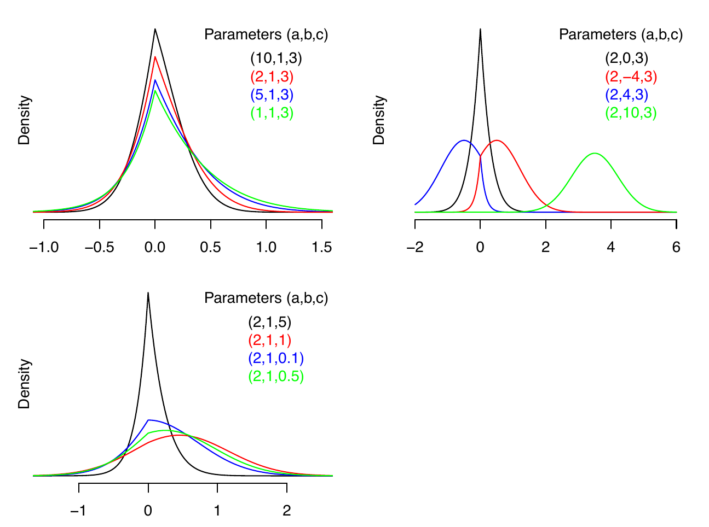
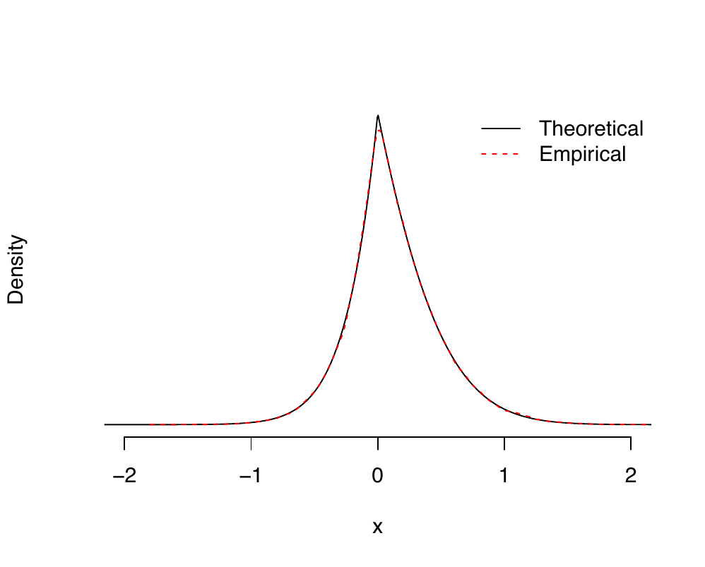

::: article
## Introduction

The Lasso (Least Absolute Shrinkage and Selection Operator) regression
method, introduced by Tibshirani (1996), has become a cornerstone in
high-dimensional statistical modeling due to its ability to perform
variable selection and regularization simultaneously. The Bayesian
formulation of the Lasso has been extensively studied, often relying on
a Laplace prior for the regression coefficients, which can be expressed
as a scale mixture of a Gaussian distribution (Park and Casella 2008).
However, despite its widespread use, existing formulations often face
computational challenges, particularly in efficiently sampling from full
conditional distributions in a Gibbs sampling framework (Hans 2009).

In this paper, we propose a new probability distribution, referred to as
the Lasso distribution, which arises naturally in the Bayesian
formulation of Lasso regression. We fully develop this distribution and
derive several of its key properties, including moments, a
moment-generating function, and an efficient, numerically stable method
for sampling from it. Key to these derivations is the accurate and
numerically stable evaluation of the Mills ratio that arises in several
of these functions (Mills 1926). Further, we establish that the Lasso
distribution belongs to the class of exponential family distributions,
making it a theoretically attractive choice for modeling and inference.
It is important to note that our formulation of the Lasso distribution
differs from the one implemented in the
[**LaplacesDemon**](https://CRAN.R-project.org/package=LaplacesDemon)
package (Statisticat and LLC. 2021), which instead corresponds to the
scale mixture of normals prior used in Park and Casella (2008).

As an application of the Lasso distribution, we note that it arises
naturally as part of a Gibbs sampling scheme, where each coefficient is
sampled individually (see Hans 2009). By leveraging the Lasso
distribution as the full conditional distribution for the regression
coefficients, we achieve a computationally efficient sampling scheme. To
facilitate reproducibility and practical implementation, we provide an R
package that implements our proposed methods.

The remainder of the paper is structured as follows. Section
[2](#Sec:Bayes_Lasso){reference-type="ref" reference="Sec:Bayes_Lasso"}
outlines our Bayesian hierarchical model, which motivates the Lasso
distribution. In Section
[3](#Sec:LassoDistribution){reference-type="ref"
reference="Sec:LassoDistribution"}, we introduce the Lasso distribution.
In Section
[3.1](#sec:lasso_samples){reference-type="ref"
reference="sec:lasso_samples"}, we describe how to sample efficiently in
a numerically stable manner from the Lasso distribution. Section
[4](#Sec:UsingBayesPackage){reference-type="ref"
reference="Sec:UsingBayesPackage"} describes how to use the package
[**BayesianLasso**](https://CRAN.R-project.org/package=BayesianLasso).
An application of the Lasso distribution via Gibbs sampling is given in
Section [5](#Sec:Gibbs){reference-type="ref" reference="Sec:Gibbs"}. We
present a performance comparison on benchmark datasets in Section
[6](#Sec:Results){reference-type="ref" reference="Sec:Results"} and
conclude with a brief discussion in Section
[7](#Sec:discussion){reference-type="ref" reference="Sec:discussion"}.

## The Bayesian Lasso {#Sec:Bayes_Lasso}

We consider the standard linear regression model
${\bf y}|{\boldsymbol\beta},\sigma^2 \sim \mathcal{N}({\bf X}{\boldsymbol\beta}, \sigma^2 {\bf I}_n)$
for the observed dataset ${\mathcal D}= \{{\bf y}, {\bf X}\}$, where
${\bf y}$ is an $n$-dimensional vector of centered responses, ${\bf X}$
is an $n \times p$ matrix of standardized predictors,
${\boldsymbol\beta}$ is a $p$-dimensional vector of regression
coefficients, and $\sigma^2$ denotes the residual variance parameter. In
practice, it is often desirable to perform variable selection alongside
parameter estimation, particularly when many covariates may be
irrelevant. To this end, Tibshirani (1996) proposes Lasso penalized
regression, which introduces an $\ell_1$ penalty to encourage sparsity
in the estimated coefficients. The regularization strength is governed
by a non-negative tuning parameter $\lambda$. The prior structure

$$\begin{equation}
\label{eq:aux_representation}
\beta_j| \sigma^2, \tau_j 
    \sim N( 0, \sigma^2 \tau_j),
\quad and \quad
\tau_j 
    \stackrel{\text{iid}}{\sim} \text{Gamma}(1,\lambda^2/2), 
\quad 1\leq j \leq p.
\end{equation}   (\#eq:aux-representation)$$

mimics this penalty when the auxiliary parameter $\tau_j$ is
marginalized out (Park and Casella 2008). This hierarchical
representation allows for full posterior inference while promoting
sparsity through the prior structure. Here, we adopt independent
conjugate priors for $\sigma^2$ and $\lambda^2$:
$\sigma^2 \sim \text{IG}(\widetilde{a}, \widetilde{b})$ and
$\lambda^2 \sim Gamma(\widetilde{u},\widetilde{v})$ where
$\widetilde{a}>0$, $\widetilde{b}>0$, $\widetilde{u}>0$, and
$\widetilde{v}>0$ are fixed prior hyperparameters.

We propose a modification to the hierarchical prior model in
\@ref(eq:aux-representation) that introduces a different
auxiliary-variable representation. Specifically, instead of the local
scale parameter $\tau_j$ used in \@ref(eq:aux-representation), we
introduce the variable $\eta_j$ and express the prior for $\beta_j$
through the alternative hierarchical formulation
$$\begin{equation}
\label{equ3}
\beta_j | \sigma^2, \eta_j 
    \sim N\left( 0, \frac{\sigma^2}{\eta_j\lambda^2} \right),
\quad \text{and} \quad
\eta_j \stackrel{\text{iid}}{\sim} \text{IG}(1, 1/2), \quad 1 \leq j \leq p.
\end{equation}   (\#eq:equ3)$$

This representation is not identical to \@ref(eq:aux-representation) but
is constructed so that the resulting full conditional distribution of
$\beta_j$ admits the kernel form given in \@ref(eq:LassoProp), which
facilitates the sampling strategy used in our Gibbs sampler.

Hans (2009) takes a different approach. Instead of using the auxiliary
variable representations in \@ref(eq:aux-representation) and
\@ref(eq:equ3), the standard Gibbs sampler of Hans (2009) samples from
the full conditional distributions of the parameters individually,
employing a weighted combination of two truncated normal distributions.
It can be shown that the full conditional distribution for each
$\beta_j$ is proportional to
$$\begin{align}
\label{LassoProp}
p(\beta_j|{\mathcal D},{\boldsymbol\beta}_{-j},\sigma^2,\lambda^2) \propto 
\exp\left(-\tfrac{1}{2}a\beta_j^2 + b\beta_j - c |\beta_j|\right)
\end{align}   (\#eq:LassoProp)$$
where $a$, $b$, and $c$ are constants that depend on ${\mathcal D}$,
${\boldsymbol\beta}_{-j}$, $\sigma^2$, and $\lambda^2$. This kernel
corresponds to the weighted combination of two truncated normal
distributions utilized by Hans (2009). Further details can be found in
the Supplementary Material.

Although this conditional kernel can be expressed as a weighted mixture
of truncated normal distributions and sampled within a Gibbs sampler
(Hans 2009), it has not previously been formalized as a standalone
distribution with explicitly derived analytical properties. In
particular, Hans (2009) utilized the truncated normal mixture
representation for computational purposes but did not formally study the
kernel as a distinct probability distribution, derive its properties in
closed form, or develop numerically stable normalization formulas. To
address this challenge, we develop a new distribution, which we term the
*Lasso distribution*, arising naturally in the context of the Lasso
regression model. We establish its analytical properties together with
stable computational methods and an accompanying open-source R package
implementation. In the next section, we formally define the Lasso
distribution and derive several of its key properties, including its
probability density function (PDF), cumulative distribution function
(CDF), moment generating function (MGF), and moments.

## The Lasso distribution {#Sec:LassoDistribution}

We derive several properties of the Lasso distribution, including the
probability density function (PDF), cumulative density function (CDF),
moment generating function (MGF), and moments. For detailed
derivations, please refer to Section B of the Supplementary Materials.

A random variable $X$ that maps from a probability space to the real
line $\mathbb{R}$ has a Lasso distribution with parameters $a$, $b$,
and $c$, denoted $X \sim \text{Lasso}(a,b,c)$, if its PDF is
$$
p(X,a,b,c) = Z^{-1}\exp\left(-\tfrac{1}{2}aX^2+bX-c|X|\right),
$$
where $a \geq 0$, $b \in \mathbb{R}$, $c \geq 0$ (with $a$ and $c$ not
both 0), and normalizing constant $Z$ given by
$$Z(a,b,c) = \int_{-\infty}^\infty \exp\left( -\tfrac{1}{2}aX^2 + bX - c|X| \right) dx = \sigma \left[ \frac{\Phi(\mu_1/\sigma)}{\phi(\mu_1/\sigma)}
+ \frac{\Phi(-\mu_2/\sigma)}{\phi(-\mu_2/\sigma)}  \right],$$
with $\mu_1 = (b-c)/a$, $\mu_2 = (b + c)/a$, and $\sigma^{2} = 1/a$.
Here, $\Phi(\cdot)$ and $\phi(\cdot)$ denote the CDF and PDF of the
standard normal distribution, respectively. The parameter $a$ controls
the quadratic curvature of the density and governs its overall
concentration. The parameter $b$ introduces a linear tilt, inducing
asymmetry and shifting mass toward positive or negative values. The
parameter $c$ controls the strength of the absolute value term,
increasing concentration near zero and producing the characteristic
cusp of the Lasso distribution. Evaluating $Z$ can be numerically
challenging due to potential overflow, underflow, or divide-by-zero
problems. To address this, our R package
[**BayesianLasso**](https://CRAN.R-project.org/package=BayesianLasso)
implements a numerically stable and efficient method for computing
$Z$, automatically managing these numerical difficulties (Ormerod et
al. 2025).

The Lasso distribution can be written as a mixture of two truncated
normal distributions. As we shall see, for different extreme values of
$a$, $b$ and $c$, the Lasso distribution can behave like a normal
distribution, a Laplace distribution, an asymmetric Laplace
distribution, a positively truncated normal distribution, or a
negatively truncated normal distribution. By characterizing the
limiting behavior under extreme parameter values, the R package
[**BayesianLasso**](https://CRAN.R-project.org/package=BayesianLasso)
leverages appropriate approximations to known distributions ensuring
robust and efficient computation even in numerically challenging
settings. Figure
[1](#fig:density_Lassos){reference-type="ref"
reference="fig:density_Lassos"} shows the density of the univariate
Lasso distribution for different parameter values.

<figure id="fig:density_Lassos" data-latex-placement="ht">
<p></p>
<figcaption>Figure 1: The Lasso density function is depicted for
different parameter values. In the top left panel, parameter <span
class="math inline"><em>a</em></span> is varied while the other
parameters are fixed. In the top right and bottom left panels,
parameters <span class="math inline"><em>b</em></span> and <span
class="math inline"><em>c</em></span> are varied, respectively, while
the other parameters are fixed.</figcaption>
</figure>

The MGF of the Lasso distribution is $M(t) = Z(a,b+t,c)/Z(a,b,c)$ and
the calculation of the moments of the Lasso distribution via the MGF
is algebraically cumbersome. See Section B of the Supplementary
Materials for the derivation of the MGF. However, by expressing the
Lasso distribution as a mixture of two truncated normal distributions,
the moments can be calculated as
$\mathbb{E}(X^r) = (1 - w) \cdot \mathbb{E}(A^r) + w \cdot \mathbb{E}(B^r),$
where the mixing proportion is given by
$$
w =  \left[ 1
+ \frac{\Phi(\mu_1/\sigma)}{\phi(\mu_1/\sigma)}\frac{\phi(-\mu_2/\sigma)}{\Phi(-\mu_2/\sigma)}
\right]^{-1},
$$
where $A\sim TN_+(\mu_1,\sigma^{2})$ and $B\sim TN_-(\mu_2,\sigma^{2})$
are the positively truncated and negatively truncated normal
distributions, respectively.

The CDF of the Lasso distribution is given by
$$
P(x) = \mathcal{P}(X < x)
     = \left\{ \begin{array}{ll}
\displaystyle
w\frac{\Phi\left(
\frac{x - \mu_2}{\sigma}\right)}{\Phi(-\mu_2/\sigma)}
    & \mbox{if $x\le 0$ and}
\\ [2ex]
\displaystyle  1 - (1 - w)\frac{\Phi(\frac{\mu_1 - x}{\sigma})}{\Phi(\mu_1/\sigma)}
    & \mbox{if $x> 0$}.
\end{array}
\right.
$$

The inverse CDF of the Lasso distribution is given by
$$\begin{align}
    P^{-1}(u) = \left\{
\begin{array}{ll}
\mu_2 + \sigma\Phi^{-1}[\Phi(-\mu_2/\sigma) u/w]
    & \mbox{if $u\le w$ and}
\\ [2ex]
\mu_1 - \sigma\Phi^{-1}[\Phi(\mu_1/\sigma) (1 - u)/(1-w) ]
    & \mbox{if $u> w$}.
\end{array}
\right.
\end{align}   (\#equ:inv_CDF)$$
Finally, the mode of the Lasso distribution is equal to
$\mbox{max}(|b| - c,0)\cdot\mbox{sign}(b)/a$, where
$\mbox{sign}(\cdot)$ is the sign function.

The R package
[**BayesianLasso**](https://CRAN.R-project.org/package=BayesianLasso)
enables efficient and numerically stable sampling from the Lasso
distribution by evaluating the inverse CDF using uniform random draws.
To ensure robustness, particularly in the tails, the implementation
incorporates safeguards against numerical issues such as overflow and
underflow. A key component of this approach is the numerically stable
evaluation of the Mills ratio, defined as $m(x) = \Phi(-x)/\phi(-x)$,
which is used in computing the normalizing constant. Specifically, the
package computes
$$
v_{1}=\frac{c-\left|b\right|}{\sqrt{a}}
\qquad
\mbox{and} \qquad
v_{2}=\frac{c+\left|b\right|}{\sqrt{a}},
$$
and evaluates the normalizing constant as
$Z = \left[m\left(v_{1}\right)+m\left(v_{2}\right)\right]/\sqrt{a}$.
This combination of numerical stability and computational efficiency
underpins the practical value of the package and is a key reason for
its robustness in high-dimensional Bayesian inference.

### Sampling from the Lasso distribution {#sec:lasso_samples}

Key quantities required for various expressions in the previous
section include the computation of $Z$ and $w$. Additionally, special
care must be taken when calculating the inverse CDF to prevent both
overflow and underflow. To address these concerns, we define
$v_{1}=\left(c-\left|b\right|\right)/\sqrt{a}$ and
$v_{2}=\left(c+\left|b\right|\right)/\sqrt{a}$. The normalizing
constant $Z$ can then be expressed as
$Z = \left[m\left(v_{1}\right)+m\left(v_{2}\right)\right]/\sqrt{a}$.
For negative inputs, i.e., $x<0$, the Mills ratio is
$m\left(x\right)=\phi\left(x\right)^{-1}-m\left(-x\right)$. Since
$v_{2}\ge 0$ and $v_{1}\ge 0$ when $\left|b\right|\le c$, we can
partition the definition of $Z$ into two cases
$$
Z =\begin{cases}
\frac{1}{\sqrt{a}}\left[m\left(v_{1}\right)+m\left(v_{2}\right)\right] & \left|b\right|\le c \quad \mbox{and}\\
\frac{1}{\sqrt{a}}\left[\left(\phi\left(v_{1}\right)^{-1}-m\left(-v_{1}\right)\right)+m\left(v_{2}\right)\right] & \left|b\right|>c;
\end{cases}
$$
where both alternatives have the requirement for two Mills ratio
calculations for positive parameters; this is a potential use case for
a SIMD, which is short for single instruction/multiple data,
vectorized implementation of the positive side of the Mills ratio.

The second component of $Z$ (for $\left|b\right|>c$) has an obvious
potential overflow when $\left|v_{1}\right|$ is large. In such cases,
it may be necessary to transition to logarithmic space to represent
$\phi\left(v_{1}\right)$ to avoid underflow/overflow. However,
unnecessary logarithmic computations should be avoided, as they are
computationally expensive and can reduce numerical precision when not
required. Marsaglia (2004) notes that the precision of evaluating the
standard normal density function $\phi\left(x\right)$ and its tail
probability deteriorates as $x$ increases, due to the limitations of
computing $\exp(-x^2/2)$ in double-precision arithmetic. While the
paper primarily examines values up to $x \approx 16$, it is also known
that $\phi\left(x\right)$ effectively loses all precision for
$x\geq 37$, where the exponential term underflows to zero and the
reciprocal overflows. Now, consider the case where $v_{1}<-37$, making
overflow a concern. By definition, we have $37<-v_{1}<v_{2}$, which
implies $m\left(37\right)>m\left(-v_{1}\right)>m\left(v_{2}\right)>0$.
Since $m\left(37\right)\approx0.027$, it follows that
$-0.027<m\left(v_{2}\right)-m\left(-v_{1}\right)<0$. Within the limits
of double precision, this difference becomes negligible due to
rounding errors for $v_{1}\approx-9$, and certainly for $v_{1}<-37$,
where $\phi\left(-37\right)<6\times10^{-300}$. Consequently, $Z$ can be
approximated as
$$
Z \approx\frac{1}{\sqrt{a}}\left[\phi\left(v_{1}\right)^{-1}\right].
$$
Thus, we can safely use the approximation
$m\left(v_{1}\right)\approx\phi\left(v_{1}\right)^{-1}$ in such cases.

For a fast and accurate approximation of Mill's ratio for positive
arguments, we employ a degree $\left(8,9\right)$ rational polynomial
optimized using the Remez algorithm (Reemtsen 1990) over the interval
$\left[0,600\right]$, achieving an accuracy of up to 12 significant
figures. The leading coefficients of both the numerator and
denominator are positive, ensuring that the approximation
asymptotically converges to a small fraction. This stability allows
the relative error to remain consistent, preserving 11 significant
figures up to approximately $x\approx2000$. Beyond this point, the
precision gradually improves, as Mills ratio satisfies
$m(x) \sim 1/x$ for large $x$.

Let
$$
\begin{array}{c}
p_0 = 46697.7602201933, \qquad  p_1 = 69339.6909002865, \qquad p_2 =50590.6980372328, \\
p_3 = 23184.62760379742, \qquad p_4 = 7236.31450136984, \qquad p_5 = 1572.136841909630, \\
p_6 = 232.9967987466022, \qquad p_7 = 21.74833514806325, \qquad \mbox{and} \quad p_8 = 1.000000000000095.
\end{array}
$$
and let
$$
\begin{array}{c}
q_0 = 37259.42190376593, \qquad q_1 = 85053.78630172011, \qquad q_2 = 89598.92885811838, \\
q_3 = 57370.93777717682, \qquad q_4 = 24713.27114352290, \qquad q_5 = 7467.311205544661, \\
q_6 = 1593.885178714749, \qquad q_7 = 233.9967987305447, \qquad q_8 = 21.74833514813385, \\
\end{array}
$$
and $q_{9} = 1$. Let
$$
\widetilde{m}  = \frac{
    p_0 + x(p_1 + x(p_2 + x( p_3 + x(p_4 + x(p_5 + x(p_6 + x(p_7 + xp_8)))))))
}{
    q_0 + x(q_1 + x(q_2 + x(q_3 + x(q_4 + x(q_5 + x(q_6 + x(q_7 + x(q_8 + x))))))))
}.
$$
Our approximation of $m(x)$ for $x>0$ is then
$$
m(x) = \left\{\begin{array}{ll}
\widetilde{m}    & \mbox{$x < 1.75 \times 10^{34}$} \\
1/x  & \mbox{otherwise.}
\end{array}\right.
$$

Next, we define
$$
w_{1}=\frac{1}{1+m\left(v_{1}\right)m\left(v_{2}\right)^{-1}}
\qquad
\mbox{and}
\qquad
w_{2}=\frac{1}{1+m\left(v_{1}\right)^{-1}m\left(v_{2}\right)}.
$$
As $v_{1}\rightarrow-\infty$, it follows that
$m\left(v_{1}\right)\rightarrow\infty$, leading to $w_{1}\rightarrow0$
and $w_{2}\rightarrow1$. However, due to the dynamic range limitations
of floating-point representation, $w_{1}$ is representable, whereas
$w_{2}$ rounds to 1 for $v_{1}\lessapprox-5.5$, resulting in a loss of
precision. Since floating-point arithmetic offers much better
precision near zero than near one, using $w_{2}$ when $v_{1}\ll0$ can
introduce numerical errors. To mitigate this, we define
$$
w=\begin{cases}
w_{1} & \mbox{if } b\le0 \mbox{ and} \\
w_{2} & \mbox{if } b>0,
\end{cases}
\qquad \mbox{and}
\qquad
1-w =\begin{cases}
w_{2} & \mbox{if } b\le0 \mbox{ and} \\
w_{1} & \mbox{if } b>0.
\end{cases}
$$
Thus, a simple yet numerically stable rule is to work with $w$ when
$b\le0$ and with $1-w$ when $b>0$.

The computation of $P^{-1}(u)$ is carried out in four distinct cases,
determined by whether $u \leq w$ and whether $b > 0$. First, the
arguments of $\Phi^{-1}(\cdot)$ are carefully computed to prevent
overflow. In extreme cases, underflow may still occur. When underflow
is detected, the arguments of $\Phi^{-1}(\cdot)$ are instead computed
on the logarithmic scale, and the asymptotic tail formula of Mächler
(2022) is used to evaluate $\Phi^{-1}(\cdot)$ accurately.

## Using the BayesianLasso package {#Sec:UsingBayesPackage}

To illustrate the functionality of the
[**BayesianLasso**](https://CRAN.R-project.org/package=BayesianLasso)
package, we provide examples of its key functions, including density
evaluation, cumulative distribution, random sampling, and quantile
calculations.

### Probability density function (PDF)

The function `dlasso()` computes the probability density function of the
Lasso distribution for given parameters. The following example plots the
density of a $\text{Lasso(2,1,3)}$ distribution, shown as a solid black
line in Figure [2](#fig:density_comparison){reference-type="ref"
reference="fig:density_comparison"}.

``` r
library(BayesianLasso)

# Define parameters
a <- 2
b <- 1
c <- 3
x <- seq(-3, 3, length = 1000)

# Plot the density of Lasso(2,1,3)
plot(x, dlasso(x, a, b, c, logarithm = FALSE), type = 'l', 
     xlab = "x", ylab = "Density", 
     ylim = c(0, 2.25), yaxt = "n", bty = "n")
```

### Cumulative distribution function (CDF)

The function `plasso()` calculates the cumulative distribution function
of the Lasso distribution. Below, we compute the CDF at $x = -1$ for a
$\text{Lasso}(2,1,3)$ distribution:

``` r
CDF_value <- plasso(-1, a, b, c)
print(CDF_value)
[1] 0.00176594
```

### Random sampling from the Lasso distribution

To generate random samples from the Lasso distribution, we use
`rlasso()`. The following example generates 100,000 samples and compares
the empirical density with the theoretical density, as shown in Figure
[2](#fig:density_comparison){reference-type="ref"
reference="fig:density_comparison"}.

``` r
# Generate random samples
samples <- rlasso(100000, a, b, c)

# Compare empirical and theoretical density
plot(x, dlasso(x, a, b, c, logarithm = FALSE), type = "l", lty = 1,
     xlab = "x", ylab = "Density",
     xlim = c(-2, 2), yaxt = "n", bty = "n")
lines(density(samples), col = "red", type = "l", lty = 2)

legend("topright", legend = c("Theoretical", "Empirical"), col = c("black", "red"),
       lty = c(1, 2), bty = "n")
```

<figure id="fig:density_comparison" data-latex-placement="ht">
<p> <span>-0.5cm</span></p>
<figcaption>Figure 2: Theoretical and empirical densities for <span
class="math inline">Lasso(2, 1, 3)</span>. The theoretical density plot
of <span class="math inline">Lasso(2, 1, 3)</span> using
<code>dlasso(x, a, b, c, logarithm = FALSE)</code> is shown as a solid
black line, and the empirical density is shown as a dashed
line.</figcaption>
</figure>

To assess implementation accuracy, we compare empirical moments obtained
from Monte Carlo simulation with the theoretical mean, `elasso(a,b,c)`,
and variance, `vlasso(a,b,c)`, derived in
Section [3](#Sec:LassoDistribution){reference-type="ref"
reference="Sec:LassoDistribution"}. For multiple parameter
configurations $(a,b,c)$ chosen to represent different scales and
degrees of concentration, $10^5$ independent samples were generated
using `rlasso()`. The empirical mean and variance were computed and
compared with their analytical counterparts, and the absolute errors
between theoretical and empirical moments are reported in
Table [1](#tab:moment_comparison){reference-type="ref"
reference="tab:moment_comparison"}.

+------------------+------------------------------------+------------------------------------+
| $(a,b,c)$        | Mean                               | Variance                           |
+:================:+:===========:+:=========:+:========:+:===========:+:=========:+:========:+
|                  | Theoretical | Empirical | Error    | Theoretical | Empirical | Error    |
+------------------+-------------+-----------+----------+-------------+-----------+----------+
| $( 2,\, 1,\, 3)$ | 0.121830    | 0.122919  | 0.001088 | 0.128773    | 0.129729  | 0.000955 |
+------------------+-------------+-----------+----------+-------------+-----------+----------+
| $(4 ,\, 4,\, 1)$ | 0.773432    | 0.773007  | 0.000425 | 0.228095    | 0.226861  | 0.001233 |
+------------------+-------------+-----------+----------+-------------+-----------+----------+
| $(1 ,\, 1,\,1 )$ | 0.503222    | 0.503450  | 0.000227 | 0.558956    | 0.559068  | 0.000111 |
+------------------+-------------+-----------+----------+-------------+-----------+----------+

: (#tab:T1) Comparison of theoretical and empirical moments for
selected $(a,b,c)$ parameter settings. {#tab:moment_comparison}

Table [1](#tab:moment_comparison){reference-type="ref"
reference="tab:moment_comparison"} demonstrates close agreement between
the theoretical and empirical moments across all tested parameter
settings. For $10^5$ independent Monte Carlo draws, the empirical means
and variances match their analytical counterparts to three or more
decimal places, with absolute errors uniformly below $10^{-3}$. The
magnitude of these discrepancies is consistent with expected Monte Carlo
error, indicating that the random number generator `rlasso()` and the
analytical moment functions `elasso()` and `vlasso()` are correctly
implemented and numerically stable.

### Quantile function

The inverse-CDF sampler corresponding to Equation
\@ref(equ:inv_CDF) is implemented in C++ which is located in
`src/lasso_distribution.cpp`, and is exposed to users via the exported
Rcpp interface `qlasso()`. The required evaluations of the normal
cumulative distribution function and its inverse are performed using the
R math library routines `R::pnorm5` and `R::qnorm5`. These routines
compute the normal CDF and quantile using piecewise rational
approximations with separate central and tail expansions, ensuring high
numerical accuracy and stability even for extreme probability values.

Below, we compute the quantiles for probability values
**$p = \{0.1, 0.3, 0.6\}$**:

``` r
p_values <- c(0.1, 0.3, 0.6)
quantiles <- qlasso(p_values, a, b, c)
print(quantiles)
[1] -0.28183916 -0.04935763  0.16137104
```

### Numerical stability and boundary behaviour {#sec:numerical_validation}

##### Failure cases of naive implementations.

A direct implementation of the Lasso distribution based on the density
$$f(x \mid a,b,c) \propto \exp\!\left(-\frac{1}{2}ax^2 + bx - c|x|\right)$$
can suffer from substantial numerical instability. In particular, naive
evaluation of the normalizing constant may overflow when $|b|/c$ is
large, due to the exponential terms arising from Gaussian tail
probabilities. Similarly, direct subtraction of nearly equal
floating-point quantities in cumulative distribution function (CDF)
computations may lead to catastrophic cancellation in extreme tail
regions.

In addition, straightforward inversion of the CDF for quantile
evaluation can fail without careful bracketing, particularly in highly
skewed parameter regimes. These issues are common in naive
implementations that rely solely on closed-form expressions without
attention to floating-point behaviour.

The implementation in `BayesianLasso` mitigates these problems by
performing normalization and tail probability calculations on the
log-scale, separating positive and negative domains explicitly, and
using numerically stable bracketing procedures for quantile inversion.
These design choices ensure stable behaviour across a wide range of
parameter values.

##### Boundary and near-degenerate regimes.

We further investigated behaviour in limiting parameter regimes:

- **$c \to 0$.** In this limit, the Lasso distribution converges to a
  Gaussian distribution with mean $b/a$ and variance $1/a$. Numerical
  experiments demonstrate that the implementation transitions smoothly
  to this Gaussian case without discontinuity or instability.

- **$a \to 0$.** As $a$ approaches zero, the quadratic term vanishes and
  the distribution approaches a Laplace-type density. Direct evaluation
  of normalization constants becomes ill-conditioned in this regime;
  however, the log-scale implementation maintains numerical stability
  and produces accurate density and distribution evaluations.

- **Large $|b|/c$.** When $|b|/c$ is large, the distribution becomes
  highly skewed and naive exponential evaluations may overflow. The
  current implementation remains stable under such extreme skewness due
  to its log-scale normalization and careful handling of Gaussian tail
  probabilities.

These investigations demonstrate that the proposed implementation is
robust not only in regular parameter settings but also in boundary and
numerically challenging regimes. Such stability is essential for
reliable use of the Lasso distribution in Bayesian computation and
simulation-based inference.

In the next section, we incorporate the Lasso distribution into a Gibbs
sampling algorithm as the full conditional distribution for the
coefficients of the Lasso regression model.

## Application of the Lasso distribution in Gibbs sampling {#Sec:Gibbs}

We modify the Gibbs sampler of Hans (2009) (henceforth Hans) by using
the Lasso distribution as the full conditional distribution of the
regression coefficients. We also consider a slightly modified version of
the Gibbs sampler of Park and Casella (2008) (henceforth PC), as the
alternative Gibbs sampler, by changing the representation of the
auxiliary variable from \@ref(eq:aux-representation) to \@ref(eq:equ3).

Furthermore, these Gibbs samplers are based on the prior
$\lambda^2\sim Gamma(\widetilde{u},\widetilde{v})$ which differs from
Hans (2009), where the prior is placed on $\lambda$ (which is conjugate)
rather than $\lambda^2$ (which is not conjugate in the modified Hans
sampler). The primary motivation for this choice is to ensure
consistency with the parameterization used in the PC Gibbs sampler,
which is formulated in terms of $\lambda^2$. This allows us to place
both samplers under the same underlying model specification and enables
a direct and fair comparison between their sampling strategies. In
addition, modeling $\lambda^2$ aligns naturally with the formulation of
the Lasso distribution introduced in this paper, where $\lambda^2$
enters directly into the quadratic form of the conditional density. This
parameterization therefore provides a more coherent connection between
the model and the proposed sampling approach. However, unlike the
conjugate specification for $\lambda$ in Hans (2009), placing the prior
on $\lambda^2$ breaks conjugacy, necessitating the use of a slice
sampler (Neal 2003) for its full conditional distribution.

Theoretically, both specifications induce similar shrinkage behavior,
but they differ in computational properties. The conjugate prior leads
to simpler Gibbs updates, whereas the non-conjugate specification
requires auxiliary sampling steps. In practice, this may affect mixing
for $\lambda^2$, leading to poorer mixing in some settings (e.g., the
Crime dataset in Table [5](#tab:ngtp_results_lasso){reference-type="ref"
reference="tab:ngtp_results_lasso"}), which we regard as a computational
trade-off of the chosen parameterization. All methods are implemented in
the same programming language and executed on the same computer,
ensuring that the primary distinction lies in the choice of Gibbs
samplers used to fit the model.

### Hans Gibbs sampler

As stated earlier, the standard Gibbs sampler proposed by Hans (2009)
relies on the fact that the full conditional distribution for each
$\beta_j$ is given by \@ref(eq:LassoProp), and Hans (2009) notes that
$p(\beta_j|{\mathcal D},{\boldsymbol\beta}_{-j},\sigma^2,\lambda^2)$ can
be represented as a mixture of two truncated normal distributions. This
is not a well-known distribution to sample. However, we show care needs
to be taken to avoid numerical problems using this representation.

To facilitate sampling from the kernel in \@ref(eq:LassoProp), we
utilize the Lasso distribution ($Lasso(a,b,c)$), which we introduced in
Section
[3](#Sec:LassoDistribution){reference-type="ref"
reference="Sec:LassoDistribution"}. We also employ the efficient and
numerically stable sampling method developed in Section
[3.1](#sec:lasso_samples){reference-type="ref"
reference="sec:lasso_samples"} to draw samples from this distribution.
Notably, while the Hans sampler is specifically designed for the Lasso
distribution, it is difficult to extend to other response types or
alternative penalty structures.

Algorithm [1](#B_Gibbs){reference-type="ref"
reference="B_Gibbs"} presents our modified version of Hans' Gibbs
sampling algorithm, where we model
$\lambda^2 \sim Gamma(\widetilde{u},\widetilde{v})$ instead of
$\lambda \sim Gamma(\widetilde{u},\widetilde{v})$. Unlike the original
method in Hans (2009), which employs conjugate sampling for $\lambda$
and rejection sampling for $\sigma^2$, our approach collapses the
auxiliary variable $\eta_j$ to improve mixing and utilizes slice
sampling for both
$\sigma^2 \mid {\mathcal D}, {\boldsymbol\beta}, \lambda^2$ and
$\lambda^2 \mid {\mathcal D}, {\boldsymbol\beta}, \sigma^2$ (Neal 2003).
Notably, the same slice sampler is applied to both parameters, as their
full conditional distributions are inverse transformations of each
other.

<div id="B_Gibbs" class="algorithm">

<p><strong>Algorithm 1: Modified Hans Gibbs sampler</strong></p>

<table style="border-top:1px solid black;border-bottom:1px solid black;width:100%;">
<tbody>
<tr><td style="vertical-align:top;white-space:nowrap;padding-right:0.5em;">1:</td><td style="padding-left:0em;"><strong>Inputs</strong>: ${\bf y}$, ${\bf X}$, $\widetilde{a}>0$, $\widetilde{b}>0$, $\widetilde{u}>0$, $\widetilde{v}>0$, ${\boldsymbol\beta}^{(0)} = {\bf 0}_p$, $\sigma^{2(0)}>0$, $\lambda^{(0)}>0$;</td></tr>
<tr><td style="vertical-align:top;">2:</td><td style="padding-left:0em;">for $i = 1,\ldots,N$ do</td></tr>
<tr><td style="vertical-align:top;">3:</td><td style="padding-left:1.5em;">${\boldsymbol\beta}^{(i)} \leftarrow {\boldsymbol\beta}^{(i-1)}$;</td></tr>
<tr><td style="vertical-align:top;">4:</td><td style="padding-left:1.5em;">if $n>p$ then</td></tr>
<tr><td style="vertical-align:top;">5:</td><td style="padding-left:3em;">${\boldsymbol\delta} \leftarrow ({\bf X}^T{\bf X}) {\boldsymbol\beta}^{(i)}$;</td></tr>
<tr><td style="vertical-align:top;">6:</td><td style="padding-left:3em;">for $j = 1,\ldots,p$ do</td></tr>
<tr><td style="vertical-align:top;">7:</td><td style="padding-left:4.5em;">${\boldsymbol\delta} \leftarrow {\boldsymbol\delta} - {\bf X}_j \beta_j^{(i)}$;</td></tr>
<tr><td style="vertical-align:top;">8:</td><td style="padding-left:4.5em;">$\displaystyle \beta^{(i)}_j \sim \text{Lasso}\left( \frac{\| {\bf X}_j\|_2^2}{\sigma^{2(i-1)}}, \frac{({\bf X}^T{\bf y})_j - \delta_j}{\sigma^{2(i-1)}}, \frac{\lambda^{(i-1)}}{\sigma^{(i-1)}} \right);$</td></tr>
<tr><td style="vertical-align:top;">9:</td><td style="padding-left:4.5em;">${\boldsymbol\delta} \leftarrow {\bf r} + {\bf X}_j \beta_j^{(i)}$;</td></tr>
<tr><td style="vertical-align:top;">10:</td><td style="padding-left:3em;">end for</td></tr>
<tr><td style="vertical-align:top;">11:</td><td style="padding-left:3em;">$\mbox{RSS} \leftarrow \|{\bf y}\|_2^2 - 2{\bf y}^T{\bf X}{\boldsymbol\beta}_j^{(i)} + ({\boldsymbol\beta}_j^{(i)})^T{\bf X}^T{\bf X}{\boldsymbol\beta}_j^{(i)}$;</td></tr>
<tr><td style="vertical-align:top;">12:</td><td style="padding-left:1.5em;">else</td></tr>
<tr><td style="vertical-align:top;">13:</td><td style="padding-left:3em;">${\bf y} \leftarrow {\bf X}{\boldsymbol\beta}^{(i)}$;</td></tr>
<tr><td style="vertical-align:top;">14:</td><td style="padding-left:3em;">for $j = 1,\ldots,p$ do</td></tr>
<tr><td style="vertical-align:top;">15:</td><td style="padding-left:4.5em;">${\bf r}_j \leftarrow {\bf y} - (\widehat{\bf y} - {\bf X}_{j}\beta^{(i-1)}_j);$</td></tr>
<tr><td style="vertical-align:top;">16:</td><td style="padding-left:4.5em;">$\displaystyle \beta^{(i)}_j \sim \text{Lasso}\left( \frac{\| {\bf X}_j\|_2^2}{\sigma^{2(i-1)}}, \frac{{\bf X}_j^T{\bf r}_j}{\sigma^{2(i-1)}}, \frac{\lambda^{(i-1)}}{\sigma^{(i-1)}} \right);$</td></tr>
<tr><td style="vertical-align:top;">17:</td><td style="padding-left:4.5em;">$\widehat{\bf y} \leftarrow \widehat{\bf y} + {\bf X}_{j}(\beta^{(i)}_j - \beta^{(i-1)}_j)$;</td></tr>
<tr><td style="vertical-align:top;">18:</td><td style="padding-left:3em;">end for</td></tr>
<tr><td style="vertical-align:top;">19:</td><td style="padding-left:3em;">$\mbox{RSS} \leftarrow \|{\bf y} - \widehat{\bf y}\|_2^2$;</td></tr>
<tr><td style="vertical-align:top;">20:</td><td style="padding-left:1.5em;">end if</td></tr>
<tr><td style="vertical-align:top;">21:</td><td style="padding-left:1.5em;">Use slice sampling to sample $\sigma^{2(i)}$ from the density
$$
\displaystyle p(\sigma^2|{\mathcal D},{\boldsymbol\beta}^{(i)},\lambda^{2(i-1)})
    \propto \exp\left[
        (\widetilde{a} +\tfrac{n+p}{2} +1)\log(\sigma^{2})
        - \left(\widetilde{b} + \tfrac{1}{2}\mbox{RSS}\right)\sigma^{-2} - \tfrac{\lambda^{(i-1)}}{\sigma}\| {\boldsymbol\beta}^{(i)} \|_1 \right];
$$</td></tr>
<tr><td style="vertical-align:top;">22:</td><td style="padding-left:1.5em;">Use slice sampling to sample $\lambda^{2(i)}$ from the density
$$
\displaystyle p(\lambda^{2}|{\mathcal D},{\boldsymbol\beta}^{(i)},\sigma^{2(i)})
    \propto \exp\left[
        \left( \widetilde{u} + \tfrac{p}{2} - 1\right) \log(\lambda^{2})
        - \widetilde{v}\lambda^{2(i-1)}
        - \tfrac{\lambda}{\sigma^{(i)}} \| {\boldsymbol\beta}^{(i)} \|_1 \right].
$$</td></tr>
<tr><td style="vertical-align:top;">23:</td><td style="padding-left:0em;">end for</td></tr>
</tbody>
</table>

</div>

In Algorithm [1](#B_Gibbs){reference-type="ref"
reference="B_Gibbs"}, the quantity ${\bf r}_j$ is analogous to the
partial residuals used in coordinate descent methods for optimizing the
Lasso objective function (see, e.g., Hastie et al. 2015, sec. 5.4.2).
However, rather than computing the mode of
$\beta_j|{\mathcal D},{\boldsymbol\beta}_{-j},\sigma^2$ as done in
coordinate descent, we draw samples from its distribution.

Hans (2009) does not discuss the computational costs of the Gibbs
samplers presented there. In contrast, our Algorithm
[1](#B_Gibbs){reference-type="ref" reference="B_Gibbs"} avoids
matrix inversion, and as shown in Algorithm
[1](#B_Gibbs){reference-type="ref" reference="B_Gibbs"},
sampling each variable requires $\mathcal{O}(\min(n,p))$ time, assuming
the quantities ${\bf X}^T{\bf X}$ (for $n>p$), $diag({\bf X}^T{\bf X})$
and ${\bf X}^T{\bf y}$ are computed outside the main loop. Moreover,
Algorithm [1](#B_Gibbs){reference-type="ref"
reference="B_Gibbs"} accommodates both the $n>p$ and $p>n$ settings,
running in $\mathcal{O}(N p \min(n,p))$ time where $N$ is the number of
samples drawn.

Note that our
[**BayesianLasso**](https://CRAN.R-project.org/package=BayesianLasso)
package implements the modified Hans sampler via the function
`Modified_Hans_Gibbs()`. In this function, ${\bf X}$ and ${\bf y}$
represent the covariate matrix and the response vector, respectively.
The arguments `a1`, `b1`, `u1`, and `v1` correspond to the
hyperparameters of the priors for $\sigma^2$ and $\lambda^2$. The total
number of MCMC iterations is specified by `nsamples`, and the initial
values for ${\boldsymbol\beta}$, $\sigma^2$ and $\lambda^2$ are set via
`beta_init`, `sigma2_init` and `lambda_init`, respectively. The argument
`verbose` controls whether the sampling progress is printed during
execution. The argument `thin` controls the thinning interval of the
MCMC chain. Only every thin-th draw is stored. The default value is 1,
corresponding to no thinning.

### PC Gibbs sampler

Our modified PC Gibbs sampler is a modification of the Gibbs sampler
developed in (Park and Casella 2008) and is presented in Algorithm
[2](#Or_Gibbs){reference-type="ref" reference="Or_Gibbs"} and
consists of a four-block Gibbs sampling scheme for estimating the model
parameters, auxiliary variables (using the representation
\@ref(eq:equ3)), and the tuning parameter $\lambda^2$. Specifically, it
involves sampling from the full conditional distributions:
$[{\boldsymbol\beta}|{\mathcal D},\sigma^2,\lambda^2,{\boldsymbol\eta}]$,
$[\sigma^2|{\mathcal D},{\boldsymbol\beta},\lambda^2,{\boldsymbol\eta}]$,
$[\lambda^2|{\mathcal D},{\boldsymbol\beta},\sigma^2,{\boldsymbol\eta}]$,
and
$[{\boldsymbol\eta}|{\mathcal D},{\boldsymbol\beta},\sigma^2,\lambda^2]$.
The time complexity of
Algorithm [2](#Or_Gibbs){reference-type="ref"
reference="Or_Gibbs"} consists of a one-time precomputation cost and a
per-iteration cost. Precomputing quantities such as
${\bf X}^\top{\bf X}$, ${\bf X}^\top{\bf y}$, and $\|{\bf y}\|_2^2$
requires $\mathcal{O}(np^2)$ operations. Each MCMC iteration then
involves sampling ${\boldsymbol\beta}^{(i)}$ from a multivariate normal
distribution, which requires computing a matrix square root---typically
via Cholesky factorization or eigen-decomposition---and therefore incurs
$\mathcal{O}(p^3)$ operations per iteration (Golub and Loan 2013). The
total complexity is thus $\mathcal{O}(np^2 + Np^3)$, where $N$ is the
number of MCMC samples. A key advantage of this algorithm is that the
per-iteration cost is independent of $n$, making it particularly
attractive when $n$ is large; however, the cubic scaling in $p$ becomes
dominant as the number of predictors increases.

In contrast, the modified Hans sampler updates ${\boldsymbol\beta}$
coordinate-wise, with each coordinate update requiring
$\mathcal{O}(\min(n,p))$ operations. Updating all $p$ coefficients
therefore costs $\mathcal{O}(p \min(n,p))$ per iteration, leading to
total complexity $\mathcal{O}(N p \min(n,p))$. Comparing per-iteration
costs, the coordinate-wise updates scale as $\mathcal{O}(p \min(n,p))$,
while the multivariate update in the PC sampler scales as
$\mathcal{O}(p^3)$. As $p$ increases, the cubic dependence in the
multivariate approach becomes computationally expensive, whereas the
coordinate-wise updates scale more favorably, particularly in
high-dimensional settings. This complexity suggests that Algorithm
[1](#B_Gibbs){reference-type="ref" reference="B_Gibbs"} may be
computationally more efficient than Algorithm
[2](#Or_Gibbs){reference-type="ref" reference="Or_Gibbs"} in
high-dimensional settings, particularly when $p$ is large relative to
$n$. This theoretical scaling is consistent with the empirical runtimes
reported in Table [5](#tab:ngtp_results_lasso){reference-type="ref"
reference="tab:ngtp_results_lasso"}, where the Hans sampler exhibits
clear computational advantages in higher-dimensional settings. In
addition, for very large $p$, storing and factorizing the $p \times p$
Gram matrix may become the dominant memory and computational bottleneck,
further favoring coordinate-wise approaches in ultra-high-dimensional
problems.

<div id="Or_Gibbs" class="algorithm">

<p><strong>Algorithm 2: Modified PC Gibbs sampler</strong></p>

<table style="border-top:1px solid black;border-bottom:1px solid black;width:100%;">
<tbody>
<tr><td style="vertical-align:top;white-space:nowrap;padding-right:0.5em;">1:</td><td style="padding-left:0em;"><strong>Inputs</strong>: ${\bf y}$, ${\bf X}$, $\widetilde{a}>0$, $\widetilde{b}>0$, $\widetilde{u}>0$, $\widetilde{v}>0$, $\lambda^2>0$, and $\sigma^{2(0)}>0$.</td></tr>
<tr><td style="vertical-align:top;">2:</td><td style="padding-left:0em;">${\boldsymbol\eta}^{(0)} = {\bf 1}_n$;</td></tr>
<tr><td style="vertical-align:top;">3:</td><td style="padding-left:0em;">for $i = 1,\ldots,N$ do</td></tr>
<tr><td style="vertical-align:top;">4:</td><td style="padding-left:1.5em;">${\bf A} \leftarrow \text{diag}({\boldsymbol\eta}^{(i-1)})$;</td></tr>
<tr><td style="vertical-align:top;">5:</td><td style="padding-left:1.5em;">$\displaystyle {\boldsymbol\beta}^{(i)} \sim N_p\left[ ({\bf X}^T{\bf X} + \lambda^{2(i-1)}{\bf A})^{-1}{\bf X}^T{\bf y}, \sigma^{2(i-1)}({\bf X}^T{\bf X} + \lambda^{2(i-1)}{\bf A})^{-1} \right]$;</td></tr>
<tr><td style="vertical-align:top;">6:</td><td style="padding-left:1.5em;">$\displaystyle \sigma^{2(i)} \sim \text{IG}\left( \widetilde{a} + \tfrac{n+p}{2}, \widetilde{b} + \tfrac{1}{2}\| {\bf y} \|_2^2 - {\bf y}^T{\bf X} {\boldsymbol\beta}^{(i)} + \tfrac{1}{2}({\boldsymbol\beta}^{(i)})^T({\bf X}^T{\bf X} + \lambda^{2(i-1)}{\bf A}) {\boldsymbol\beta}^{(i)} \right)$;</td></tr>
<tr><td style="vertical-align:top;">7:</td><td style="padding-left:1.5em;">$\displaystyle \lambda^{2(i)} \sim \text{Gamma}\left( \widetilde{u} + \frac{p}{2}, \widetilde{v} + \frac{({\boldsymbol\beta}^{(i)})^T{\bf A}{\boldsymbol\beta}^{(i)}}{2\sigma^{2(i)}} \right)$;</td></tr>
<tr><td style="vertical-align:top;">8:</td><td style="padding-left:1.5em;">for $j = 1,\ldots,p$ do</td></tr>
<tr><td style="vertical-align:top;">9:</td><td style="padding-left:3em;">$\displaystyle \eta^{(i)}_j \sim \text{Inverse-Gaussian}\left( \frac{\sigma^{(i)}}{\lambda|\beta_j^{(i-1)}|},1 \right)$.</td></tr>
<tr><td style="vertical-align:top;">10:</td><td style="padding-left:1.5em;">end for</td></tr>
<tr><td style="vertical-align:top;">11:</td><td style="padding-left:0em;">end for</td></tr>
</tbody>
</table>

</div>

Note that our
[**BayesianLasso**](https://CRAN.R-project.org/package=BayesianLasso)
package implements the modified PC sampler via the function
`Modified_PC_Gibbs()`. In this function, ${\bf X}$ and ${\bf y}$
represent the covariate matrix and the response vector, respectively.
The arguments `a1`, `b1`, `u1`, and `v1` correspond to the
hyperparameters of the priors for $\sigma^2$ and $\lambda^2$. The total
number of MCMC iterations is specified by `nsamples`, and the initial
values for $\sigma^2$ and $\lambda^2$ are set via `sigma2_init` and
`lambda_init`. The argument `verbose` controls whether the sampling
progress is printed during execution. The argument `thin` controls the
thinning interval of the MCMC chain. Only every thin-th draw is stored.
The default value is 1, corresponding to no thinning. The MCMC outputs
returned by `Modified_Hans_Gibbs()` and `Modified_PC_Gibbs()` are
standard R matrices and vectors, which can be easily converted to
objects used by common MCMC diagnostic packages such as `posterior` and
`coda`. For example:

``` r
library(BayesianLasso)
fit <- Modified_Hans_Gibbs(X, y)

library(posterior)
draws <- as_draws_matrix(fit$mBeta)
```

Alternatively, the samples can be converted to objects used by the
`coda` package:

``` r
library(coda)
mcmc_beta <- mcmc(fit$mBeta)
```

## Performance comparison on simulated and benchmark datasets {#Sec:Results}

##### Performance metrics.

The impact of autocorrelation within the chains on estimation
uncertainty can be quantified using the effective sample size (ESS). We
compute ESS using the `ess_bulk()` function from the
[**posterior**](https://CRAN.R-project.org/package=posterior) package in
R (Bürkner et al. 2023; Vehtari et al. 2021). To evaluate the efficiency
of our proposed MCMC approach relative to the modified PC Gibbs sampler
and the aforementioned R packages, we use the following metric
$$Efficiency = \frac{ESS}{time};$$
where $time$ represents execution time in seconds. All runtimes are
measured using `system.time()` to ensure consistent timing across
samplers. Additionally, we assess whether the MCMC samples have reached
a stationary distribution and exhibit adequate mixing using Gelman and
Rubin's convergence diagnostic, $\widehat{R}$ (Gelman and Rubin 1992).
We assess whether the outputs from each chain are indistinguishable by
examining the scale reduction factor, considering values below 1.1 as an
indication of convergence. We also evaluate the quality of mixing using
the ratio
$$Mix \% = 100 \times \frac{ESS}{N}$$
where $N$ represents the total number of samples.

We use weakly informative priors for the variance and shrinkage
parameters by setting
$\tilde a = \tilde b = \tilde u = \tilde v = 0.01$. These values
correspond to diffuse Gamma priors on $\sigma^2$ and $\lambda^2$,
allowing the posterior inference to be driven primarily by the data. In
practice, the algorithm is not highly sensitive to small changes in
these hyperparameters, although extremely informative priors may
influence both shrinkage strength and MCMC mixing. As a general
guideline, small values (e.g., $0.01$) provide weak regularization while
maintaining stable posterior computation.

### Simulation study {#sec:simulation_study}

We conduct a controlled simulation study to compare the computational
efficiency of the modified Hans sampler and the modified PC Gibbs
sampler under a sparse linear regression setting.

##### Data-generating mechanism.

We generate synthetic data from the linear model
$${\bf y}= {\bf X}{\boldsymbol\beta}+ {\boldsymbol\varepsilon},$$
where ${\bf X}\in \mathbb{R}^{n \times p}$ has independent standard
normal entries, ${\boldsymbol\beta}= (2,2,2,0,\ldots,0)^\top$ contains
three non-zero coefficients and $p-3$ zeros, and
${\boldsymbol\varepsilon}\sim \mathcal{N}(0,\textbf{I}_n)$. In our
experiments we set $n=100$ and $p=10$. This configuration yields a
moderately sparse setting with non-trivial shrinkage behaviour.

##### MCMC configuration.

For both samplers we generate $N=2000$ posterior samples with
hyperparameters $(a_1,b_1,u_1,v_1) = (2,1,2,1)$. The first 200
iterations are discarded as burn-in. The modified Hans sampler is
initialized with $\beta^{(0)}=\mathbf{1}$, $\lambda^{2(0)}=1$, and
$\sigma^{2(0)}=1$, while the modified PC sampler uses identical
hyperparameter settings and initial variance parameters for
comparability.

Table [2](#tab:simulation_results){reference-type="ref"
reference="tab:simulation_results"} summarizes the simulation results
for the modified Hans and modified PC Gibbs samplers. While both
samplers achieve comparable mixing percentages across all parameters,
the modified Hans sampler yields substantially larger effective sample
sizes for ${\boldsymbol\beta}$, $\sigma^2$, and $\lambda^2$, as well as
a shorter computation time. In particular, the efficiency of the Hans
sampler exceeds that of the PC sampler by approximately 44% for
${\boldsymbol\beta}$ (256.73 versus 178.45), 81% for $\sigma^2$ (271.73
versus 149.97), and 151% for $\lambda^2$ (223.75 versus 89.03), while
also requiring less computation time (0.05 seconds versus 0.09 seconds).
Overall, these results demonstrate that the modified Hans sampler
provides markedly improved sampling efficiency at a lower computational
cost in the simulated setting.

  ----------- -------- ---------------------- ----------------- ------------ ----------------- ------------- ----------------- ----------
                        ${\boldsymbol\beta}$         Eff         $\sigma^2$         Eff         $\lambda^2$         Eff           Time

  Dataset     Method           Mix %           ($\times 10^2$)     Mix %      ($\times 10^2$)      Mix %      ($\times 10^2$)    \(s\)

  Simulated   Hans             74.45             **256.73**        78.80        **271.73**         64.88        **223.75**      **0.05**

              PC               85.65               178.45          71.98          149.97           42.73           89.03          0.09
  ----------- -------- ---------------------- ----------------- ------------ ----------------- ------------- ----------------- ----------

  : (#tab:T2) Mixing percentages, effective sample sizes, and
  computation times (in seconds) for the simulated dataset using the
  Hans and PC Gibbs samplers from the `BayesianLasso` package.
  Efficiencies are reported in units of $\times 10^2$. Higher mixing
  percentages and efficiencies indicate improved sampling performance.
  {#tab:simulation_results}

Table [3](#tab:sim_credible_intervals){reference-type="ref"
reference="tab:sim_credible_intervals"} reports 95% credible intervals
for the regression coefficients and hyperparameters in the simulated
dataset with three nonzero coefficients ($\beta_1=\beta_2=\beta_3=2$)
and the remaining coefficients equal to zero. For both the modified Hans
and modified PC samplers, the 95% credible intervals for
$\beta_1,\beta_2,$ and $\beta_3$ contain the true value 2, while the
credible intervals for $\beta_4,\ldots,\beta_{10}$ all contain 0.
Consequently, the empirical coverage for $\beta$ in this replicate is
1.00 overall, and also 1.00 when reported separately for nonzero and
zero coefficients. The credible intervals for $\sigma^2$ and $\lambda^2$
are similar across the two samplers, indicating comparable posterior
uncertainty for these hyperparameters in this simulated setting. Since
$\lambda^2$ is a prior hyperparameter rather than a parameter in the
data-generating mechanism, no ground-truth value is available for
coverage assessment in the simulation study.

+:--------------+:-------------:+:--------:+:-------------:+:--------:+
|               | Hans                     | PC                       |
+---------------+---------------+----------+---------------+----------+
| Parameter     | 95% CI (lo,   | Covered? | 95% CI (lo,   | Covered? |
|               | hi)           |          | hi)           |          |
+---------------+---------------+----------+---------------+----------+
| $\beta_{1}$   | (1.72, 2.12)  | Yes      | (1.69, 2.12)  | Yes      |
| (true $=2$)   |               |          |               |          |
+---------------+---------------+----------+---------------+----------+
| $\beta_{2}$   | (1.85, 2.17)  | Yes      | (1.86, 2.19)  | Yes      |
| (true $=2$)   |               |          |               |          |
+---------------+---------------+----------+---------------+----------+
| $\beta_{3}$   | (1.81, 2.24)  | Yes      | (1.82, 2.24)  | Yes      |
| (true $=2$)   |               |          |               |          |
+---------------+---------------+----------+---------------+----------+
| $\beta_{4}$   | (-0.16, 0.22) | Yes      | (-0.16, 0.22) | Yes      |
| (true $=0$)   |               |          |               |          |
+---------------+---------------+----------+---------------+----------+
| $\beta_{5}$   | (-0.15, 0.24) | Yes      | (-0.15, 0.22) | Yes      |
| (true $=0$)   |               |          |               |          |
+---------------+---------------+----------+---------------+----------+
| $\beta_{6}$   | (-0.07, 0.30) | Yes      | (-0.06, 0.29) | Yes      |
| (true $=0$)   |               |          |               |          |
+---------------+---------------+----------+---------------+----------+
| $\beta_{7}$   | (-0.12, 0.27) | Yes      | (-0.13, 0.27) | Yes      |
| (true $=0$)   |               |          |               |          |
+---------------+---------------+----------+---------------+----------+
| $\beta_{8}$   | (-0.11, 0.26) | Yes      | (-0.11, 0.27) | Yes      |
| (true $=0$)   |               |          |               |          |
+---------------+---------------+----------+---------------+----------+
| $\beta_{9}$   | (-0.37, 0.01) | Yes      | (-0.35, 0.02) | Yes      |
| (true $=0$)   |               |          |               |          |
+---------------+---------------+----------+---------------+----------+
| $\beta_{10}$  | (-0.16, 0.19) | Yes      | (-0.16, 0.18) | Yes      |
| (true $=0$)   |               |          |               |          |
+---------------+---------------+----------+---------------+----------+
| $\sigma^{2}$  | (0.81, 1.40)  | Yes      | (0.81, 1.42)  | Yes      |
| (true $=1$)   |               |          |               |          |
+---------------+---------------+----------+---------------+----------+
| $\lambda^{2}$ | (0.75, 4.72)  | --       | (0.75, 4.72)  | --       |
+---------------+---------------+----------+---------------+----------+
| Coverage      | 1.00                     | 1.00                     |
| (nonzero      |                          |                          |
| $\beta$)      |                          |                          |
+---------------+--------------------------+--------------------------+
| Coverage      | 1.00                     | 1.00                     |
| (zero         |                          |                          |
| $\beta$)      |                          |                          |
+---------------+--------------------------+--------------------------+
| Coverage      | 1.00                     | 1.00                     |
| (overall      |                          |                          |
| $\beta$)      |                          |                          |
+---------------+--------------------------+--------------------------+

: (#tab:T3) Simulation study: 95% equal-tailed credible intervals
(CIs) for regression coefficients and hyperparameters based on
post-burn-in MCMC samples (iterations 201--2000). Coverage refers to
whether the true parameter value lies within the reported 95% CI
(reported as proportions for nonzero and zero coefficients).
{#tab:sim_credible_intervals}

Table [4](#tab:sim_varsel){reference-type="ref"
reference="tab:sim_varsel"} summarizes variable selection performance
over 100 simulated datasets with three nonzero coefficients and seven
zeros. Both samplers achieved perfect sensitivity (1.00) and zero false
negative rate, indicating that all true signals were consistently
selected across replicates. The overall selection accuracy was high for
both methods (approximately 0.97), with specificity around 0.95,
implying that occasional false positives occurred among truly zero
coefficients. Consistent with this, the false discovery rate was low
(about 0.07 on average) for both samplers.

  --------------------------------------------------------------------------------------------------
  Method       Accuracy         Sensitivity       Specificity           FDR               FNR
  -------- ----------------- ----------------- ----------------- ----------------- -----------------
  Hans      $0.97 \pm 0.06$   $1.00 \pm 0.00$   $0.96 \pm 0.08$   $0.07 \pm 0.13$   $0.00 \pm 0.00$

  PC        $0.97 \pm 0.06$   $1.00 \pm 0.00$   $0.95 \pm 0.09$   $0.07 \pm 0.13$   $0.00 \pm 0.00$
  --------------------------------------------------------------------------------------------------

  : (#tab:T4) Simulation study (100 replicates): variable selection
  performance of the modified Hans and modified PC Gibbs samplers. A
  coefficient is declared *selected* if its 95% credible interval
  excludes zero. Reported values are mean $\pm$ standard deviation
  across replicates. {#tab:sim_varsel}

Out-of-sample predictive performance was evaluated using mean squared
error (MSE) on an independently generated test dataset. The modified
Hans and PC samplers achieved nearly identical predictive accuracy, with
test MSE values of 1.077 and 1.075, respectively. Both values are close
to the true noise variance ($\sigma^2 = 1$) used in the data-generating
process, indicating that the fitted models provide well-calibrated
predictions. The negligible difference between the two samplers suggests
that, despite differences in sampling efficiency, their predictive
performance in this simulated setting is essentially equivalent.

### Benchmark experiments {#sec:benchmark_study}

In this section, we compare the performance of our modified Hans sampler
with our modified PC Gibbs sampler, as well as the R packages
[**monomvn**](https://CRAN.R-project.org/package=monomvn),
[**bayeslm**](https://CRAN.R-project.org/package=bayeslm),
[**rstan**](https://CRAN.R-project.org/package=rstan), and
[**bayesreg**](https://CRAN.R-project.org/package=bayesreg) (Gramacy
2024; He et al. 2022; Stan Development Team 2020; Makalic and Schmidt
2016). The comparison is based on several benchmark datasets that
represent a diverse range of scenarios where $n>p$, $p>n$ and $p \gg n$.
For $n>p$, we consider the Diabetes dataset with all pairwise
interactions of the original variables (referred to as Diabetes${}^2$)
from the [**lars**](https://CRAN.R-project.org/package=lars) package
(Efron et al. 2004; Hastie and Efron 2022), with $n = 442$ and $p = 55$;
the Kakadu dataset with all pairwise interactions (Kakadu${}^2$) from
the [**Ecdat**](https://CRAN.R-project.org/package=Ecdat) package
(Croissant and Graves 2022), with $n = 1827$ and $p = 252$; and the
Crime dataset from the UCI Machine Learning Repository with $n = 2215$
and $p = 98$ (Redmond 2002).

We use 1,000 burn-in samples followed by 5,000 samples for inference.
The computations were performed on an Apple M1 Pro with 12 cores and 16
GB of RAM. The Gibbs sampler methods were implemented in the R
programming language (version 4.4.2), leveraging the computational
efficiency of the [**Rcpp**](https://CRAN.R-project.org/package=Rcpp)
(version 1.0.13-1) (Eddelbuettel, Francois, Allaire, et al. 2024;
Eddelbuettel and François 2011; Eddelbuettel 2013; Eddelbuettel and
Balamuta 2018) and
[**RcppArmadillo**](https://CRAN.R-project.org/package=RcppArmadillo)
(version 14.2.2-1) (Eddelbuettel and Sanderson 2014; Eddelbuettel,
Francois, Bates, et al. 2024) packages. All Gibbs samplers developed
here were run 5 times on all datasets and the results were averaged.

Table [5](#tab:ngtp_results_lasso){reference-type="ref"
reference="tab:ngtp_results_lasso"} presents the mixing percentages,
sampling efficiencies, and elapsed times (in seconds) for the modified
Hans and PC Gibbs samplers applied to the benchmark datasets
Diabetes${}^2$, Kakadu${}^2$, and Crime. It is important to note that
the Gelman--Rubin diagnostic $\widehat{R}$ for each model parameter was
below 1.01, indicating convergence, and the effective sample size (ESS)
for ${\boldsymbol\beta}$ corresponds to the median of the ESS values for
the $p$-dimensional vector ${\boldsymbol\beta}$. The results indicate
that the modified Hans sampler is the most efficient for sampling
$\sigma^2$ and $\lambda^2$ in the Diabetes$^2$ and Kakadu$^2$ datasets,
and also the most efficient for sampling ${\boldsymbol\beta}$ in both
the Diabetes$^2$ and Kakadu$^2$ datasets. For the Crime dataset, the
modified PC sampler achieves the highest efficiency for sampling
${\boldsymbol\beta}$, while
[**bayeslm**](https://CRAN.R-project.org/package=bayeslm) achieves the
highest efficiency for $\lambda^2$, and the modified Hans sampler
achieves the highest efficiency for $\sigma^2$. Furthermore, the
modified Hans sampler achieves the shortest computation time across all
three datasets: Diabetes$^2$, Kakadu${}^2$, and Crime. Note that
[**monomvn**](https://CRAN.R-project.org/package=monomvn) was extremely
slow on the Kakadu$^2$ dataset. Therefore, its output is reported as NA,
as it was not within a comparable range of performance with the other
samplers.

  -------------- ---------- ---------------------- ----------------- ------------ ----------------- ------------- ----------------- ----------
                              ${\boldsymbol\beta}$               Eff   $\sigma^2$               Eff   $\lambda^2$               Eff       Time

     Dataset     Method                      Mix %   ($\times 10^2$)        Mix %   ($\times 10^2$)         Mix %   ($\times 10^2$)      \(s\)

   Diabetes$^2$  Hans                        26.91         **50.77**        75.62        **142.68**         27.13         **51.20**   **0.21**

                 PC                          78.21             38.34        74.80             36.67         15.73              7.71       0.81

                 monomvn                     98.14              0.72        97.08              0.71         96.11              0.71      59.21

                 bayeslm                     12.28             10.24        50.43             42.27          4.29              3.58       0.48

                 rstan                       98.50              0.57        94.55              0.55         99.21              0.58      68.51

                 bayesreg                    77.26             14.59        61.62             11.59         17.52              3.33       2.15

    Kakadu$^2$   Hans                        19.29          **3.22**        78.85         **13.16**          5.51          **0.92**   **2.39**

                 PC                          85.64              0.76        72.99              0.65          7.88              0.07      44.70

                 monomvn                        NA                NA           NA                NA            NA                NA         NA

                 bayeslm                     15.13              1.80        52.54              3.72          2.46              0.17       6.16

                 rstan                       98.45              0.12        98.43              0.12         96.49              0.12     347.10

                 bayesreg                    84.65              1.98        69.65              1.63          4.34              0.10      17.08

      Crime      Hans                         6.02              5.93         9.42          **9.28**          0.24              0.24   **0.40**

                 PC                          83.65          **9.89**        24.22              2.86         12.11              1.43       3.38

                 monomvn                     97.76              0.04        97.38              0.04         98.76              0.04     862.59

                 bayeslm                      5.37              2.19        13.94              5.65          3.79          **1.53**       0.98

                 rstan                       98.07              0.55        92.44              0.52         92.39              0.52      70.81

                 bayesreg                    81.84              9.09        29.38              3.27         13.62              1.51       3.62
  -------------- ---------- ---------------------- ----------------- ------------ ----------------- ------------- ----------------- ----------

  : (#tab:T5) Mixing percentages, efficiencies, and computation
  times (in seconds) for each dataset using the Hans and PC Gibbs
  samplers from the
  [**BayesianLasso**](https://CRAN.R-project.org/package=BayesianLasso)
  package, as well as the R packages
  [**monomvn**](https://CRAN.R-project.org/package=monomvn),
  [**bayeslm**](https://CRAN.R-project.org/package=bayeslm),
  [**rstan**](https://CRAN.R-project.org/package=rstan), and
  [**bayesreg**](https://CRAN.R-project.org/package=bayesreg).
  {#tab:ngtp_results_lasso}

For these datasets, the modified Hans sampler exhibits lower mixing
percentages for ${\boldsymbol\beta}$ relative to $\sigma^2$. This is
consistent with the coordinate-wise structure of the algorithm, where
regression coefficients are updated sequentially and mixing can be
slower in the presence of strong posterior dependence among predictors.
In contrast, $\sigma^2$ is a scalar global parameter whose full
conditional depends on aggregate quantities --- namely, the residual sum
of squares and $\|{\boldsymbol\beta}\|_1$ --- resulting in substantially
faster mixing.

Table [6](#tab:eye_riboflavin_results){reference-type="ref"
reference="tab:eye_riboflavin_results"} presents results for two
high-dimensional settings in which the number of predictors exceeds the
number of observations ($p > n$). Specifically, the Eye dataset contains
$n = 120$ observations and $p = 200$ predictors, while the Riboflavin
dataset has $n = 71$ observations and $p = 4088$ predictors. These
settings illustrate the performance of the samplers under challenging
high-dimensional regimes, particularly when $p \gg n$. Here, we use
1,000 burn-in samples followed by 10,000 samples for inference. We
report results for the Hans and PC Gibbs samplers implemented in the
`BayesianLasso` package, as well as for the `bayesreg` package. Other
samplers and R packages were not included due to their prohibitively
high computational cost in these settings, resulting in runtimes that
were not directly comparable. Notably, the PC sampler was extremely slow
on the Riboflavin dataset; consequently, its results are reported as NA,
as they were not obtained within a comparable computational budget. This
behaviour is expected, as the computational cost of the PC sampler
scales cubically with $p$, that is, $\mathcal{O}(np^2 + Np^3)$.

+:-----------+:---------+:-----:+:---------------:+:-----:+:---------------:+:------:+:---------------:+:---------:+
|            |          | $\beta$                 | $\sigma^2$              | $\lambda^2$              | Time      |
+------------+----------+-------+-----------------+-------+-----------------+--------+-----------------+-----------+
| Dataset    | Method   | Mix % | Eff             | Mix % | Eff             | Mix %  | Eff             | \(s\)     |
|            |          |       | ($\times 10^2$) |       | ($\times 10^2$) |        | ($\times 10^2$) |           |
+------------+----------+-------+-----------------+-------+-----------------+--------+-----------------+-----------+
| Eye        | Hans     | 25.14 | **19.07**       | 7.44  | **5.64**        | 2.96   | **2.25**        | **1.32**  |
|            +----------+-------+-----------------+-------+-----------------+--------+-----------------+-----------+
|            | PC       | 78.28 | 2.89            | 5.97  | 0.21            | 3.71   | 0.13            | 27.44     |
|            +----------+-------+-----------------+-------+-----------------+--------+-----------------+-----------+
|            | bayesreg | 79.28 | 2.89            | 5.90  | 0.31            | 3.33   | 0.17            | 19.08     |
+------------+----------+-------+-----------------+-------+-----------------+--------+-----------------+-----------+
| Riboflavin | Hans     | 9.67  | **0.70**        | 0.13  | **0.01**        | 0.05   | 0.00            | **13.95** |
|            +----------+-------+-----------------+-------+-----------------+--------+-----------------+-----------+
|            | PC       | NA    | NA              | NA    | NA              | NA     | NA              | NA        |
|            +----------+-------+-----------------+-------+-----------------+--------+-----------------+-----------+
|            | bayesreg | 96.33 | 0.41            | 0.08  | 0.00            | 0.07   | 0.00            | 234.08    |
+------------+----------+-------+-----------------+-------+-----------------+--------+-----------------+-----------+

: (#tab:T6) Mixing percentages, efficiencies, and computation times
(in seconds) for the Eye and Riboflavin datasets using the Hans and PC
Gibbs samplers from the `BayesianLasso` package, and the `bayesreg`
package. {#tab:eye_riboflavin_results}

Based on the results shown in
Table [6](#tab:eye_riboflavin_results){reference-type="ref"
reference="tab:eye_riboflavin_results"}, the modified Hans sampler
generally exhibits substantially higher efficiency and markedly shorter
computation times compared with the competing methods. For the Eye
dataset ($n = 120$, $p = 200$), the Hans sampler attains the largest
efficiency across all parameters while maintaining the shortest runtime.
In contrast, the PC sampler and the `bayesreg` implementation yield
considerably lower efficiencies and require longer computation times.
These differences become more pronounced for the Riboflavin dataset
($n = 71$, $p = 4088$). As the dimensionality increases, the PC sampler
becomes computationally infeasible, while `bayesreg` incurs a
substantial computational cost of 234.08 seconds. In comparison, the
modified Hans sampler maintains higher efficiency for
${\boldsymbol\beta}$ and $\sigma^2$, together with a substantially lower
runtime of 13.95 seconds. Overall, these results indicate that the Hans
sampler is more computationally efficient and scalable in
high-dimensional settings, making it well suited for Bayesian Lasso
regression when $p \gg n$.

## Discussion {#Sec:discussion}

This paper introduces the
[**BayesianLasso**](https://CRAN.R-project.org/package=BayesianLasso) R
package, which provides a comprehensive and computationally efficient
implementation of Bayesian Lasso regression based on a newly defined
Lasso distribution. The package encapsulates recent methodological
advances by offering implementations of both the modified Hans and PC
Gibbs samplers, tailored to exploit the distributional structure of the
Lasso prior.

Central to the package is the formal development of the Lasso
distribution, which we establish as a member of the exponential family.
We derive key theoretical properties---including the probability density
function, cumulative distribution function, moments, and a numerically
stable inverse-CDF sampling method---which underpin the samplers
implemented in the package. In particular, the Lasso distribution serves
as the full conditional distribution for regression coefficients in the
proposed Gibbs sampling framework.

The
[**BayesianLasso**](https://CRAN.R-project.org/package=BayesianLasso)
package is designed with usability and extensibility in mind, offering
an accessible interface for researchers and practitioners to fit
Bayesian Lasso models in regression settings. The package also provides
utility functions for working directly with the Lasso distribution,
including density evaluation, random sampling, and cumulative
probability calculations.

Our empirical evaluations demonstrate that the modified Hans sampler
achieves strong computational efficiency and favorable mixing behavior
across both low-dimensional and high-dimensional settings. In the
benchmark datasets where $n > p$ (Diabetes$^2$, Kakadu$^2$, and Crime),
the results show that the modified Hans sampler attains substantially
higher sampling efficiency for all parameters in the Diabetes$^2$ and
Kakadu$^2$ datasets. In the Crime dataset, it achieves the highest
efficiency for $\sigma^2$ and the shortest computation time, though the
PC sampler and `bayeslm` attain higher efficiency for
${\boldsymbol\beta}$ and $\lambda^2$, respectively. Overall, the
modified Hans sampler consistently achieves the shortest computation
times across all three datasets, indicating strong computational
scalability relative to existing implementations.

Similar patterns are observed in high-dimensional settings ($p > n$),
represented by the Eye and Riboflavin datasets. In these scenarios, the
modified Hans sampler demonstrates substantially higher sampling
efficiency across all parameters in the Eye dataset, while also
achieving markedly lower computation times compared with alternative
implementations. For the Riboflavin dataset, the PC sampler becomes
computationally infeasible, and while `bayesreg` remains applicable, it
incurs a substantially higher computational cost. The modified Hans
sampler maintains higher efficiency for ${\boldsymbol\beta}$ and
$\sigma^2$ alongside a markedly shorter runtime, highlighting its
robustness and scalability in challenging high-dimensional regimes where
efficient posterior exploration is critical.

Overall, the empirical results suggest that the modified Hans sampler
provides an effective and computationally scalable approach for
posterior inference in Bayesian Lasso models. By integrating the method
into an easy-to-use `R` package, we aim to facilitate its adoption and
support broader use of Bayesian Lasso methodology in applied statistical
analysis.

The Gibbs-based approach developed in this paper is particularly
attractive when the model admits structured conditional distributions
that can be exploited for efficient updates, as in the Gaussian Bayesian
Lasso considered here. Compared to Hamiltonian Monte Carlo (HMC) as
implemented in `Stan`, the proposed sampler avoids gradient evaluations
and matrix factorizations at each iteration, leading to substantially
lower per-iteration computational cost in high-dimensional settings.
While HMC can exhibit superior mixing for strongly correlated parameters
due to joint updates, its computational burden scales cubically in the
number of predictors for dense regression models.

Relative to variational inference, the Gibbs sampler provides
asymptotically exact posterior samples rather than approximate
solutions. Although variational methods are typically faster, they may
underestimate posterior uncertainty, particularly in hierarchical
shrinkage models where strong posterior dependence is present.
Therefore, the proposed Gibbs sampler is especially preferable in
moderate- to high-dimensional Gaussian regression problems where exact
posterior inference is desired and structured conditional updates can be
exploited.

The current implementation focuses on Gaussian linear regression, where
the conditional distribution of each regression coefficient can be
expressed in terms of the Lasso distribution introduced in this paper,
enabling efficient Gibbs updates. Extensions to generalized linear
models (GLMs) are conceptually possible by combining the proposed Lasso
distribution with suitable data augmentation schemes, so that
conditional updates remain tractable within a Gibbs framework.

Extensions to related penalization schemes such as the elastic net or
group Lasso are also feasible through modifications of the prior
structure. The elastic net can be obtained by combining $\ell_1$ and
$\ell_2$ penalties via an additional Gaussian shrinkage component, while
the group Lasso requires block-wise shrinkage priors defined on groups
of coefficients. In these cases, the general Gibbs sampling framework
remains applicable, although the form of the conditional distributions
and the associated computational complexity would differ. These
extensions represent promising directions for future development of the
`BayesianLasso` package.

## Code availability

The R package
[**BayesianLasso**](https://CRAN.R-project.org/package=BayesianLasso)
implementing the methods described in this paper is available on CRAN at
<https://CRAN.R-project.org/package=BayesianLasso> and on GitHub at
<https://github.com/garthtarr/BayesianLasso>.

## Competing interests

The authors declare that they have no conflict of interest.

## Acknowledgments {#acknowledgments .unnumbered}

The following source of funding is gratefully acknowledged: Australian
Research Council Discovery Project grant (DP210100521).


:::

:::::::::::::::::::::::::::: {#refs .references .csl-bib-body .hanging-indent}
::: {#ref-BurknerEtAl2023 .csl-entry}
Bürkner, Paul-Christian, Jonah Gabry, Matthew Kay, and Aki Vehtari.
2023. *Posterior: Tools for Working with Posterior Distributions*.
<https://mc-stan.org/posterior/>.
:::

::: {#ref-Ecdat .csl-entry}
Croissant, Yves, and Spencer Graves. 2022. *Ecdat: Data Sets for
Econometrics*. <https://CRAN.R-project.org/package=Ecdat>.
:::

::: {#ref-Eddelbuettel3 .csl-entry}
Eddelbuettel, Dirk. 2013. *Seamless R and C++ Integration with Rcpp*.
Springer. <https://doi.org/10.1007/978-1-4614-6868-4>.
:::

::: {#ref-Eddelbuettel4 .csl-entry}
Eddelbuettel, Dirk, and James Joseph Balamuta. 2018. "[Extending R with
C++: A Brief Introduction to Rcpp]{.nocase}." *The American
Statistician* 72 (1): 28--36.
<https://doi.org/10.1080/00031305.2017.1375990>.
:::

::: {#ref-Eddelbuettel1 .csl-entry}
Eddelbuettel, Dirk, Romain Francois, JJ Allaire, et al. 2024. *Rcpp:
Seamless R and c++ Integration*.
<https://CRAN.R-project.org/package=Rcpp>.
:::

::: {#ref-Eddelbuettel6 .csl-entry}
Eddelbuettel, Dirk, Romain Francois, Doug Bates, Binxiang Ni, and Conrad
Sanderson. 2024. *RcppArmadillo: 'Rcpp' Integration for the 'Armadillo'
Templated Linear Algebra Library*.
<https://CRAN.R-project.org/package=RcppArmadillo>.
:::

::: {#ref-Eddelbuettel2 .csl-entry}
Eddelbuettel, Dirk, and Romain François. 2011. "Rcpp: Seamless R and C++
Integration." *Journal of Statistical Software* 40 (8): 1--18.
<https://doi.org/10.18637/jss.v040.i08>.
:::

::: {#ref-Eddelbuettel5 .csl-entry}
Eddelbuettel, Dirk, and Conrad Sanderson. 2014. "RcppArmadillo:
Accelerating R with High-Performance C++ Linear Algebra." *Computational
Statistics and Data Analysis* 71: 1054--63.
<https://doi.org/10.1016/j.csda.2013.02.005>.
:::

::: {#ref-efron2004least .csl-entry}
Efron, B., T. Hastie, I. Johnstone, and R. Tibshirani. 2004. "Least
Angle Regression." *The Annals of Statistics* 32 (2): 407--99.
<https://doi.org/10.1214/009053604000000067>.
:::

::: {#ref-gelman1992inference .csl-entry}
Gelman, A., and D. B. Rubin. 1992. "Inference from Iterative Simulation
Using Multiple Sequences." *Statistical Science* 7 (4): 457--72.
<https://doi.org/10.1214/ss/1177011136>.
:::

::: {#ref-golub13 .csl-entry}
Golub, Gene H., and Charles F. van Loan. 2013. *Matrix Computations*.
Fourth. The Johns Hopkins University Press.
<https://doi.org/10.56021/9781421407944>.
:::

::: {#ref-monomvn .csl-entry}
Gramacy, Robert B. 2024. *Monomvn: Estimation for MVN and Student-t Data
with Monotone Missingness*.
<https://CRAN.R-project.org/package=monomvn>.
:::

::: {#ref-hans2009bayesian .csl-entry}
Hans, C. 2009. "Bayesian Lasso Regression." *Biometrika* 96 (4):
835--45. <https://doi.org/10.1093/biomet/asp047>.
:::

::: {#ref-lars .csl-entry}
Hastie, Trevor, and Brad Efron. 2022. *Lars: Least Angle Regression,
Lasso and Forward Stagewise*. <https://CRAN.R-project.org/package=lars>.
:::

::: {#ref-HasteEtAl2015 .csl-entry}
Hastie, T., R. Tibshirani, and M. Wainwright. 2015. *Statistical
Learning with Sparsity: The Lasso and Generalizations*. Chapman &
Hall/CRC. <https://hastie.su.domains/StatLearnSparsity/>.
:::

::: {#ref-bayeslm .csl-entry}
He, Jingyu, P. Richard Hahn, Hedibert Lopes, and Andrew Herren. 2022.
*Bayeslm: Efficient Sampling for Gaussian Linear Regression with
Arbitrary Priors*. <https://CRAN.R-project.org/package=bayeslm>.
:::

::: {#ref-Martin .csl-entry}
Mächler, M. 2022. *Asymptotic Tail Formulas for Gaussian Quantiles*.
<https://cran.r-project.org/package=DPQ/vignettes/qnorm-asymp.pdf>.
:::

::: {#ref-makalic2016high .csl-entry}
Makalic, Enes, and Daniel F Schmidt. 2016. "High-Dimensional Bayesian
Regularised Regression with the Bayesreg Package." *arXiv Preprint
arXiv:1611.06649*. <https://arxiv.org/abs/1611.06649>.
:::

::: {#ref-marsaglia2004evaluating .csl-entry}
Marsaglia, George. 2004. "Evaluating the Normal Distribution." *Journal
of Statistical Software* 11: 1--11.
<https://doi.org/10.18637/jss.v011.i04>.
:::

::: {#ref-Mills1926 .csl-entry}
Mills, John P. 1926. "Table of the Ratio: Area to Bounding Ordinate, for
Any Protion of Normal Curve." *Biometrika* 18 (3-4): 395--400.
<https://doi.org/10.1093/biomet/18.3-4.395>.
:::

::: {#ref-neal2003slice .csl-entry}
Neal, R. M. 2003. "Slice Sampling." *The Annals of Statistics* 31 (3):
705--67. <https://doi.org/10.1214/aos/1056562461>.
:::

::: {#ref-BayesianLassoPkg .csl-entry}
Ormerod, John, Mohammad Javad Davoudabadi, Garth Tarr, and Samuel
Mueller. 2025. *BayesianLasso: Bayesian Lasso Regression and Tools for
the Lasso Distribution*. R Package on GitHub.
<https://github.com/garthtarr/BayesianLasso>.
:::

::: {#ref-park2008bayesian .csl-entry}
Park, T., and G. Casella. 2008. "The Bayesian Lasso." *Journal of the
American Statistical Association* 103 (482): 681--86.
<https://doi.org/10.1198/016214508000000337>.
:::

::: {#ref-communities_and_crime_183 .csl-entry}
Redmond, Michael. 2002. *[Communities and Crime]{.nocase}*. UCI Machine
Learning Repository. <https://doi.org/10.24432/C53W3X>.
:::

::: {#ref-reemtsen1990modifications .csl-entry}
Reemtsen, R. 1990. "Modifications of the First Remez Algorithm." *SIAM
Journal on Numerical Analysis* 27 (2): 507--18.
<https://doi.org/10.1137/0727031>.
:::

::: {#ref-Stan_Development_Team2020-sz .csl-entry}
Stan Development Team. 2020. *RStan: The R Interface to Stan*.
<http://mc-stan.org/>.
:::

::: {#ref-LaplacesDemon .csl-entry}
Statisticat, and LLC. 2021. *LaplacesDemon: Complete Environment for
Bayesian Inference*. Bayesian-Inference.com.
<https://web.archive.org/web/20150206004624/http://www.bayesian-inference.com/software>.
:::

::: {#ref-tibshirani1996regression .csl-entry}
Tibshirani, R. 1996. "Regression Shrinkage and Selection via the Lasso."
*Journal of the Royal Statistical Society Series B: Statistical
Methodology* 58 (1): 267--88.
<https://doi.org/10.1111/j.2517-6161.1996.tb02080.x>.
:::

::: {#ref-VehtariEtAl2021 .csl-entry}
Vehtari, Aki, Andrew Gelman, Daniel Simpson, Bob Carpenter, and
Paul-Christian Bürkner. 2021. "Rank-Normalization, Folding, and
Localization: An Improved Rhat for Assessing Convergence of MCMC (with
Discussion)." *Bayesian Analysis*. <https://doi.org/10.1214/20-BA1221>.
:::
::::::::::::::::::::::::::::
