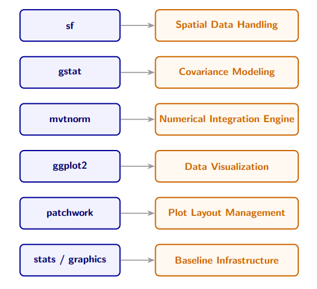

```{r setup, include=FALSE}
knitr::opts_chunk$set(echo = FALSE, warning = FALSE, message = FALSE)
library(plotly)
library(ggplot2)
library(sf)
library(gstat)
library(tidyr)
library(viridis)
library(gridExtra)
library(kableExtra)
library(BMEmapping)
```

# Introduction

Measurements and predictions of spatial variables are inherently subject to various forms of uncertainty. These uncertainties can significantly affect the reliability and interpretability of spatial data, particularly when dealing with complex environmental or geophysical systems. As a result, any decisions or actions informed by such data, whether in environmental policy, resource management, public health, or engineering design, are also influenced by the underlying uncertainty in both the observations and model-based predictions. The quantitative assessment of spatial uncertainties, along with the modeling of the statistical properties of natural processes, is crucial in a wide range of applications [@bogaert1997spatiotemporal; @christakos1998bayesian]. As spatial data continue to grow in complexity and volume, the need for rigorous uncertainty modeling becomes increasingly important for advancing both scientific knowledge and practical outcomes.

Classical spatial analysis and mapping techniques, including classical geostatistical methods, surface fitting approaches, and basis function models, have been developed primarily for precise point-valued observations, commonly referred to as hard data [@jain1989fundamentals; @journel1989fundamentals]. Although these methods have proven effective in many applications, they generally rely exclusively on exact measurements and often fail to incorporate other valuable sources of information characterized by uncertainty or imprecision. In spatial modeling, hard data consist of observations whose values are treated as known with negligible measurement error, whereas soft data represent uncertain information described through intervals, probability distributions, or expert knowledge. For example, in ground snow load mapping, a weather station may report a reliability-targeted design ground snow load of 65 psf at a specific location, which would be considered hard data. In contrast, an engineering assessment or historical record may indicate that the snow load at another location is likely between 50 and 70 psf without specifying an exact value, thereby constituting soft interval data. Similarly, in snow water equivalent (SWE) mapping, measurements collected from ground monitoring stations can be treated as hard data, while satellite-derived estimates subject to retrieval and measurement uncertainties can be represented as soft data. By integrating both hard and soft information within a unified probabilistic framework, BME enables the incorporation of multiple sources of knowledge and uncertainty, leading to more informative and realistic spatial predictions than methods that rely solely on precise observations.

In the literature, fruitful results have been obtained on the incorporation of soft data in spatial and spatiotemporal modeling. For example, a class of models called interval-valued kriging [@diamond88; @bean22] aims to develop an extension of kriging that takes interval-valued input and produces interval-valued output. Another approach that is more relevant to the R package introduced in this paper is called soft kriging [@journel1986constrained], which attempts to integrate soft data by summarizing it into a prior probability distribution and linearly interpolating it via least squares to derive the posterior distribution. Soft kriging has gained popularity for its practical utility, but also suffers from noticeable limitations: it lacks a systematic framework to derive priors from incomplete information, which can result in significant information loss due to approximation [@christakos1998bayesian; @journel1986constrained]. Moreover, it is mainly suited for spatial data, but does not easily extend to spatiotemporal data [@dowd1991review]. 

Bayesian Maximum Entropy (BME) presents a more robust theoretical framework for analyzing and mapping complex spatial and spatiotemporal variables in the presence of uncertainty [@christakos1990bayesian; @tang2016spatiotemporal; @xu2022spatio]. BME leverages Bayesian inference and information theory to integrate both hard and soft data, along with other relevant prior information, into a unified estimation process [@christakos1998bayesian; @christakos2000modern]. The main strength of BME lies in its mathematical foundation to process a wide variety of knowledge sources. More specifically, it allows for the inclusion of soft data of various forms and enables the use of nonlinear estimators that offer greater flexibility than traditional geostatistical methods. Computationally, BME can be formulated in vector forms for multi-location predictions, thus providing an efficient solution to block estimation challenges. As an extension of classical kriging methods, BME significantly improves our ability to model complex natural phenomena under uncertainty, making it an invaluable tool for modern spatial and spatiotemporal statistics, where data have grown dramatically both in quantity and complexity. 

The \CRANpkg{BMEmapping} R [@R] package provides a comprehensive suite of tools for spatial interpolation within the BME framework, enhancing traditional geostatistical methods by seamlessly integrating both hard and soft data. Designed with a user-friendly interface, \CRANpkg{BMEmapping} facilitates end-to-end spatial BME prediction workflows, including posterior density evaluation at unobserved locations, calculation of posterior summaries such as the mean and mode, uncertainty quantification, and model validation. It simplifies the preparation of input data, execution of spatial predictions, and analysis of posterior distributions, enabling the incorporation of expert knowledge and uncertain observations into environmental and spatial modeling. Notably, \CRANpkg{BMEmapping} improves scalability and user flexibility by allowing modifications to the posterior distribution domain and providing advanced options for data integration. The package includes sample datasets of ground snow load measurements from Utah and California to demonstrate its functionality. Built-in tools for posterior density analysis and diagnostic visualization enhance interpretability and support transparent reporting. Within the R ecosystem, several packages such as \CRANpkg{gstat}, \CRANpkg{fields}, \CRANpkg{spmodel}, and \CRANpkg{intkrige} provide tools for spatial interpolation, primarily based on classical geostatistical approaches. By providing an integrated and computationally efficient implementation of the entropy-based geostatistical framework, \CRANpkg{BMEmapping} complements these existing tools and addresses a gap in R's current spatial analysis toolkit by enabling uncertainty-aware spatial interpolation that can incorporate heterogeneous, imprecise soft information alongside hard measurements. The current version of \CRANpkg{BMEmapping} focuses on spatial BME applications; while the BME framework can be extended to spatiotemporal settings, spatiotemporal prediction capabilities are not yet implemented and remain a potential direction for future development.

The rest of the paper is organized as follows. Section 2 presents the theoretical foundation of the BME methodology, highlighting its capacity to integrate hard and soft data within a coherent probabilistic framework. Section 3 introduces the \CRANpkg{BMEmapping} package, detailing its architecture, key functions, and practical implementation within the R environment. In Section 4, we demonstrate a typical spatial prediction workflow using real-world data, illustrating how \CRANpkg{BMEmapping} facilitates geostatistical inference under uncertainty. Finally, Section 5 offers concluding remarks and outlines potential directions for future enhancements and applications of the package.

# Bayesian maximum entropy methodology

The BME was proposed by Christakos [@christakos1990bayesian; @christakos2000bme; @becker2021using] as an extension of kriging to allow for the integration of both measurements and diverse knowledge sources in the spatial and spatiotemporal interpolation in a coherent and logical manner. Generally speaking, BME integrates two primary forms of physical knowledge ($\mathcal{K}$): general knowledge ($\mathcal{G}$), which includes theoretical assumptions, physical laws, and model constraints; and specific knowledge ($\mathcal{S}$), which encompasses site-specific measurements and empirical data [@serre1999modern; @fu2020mitigating; @yecsilkoy2020estimation]. By combining these knowledge sources within a spatiotemporal mapping context, BME enables a more comprehensive and informed representation of natural phenomena. The BME methodology is organized into three critical epistemological stages: the prior stage (that summarizes the general knowledge into a prior distribution), the pre-posterior stage (where data of various forms and degrees of uncertainty are integrated), and the posterior stage (which computes the posterior distribution). 

In the following, we describe basic concepts and formula of the three-stage procedure. To facilitate the presentation, random variables are denoted by uppercase letters, their realizations by lowercase letters, and vectors or matrices by boldface type, respectively. Let $Z$ denote a spatial random field (SRF), defined over spatial location vectors $\boldsymbol{x}$. Although the BME framework is applicable to spatiotemporal random fields (S/TRFs), we focus here on the purely spatial case, i.e., $Z(\boldsymbol{x})$ varies only in space, for ease of presentation. The values of $Z$ are known exactly at $n_h$ hard data locations, such that $Z(\boldsymbol{x}_{h:i}) = z_{h:i}$ for $i = 1, 2, \dots, n_h$. We denote the set of hard data as $Z(\boldsymbol{x}_h) = \boldsymbol{Z}_h$, with corresponding realization $\boldsymbol{z}_h$. In addition, we observe uncertain (soft) data at $n_s$ spatial locations, expressed as intervals $Z(\boldsymbol{x}_{s:i}) = [a_i, b_i]$ for $i = 1, 2, \dots, n_s$, collectively denoted as $Z(\boldsymbol{x}_s)=\boldsymbol{Z}_s$, with realization $\boldsymbol{z}_s = [\boldsymbol{a}, \boldsymbol{b}]$. Thus, the complete observed (i.e., hard and soft) data are represented as $\boldsymbol{z}_{hs} = \{ \boldsymbol{z}_h, \boldsymbol{z}_s \}$. Our aim is to estimate the unknown value $Z_k = Z(\boldsymbol{x}_k)$ at an unsampled location $\boldsymbol{x}_k$ based on the available data $\boldsymbol{z}_{hs}$. Denote the full set of random variables under this mapping framework as 

```{r results='asis', echo=FALSE, include=knitr::is_latex_output()}
cat('
\\begin{equation*}
\\boldsymbol{Z}_\\mathrm{map} = \\{ \\boldsymbol{Z}_h, \\boldsymbol{Z}_s, Z_k \\}, 
\\end{equation*}
')
```

```{r results='asis', echo=FALSE, include=knitr::is_html_output()}
cat('
$$
\\boldsymbol{Z}_\\mathrm{map} = \\{ \\boldsymbol{Z}_h, \\boldsymbol{Z}_s, Z_k \\},
$$
')
```

with the corresponding realization $\boldsymbol{z}_\mathrm{map} = \{ \boldsymbol{z}_h, \boldsymbol{z}_s, z_k \}$. The main objective of BME analysis is to compute the multivariate posterior probability density function, i.e., the conditional density  $f(\boldsymbol{z}_\mathrm{map} \mid \boldsymbol{z}_{hs})$, followed by an integration to derive the marginal posterior distribution $f(z_k\mid \boldsymbol{z}_{hs})$.

## Prior stage

The goal of the prior stage is to maximize information relative to the general knowledge $\mathcal{G}$. In most cases, $\mathcal{G}$ includes information up to the first two moments, that is, the mean vector, $\boldsymbol{m}_\mathrm{map}$ and covariance matrix $\boldsymbol{C}_\mathrm{map}$ between the locations $\boldsymbol{x}_\mathrm{map} = \{\boldsymbol{x}_h, \boldsymbol{x}_s, x_k\}$. The most general distribution that respects $\mathcal{G}$, denoted by $f_\mathcal{G}$, is the joint prior distribution for the variables $\boldsymbol{Z}_\mathrm{map}$; it is found by maximizing the expected information received when the value of $Z_\mathrm{map}$ is observed, subject to the constraints of $\mathcal{G}$ (i.e., the mean and covariance of $\boldsymbol{Z}_\mathrm{map}$). Shannon's information entropy is used as a measure of uncertainty in the prior distribution $f_{\mathcal{G}}$, which is expressed as 

```{r results='asis', echo=FALSE, include=knitr::is_latex_output()}
cat('
\\begin{equation}
\\mathrm{E}\\left[\\mathrm{Info}_\\mathcal{G}(\\boldsymbol{Z}_{\\mathrm{map}})\\right] = - \\int \\log\\left[{f_\\mathcal{G} (\\boldsymbol{z}_{\\mathrm{map}})}\\right] \\, f_\\mathcal{G} (\\boldsymbol{z}_{\\mathrm{map}})  \\, d \\boldsymbol{z}_{\\mathrm{map}}
\\label{eq:shannon}.
\\end{equation}
')
```

```{r results='asis', echo=FALSE, include=knitr::is_html_output()}
cat('
$$
\\mathrm{E}\\left[\\mathrm{Info}_{\\mathcal{G}}(\\boldsymbol{Z}_{\\mathrm{map}})\\right] =
- \\int \\log\\left( f_{\\mathcal{G}}(\\boldsymbol{z}_{\\mathrm{map}}) \\right) \\, f_{\\mathcal{G}}(\\boldsymbol{z}_{\\mathrm{map}}) \\, d\\boldsymbol{z}_{\\mathrm{map}}
(\\#eq:shannon).
$$
')
```

@christakos1998environmental showed that, under the mean and covariance constraints, the optimal $f_\mathcal{G}$ that maximizes Shannon's entropy \@ref(eq:shannon) is the multivariate Gaussian distribution with mean $\boldsymbol{m}_\mathrm{map}$ and covariance $\boldsymbol{C}_\mathrm{map}$. Therefore, the prior distribution of $\boldsymbol{z}_\mathrm{map}$ is given as 

```{r results='asis', echo=FALSE, include=knitr::is_latex_output()}
cat('
\\begin{equation}
f_\\mathcal{G} (\\boldsymbol{z}_\\mathrm{map}) = 
  \\phi (\\boldsymbol{z}_\\mathrm{map}; \\boldsymbol{m}_\\mathrm{map}, \\boldsymbol{C}_\\mathrm{map})
\\label{eq:prior-pdf}.
\\end{equation}
')
```

```{r results='asis', echo=FALSE, include=knitr::is_html_output()}
cat('
$$
f_\\mathcal{G} (\\boldsymbol{z}_\\mathrm{map}) = 
  \\phi (\\boldsymbol{z}_\\mathrm{map}; \\boldsymbol{m}_\\mathrm{map}, \\boldsymbol{C}_\\mathrm{map})
(\\#eq:prior-pdf),
$$
')
```

where 

```{r results='asis', echo=FALSE, include=knitr::is_latex_output()}
cat('
\\begin{equation}
\\phi (\\boldsymbol{z}_\\mathrm{map}; \\boldsymbol{m}_\\mathrm{map}, \\boldsymbol{C}_\\mathrm{map}) = \\dfrac{\\exp\\left\\{ -\\frac{1}{2} (\\boldsymbol{z}_\\mathrm{map} - \\boldsymbol{m}_\\mathrm{map})^T \\hspace{.3em} \\boldsymbol{C}_\\mathrm{map}^{-1} \\hspace{.3em} (\\boldsymbol{z}_\\mathrm{map} - \\boldsymbol{m}_\\mathrm{map})\\right\\}}{(2\\pi)^{\\frac{(n+1)}{2}} \\, \\rvert{\\boldsymbol{C}_\\mathrm{map}\\lvert}^{\\frac{1}{2}}}
\\label{eq:prior-pdf-full}.
\\end{equation}
')
```

```{r results='asis', echo=FALSE, include=knitr::is_html_output()}
cat('
$$
\\phi (\\boldsymbol{z}_\\mathrm{map}; \\boldsymbol{m}_\\mathrm{map}, \\boldsymbol{C}_\\mathrm{map}) = \\dfrac{\\exp\\left\\{ -\\frac{1}{2} (\\boldsymbol{z}_\\mathrm{map} - \\boldsymbol{m}_\\mathrm{map})^T \\hspace{.3em} \\boldsymbol{C}_\\mathrm{map}^{-1} \\hspace{.3em} (\\boldsymbol{z}_\\mathrm{map} - \\boldsymbol{m}_\\mathrm{map})\\right\\}}{(2\\pi)^{\\frac{(n+1)}{2}} \\, \\rvert{\\boldsymbol{C}_\\mathrm{map}\\lvert}^{\\frac{1}{2}}}
(\\#eq:prior-pdf-full).
$$
')
```

Spatial continuity is a foundational tenet of geostatistics, quantifying the degree of spatial correlation exhibited by a regionalized variable across a geographic domain. Accurately capturing this spatial dependence structure is a prerequisite for generating reliable interpolations and stochastic simulations. Within the BME paradigm, this continuity is mathematically encoded through the spatial variogram (or semivariogram) and its corresponding covariance function, which formalize how data similarity decays as a function of separation distance.

Operationally, the BME framework can be executed via two distinct pathways: Conventional BME and Quantile-Based BME. These frameworks diverge strictly in their methodology for characterizing spatial continuity through variogram structures. Crucially, this operational distinction is confined entirely to the construction of the structural prior stage; once the prior spatial parameters are established, both routines converge on the identical core entropy maximization algorithms to calculate final localized estimation fields.

### Conventional BME (CBME)

In the CBME framework, structural spatial continuity is established by computing an empirical variogram from the precise hard data, which is subsequently fitted to a valid theoretical model (e.g., spherical, exponential, or Matérn). Once defined, this single global variogram governs the spatial covariance structures across the entire mapping domain, dictating the relationships among hard observations, soft intervals, and unsampled prediction locations alike. A central assumption of this approach is that a variogram derived exclusively from hard data can accurately reflect spatial dependence across the entire region. However, in undersampled environments where hard observations are scarce, practitioners frequently resort to a hybrid dataset that pools the available hard data with the deterministic midpoints $\frac{1}{2}(\boldsymbol{a} + \boldsymbol{b})$ of the soft-interval bounds. While operationally convenient, this midpoint approximation introduces an important methodological limitation. By compressing an entire interval of uncertainty into a single central value, it implicitly assumes that the midpoint represents the true, unobserved state of the field. This over-concentration of prior probability density at the center ignores potential structural skewness and spatial variability within the soft data domain, frequently resulting in under-characterized uncertainty profiles and biased downstream spatial predictions.

Assuming a uniform weighting over the soft data intervals, it is convenient to define the mean vector as  

```{r results='asis', echo=FALSE, include=knitr::is_latex_output()}
cat('
\\begin{equation}
\\boldsymbol{m}_\\mathrm{map} = \\begin{bmatrix} \\boldsymbol{z}_{h} \\\\ \\frac{1}{2}(\\boldsymbol{a} + \\boldsymbol{b}) \\\\ z_k \\end{bmatrix}
\\label{eq:m-map}.
\\end{equation}
')
```

```{r results='asis', echo=FALSE, include=knitr::is_html_output()}
cat('
$$
\\boldsymbol{m}_\\mathrm{map} = \\begin{bmatrix} \\boldsymbol{z}_{h} \\\\ \\frac{1}{2}(\\boldsymbol{a} + \\boldsymbol{b}) \\\\ z_k \\end{bmatrix}
(\\#eq:m-map).
$$
')
```

The covariance $\boldsymbol{C}_\mathrm{map}$ is partitioned into blocks as

```{r results='asis', echo=FALSE, include=knitr::is_latex_output()}
cat('
\\begin{equation}
\\boldsymbol{C}_\\mathrm{map} =
  \\begin{bmatrix}
\\boldsymbol{C}_{h,h} & \\boldsymbol{C}_{h,s} & \\boldsymbol{C}_{h,k} \\\\
\\boldsymbol{C}_{s,h} & \\boldsymbol{C}_{s,s} & \\boldsymbol{C}_{s,k} \\\\
\\boldsymbol{C}_{k,h} & \\boldsymbol{C}_{k,s} & \\boldsymbol{C}_{k,k} \\end{bmatrix}
\\label{eq:C-map}.
\\end{equation}
')
```

```{r results='asis', echo=FALSE, include=knitr::is_html_output()}
cat('
$$
\\boldsymbol{C}_\\mathrm{map} =
  \\begin{bmatrix}
\\boldsymbol{C}_{h,h} & \\boldsymbol{C}_{h,s} & \\boldsymbol{C}_{h,k} \\\\
\\boldsymbol{C}_{s,h} & \\boldsymbol{C}_{s,s} & \\boldsymbol{C}_{s,k} \\\\
\\boldsymbol{C}_{k,h} & \\boldsymbol{C}_{k,s} & \\boldsymbol{C}_{k,k} \\end{bmatrix}
(\\#eq:C-map).
$$
')
```

with respect to the covariances of the hard data (h), soft data (s), and prediction locations (k), as well as their cross-covariances. The component blocks in \@ref(eq:C-map) are computed from a fitted variogram model. If sufficient hard data are available, the variogram can be fitted to the hard data only. Otherwise, additional information from the soft data, e.g., midpoints of the soft intervals, is included to enhance the variogram fitting. For the soft data covariance  $\boldsymbol{C}_{s,s}$, an extra uncertainty from a prior distribution $f_s(\boldsymbol{z}_s)$ is added to the diagonals. More precisely, the diagonals of $\boldsymbol{C}_{s,s}$ are defined as the sum of the covariance function at lag $0$ and the variance of the prior soft data distribution, i.e.,

```{r results='asis', echo=FALSE, include=knitr::is_latex_output()}
cat('
\\begin{equation}
diag\\left\\{\\boldsymbol{C}_{s,s}\\right\\}
= C(0) + \\sigma^2\\left\\{f_s(\\boldsymbol{z}_s)\\right\\}
\\label{eq:var}.
\\end{equation}
')
```

```{r results='asis', echo=FALSE, include=knitr::is_html_output()}
cat('
$$
diag\\left\\{\\boldsymbol{C}_{s,s}\\right\\}
= C(0) + \\sigma^2\\left\\{f_s(\\boldsymbol{z}_s)\\right\\}
(\\#eq:var).
$$
')
```

where $C(0)$ is the empirical variance derived from the variogram model. The value of $\sigma^2\left\{f_s(\boldsymbol{z}_s)\right\}$ depends on the form of $f_s$, which is usually assumed to be a uniform distribution without additional prior information. Under this assumption, it takes the form   

```{r results='asis', echo=FALSE, include=knitr::is_latex_output()}
cat('
\\begin{equation}
\\sigma^2\\left\\{f_s(\\boldsymbol{z}_s)\\right\\} = \\frac{1}{12} (\\boldsymbol{b}-\\boldsymbol{a})^2
\\label{eq:sigma}.
\\end{equation}
')
```

```{r results='asis', echo=FALSE, include=knitr::is_html_output()}
cat('
$$
\\sigma^2\\left\\{f_s(\\boldsymbol{z}_s)\\right\\} = \\frac{1}{12} (\\boldsymbol{b}-\\boldsymbol{a})^2
(\\#eq:sigma).
$$
')
```

where $\boldsymbol{b}$ and $\boldsymbol{a}$ are the upper and lower bounds of the soft intervals. 

### Quantile-Based BME (QBME)

To address the geometric limitations of the conventional approach, @duah2026random introduced the QBME framework. Rather than reducing uncertain information to a static center point, QBME models the true, unobserved value within a soft interval as a continuous functional distribution driven by a latent quantile variable $q \in [0, 1]$. In the absence of specific historical or observational constraints regarding the inner distribution of the interval, the framework assigns a non-informative uniform prior ($q \sim \text{Uniform}(0, 1)$). This directly satisfies the principle of maximum entropy by distributing probability mass equally across the bounded range.

Operationally, this continuous distribution is resolved by slicing each soft interval into a finite set of $p$ representative quantile coordinates. Each coordinate slice is paired with the fixed hard observations to construct an ensemble of distinct hybrid datasets. The mean vector of the mapping variable then becomes

```{r results='asis', echo=FALSE, include=knitr::is_latex_output()}
cat('
\\begin{equation}
\\boldsymbol{m}_\\mathrm{map} = \\begin{bmatrix} \\boldsymbol{z}_{h} \\\\ \\frac{1}{p}(\\boldsymbol{z}_{q_1} + \\boldsymbol{z}_{q_2} + \\dots + \\boldsymbol{z}_{q_p}) \\\\ z_k \\end{bmatrix}
\\label{eq:qm-map}.
\\end{equation}
')
```

```{r results='asis', echo=FALSE, include=knitr::is_html_output()}
cat('
$$
\\boldsymbol{m}_\\mathrm{map} = \\begin{bmatrix} \\boldsymbol{z}_{h} \\\\ \\frac{1}{p}(\\boldsymbol{z}_{q_1} + \\boldsymbol{z}_{q_2} + \\dots + \\boldsymbol{z}_{q_p}) \\\\ z_k \\end{bmatrix}
(\\#eq:qm-map).
$$
')
```

By fitting a unique theoretical variogram model to each specific configuration, the framework captures the structural spatial continuity across the full spectrum of plausible field values. The resulting quantile-specific covariance matrices $\boldsymbol{\Sigma}(q_k)$ are subsequently combined into a single integrated prior covariance matrix:

```{r results='asis', echo=FALSE, include=knitr::is_latex_output()}
cat('
\\vspace{-1em}
\\begin{equation}
\\boldsymbol{C}_{ij} \\approx \\frac{1}{p} \\sum_{k=1}^{p} \\boldsymbol{C}_{q_k}(|i - j|)
\\label{eq:qbme-vignette-cov}.
\\end{equation}
')

```

```{r results='asis', echo=FALSE, include=knitr::is_html_output()}
cat('
$$
\\boldsymbol{C}_{ij} \\approx \\frac{1}{p} \\sum_{k=1}^{p} \\boldsymbol{C}_{q_k}(|i - j|)
(\\#eq:qbme-vignette-cov).
$$
')

```

By shifting from a restrictive single-midpoint approximation to an integrated ensemble of conditional variograms, the QBME implementation explicitly propagates soft-data uncertainty throughout the entire mapping domain. Because the global prior matrix $\boldsymbol{C}$ is a convex combination of mathematically valid, positive-definite matrices, it preserves spatial coherence and structural stability in a principled, computationally tractable manner that remains strictly consistent with its information-theoretic foundations.

In practice, selecting the number of quantile steps $p$ involves a critical trade-off between statistical precision and computational overhead. While small values of $p$ may fail to adequately capture the uncertainty profile of the soft intervals, excessively large values impose a heavy computational burden by requiring the estimation of $p$ separate variogram models. To maximize localized prediction accuracy while maintaining numerical efficiency, a proper operational balance must be struck. For the empirical evaluations in this study, a resolution of $p = 10$ was chosen, providing highly stable spatial configurations and optimal runtime performance.

## Pre-posterior stage

The pre-posterior stage incorporates the specification knowledge $\mathcal{S}$, which primarily consists of the physical data to be utilized in the subsequent posterior estimation. This stage focuses on the collection, characterization, and organization of both hard and soft data in a form compatible with the BME framework. While the task is essential, it is often considered more of an interpretative and heuristic process than a purely quantitative one. In this version of the package, soft data are limited to interval-type information; however, in general, soft data may take various forms, including probability distributions, physical model outputs, or functional data. A notable feature of the BME methodology is that some or all of the data may be employed twice during the inference process. Specifically, data are first incorporated implicitly during the prior stage to determine the prior probability distribution function (pdf), and then explicitly used during the posterior stage to compute the posterior estimates.

## Posterior stage

The objective of the posterior stage is to derive the most coherent and informative estimate by maximizing the posterior probability distribution conditioned on both the general knowledge $\mathcal{G}$ and the specification knowledge $\mathcal{S}$. This stage integrates all available information (both theoretical and empirical) and is typically carried out in two steps. In the first step, the posterior probability density of $\boldsymbol{z}_\mathrm{map}$ conditioning on $\boldsymbol{z}_{hs}$ is computed according to Bayes’ rule as:

```{r results='asis', echo=FALSE, include=knitr::is_latex_output()}
cat('
\\begin{equation}
f(\\boldsymbol{z}_\\mathrm{map} \\mid \\boldsymbol{z}_{hs}) = A^{-1} \\, l(\\boldsymbol{z}_{hs}  \\mid  \\boldsymbol{z}_\\mathrm{map}) \\, \\phi (\\boldsymbol{z}_\\mathrm{map}; \\boldsymbol{m}_\\mathrm{map}, \\boldsymbol{C}_\\mathrm{map})
\\label{eq:post},
\\end{equation}
')
```

```{r results='asis', echo=FALSE, include=knitr::is_html_output()}
cat('
$$
f(\\boldsymbol{z}_\\mathrm{map} \\mid \\boldsymbol{z}_{hs}) = A^{-1} \\, l(\\boldsymbol{z}_{hs}  \\mid  \\boldsymbol{z}_\\mathrm{map}) \\, \\phi (\\boldsymbol{z}_\\mathrm{map}; \\boldsymbol{m}_\\mathrm{map}, \\boldsymbol{C}_\\mathrm{map})
(\\#eq:post),
$$
')
```

where $A$ is a normalizing constant. The likelihood function, $l(\boldsymbol{z}_{hs}  \mid  \boldsymbol{z}_\mathrm{map})$ is the key in this Bayesian formulation, which is defined for three cases. If $\boldsymbol{z}_h$ is not exactly the hard data then $l(\boldsymbol{z}_{hs}  \mid  \boldsymbol{z}_\mathrm{map}) = 0$. If $\boldsymbol{z}_h$ is exactly the hard data and there are no soft data, then $l(\boldsymbol{z}_{hs}  \mid  \boldsymbol{z}_\mathrm{map}) = 1$. The third case is when $\boldsymbol{z}_h$ is exactly the hard data and there are additional soft data $(n_s > 0)$ then $l(\boldsymbol{z}_{hs}  \mid  \boldsymbol{z}_\mathrm{map}) = \Pi_{i=1}^{n_s} f_{s,i} (z_{s,i}) := f_s(\boldsymbol{z}_s)$. 

In the second step, the posterior pdf $f(z_k)$ of $Z(\boldsymbol{x}_k)$ is calculated as the marginal of the posterior joint pdf \@ref(eq:post). For the case when there are both hard and soft data, since the hard data are fixed values, the integration is only with respect to the soft data. More precisely, 

```{r results='asis', echo=FALSE, include=knitr::is_latex_output()}
cat('
\\begin{equation}
f(z_k) = A^{-1} \\int f_s(\\boldsymbol{z}_s) \\, \\phi(\\boldsymbol{z}_\\mathrm{map}; \\boldsymbol{m}_\\mathrm{map}, \\boldsymbol{C}_\\mathrm{map}) \\, d\\boldsymbol{z}_\\mathrm{map}
\\label{eq:ort}.
\\end{equation}
')
```

```{r results='asis', echo=FALSE, include=knitr::is_html_output()}
cat('
$$
f(z_k) = A^{-1} \\int f_s(\\boldsymbol{z}_s) \\, \\phi(\\boldsymbol{z}_\\mathrm{map}; \\boldsymbol{m}_\\mathrm{map}, \\boldsymbol{C}_\\mathrm{map}) \\, d\\boldsymbol{z}_\\mathrm{map}
(\\#eq:ort).
$$
')
```

For soft data expressed as intervals $[\boldsymbol{a}, \boldsymbol{b}]$, @serre1999environmental introduced an alternative formulation of \@ref(eq:ort), simplifying the notation and utilizing the properties of the multivariate Gaussian pdf to enhance computational efficiency. This formulation is given by

```{r results='asis', echo=FALSE, include=knitr::is_latex_output()}
cat('
\\begin{equation}
f(z_k) = \\mathcal{A}^{-1} \\, \\phi (z_k; \\boldsymbol{m}_{k \\mid h}, \\boldsymbol{C}_{k \\mid h}) \\, \\int^{\\boldsymbol{b}}_{\\boldsymbol{a}} \\phi (\\boldsymbol{z}_s; \\boldsymbol{m}_{s \\mid kh}, \\boldsymbol{C}_{s \\mid kh})  \\, d\\boldsymbol{z}_s
\\label{eq:post-k-int},
\\end{equation}
')
```

```{r results='asis', echo=FALSE, include=knitr::is_html_output()}
cat('
$$
f(z_k) = \\mathcal{A}^{-1} \\, \\phi (z_k; \\boldsymbol{m}_{k \\mid h}, \\boldsymbol{C}_{k \\mid h}) \\, \\int^{\\boldsymbol{b}}_{\\boldsymbol{a}} \\phi (\\boldsymbol{z}_s; \\boldsymbol{m}_{s \\mid kh}, \\boldsymbol{C}_{s \\mid kh})  \\, d\\boldsymbol{z}_s
(\\#eq:post-k-int),
$$
')
```

where the conditional mean, $\boldsymbol{m}_{k \mid h}$ and covariance, $\boldsymbol{C}_{k \mid h}$ of $z_k$ given the hard data $\boldsymbol{z}_h$ are computed as

```{r results='asis', echo=FALSE, include=knitr::is_latex_output()}
cat('
\\vspace{-2em}
\\begin{align}
\\boldsymbol{m}_{k \\mid h} &= \\boldsymbol{C}_{k h} \\, \\boldsymbol{C}_{h h}^{-1} \\, \\boldsymbol{z}_h,
\\label{eq:m-zkh}\\\\
\\boldsymbol{C}_{k \\mid h} &= \\boldsymbol{C}_{k,k} - \\boldsymbol{C}_{k,h} \\, \\boldsymbol{C}^{-1}_{h,h} \\, \\boldsymbol{C}_{h, k}.
\\label{eq:c-zkh}
\\end{align}
')
```

```{r results='asis', echo=FALSE, include=knitr::is_html_output()}
cat('
$$
\\boldsymbol{m}_{k \\mid h} = \\boldsymbol{C}_{k h} \\, \\boldsymbol{C}_{h h}^{-1} \\, \\boldsymbol{z}_h
(\\#eq:m-zkh),
$$

$$
\\boldsymbol{C}_{k \\mid h} = \\boldsymbol{C}_{k,k} - \\boldsymbol{C}_{k,h} \\, \\boldsymbol{C}^{-1}_{h,h} \\, \\boldsymbol{C}_{h, k}
(\\#eq:C-zkh).
$$
')
```

Defining the augmented hard data $\boldsymbol{z}_{kh} = [z_k, \boldsymbol{z}_{h}]$, the conditional mean $\boldsymbol{m}_{s \mid h}$ and covariance $\boldsymbol{C}_{s \mid h}$ of the soft-interval data $\boldsymbol{z}_s$ given the augmented hard data are calculated as

```{r results='asis', echo=FALSE, include=knitr::is_latex_output()}
cat('
\\vspace{-2em}
\\begin{align}
\\boldsymbol{m}_{s \\mid kh} &=  \\boldsymbol{C}_{s,kh} \\, \\boldsymbol{C}^{-1}_{kh,kh} \\, \\boldsymbol{z}_{kh},
\\label{eq:m-zskh}\\\\
\\boldsymbol{C}_{s \\mid kh} &= \\boldsymbol{C}_{s,s} - \\boldsymbol{C}_{s,kh} \\, \\boldsymbol{C}^{-1}_{kh,kh} \\, \\boldsymbol{C}_{kh,s}.
\\label{eq:C-zskh}
\\end{align}
')
```

```{r results='asis', echo=FALSE, include=knitr::is_html_output()}
cat('
$$
\\boldsymbol{m}_{s \\mid kh} =  \\boldsymbol{C}_{s,kh} \\, \\boldsymbol{C}^{-1}_{kh,kh} \\, \\boldsymbol{z}_{kh}
(\\#eq:m-zskh),
$$

$$
\\boldsymbol{C}_{s \\mid kh} = \\boldsymbol{C}_{s,s} - \\boldsymbol{C}_{s,kh} \\, \\boldsymbol{C}^{-1}_{kh,kh} \\, \\boldsymbol{C}_{kh,s}
(\\#eq:C-zskh)
$$
')
```

The normalizing constant $\mathcal{A}$ has the formula

```{r results='asis', echo=FALSE, include=knitr::is_latex_output()}
cat('
\\begin{equation}
\\mathcal{A} = \\int^{\\boldsymbol{b}}_{\\boldsymbol{a}} \\phi (\\boldsymbol{z}_s; \\boldsymbol{m}_{s \\mid h}, \\boldsymbol{C}_{s \\mid h})  \\, d\\boldsymbol{z}_s
\\label{eq:norm-constant},
\\end{equation}
')
```

```{r results='asis', echo=FALSE, include=knitr::is_html_output()}
cat('
$$
\\mathcal{A} = \\int^{\\boldsymbol{b}}_{\\boldsymbol{a}} \\phi (\\boldsymbol{z}_s; \\boldsymbol{m}_{s \\mid h}, \\boldsymbol{C}_{s \\mid h})  \\, d\\boldsymbol{z}_s
(\\#eq:norm-constant),
$$
')
```

where the conditional mean $\boldsymbol{m}_{s \mid h}$ and covariance $\boldsymbol{C}_{s \mid h}$ of the soft-interval data given the hard data are given by

```{r results='asis', echo=FALSE, include=knitr::is_latex_output()}
cat('
\\vspace{-2em}
\\begin{align}
\\boldsymbol{m}_{s \\mid h} &= \\boldsymbol{C}_{s,h} \\, \\boldsymbol{C}^{-1}_{h,h} \\, \\boldsymbol{z}_{h},
\\label{eq:m-zsh}\\\\
\\boldsymbol{C}_{s \\mid h} &= \\boldsymbol{C}_{s,s} - \\boldsymbol{C}_{s,h} \\, \\boldsymbol{C}^{-1}_{h,h} \\, \\boldsymbol{C}_{h,s}.
\\label{eq:C-zsh}
\\end{align}
')
```

```{r results='asis', echo=FALSE, include=knitr::is_html_output()}
cat('
$$
\\boldsymbol{m}_{s \\mid h} = \\boldsymbol{C}_{s,h} \\, \\boldsymbol{C}^{-1}_{h,h} \\, \\boldsymbol{z}_{h}
(\\#eq:m-zsh),
$$

$$
\\boldsymbol{C}_{s \\mid h} = \\boldsymbol{C}_{s,s} - \\boldsymbol{C}_{s,h} \\, \\boldsymbol{C}^{-1}_{h,h} \\, \\boldsymbol{C}_{h,s}.
(\\#eq:C-zsh)
$$
')
```

The notation $\int_{\boldsymbol{a}}^{\boldsymbol{b}}$ represents the $n_s$-dimensional integral over the intervals $[a_i, b_i]$ for $i = 1, \ldots, n_s$, which can be conveniently computed numerically since the integrand is a multivariate Gaussian pdf. 

## Prediction and uncertainty quantification

For spatial mapping applications, it is often desirable to obtain an estimate of the variable of interest at the prediction location, $\boldsymbol{x}_k$. The BME framework offers the flexibility to select from multiple types of estimates, depending on the specific requirements and context of the mapping task. Given the posterior pdf, one can compute various estimates such as the posterior mean, mode, median, or any desired percentile. The choice of estimate should be guided by both theoretical considerations (e.g., optimality criteria) and practical constraints (e.g., computational complexity or interpretability). Among the most commonly used estimators are the BME mean estimate, $\bar{z}_{k \mid \mathcal{K}}$, and the BME mode estimate, $\hat{z}_{k \mid \mathcal{K}}$.

### BME mean

The BME mean, denoted by $\bar{z}_{k \mid \mathcal{K}}$, is the mean of the posterior distribution, which takes the nonlinear form [@christakos2000modern]

```{r results='asis', echo=FALSE, include=knitr::is_latex_output()}
cat('
\\vspace{-1em}
\\begin{equation}
\\bar{z}_{k \\mid \\mathcal{K}} = \\int z_k f_{\\mathcal{K}}(z_k) \\, d z_k
\\label{eq:post-mean}.
\\end{equation}
')
```

```{r results='asis', echo=FALSE, include=knitr::is_html_output()}
cat('
$$
\\bar{z}_{k \\mid \\mathcal{K}} = \\int z_k f_{\\mathcal{K}}(z_k) \\, d z_k
(\\#eq:post-mean).
$$
')
```

The posterior mean is the minimizer of the posterior mean squared loss from Bayesian perspectives, so $\bar{z}_{k \mid \mathcal{K}}$ is most suitable for mapping situations where the objective is to minimize the mean squared prediction error. 

### BME mode

The BME mode estimate, denoted by $\hat{z}_{k \mid \mathcal{K}}$, is defined as the value of $z_{k}$ at which the posterior probability density function $f_{\mathcal{K}}(z_k)$ attains its maximum. In other words, it is the most probable value of the unknown quantity $z_k$ given the available hard and soft data, and is formally expressed as:

```{r results='asis', echo=FALSE, include=knitr::is_latex_output()}
cat('
\\vspace{-1em}
\\begin{equation}
\\hat{z}_{k \\mid \\mathcal{K}} = \\arg\\max_{z_k} \\, f_{\\mathcal{K}}(z_k)
\\label{eq:post-mode}.
\\end{equation}
')
```

```{r results='asis', echo=FALSE, include=knitr::is_html_output()}
cat('
$$
\\hat{z}_{k \\mid \\mathcal{K}} = \\arg\\max_{z_k} \\, f_{\\mathcal{K}}(z_k)
(\\#eq:post-mode).
$$
')
```

The posterior mode is particularly useful when the posterior distribution is skewed or multimodal. In such cases, the BME mode identifies the most likely value based on the available data. Therefore, the BME mode estimate is often preferred in non-Gaussian or asymmetric scenarios where capturing the most probable outcome is more meaningful than representing a central tendency.

### BME variance

An important aspect of any geostatistical estimation method is the ability to quantify the uncertainty associated with predictions. In the BME framework, this is achieved by estimating the variance of the prediction error, which is referred to as the BME variance. 
For a prediction made at location $\boldsymbol{x}_k$, the BME variance $\sigma^2_{k \mid \mathcal{K}}$ is defined as [@olea2006six; @bogaert1997spatiotemporal]:

```{r results='asis', echo=FALSE, include=knitr::is_latex_output()}
cat('
\\vspace{-1em}
\\begin{equation}
\\sigma^2_{k \\mid \\mathcal{K}} = \\int \\left(z_k - \\bar{z}_{k \\mid \\mathcal{K}} \\right)^2 f_{\\mathcal{K}}(z_k) \\, dz_k
\\label{eq:post-var}.
\\end{equation}
')
```

```{r results='asis', echo=FALSE, include=knitr::is_html_output()}
cat('
$$
\\sigma^2_{k \\mid \\mathcal{K}} = \\int \\left(z_k - \\bar{z}_{k \\mid \\mathcal{K}} \\right)^2 f_{\\mathcal{K}}(z_k) \\, dz_k
(\\#eq:post-var).
$$
')
```

where $z_k$ is the true (but unknown) value. Importantly, $\sigma^2_{k \mid \mathcal{K}}$ reflects the variance of the error in estimating the actual field value $Z(\boldsymbol{x}_k)$, not the variance of the predictor itself. This distinction is essential because it highlights the degree of confidence in the prediction given the available hard and soft data. As such, $\sigma^2_{k \mid \mathcal{K}}$ serves as a valuable diagnostic for assessing the fit of the model and the reliability of the spatial predictions. Notice, however, that the BME variance can only be computed for the mean estimate and is not available for the mode. 

### BME median

The BME median, denoted by $m_{k \mid \mathcal{K}}$, is the median of the posterior distribution, defined as the value of $z_k$ that splits the localized probability density field into two equal halves. Formally, it satisfies the integral condition:

```{r results='asis', echo=FALSE, include=knitr::is_latex_output()}
cat('
\\vspace{-1em}
\\begin{equation}
\\int_{-\\infty}^{m_{k \\mid \\mathcal{K}}} f_{\\mathcal{K}}(z_k) \\, d z_k = 0.5
\\label{eq:post-median}.
\\end{equation}
')

```

```{r results='asis', echo=FALSE, include=knitr::is_html_output()}
cat('
$$
\\int_{-\\infty}^{m_{k \\mid \\mathcal{K}}} f_{\\mathcal{K}}(z_k) \\, d z_k = 0.5
(\\#eq:post-median).
$$
')

```

From a Bayesian decision-theoretic perspective, the posterior median minimizes the expected mean absolute error loss function. Consequently, $m_{k \mid \mathcal{K}}$ is highly robust against outliers and represents the optimal point estimator for spatial mapping situations where the objective is to minimize the absolute deviation between true and predicted attributes rather than squared error.

### BME interval

To capture the complete spatial uncertainty profile without relying on symmetry or Gaussian assumptions, the BME framework enables the computation of non-Gaussian spatial credible intervals. A $100(1-\alpha)\%$ BME credible interval, defined by its lower bound $L_{k \mid \mathcal{K}}$ and upper bound $U_{k \mid \mathcal{K}}$, isolates the localized posterior probability mass such that:

```{r results='asis', echo=FALSE, include=knitr::is_latex_output()}
cat('
\\vspace{-1em}
\\begin{equation}
\\int_{L_{k \\mid \\mathcal{K}}}^{U_{k \\mid \\mathcal{K}}} f_{\\mathcal{K}}(z_k) \\, dz_k = 1 - \\alpha
\\label{eq:post-interval}.
\\end{equation}
')

```

```{r results='asis', echo=FALSE, include=knitr::is_html_output()}
cat('
$$
\\int_{L_{k \\mid \\mathcal{K}}}^{U_{k \\mid \\mathcal{K}}} f_{\\mathcal{K}}(z_k) \\, dz_k = 1 - \\alpha
(\\#eq:post-interval).
$$
')

```

Commonly parameterized as equal-tailed bounds, the limits are obtained by solving for the corresponding $(\alpha/2)$ and $(1 - \alpha/2)$ quantiles of the cumulative posterior distribution. Unlike classical kriging variance metrics which merely yield symmetric intervals under a rigid Gaussian profile, the BME credible interval directly mirrors asymmetric, skewed, or multimodal attributes of $f_{\mathcal{K}}(z_k)$. This feature provides a rigorous and physically realistic indicator of localized risk and prediction precision across highly heterogeneous soft-interval spaces.

# Description and implementation of \CRANpkg{BMEmapping}

The \CRANpkg{BMEmapping} package is publicly available on CRAN under the GPL-3 license and can be installed using the code:

```{r echo=TRUE, eval=FALSE}
install.packages("BMEmapping")

```

The development version is available on [GitHub](https://github.com/KinsprideDuah/BMEmapping) and can be installed via the \CRANpkg{devtools} package [@wickham2022devtools] using the following command:

```{r echo=TRUE, eval=FALSE}
devtools::install_github("KinsprideDuah/BMEmapping")

```

The internal software architecture and downstream dependencies of the \CRANpkg{BMEmapping} framework are depicted in Figure \@ref(fig:chart). The flowchart outlines the clear separation of concerns embedded within the package design, categorizing dependencies into distinct operational pillars: spatial geometry management, core geostatistical parameter optimization, multi-dimensional integration utilities, and diagnostic plotting tools.

```{r chart, out.width = "80%", out.height = "30%", fig.cap ="External R packages (left) and their architectural roles (right) in BMEmapping."}


```

## Operation

To use the \CRANpkg{BMEmapping} package, users need R version 3.5 or higher. Its functions are organized into three categories: posterior density estimation, BME prediction, and model assessment. Two datasets `utsnowload` and `casnowload` are provided for demonstration purposes. The `utsnowload` dataset [@duah2025integrating] consists of detrended, reliability-targeted design ground snow loads (RTSLs) specific to Utah, whereas the `casnowload` dataset [@bean2021] includes RTSLs data collected from sites across California. RTSLs are estimates of settled snow weight used in structural design to achieve a prescribed level of safety against snow-induced failure. Unlike simple maximum observed loads, RTSLs account for snow variability, extreme event probabilities, and uncertainty in available observations. Because snow loads vary spatially due to climate, terrain, and environmental factors, accurate estimation of RTSLs requires spatial interpolation methods that incorporate both spatial dependence and uncertainty.

## Data cartography

Organizing and visualizing spatial data is a key step in spatial data analysis, as it reveals the underlying structure and spatial relationships present in geographic datasets. The bme_map function plays a central role in this process by organizing both hard and soft data into a structured format and generating `BMEmapping` objects—comprehensive containers that store all the necessary information for BME interpolation. By doing so, `bme_map` ensures that spatial predictions are built on well-organized, clearly defined input. A sample syntax to call the `bme_map` function is:

```{r echo=TRUE, eval=FALSE}
bme_map(ch, cs, zh, a, b)

```

where the needed arguments are:

* `ch`: A two-column matrix or data frame containing the geographic coordinates of the hard data locations.
* `cs`: A two-column matrix or data frame containing the geographic coordinates of the soft data locations.
* `zh`: A vector containing observed hard data values at the locations specified in `ch`.
* `a`: A vector containing lower bounds of the soft-interval data at locations `cs`.
* `b`: A vector containing upper bounds of the soft-interval data at locations `cs`.

## Posterior density estimation

At location $\boldsymbol{x}_k$, the posterior pdf is evaluated on an evenly spaced sequence of values $\{ z_{k,j} \}_{j=1}^{n_k}$ within a reasonably defined interval $[z_{k_{\min}}, z_{k_{\max}}]$ such that $z_{k_{\min}}= z_{k,1} < z_{k,2} < \cdots < z_{k,n_k}=z_{k_{\max}}$. We use the formulation given in \@ref(eq:post-k-int) to compute the posterior pdf for each $z_{k,j}$, where the augmented hard data are constructed as $\boldsymbol{z}_{kh} = \{z_{k,j}, \boldsymbol{z}_h \}$, and the corresponding conditional means and covariances are calculated according to \@ref(eq:m-zkh)-\@ref(eq:C-zskh). Note that both the normalization constant $\mathcal{A}$ and the term $\phi(z_k; m_{k \mid h}, C_{k \mid h})$ remain constant across all values of $z_{k,j}$, as they do not depend on $z_{k,j}$. The only term that varies with $j$ is the multidimensional integral $\int_{\boldsymbol{a}}^{\boldsymbol{b}} \phi(\boldsymbol{z}_s; \boldsymbol{m}_{s \mid kh}, \boldsymbol{C}_{s \mid kh}) \, d\boldsymbol{z}_s$, which must be evaluated individually for each $z_{k,j}$. The final estimated posterior pdf for the location $\boldsymbol{x}_k$ is output as the set of paired values:

```{r results='asis', echo=FALSE, include=knitr::is_latex_output()}
cat('
\\vspace{-1em}
\\begin{equation}
\\left\\{ ( z_{k,1}, f_{z_{k,1}} ), ( z_{k,2}, f_{z_{k,2}} ), \\dots, ( z_{k,n_k}, f_{z_{k,n_k}} ) \\right\\}
\\label{eq:paired}.
\\end{equation}
')
```

```{r results='asis', echo=FALSE, include=knitr::is_html_output()}
cat('
$$
\\left\\{ ( z_{k,1}, f_{z_{k,1}} ), ( z_{k,2}, f_{z_{k,2}} ), \\dots, ( z_{k,n_k}, f_{z_{k,n_k}} ) \\right\\}
(\\#eq:paired).
$$
')
```

The interval $[z_{k_{\min}}, z_{k_{\max}}]$ described herein, which is the domain of the numerical density function, should include at least all observed values derived from the aggregation of both hard and soft data sources. This leads to the base range
$$
R^{\circ}_z=[z^{\circ}_{k_{\min}}, \, z^{\circ}_{k_{\max}}] = 
\left[\min\{\boldsymbol{z}_h, \boldsymbol{a}\}, \, \max\{\boldsymbol{z}_h, \boldsymbol{b}\}\right].
$$

In practical applications, it is often beneficial to slightly expand the base range $R^{\circ}_z$ beyond its original endpoints. This extension acts as a buffer to account for potential values that may fall just outside the observed range due to sampling variability or unseen conditions, thereby ensuring robustness in subsequent analyses. In the context of this package, we adopt a simple yet effective strategy to stretch the base range by a fixed small fraction. Specifically, we consider the extension amount, $\delta$ to be 20% of the total width of the base interval and define the extended range of $z_k$ as

```{r results='asis', echo=FALSE, include=knitr::is_latex_output()}
cat('
\\vspace{-1em}
\\begin{equation}
R_z = [z_{k_{\\min}},\\, z_{k_{\\max}}] = 
  \\left[z^{\\circ}_{k_{\\min}} - \\delta,\\, z^{\\circ}_{k_{\\max}} + \\delta\\right]
\\label{eq:zk-range}.
\\end{equation}
')
```

```{r results='asis', echo=FALSE, include=knitr::is_html_output()}
cat('
$$
R_z = [z_{k_{\\min}},\\, z_{k_{\\max}}] = 
  \\left[z^{\\circ}_{k_{\\min}} - \\delta,\\, z^{\\circ}_{k_{\\max}} + \\delta\\right]
(\\#eq:zk-range).
$$
')
```

where 

```{r results='asis', echo=FALSE, include=knitr::is_latex_output()}
cat('
\\vspace{-1em}
\\begin{equation}
\\delta = \\left|z^{\\circ}_{k_{\\max}} - z^{\\circ}_{k_{\\min}}\\right| \\times 20\\%
\\label{eq:delta}.
\\end{equation}
')
```

```{r results='asis', echo=FALSE, include=knitr::is_html_output()}
cat('
$$
\\delta = \\left|z^{\\circ}_{k_{\\max}} - z^{\\circ}_{k_{\\min}}\\right| \\times 20\\%
(\\#eq:delta).
$$
')
```

This extended range, $R_z$ is employed as the default domain for the posterior density function $f(z_k)$. However, users retain the flexibility to override this default and specify a custom range that better suits their specific modeling context or domain knowledge.

In the **CBME implementation**, *Variography* plays a crucial role in spatial interpolation. For BME, a variogram model is required to characterize the spatial dependence structure of the data. Before using the \CRANpkg{BMEmapping} package, users must fit a variogram to their data and identify the appropriate `model` along with its associated parameters: `nugget`, `sill` and `range`. These parameters are essential inputs for the functions in this package. 

The function `prob_zk` computes the numerical estimation of $f(z_k)$ and outputs the set of paired values in \@ref(eq:paired) for a *single* location. An example syntax for calling the `prob_zk` function, along with its required arguments, is provided below:

```{r echo=TRUE, eval=FALSE}
prob_zk(x, data_object, model, nugget, sill, range,
        nsmax, nhmax, n, zk_range)
```

* `x`: A two-dimensional vector specifying the geographic coordinates (e.g., latitude and longitude) where predictions are to be made.
* `data_object`: A `BMEmapping` object, which is the output of the `bme_map()` function.
* `model`: The variogram model type. Supported options are `"exp"` (Exponential), `"sph"` (Spherical), and `"gau"` (Gaussian). 
* `nugget`: The nugget effect of the variogram.
* `sill`: The sill of the variogram.
* `range`: The range (or effective range) of the variogram.
* `nhmax`: The maximum number of nearby hard data points to include in the integration process. Default is `5`.
* `nsmax`: The maximum number of nearby soft-interval data points to include in the integration process. Default is `5`.
* `zk_range`: A two-dimensional vector specifying the range over which the function is evaluated. The default is the extended range $R_z$ defined in \@ref(eq:zk-range).
* `n`: The number of points at which to evaluate the posterior density over `zk_range`. Default is `50`.

The **QBME implementation** completely bypasses manual variogram modeling. Spatial continuity is internally and adaptively captured through an ensemble of quantile-specific variogram estimations across different levels of the data distribution. Consequently, the user-specified spatial parameters (`model`, `nugget`, `sill`, and `range`) are omitted entirely from the function calls. Instead, the user provides a key configuration argument: `nq`, which defines the number of discrete quantile levels used to partition and approximate the soft-interval bounds.

Despite these distinct core structural changes in structural parameter estimation, the QBME framework produces the identical suite of localized posterior characterizations, point estimators, and uncertainty measures as the CBME workflow. The function `q_prob_zk` is the QBME version of `prob_zk`.

```{r echo=TRUE, eval=FALSE}
q_prob_zk(x, nsmax, nhmax, n, zk_range, nq)

```

* `nq`: An integer specifying the number of discrete quantile levels used to approximate soft intervals within the QBME framework.

To improve computational efficiency, both `prob_zk` and `q_prob_zk` functions employ a radial neighborhood selection strategy that independently selects up to `nhmax` hard data points and `nsmax` soft data points based on their Euclidean distance from the prediction location. This approach reduces the computational burden by retaining only the nearest observations, under the assumption that spatial influence decreases with distance.

The choice of neighborhood size represents a trade-off between computational efficiency and prediction accuracy. Larger values of `nsmax` incorporate more information but substantially increase computation time, whereas values that are too small may fail to adequately capture the local spatial dependence, particularly in regions with sparse observations or complex spatial structure. Because the optimal neighborhood size depends on the spatial correlation range, data density, and available computational resources, there is no universally appropriate choice. For applications where prediction accuracy is critical, users are encouraged to perform a sensitivity analysis by comparing predictions across several neighborhood sizes and selecting a value for which the estimated posterior summaries and uncertainty measures are stable. In practice, users are generally advised to avoid excessively large values of `nsmax` (e.g., `nsmax` $\geq$ 20), as these can substantially increase computation time with limited improvement in prediction accuracy.

The choice of `zk_range` is also important for accurate posterior density estimation. This range should encompass the observed values in `zh`, `a`, and `b` to ensure that the posterior density is evaluated over an adequate domain. Before finalizing `zk_range`, users are encouraged to inspect posterior density plots at several representative prediction locations to verify that the selected range fully captures the posterior distribution.

## BME prediction

Based on the estimated posterior density \@ref(eq:paired), the posterior point estimates and uncertainty metrics defined in \@ref(eq:post-mode), \@ref(eq:post-mean), \@ref(eq:post-median), \@ref(eq:post-var) and \@ref(eq:post-interval) are computed numerically over a discrete grid $\{z_{k,j}\}_{j=1}^{n_k}$ with constant step size $\Delta z_k$ as:

```{r results='asis', echo=FALSE, include=knitr::is_latex_output()}
cat('
\\vspace{-1em}
\\begin{align}
\\hat{z}_{k \\mid \\mathcal{K}} &= \\arg\\max_{z_{k,j}} \\, f_{\\mathcal{K}}(z_{k,j}), \\label{eq:num-post-mode} \\\\
\\bar{z}_{k \\mid \\mathcal{K}} &= \\sum_{j=1}^{n_k} z_{k,j} \\, f_{\\mathcal{K}}(z_{k,j}) \\, \\Delta z_k, \\label{eq:num-post-mean} \\\\
m_{k \\mid \\mathcal{K}} &= \\left\\{ z_{k,m} \\ \\middle| \\ \\sum_{j=1}^{m} f_{\\mathcal{K}}(z_{k,j}) \\, \\Delta z_k \\approx 0.5 \\right\\}, \\label{eq:num-post-median} \\\\
\\sigma^2_{k \\mid \\mathcal{K}} &= \\sum_{j=1}^{n_k} \\left( z_{k,j} - \\bar{z}_{k \\mid \\mathcal{K}} \\right)^2 f_{\\mathcal{K}}(z_{k,j}) \\, \\Delta z_k, \\label{eq:num-post-var} \\\\
\\left[L_{k \\mid \\mathcal{K}} , U_{k \\mid \\mathcal{K}}\\right]_{\\alpha} &=
\\left[
\\left\\{\\sum_{j=1}^{l} f_{\\mathcal{K}}(z_{k,j}) \\, \\Delta z_k \\approx \\frac{\\alpha}{2} \\right\\} ,
\\left\\{\\sum_{j=1}^{u} f_{\\mathcal{K}}(z_{k,j}) \\, \\Delta z_k \\approx 1 - \\frac{\\alpha}{2} \\right\\}
\\right]\\label{eq:num-post-interval},
\\end{align}
')

```

```{r results='asis', echo=FALSE, include=knitr::is_html_output()}
cat('
$$
\\hat{z}_{k \\mid \\mathcal{K}} = \\arg\\max_{z_{k,j}} \\, f_{\\mathcal{K}}(z_{k,j})
(\\#eq:num-post-mode),
$$

$$
\\bar{z}_{k \\mid \\mathcal{K}} = \\sum_{j=1}^{n_k} z_{k,j} \\, f_{\\mathcal{K}}(z_{k,j}) \\, \\Delta z_k
(\\#eq:num-post-mean),
$$

$$
m_{k \\mid \\mathcal{K}} = \\left\\{ z_{k,m} \\ \\middle| \\ \\sum_{j=1}^{m} f_{\\mathcal{K}}(z_{k,j}) \\, \\Delta z_k \\approx 0.5 \\right\\}
(\\#eq:num-post-median),
$$

$$
\\sigma^2_{k \\mid \\mathcal{K}} = \\sum_{j=1}^{n_k} \\left( z_{k,j} - \\bar{z}_{k \\mid \\mathcal{K}} \\right)^2 f_{\\mathcal{K}}(z_{k,j}) \\, \\Delta z_k
(\\#eq:num-post-var),
$$

$$
\\left[L_{k \\mid \\mathcal{K}} , U_{k \\mid \\mathcal{K}}\\right]_{\\alpha} =
\\left[
\\left\\{\\sum_{j=1}^{l} f_{\\mathcal{K}}(z_{k,j}) \\, \\Delta z_k \\approx \\frac{\\alpha}{2} \\right\\} ,
\\left\\{\\sum_{j=1}^{u} f_{\\mathcal{K}}(z_{k,j}) \\, \\Delta z_k \\approx 1 - \\frac{\\alpha}{2} \\right\\}
\\right](\\#eq:num-post-interval),
$$
')

```

where $\Delta z_k = z_{k, j+1} - z_{k, j}$ represents the uniform discretization interval used in the numerical integration over the support `zk_range`.

The `bme_predict` and `q_bme_predict` functions use the above discrete numerical formulations to evaluate localized point and uncertainty estimations across individual or multiple target locations for the Conventional BME and Quantile-Based BME frameworks, respectively. Both functions accept coordinate inputs `x` as either a single two-dimensional numeric coordinate vector or a multi-row, two-column spatial matrix for batch processing.

A key distinction between the two interfaces resides in their hyperparameter configuration profiles: while the conventional engine (`bme_predict`) requires manual specification of spatial structures (`model`, `nugget`, `sill`, `range`), the quantile pipeline (`q_bme_predict`) automates structural spatial continuity by resolving spatial dependencies natively over an internal quantile ensemble.

To specify the desired output metrics, users can pass a string vector to the `type` argument, which accepts combinations of `"mean"`, `"mode"` and `"median"`.

The sample syntaxes to call the respective interpolation pipelines are:

```{r echo=TRUE, eval=FALSE}
# CBME Prediction 
bme_predict(x, data_object, model, nugget, sill, range, 
            nsmax, nhmax, n, zk_range, type)

# QBME Prediction 
q_bme_predict(x, data_object, nsmax, nhmax, n, 
              zk_range, nq, type)

```

The sample syntaxes to calculate the respective BME credible intervals are presented below, where the `level` parameter defines the targeted probability mass for uncertainty quantification. For instance, setting `level = 0.90` computes a symmetric $90\%$ spatial credible interval directly from the localized non-Gaussian posterior distribution.

```{r echo=TRUE, eval=FALSE}
# CBME interval 
bme_predict_ci(x, data_object, model, nugget, sill, range, 
               nsmax, nhmax, n, zk_range, level)

# QBME interval 
q_bme_predict_ci(x, data_object, nsmax, nhmax, n, 
                 zk_range, nq, level)

```

## Model assessment

To rigorously evaluate the predictive performance and structural integrity of both interpolation frameworks, the package provides dedicated cross-validation (CV) engines: `bme_cv()` for CBME and `q_bme_cv()` for QBME. These functions execute diagnostic validation routines exclusively at hard data locations, as the true values at soft locations are unobserved and cannot serve as direct baselines for accuracy. Both functions support flexible K-fold data partitioning alongside exact Leave-One-Out Cross-Validation (LOOCV), which is triggered automatically by setting the fold parameter `k` equal to the total number of hard observations.

Beyond assessing model bias and precision, these CV routines serve as an essential diagnostic tool for optimizing and tuning theoretical variogram parameters. Depending on the user-specified `type` argument, spatial predictions are generated using either the localized posterior mean or mode.

The output of both functions is structured as a `list` containing two primary components:

1. **A detailed prediction** `data.frame`: Comprising spatial coordinates (`ch`), true observations ($\boldsymbol{z}_h$), predicted estimates ($\boldsymbol{z}^\ast_h$), predictive variances (computed exclusively when `type = "mean"`), prediction residuals, and the cross-validation fold indices. It also contains the prediction residuals, defined as $\boldsymbol{e}_h = \boldsymbol{z}_h - \boldsymbol{z}^\ast_h$.

2. **A summary metrics array**: A quantitative assessment summarizing overall model performance across four key statistical dimensions: mean error (ME), mean absolute error (MAE), root mean squared error (RMSE), and the coefficient of determination ($R^{\scriptsize 2}$). These diagnostics are computed explicitly at the hard data locations as follows:

```{r results='asis', echo=FALSE, include=knitr::is_latex_output()}
cat('
\\vspace{-1em}
\\begin{align*}
\\mathrm{ME} &= \\dfrac{1}{n_h} \\sum^{n_h}_{i} e_{h,i}, \\\\  
\\mathrm{MAE} &= \\dfrac{1}{n_h} \\sum^{n_h}_{i} {|e_{h,i}|}, \\\\  
\\mathrm{RMSE} &= \\sqrt{\\dfrac{1}{n_h} \\sum^{n_h}_{i} e^2_{h,i}}, \\\\
\\mathrm{R}^2 &= 1 - \\dfrac{\\sum^{n_h}_{i}(e_{h,i}^2)}{\\sum^{n_h}_{i}(z_{h,i} - \\bar{\\boldsymbol{z}}_{h})^2}
\\end{align*}
')
```

```{r results='asis', echo=FALSE, include=knitr::is_html_output()}
cat('
$$
\\mathrm{ME} = \\dfrac{1}{n_h} \\sum^{n_h}_{i} e_{h,i} , \\\\  
\\mathrm{MAE} = \\dfrac{1}{n_h} \\sum^{n_h}_{i} {|e_{h,i}|}, \\\\  
\\mathrm{RMSE} = \\sqrt{\\dfrac{1}{n_h} \\sum^{n_h}_{i} e^2_{h,i}}, \\\\
\\mathrm{R}^2 = 1 - \\dfrac{\\sum^{n_h}_{i}(e_{h,i}^2)}{\\sum^{n_h}_{i}(z_{h,i} - \\bar{\\boldsymbol{z}}_{h})^2}
$$
')
```

where $n_h$ is the number of hard data locations and $\bar{\boldsymbol{z}}_{h} = \dfrac{1}{n_h}\sum^{n_h}_{i}z_{h,i}$. Below is an example syntax for calling these functions for CBME and QBME respectively:

```{r echo=TRUE, eval=FALSE}
# CBME
bme_cv(data_object, model, nugget, sill, range,
       nsmax, nhmax, n, zk_range, type, k)

# QBME
q_bme_cv(data_object, nsmax, nhmax, n, zk_range, nq, type, k)
```

To facilitate user-friendly data exploration and interpretation, we provide two custom S3 methods: `summary.BMEmapping` and `plot.BMEmapping`. The `summary.BMEmapping` method generates a concise textual summary of the performance metrics: ME, MAE, RMSE and R$^{\scriptsize 2}$ associated with the prediction process. The `plot.BMEmapping` method offers a visual representation of the data, differentiating hard and soft data types using distinct shapes and colors, and includes prediction and diagnostic plots for evaluating model performance. Together, these methods support an intuitive and streamlined workflow for both summarizing and visualizing spatial data within the BME framework.

An overview of the core functions available in the \CRANpkg{BMEmapping} package is presented below. These functions constitute the foundation of the package's functionality for organizing input data, modeling spatial uncertainty, and generating predictions within the BME framework:

*Data pipeline configuration*

* **`bme_map`**
Constructs a unified data object encapsulating coordinate structures, spatial attributes, hard measurements, and soft-interval constraints to condition the interpolation space.

*Posterior density estimation*

* **`prob_zk`**
Computes posterior densities using the CBME approach.
* **`q_prob_zk`**
Computes posterior densities using the QBME approach.

*Probabilistic spatial prediction and uncertainty estimation*

* **`bme_predict`**
Computes spatial point estimates using the CBME approach.
* **`q_bme_predict`**
Computes spatial point estimates using the QBME approach.
* **`bme_predict_ci`** 
Constructs credible intervals using the CBME approach.
* **`q_bme_predict_ci`**
Constructs credible intervals using the QBME approach.

*Model validation and S3 graphics*

* **`bme_cv`**
Executes K-fold or exact Leave-One-Out Cross-Validation (LOOCV) at hard data locations using the CBME approach.
* **`q_bme_cv`**
Executes K-fold or exact LOOCV at hard data locations using the QBME approach.
* **`summary()`**
Provides standard geostatistical error metrics for \CRANpkg{BMEmapping} objects.
* **`plot()`**
Provides graphical visualizations (spatial, prediction and residual plots) of \CRANpkg{BMEmapping} objects.

# Illustrations
## Example 1: Using the QBME implementation
### Data

We illustrate the usage of \CRANpkg{BMEmapping} by the `utsnowload` dataset which is included in this package (see @duah2025integrating for complete documentation of `utsnowload`). The `utsnowload` is a detrended dataset comprising 232 snow measurement locations. Among these, 65 locations contain direct snow load measurements (treated as hard data), while the other 167 locations contain indirect snow depth measurements that need to be converted to snow weight values and thus generate uncertainties (represented as soft-interval data). The dataset is organized such that the first 67 rows record hard data, while the remaining rows correspond to soft-interval data. This dataset includes 5 variables: `latitude`, `longitude`, `hard`, `lower`, and `upper`. The first two variables `latitude` and `longitude` represent geographic coordinates. The other three variables `hard`, `lower` and `upper` denote the hard data, lower and upper bound of the soft-interval data, respectively. For hard data locations, the variables `lower` and `upper` report `NA` values, while for soft data locations, the values of `hard` are `NA`. 

```{r data, echo = TRUE, eval=TRUE}
data("utsnowload", package = "BMEmapping")
head(utsnowload)
tail(utsnowload)

```

For illustration, we utilize all available data, including the 67 hard data locations and 160 soft data locations, to demonstrate the full workflow of the package.

```{r data-partition, echo=TRUE, eval=TRUE}
# hard data locations
ch <- utsnowload[1:67, c("latitude", "longitude")]

# hard data values
zh <- utsnowload[1:67, c("hard")]

# soft data locations
cs <- utsnowload[68:227, c("latitude", "longitude")]

# lower and upper bounds of soft data (intervals)
a <- utsnowload[68:227, c("lower")]
b <- utsnowload[68:227, c("upper")]

```

The selected data are then organized into a `BMEmapping` object as shown below.

```{r data-object, echo=TRUE, eval=TRUE}
data_object <- bme_map(ch, cs, zh, a, b)

```

Figure \@ref(fig:spatial-plot) presents a spatial visualization of the dataset, illustrating the geographic distribution of both hard and soft data types. The plot not only marks the locations where data were collected, but also differentiates between the two data types. In addition, it conveys the level of uncertainty associated with the soft data by displaying the corresponding interval widths, allowing for an intuitive understanding of the spatial variability and data reliability across the study area.

```{r spatial-plot, fig.cap="A spatial plot of data.", out.width="100%", fig.height=8, echo=TRUE, eval=TRUE}
plot(data_object)

```

### BME prediction

We demonstrate an example to predict the last 10 soft data locations. First, we set the prediction locations $\boldsymbol{x}_k$ by passing the corresponding coordinate values to it.

```{r estimation-locations, echo=TRUE, eval=TRUE}
# estimation locations
xk <- utsnowload[228:232, c("latitude", "longitude")]
xk

```

Next, we examine the posterior distribution estimation at a few individual locations. This step is not essential and can be skipped without interrupting the prediction process. However, it is strongly recommended that users go through this step to learn the patterns of the posterior distribution as well as adjust its domain `zk_range`. In the following demonstration, we begin with the default values for all the optional arguments `nsmax`, `nhmax`, `zk_range`, `n` and `nq`. A numerical evaluation and graphical visualization of the posterior predictive densities at the first four prediction locations is performed using the `q_prob_zk` function, as illustrated in Figure \@ref(fig:default-posterior-plots).

```{r default-posterior-plots, fig.cap="Posterior density plots at selected sites using the default range of zk.", out.width="100%", fig.height=4, echo=TRUE, eval=TRUE}

p_1 <- q_prob_zk(xk[1,], data_object)
p_2 <- q_prob_zk(xk[2,], data_object)
p_3 <- q_prob_zk(xk[3,], data_object)
p_4 <- q_prob_zk(xk[4,], data_object)
p_df <- cbind.data.frame(p_1, p_2[, 2], p_3[, 2], p_4[, 2])
names(p_df) <- c("zk_i", "p1", "p2", "p3", "p4")

# Function to generate ggplot for a given column name
plot_prob_curve <- function(df, pi_col) {
  ggplot(df, aes_string(x = "zk_i", y = pi_col)) +
    geom_line(color = "blue", linewidth = 0.5) +
    labs(x = "z", y = "f(z)") +
    theme_minimal(base_size = 10) +
    theme(
      panel.background = ggplot2::element_rect(fill = "white",color = "black")
    )
}

# Generate individual plots
p1 <- plot_prob_curve(p_df, "p1")
p2 <- plot_prob_curve(p_df, "p2")
p3 <- plot_prob_curve(p_df, "p3")
p4 <- plot_prob_curve(p_df, "p4")

# Arrange in a 2x2 grid
grid.arrange(p1, p2, p3, p4, ncol = 2)

```

The posterior density plots of the selected locations are displayed in Figure 1. We see from these plots that the estimated density functions have zero values at some sub-regions within the default range specified by `zk_range`, e.g., $\left(-4.25, -1.8\right)$ and $\left(1.5, 2.5\right)$. This implies that the underlying support of the posterior distribution is likely much narrower than the default range of about $\left(-4.25, 2.5\right)$. To address this issue, one can refine the posterior domain by excluding the regions where $f(z) = 0$ and focus more on the region where the estimated function value is strictly positive. This can be done by setting a custom value for `zk_range`, which could be $\left[-1.8, 1.5\right]$ in this particular case. By using the refined range, the estimation of the posterior mean and mode is expected to be more accurate and efficient. The posterior densities at the selected prediction locations using the updated `zk_range` can be computed as follows with the graphical visualization displayed in Figure \@ref(fig:updated-posterior-plots).

```{r updated-posterior-plots, fig.cap="Posterior density plots at selected sites using the updated range of zk.", out.width="100%", fig.height=4, echo=TRUE, eval=TRUE}
q_1 <- q_prob_zk(xk[1,], data_object, zk_range = c(-1.8, 1.5))
q_2 <- q_prob_zk(xk[2,], data_object, zk_range = c(-1.8, 1.5))
q_3 <- q_prob_zk(xk[3,], data_object, zk_range = c(-1.8, 1.5))
q_4 <- q_prob_zk(xk[4,], data_object, zk_range = c(-1.8, 1.5))
q_df <- cbind.data.frame(q_1, q_2[, 2], q_3[, 2], q_4[, 2])
names(q_df) <- c("zk_i", "q1", "q2", "q3", "q4")

# Generate individual plots
q1 <- plot_prob_curve(q_df, "q1")
q2 <- plot_prob_curve(q_df, "q2")
q3 <- plot_prob_curve(q_df, "q3")
q4 <- plot_prob_curve(q_df, "q4")

grid.arrange(q1, q2, q3, q4, ncol = 2)

```

Once a good variogram model and a reasonable posterior domain are obtained, we can proceed to compute the BME predictions using the `bme_predict` function. The function computes either the posterior mode, posterior mean (and associated variance) or the posterior median according to the specified prediction `type`. Based on the desired `type` of prediction, the following code can be used to compute BME estimates at the specified prediction locations:

```{r bme-predictions, echo=TRUE, eval=TRUE}
# posterior mode predictions
q_bme_predict(xk, data_object, zk_range = c(-1.8, 1.5), type = "mode")

# posterior mean predictions
q_bme_predict(xk, data_object, zk_range = c(-1.8, 1.5), type = "mean")

# posterior median predictions
q_bme_predict(xk, data_object, zk_range = c(-1.8, 1.5), type = "median")

```

A 90% and 95% credible intervals can be computed as

```{r echo=TRUE, eval= TRUE}
# 90% credible interval
q_bme_predict_ci(xk, data_object, zk_range = c(-1.8, 1.5), level = 0.90)

# 95% credible interval
q_bme_predict_ci(xk, data_object, zk_range = c(-1.8, 1.5), level = 0.95)

```

Finally, we evaluate the predictive accuracy of the BME interpolation (as the posterior mode) by performing a 5-fold CV at hard data locations using the `q_bme_cv` function (for display purposes, only a subset of the results is shown):

```{r KFCV, echo=TRUE, eval=TRUE}
QBME_cv <- q_bme_cv(data_object, zk_range = c(-1.8, 1.5), type = "mode", k = 5)
head(QBME_cv, 10)

```

To evaluate the predictive performance of the BME interpolation process, a comprehensive summary of key performance metrics can be generated using the following command. This provides insight into the accuracy and reliability of the model's predictions across the validation dataset:

```{r QBME-results-summary, echo=TRUE, eval=TRUE}
summary(QBME_cv)

```

The diagnostic plots of the residuals in \@ref(fig:residual-plot) can be generated using the following command. The plots include *observed versus predicted values*, *residuals versus predicted values*, *Normal Q-Q plot* and *histogram of residuals*, providing insight into the adequacy of model fit.

```{r residual-plot, fig.cap="Residual diagnostics for hard data.", out.width="90%", layout="l-body", echo=TRUE, eval=TRUE}
plot(QBME_cv)

```

These diagnostic plots provide visual insight into the distribution and statistical properties of residuals from the spatial model and allow assessment of several key modeling assumptions. The *observed-versus-predicted values* plot provides an overall assessment of model fit; predictions that closely follow the observed values indicate that the model captures the main variation in the response. The *residuals-versus-predicted values* plot is particularly useful for assessing homoscedasticity and systematic model misspecification: a roughly constant spread of residuals across the range of predicted values, without a systematic trend or curvature, provides evidence of approximately constant residual variance. The *Normal Q–Q* plot and *histogram of residuals* provide complementary assessments of the assumed residual distribution. Approximate alignment with the reference line in the Q–Q plot, together with a roughly symmetric and unimodal histogram, indicates that the residuals are reasonably consistent with the assumed distribution.

Although these diagnostics provide evidence regarding model fit, residual variance, and the distribution of residuals, they do not by themselves directly establish spatial independence or stationarity. These spatial assumptions require diagnostics that explicitly account for the spatial arrangement of observations. Identifying these features can guide model refinement and improve the reliability of spatial predictions and uncertainty estimates. Users are encouraged to consult [@wackernagel2003multivariate; @banerjee2014hierarchical] for further discussion of these key spatial modeling assumptions and guidance on their assessment and interpretation.

## Example 2: Using the CBME implementation
### Simulation Study: Data Generation

To evaluate the predictive performance of the spatial interpolation framework, a synthetic continuous spatial field is generated and partitioned into distinct operational subsets. A total of $n = 625$ static spatial coordinates are sampled uniformly within a $100 \times 100$ square unit domain, where a localized Gaussian random field is constructed using an exponential variogram model (partial sill of 1.5, operational range of 60 units, and a nugget effect of 0.5) to simulate a surface with realistic, non-smooth spatial fluctuations. From this field, the data are split into three mutually exclusive subsets: 125 observations ($n_h = 125$) serve as precise, error-free hard data ($\mathbf{c}_h, \mathbf{z}_h$); 400 locations ($n_s = 400$) are allocated for soft data generation ($\mathbf{c}_s, \mathbf{z}_s$); and the remaining 100 points ($n_k = 100$) are completely isolated as independent validation coordinates ($\mathbf{c}_k, \mathbf{z}_k$). To prevent data leakage and simulate realistic conditions, the structural geostatistical parameters including nugget, sill, and range are dynamically re-estimated during each simulation run solely from the hard dataset using an automated empirical variogram fitting routine.

The precise true values at the designated soft data locations are subsequently transformed into realistic interval-type uncertainties using a stochastic window generation pipeline. For each soft location, an individual interval width $l_i$ is sampled from a uniform distribution bound by $\left[l_{\text{val}} - 0.5, l_{\text{val}} + 0.5\right]$ with a baseline width of $l_{\text{val}} = 3$, establishing the global scale of measurement uncertainty. To introduce realistic directional bias and asymmetry relative to the true latent value $z_{s,i}$, a relative placement positioning factor $u_i$ is randomly drawn from a restricted uniform range of $\left[0.25, 0.75\right]$. The lower truncation boundary $a_i$ and upper truncation boundary $b_i$ are then mathematically constructed as $a_i = z_{s,i} - l_i u_i$ and $b_i = z_{s,i} + l_i(1 - u_i)$, respectively. This parameterization constructs a heterogeneous set of soft intervals $\left[a_i, b_i\right]$ that strictly enclose the true physical values while masking their exact locations, successfully replicating the vague or clipped data boundaries frequently encountered in operational geostatistics. The data were generated using the following code:

```{r echo=TRUE, eval= TRUE, message=FALSE}
# 1. Setup Simulation Space and Geostatistical Background
set.seed(123)
n <- 625

# Generate static spatial coordinates uniformly across the domain
coords <- data.frame(
  x = runif(n, 0, 100),
  y = runif(n, 0, 100)
)
grid_sf <- st_as_sf(coords, coords = c("x", "y"))

# Define background exponential variogram structure
vgm_model <- vgm(psill = 1.5, model = "Exp", range = 40, nugget = 0.5)

g.dummy <- gstat(
  formula = z ~ 1, 
  dummy = TRUE, 
  beta = 0, 
  model = vgm_model, 
  nmax = 40
)

sim <- predict(g.dummy, newdata = grid_sf, nsim = 1)

# Define explicit mutually exclusive partitioning limits
nh <- 1:125    # Hard data indices
ns <- 126:525  # Soft data indices
nk <- 526:625  # Validation tracking indices

# 2. Main Simulation Configuration (Single Realization Run)
l_val <- 3
q_val <- c(0.25, 0.75)

# Extract true continuous field values for realization j
z_t    <- sim[[paste0("sim", 1)]] 
t_data <- cbind(coords, z = z_t)

# Split spatial subsets cleanly without inline semi-colons
ch <- t_data[nh, c("x", "y")]; zh <- t_data[nh, "z"]
cs <- t_data[ns, c("x", "y")]; zs <- t_data[ns, "z"]
ck <- t_data[nk, c("x", "y")]; zk <- t_data[nk, "z"]

# 4. Generate Realistic Soft-Interval Bounding Windows
n_soft <- length(zs)

# Step A: Determine total window length of individual intervals
ln <- runif(n_soft, min = l_val - 0.5, max = l_val + 0.5)

# Step B: Pick random relative positioning factors to introduce skewness
u <- runif(n_soft, min = q_val[1], max = q_val[2])

# Step C: Mathematically calculate lower (a) and upper (b) boundary envelopes
a <- zs - ln * u
b <- zs + ln * (1 - u)

```

The spatial visualization of the simulated data is shown in Figure \@ref(fig:sim-plot).

```{r sim-plot, fig.cap="A spatial plot of the simulated data.", out.width="100%", fig.height=7, echo=TRUE, eval=TRUE}
data_object <- bme_map(ch, cs, zh, a, b)
plot(data_object)

```

### Variography

CBME interpolation requires a variogram model to characterize the spatial dependence structure of the data. Because only a limited number of hard observations are available, we adopt a common approach [@douaik2005soil; @duah2025integrating] that combines the hard data with the midpoints of the soft intervals for variogram estimation. Before fitting the variogram, the data are transformed into an appropriate projected coordinate system to ensure that distance calculations are performed using consistent spatial units. In this example, the observations are reprojected to the NAD83 / UTM Zone 12N coordinate system, which is suitable for distance-based spatial analysis in the study region.

The empirical variogram is first computed using the combined hard observations and soft-data midpoints. To reduce the influence of poorly estimated long-distance pairs, a cutoff distance is selected based on the empirical variogram and the variogram is recomputed using this cutoff. The theoretical variogram model is then fitted to the empirical variogram using the \CRANpkg{gstat} package [@pebesma2004multivariable] in R. Figure \@ref(fig:variogram-plot) displays the resulting empirical and fitted variogram models used for the BME analysis.

Because the variogram defines the spatial dependence structure used throughout the BME workflow, its quality directly influences both prediction accuracy and uncertainty estimates. Users should carefully evaluate the fitted variogram model, including the agreement between the empirical and theoretical variograms and the plausibility of the estimated nugget, sill, and range parameters. Poorly fitted variograms may lead to biased predictions and unreliable uncertainty estimates. Additional guidance on variogram estimation, model selection, and validation can be found in standard geostatistical references, including [@cressie1993statistics; @chiles2012geostatistics; @webster2007geostatistics].

Coordinate projection is an important consideration in spatial analysis because distance calculations influence variogram estimation, neighborhood selection, and BME predictions. Users should ensure that spatial data are represented in an appropriate projected coordinate system before applying the \CRANpkg{BMEmapping} workflow. Geographic coordinates (e.g., latitude and longitude) are not recommended for distance-based analyses because coordinate differences do not correspond to consistent physical distances. When data are reprojected, users should ensure that spatial parameters, such as variogram ranges and neighborhood distances, are expressed in the corresponding coordinate units to maintain consistency and accurately represent spatial dependence.

```{r variogram-plot, fig.cap="Empirical (points) and theoretical (line) variograms for the data.", out.width="80%", layout="l-body", echo=TRUE, eval=TRUE}

# combine hard data and midpoints of soft data
df <- data.frame(rbind(ch, cs), c(zh, (a + b) / 2))
colnames(df) <- c("x", "y", "z")

df_data <- sf::st_as_sf(df, coords = c("x", "y"))

# Compute the empirical variogram using all available distances
vg <- variogram(z ~ 1, data = df_data)

# Define the cutoff distance as 1.75 times the distance at which the
# empirical variogram reaches its maximum semi-variance. This reduces the
# influence of poorly estimated long-distance pairs while retaining the
# dominant spatial dependence structure.
cut_off <- 1.4 * vg[which.max(vg$gamma), "dist"]

# Recompute the empirical variogram using the selected cutoff distance
# before fitting the theoretical variogram model
vg <- variogram(z ~ 1, cutoff = cut_off, data = df_data)

# Fit the theoretical variogram model to the empirical variogram
vg_model <- fit.variogram(vg, model = vgm(c("Sph")))

# variogram plot
plot(vg, vg_model)

# variogram model
vg_model

```

We examine the posterior distribution estimation at a few individual locations as illustrated in Figure \@ref(fig:sim-posterior-plots).

```{r sim-posterior-plots, fig.cap="Posterior density plots at selected locations using the default range of zk.", out.width="100%", fig.height=4, echo=TRUE, eval=TRUE}
# set model parameters
model <- as.character(vg_model[2, 1])
nugget <- vg_model[1, 2]
sill <- vg_model[2, 2]
range <- vg_model[2, 3]

sim_p1 <- prob_zk(ck[1,], data_object, model, nugget, sill, range)
sim_p2 <- prob_zk(ck[2,], data_object, model, nugget, sill, range)
sim_p3 <- prob_zk(ck[3,], data_object, model, nugget, sill, range)
sim_p4 <- prob_zk(ck[4,], data_object, model, nugget, sill, range)
sim_pdf <- cbind.data.frame(sim_p1, sim_p2[, 2], sim_p3[, 2], sim_p4[, 2])
names(sim_pdf) <- c("zk_i", "p1", "p2", "p3", "p4")

# Generate individual plots
p1 <- plot_prob_curve(sim_pdf, "p1")
p2 <- plot_prob_curve(sim_pdf, "p2")
p3 <- plot_prob_curve(sim_pdf, "p3")
p4 <- plot_prob_curve(sim_pdf, "p4")

# Arrange in a 2x2 grid
grid.arrange(p1, p2, p3, p4, ncol = 2)

```

Based on the density plots, it is advisable to set the `zk_range` to be $\left[-3, 4\right]$ to achieve better predictions. The BME estimates (posterior mode, mean, median and variance) of the prediction locations are computed using the following code. Note that only a subset of the predictions is displayed.

```{r echo=TRUE, eval=TRUE}
# posterior mode predictions
BME_mode <- bme_predict(ck, data_object, model, nugget, sill, range, 
                        zk_range = c(-3, 4), type = "mode")
head(BME_mode)

# posterior mean predictions
BME_mean <- bme_predict(ck, data_object, model, nugget, sill, range, 
                        zk_range = c(-3, 4), type = "mean")
head(BME_mean)

# posterior median predictions
BME_median <- bme_predict(ck, data_object, model, nugget, sill, range, 
                          zk_range = c(-3, 4), type = "median")
head(BME_median)

```

The code below visualizes the spatial distribution of the estimated posterior means alongside their corresponding predictive variances across the mapping domain. An identical plotting configuration can be applied to map the localized posterior mode and median estimates.

```{r sim-pred-plots, fig.cap="Spatial plots of the posterior mean and variance.", out.width="100%", fig.height=4, echo=TRUE, eval=TRUE}
plot(BME_mean)

```

The code below computes the $90\%$ and $95\%$ spatial credible intervals across the target domain; for display purposes, only a subset of these predictive intervals is shown.

```{r echo=TRUE, eval= TRUE}
# 90% credible interval
bme_predict_ci(head(ck), data_object, model, nugget, sill, range,
               zk_range = c(-3, 5), level = 0.90)

# 95% credible interval
bme_predict_ci(head(ck), data_object, model, nugget, sill, range,
               zk_range = c(-3, 5), level = 0.95)

```                                                                       

Finally, we perform a LOOCV; for display purposes, only a subset of these predictive intervals is shown.

```{r LOOCV, echo=TRUE, eval=TRUE}
CBME_cv <- bme_cv(data_object, model, nugget, sill, range, 
                  zk_range = c(-3, 5), type = "mean", k = nrow(ch))
head(CBME_cv, 10)

```

A summary of key performance metrics can be generated using the following command. 

```{r results-summary, echo=TRUE, eval=TRUE}
summary(CBME_cv)

```

The diagnostic plots of the residuals in \@ref(fig:sim-residual-plot) can be generated using the following command. 

```{r sim-residual-plot, fig.cap="Residual diagnostics for hard data.", out.width="90%", layout="l-body", echo=TRUE, eval=TRUE}
plot(CBME_cv)

```

# Conclusion and future directions

The \CRANpkg{BMEmapping} package introduces a rigorous, computationally optimized framework for BME spatial interpolation within the R environment, successfully bridging classical geostatistical structures with general probabilistic information processing. By seamlessly integrating exact physical measurements (hard data) alongside bounded, interval-valued constraints (soft data), the package circumvents the structural Gaussian and linearity limitations inherent to traditional kriging methodologies.

Throughout this paper, we demonstrated comprehensive operational workflows for both the CBME and QBME frameworks. These pipelines span empirical semivariogram estimation, localized posterior probability density derivation, non-Gaussian uncertainty propagation, and automated cross-validation diagnostics. Using spatial data applications, we illustrated how explicitly accounting for interval uncertainty yields highly nuanced spatial predictions. This approach provides distinct posterior mean, median, and mode estimators alongside robust spatial variance fields and asymmetric credible intervals that adapt organically to localized data configurations.

The current implementation proves uniquely suited for environmental, hydrological, and meteorological applications where physical monitoring networks are inherently heterogeneous, sparse, or subject to sensor detection thresholds.

## Future methodological improvements

While the accelerated interval-valued routines within \CRANpkg{BMEmapping} provide a scalable foundation for practical geostatistics, several foundational expansions are planned for future iterations to fully leverage the theoretical capabilities of the BME paradigm:

* **Probabilistic soft data integration**: Future releases will expand the soft data ingestion pipeline beyond bounded intervals to accommodate continuous probabilistic distributions. This includes Gaussian soft data defined by a localized mean $\mu$ and standard error $\sigma$ derived from collocated proxy variables or remote sensing instruments, as well as arbitrary, custom non-parametric probability density functions (PDFs).

* **Functional and categorical soft constraints**: Methodological work is underway to support soft data formatted as continuous functions or conditional probability matrices. This advancement will allow users to pass complex soft information, such as categorical indicator probabilities, non-parametric risk curves, or physics-informed boundary constraints, directly into the core entropy maximization engine.

* **Spatiotemporal extensions**: Expanding the underlying spatial covariance architectures into the space-time domain will enable the package to model dynamic environmental systems, capturing concurrent spatial correlation structures and temporal dependencies.

* **Uncertainty quantification and calibration metrics**: Future versions will incorporate additional diagnostics for evaluating predictive uncertainty, including coverage probability measures based on posterior credible intervals. Metrics such as 95% coverage probability will provide a quantitative assessment of whether the estimated uncertainty intervals are properly calibrated and whether the nominal confidence levels align with observed prediction performance. These additions will complement existing point prediction accuracy measures and provide users with a more comprehensive framework for evaluating both predictive accuracy and uncertainty reliability.

Although some of these advanced extensions will eliminate the current closed-form analytical simplifications and necessitate the deployment of computationally intensive stochastic methods such as Markov chain Monte Carlo (MCMC) sampling, the modular architecture of the package is explicitly designed to readily support and accommodate these future algorithmic enhancements.
