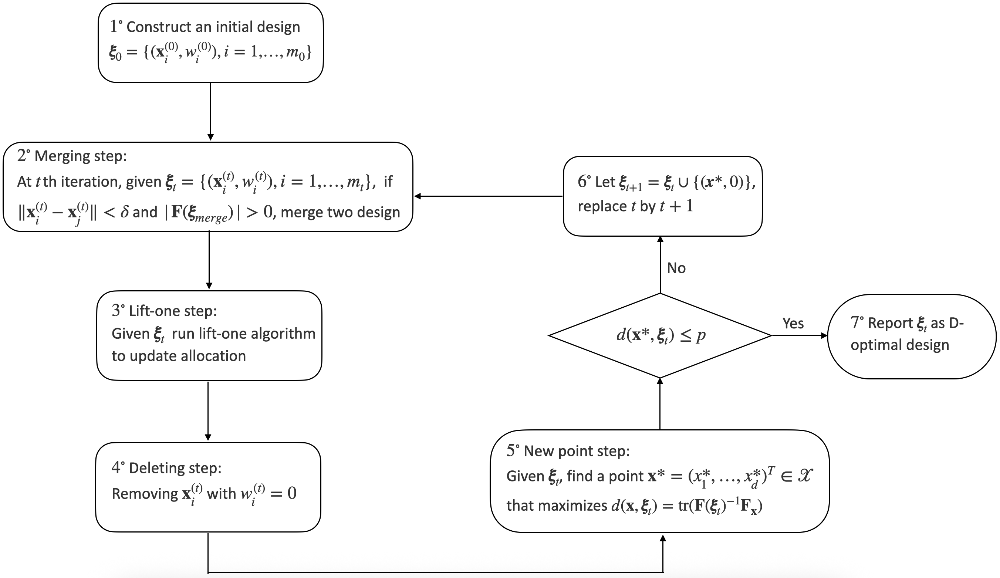
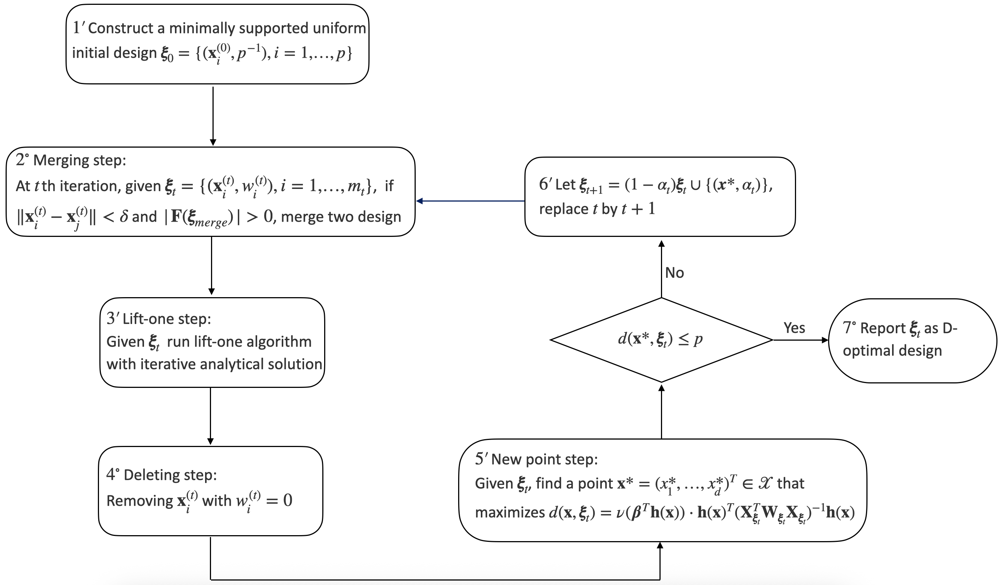
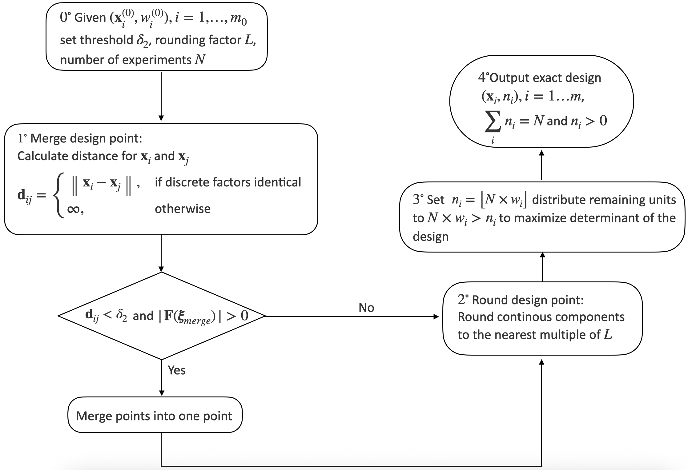
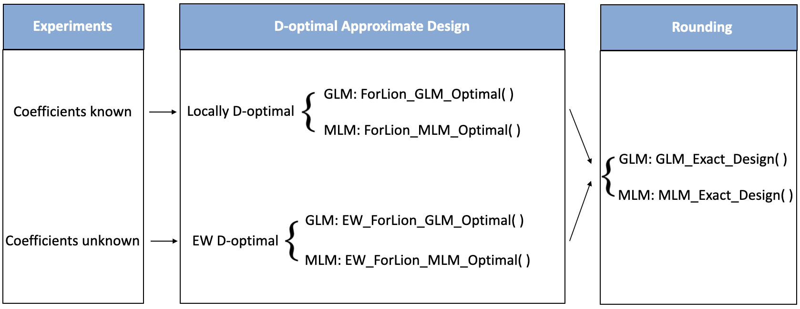

::: article
# Introduction {#sec:introduction}

The study of optimal designs can be traced back to Smith (1918) on
regression problems for univariate polynomials of order up to six
(Fedorov and Leonov 2014). Later in the 20th century, the optimal design
theory has been expanded to encompass various statistical models and
optimality criteria (Fedorov 1972; Silvey 1980; Pukelsheim 1993;
Atkinson et al. 2007; Fedorov and Leonov 2014). Despite significant
advancements on linear regression models, generalized linear models
(GLM) for more general univariate responses (McCullagh and Nelder 1989;
Dobson and Barnett 2018; Khuri et al. 2006; Stufken and Yang 2012) and
multinomial logistic models (MLM) for categorical responses (Glonek and
McCullagh 1995; Zocchi and Atkinson 1999; Bu et al. 2020) have been
widely used in practice, but are much more difficult in the optimal
design theory, because their Fisher information matrices depend on model
parameters.

Package [**AlgDesign**](https://CRAN.R-project.org/package=AlgDesign)
(version 1.2.1.2, see Wheeler and Braun (2025)) offers tools to
construct optimal designs with exact and approximate allocations,
focusing on linear models including polynomial forms. It allows mixed
factors by generating a finite candidate list of experimental settings
and employs the Fedorov's exchange algorithm (Fedorov 1972) for
optimization under D-, A-, and I-criteria. Package
[**OptimalDesign**](https://CRAN.R-project.org/package=OptimalDesign)
(version 1.0.2.1, see Harman and Filová (2025); Harman et al. (2020))
finds D-, A-, I-, and c-efficient designs for linear models (LM),
generalized linear models (GLM), some dose-response, and certain
survival models, with mixed factors by discretizing the continuous
factors first. Harman et al. (2021) further proposed a grid-exploration
method for mixed-factor D-optimal designs on cuboid grids under linear,
generalized linear, and nonlinear regression models. Package
[**ICAOD**](https://CRAN.R-project.org/package=ICAOD) (version 1.0.1,
see Masoudi et al. (2020)) provides tools for finding locally, minimax,
and Bayesian D-optimal designs, as well as user-specified optimality
criteria, for nonlinear statistical models. It implements the
imperialist competitive algorithm (Masoudi et al. 2022) for designs
involving continuous factors only. Package
[**PFIM**](https://CRAN.R-project.org/package=PFIM) (version 6.1, see
(Mentré et al. (2024); [Dumont et al.]{.nocase} (2018)) computes D-optimal
designs for nonlinear mixed-effects models (NLMEM), which is
particularly useful for pharmacokinetic/pharmacodynamic models (PKPD).
It handles designs either with discrete factors only or with continuous
factors only. Package
[**idefix**](https://CRAN.R-project.org/package=idefix) (version 1.1.0,
see (Traets et al. 2025, 2020)) is designed to generate D-efficient and
Bayesian D-efficient optimal designs for multinomial logit (MNL) and
mixed logit (MIXL) models for discrete choice experiments (DCE).
However, these existing packages are designed for experiments with
discrete factors only, continuous factors only, or mixed factors by
discretizing the continuous factors first. There has been limited
progress in constructing efficient designs that incorporate both
discrete and continuous factors (Huang et al. 2024).

The [**ForLion**](https://CRAN.R-project.org/package=ForLion) package,
available at the Comprehensive R Archive Network (CRAN,
[ https://CRAN.R-project.org/package=ForLion]( https://CRAN.R-project.org/package=ForLion){.uri}),
complements existing software by providing computational tools for
constructing D-optimal experimental designs involving both types of
factors under fairly general parametric statistical models using the
ForLion algorithm proposed by Huang et al. (2024). A key contribution of
the package is to provide practical computational tools for constructing
D-optimal designs for experiments involving multinomial or ordinal
qualitative responses under the MLM framework, while using a unified
strategy for mixed-factor design problems. In addition, for GLMs and
some MLMs, the package adopts internal optimizations via analytic
solutions, which can significantly improve the computational efficiency
(Huang et al. 2024). Different from discretizing the continuous factors
first, it starts from a randomly generated or user-provided initial
design and iteratively applies merging, lift-one, and deletion steps to
control the number of support points. In the new-point step, it
enumerates the combinations of discrete-factor levels and optimizes
continuous-factor levels conditional on each discrete-factor setting. As
a result, it tends to reduce the number of distinct experimental
settings while maintaining high efficiency of designs. It covers linear
models (LM), generalized linear models (GLM), and general multinomial
logistic models (MLM). Note that the MLM here is much broader than the
MNL for discrete choice experiments. It includes three more classes of
models for ordinal responses, namely cumulative, adjacent-categories,
and continuation-ratio logit models (Bu et al. 2020). Furthermore, to
overcome the issue caused by the dependence of Fisher information
matrices on model parameters, we also implement the EW ForLion algorithm
proposed by Lin et al. (2026) for constructing robust optimal designs
against unknown model parameters for LM, GLM, and MLM as well. Here, the
EW criterion is a practical surrogate to Bayesian D-optimality under
parameter uncertainty, and the resulting computation can be carried out
within a similar computational framework to ForLion. The motivation and
theoretical justifications of the EW criterion for mixed-factor design
problems can be found in Lin et al. (2026).

In Section [2](#sec:ForLion){reference-type="ref"
reference="sec:ForLion"}, we outline the theoretical foundations of the
[**ForLion**](https://CRAN.R-project.org/package=ForLion) package,
including the ForLion algorithm, the lift-one algorithm, the EW ForLion
algorithm, and a rounding algorithm. In
Section [3](#sec:structure){reference-type="ref"
reference="sec:structure"}, we introduce the structure and function
arguments of the
[**ForLion**](https://CRAN.R-project.org/package=ForLion) package,
followed by illustrative examples of the package applications, as well
as the interpretations of the key results in
Section [4](#sec:example){reference-type="ref" reference="sec:example"}.
We summarize and conclude in
Section [5](#sec:summary){reference-type="ref" reference="sec:summary"}.

# Method {#sec:ForLion}

We consider a mixed-factors experiment under a general statistical model
$M(\mathbf x; \boldsymbol \theta)$ with parameter(s)
$\boldsymbol \theta \in \boldsymbol{\Theta} \subseteq \mathbb{R}^p$ and
experimental setting ${\mathbf x} \in {\cal X} \subset \mathbb{R}^d$,
where $\boldsymbol{\Theta}$ is called the parameter space, and
${\cal X}$ is called the design region or design space. For typical
applications, ${\cal X}$ is compact. Among the $d$ factors, without any
loss of generality, we assume that the first $k$ factors are continuous
and the last $d-k$ are discrete, for $0\le k \le d$. Following Lin et
al. (2026), in package
[**ForLion**](https://CRAN.R-project.org/package=ForLion), we cover
three scenarios: *(i)* if $k=0$, ${\cal X} = {\cal D}$ consists of a
predetermined finite list of level combinations of discrete factors;
*(ii)* if $1\leq k\leq d-1$,
${\cal X} = \prod_{j=1}^k I_j\times {\cal D}$, with $I_j=[a_j, b_j]$
being a finite closed interval; and *(iii)* if $k=d$,
${\cal X} = \prod_{j=1}^d I_j$ .

An experimental design $\boldsymbol{\xi}$ considered in this paper
consists of $m$ distinct design points,
$\mathbf x_1, \dots, \mathbf x_m$ $\in {\cal X}$, and real-valued
proportions ${\mathbf w} = (w_1, \ldots, w_m)^\top$ satisfying
$w_i\geq 0$ for each $i$ and $\sum_{i=1}^m w_i = 1$, known as an
approximate allocation of the experimental units. In practice, we also
look for integer-valued assignments
${\mathbf n} = (n_1, \ldots, n_m)^\top$ given $N=\sum_{i=1}^m n_i$ ,
known as an exact allocation. The collection of approximate designs is
denoted by
$\boldsymbol{\Xi} = \{\boldsymbol{\xi} = \{({\mathbf x}_i, w_i), i=1, \ldots, m\} \mid m\geq 1, {\mathbf x}_i \in {\cal X}, w_i\geq 0, \sum_{i=1}^m w_i = 1\}$.
Under regularity conditions, the Fisher information matrix associated
with the design $\boldsymbol{\xi}$ can be denoted as
${\mathbf F}(\boldsymbol{\xi}, \boldsymbol{\theta}) = \sum_{i=1}^m w_i {\mathbf F}({\mathbf x}_i, \boldsymbol{\theta}) \in \mathbb{R}^{p\times p}$,
where ${\mathbf F}({\mathbf x}_i, \boldsymbol{\theta})$ is the Fisher
information associated with ${\mathbf x}_i$ .

When the experimenter has a good idea about the values of
$\boldsymbol \theta$, following Huang et al. (2024), we look for a
locally D-optimal design that maximizes
$f_{\boldsymbol{\theta}}(\boldsymbol \xi)=| \mathbf F(\boldsymbol \xi, \boldsymbol \theta)|$
by implementing the ForLion algorithm (see
Section [2.1](#sec:ForLion_algorithms){reference-type="ref"
reference="sec:ForLion_algorithms"}). In practice, however, the
experimenter may not be certain about the true parameter values. In
package [**ForLion**](https://CRAN.R-project.org/package=ForLion), we
offer two options for the users. With a prespecified prior distribution
or probability measure $Q(\cdot)$ on $\boldsymbol{\Theta}$, we look for
an EW D-optimal design (Atkinson et al. 2007; Yang et al. 2016, 2017; Bu
et al. 2020; Huang et al. 2025; Lin et al. 2026) that maximizes
$$\begin{equation}
\label{eq:f_EW}
f_{\rm EW}(\boldsymbol{\xi}) = |E\{{\mathbf F}(\boldsymbol{\xi}, \boldsymbol{\Theta})\}| = \left|\int_{\boldsymbol{\Theta}} {\mathbf F}(\boldsymbol{\xi}, \boldsymbol{\theta}) Q(d\boldsymbol{\theta})\right|\
\end{equation}   (\#eq:f-EW)$$
by implementing the EW ForLion algorithm proposed by Lin et al. (2026),
also called an integral-based EW D-optimal design. When a dataset from a
pilot study is available, or if the integral in \@ref(eq:f-EW) is
difficult to calculate, we look for a sample-based EW D-optimal design
(Lin et al. 2026) that maximizes
$$\begin{equation}
\label{eq:f_SEW}
f_{\rm SEW}(\boldsymbol{\xi}) = |\hat{E}\{{\mathbf F}(\boldsymbol{\xi}, \boldsymbol{\Theta})\}| = \left|\frac{1}{B}\sum_{j=1}^B {\mathbf F}(\boldsymbol{\xi}, \hat{\boldsymbol{\theta}}_j) \right|\ ,
\end{equation}   (\#eq:f-SEW)$$
where
$\{\hat{\boldsymbol{\theta}}_1, \ldots, \hat{\boldsymbol{\theta}}_B\}$
are either estimated from bootstrapped samples from the pilot dataset,
or sampled from the prior distribution $Q(\cdot)$ on
$\boldsymbol{\Theta}$ (see
Section [2.3](#sec:EW_ForLion){reference-type="ref"
reference="sec:EW_ForLion"}).

To compare two designs, we report the relative efficiency of design
$\boldsymbol{\xi}_1$ with respect to design $\boldsymbol{\xi}_2$ in
terms of their criterion values. For local D-optimality, we define
$$\mathrm{Eff}_{\mathrm{loc}}(\boldsymbol{\xi}_1;\boldsymbol{\xi}_2)=\left(\frac{|{\mathbf F}(\boldsymbol{\xi}_{\rm 1}, \boldsymbol\theta)|}{|{\mathbf F}(\boldsymbol{\xi}_{\rm 2}, \boldsymbol\theta)|}\right)^{1/p}\ ,$$
where $p$ is the number of parameters. For EW D-optimality, the relative
efficiency is defined by
$$\begin{array}{c@{\qquad\text{or}\qquad}c}
\displaystyle
\mathrm{Eff}_{\mathrm{EW}}(\boldsymbol{\xi}_1;\boldsymbol{\xi}_2)
=\left(\frac{|E\{{\mathbf F}({\boldsymbol{\xi}}_{1}, \boldsymbol{\Theta})\}|}
{|E\{{\mathbf F}({\boldsymbol{\xi}}_{2}, \boldsymbol{\Theta})\}|}\right)^{1/p}
&
\displaystyle
\mathrm{Eff}_{\mathrm{SEW}}(\boldsymbol{\xi}_1;\boldsymbol{\xi}_2)
=\left(\frac{|\hat{E}\{{\mathbf F}({\boldsymbol{\xi}}_{1}, \boldsymbol{\Theta})\}|}
{|\hat{E}\{{\mathbf F}({\boldsymbol{\xi}}_{2}, \boldsymbol{\Theta})\}|}\right)^{1/p}
\end{array}\ .$$

According to Theorem 1 of Huang et al. (2024), unlike stochastic
optimization algorithms such as particle swarm optimization (PSO), the
designs found by the ForLion algorithm are locally D-optimal when the
converging condition based on the maximized sensitivity function is met.
Based on Corollary 1 of Lin et al. (2026), the designs constructed by
the EW ForLion algorithm are EW D-optimal under a similar condition,
which are not only robust against unknown parameters, but also
computationally much easier to find than traditional Bayesian D-optimal
designs, while keeping high efficiency (Yang et al. 2016, 2017; Bu et
al. 2020; Lin et al. 2026). Nevertheless, from a practical point of
view, such an algorithm may stop before reaching a D-optimal design, if
it fails to find the global maxima for the sensitivity function (see
Remark 4 of Huang et al. (2024)). As a common practice, one may explore
multiple random starting points during the maximization to increase the
chance of success.

## ForLion algorithm {#sec:ForLion_algorithms}

In this section, we assume that
$\boldsymbol{\theta} \in \boldsymbol{\Theta}$ is known. To simplify
notations, we let ${\mathbf F}_{\mathbf x}$ and
${\mathbf F}(\boldsymbol{\xi})$ stand for
${\mathbf F}({\mathbf x}, \boldsymbol{\theta})$ and
${\mathbf F}(\boldsymbol{\xi}, \boldsymbol{\theta})$, respectively. The
ForLion algorithm looks for a locally D-optimal design
$\boldsymbol{\xi}_* \in \boldsymbol{\Xi}$ that maximizes
$|{\mathbf F}(\boldsymbol\xi)|$. It begins with an initial design
$\boldsymbol{\xi}_0 \in \boldsymbol{\Xi}$ in Step $1^\circ$ (see
Figure [1](#fig:ForLion_general){reference-type="ref"
reference="fig:ForLion_general"}) satisfying
$|{\mathbf{F}}({\boldsymbol{\xi}}_0)| > 0$, with a prespecified distance
threshold $\delta_{0} > 0$ between any two design points, such that,
$\|{\mathbf{x}}_i^{(0)} - {\mathbf{x}}_j^{(0)}\| \geq \delta_{0}$ for
any $i \neq j$. To reduce the number of distinct experimental settings,
which in practice often indicates reduced experimental time and cost, at
the beginning of each round of iterations, the ForLion algorithm reduces
the number of design points by merging those points in close distance
(i.e., less than $\delta$), which is performed only if the resulting
design still satisfies
$|{\mathbf{F}}({\boldsymbol{\xi}}_{\rm merge})|>0$ (see Step $2^\circ$
in Figure [1](#fig:ForLion_general){reference-type="ref"
reference="fig:ForLion_general"}). According to Figure S2 in the
Supplementary Material of Huang et al. (2024), larger $\delta$ may yield
fewer support points and increased minimum distance among support
points. On the other hand, however, too large $\delta$ may lead to
unnecessary merges and possible loss in D-efficiency. In practice, one
may choose an appropriate $\delta$ to balance the number of design
points and D-efficiency. In Step $3^\circ$, the lift-one algorithm (Yang
and Mandal 2015; Yang et al. 2016; Huang et al. 2025) is employed to
update the approximate allocation for the current design
$\boldsymbol{\xi}_t$ . In Step $4^\circ$, the design points with zero
allocation are removed from the design.

In Step $5^\circ$, the ForLion algorithm identifies a new design point
$\mathbf{x}^*$ that maximizes the sensitivity function
$d(\mathbf{x}, \boldsymbol{\xi}_t) = \operatorname{tr}(\mathbf{F}(\boldsymbol{\xi}_t)^{-1} \mathbf{F}_{\mathbf{x}})$.
When both discrete and continuous factors are present, we enumerate the
finite combinations of discrete-factor levels $\mathbf{x}_{(2)}$ . For
each possible $\mathbf{x}_{(2)}$ , we maximize
$d\bigl((\mathbf{x}_{(1)},\mathbf{x}_{(2)}), \boldsymbol{\xi}_t\bigr)$
over the continuous-factor levels $\mathbf{x}_{(1)}$ using the L-BFGS-B
quasi-Newton method, and then select the $\mathbf{x}_{(2)}$ that attains
the largest optimized sensitivity function value. According to Theorem
2.2 of Fedorov and Leonov (2014) and Theorem 1 in Huang et al. (2024),
if $d(\mathbf{x}^*, \boldsymbol{\xi}_t) \leq p$, then
$\boldsymbol{\xi}_t$ is D-optimal; otherwise, $\mathbf{x}^*$ is added to
$\boldsymbol{\xi}_t$ with an initial zero allocation in Step $6^\circ$,
and the process returns to Step $2^\circ$. In this package, we relax the
stopping rule using a prespecified level of relative tolerance
`rel.tol`. The algorithm stops when
$d(\mathbf{x}^*, \boldsymbol{\xi}_t) \leq (1+\texttt{rel.tol})p$ and
reports the resulting design as a numerically D-optimal design up to the
relative tolerance. The outline of the ForLion algorithm is provided in
Figure [1](#fig:ForLion_general){reference-type="ref"
reference="fig:ForLion_general"}, with detailed descriptions available
in Algorithm 1 of Huang et al. (2024).

<figure id="fig:ForLion_general" data-latex-placement="ht">

<figcaption>Figure 1: An outline of the ForLion algorithm under a
general statistical model.</figcaption>
</figure>

To speed up the ForLion algorithm for LM and GLM, we replace Steps
$1^{\circ}$, $3^{\circ}$, $5^{\circ}$, and $6^{\circ}$ in
Figure [1](#fig:ForLion_general){reference-type="ref"
reference="fig:ForLion_general"} with Steps $1^{\prime}$, $3^{\prime}$,
$5^{\prime}$, and $6^{\prime}$ in
Figure [2](#fig:ForLion_GLM){reference-type="ref"
reference="fig:ForLion_GLM"}, respectively, and implement the analytical
solutions for GLM derived by Yang and Mandal (2015) and Huang et al.
(2024). More specifically, in Step $1^{\prime}$, we replace the random
initial design with a minimally supported uniform design. In
Step $3^{\prime}$, we adopt the analytic solutions provided by Yang and
Mandal (2015) for the lift-one algorithm (see
Section [2.2](#sec:liftone_algorithm){reference-type="ref"
reference="sec:liftone_algorithm"}) under a GLM. In Step $5^{\prime}$,
we adopt the simplified form of the sensitivity function as described in
Theorem 4 of Huang et al. (2024). In Step $6^{\prime}$, we assign an
initial weight $\alpha_t$ instead of zero to the new design point
$\mathbf{x}^*$, based on Theorem 5 of Huang et al. (2024). Those
modifications accelerate the ForLion algorithm for LM and GLM. The
specialized ForLion algorithm is illustrated by
Figure [2](#fig:ForLion_GLM){reference-type="ref"
reference="fig:ForLion_GLM"}, with further details provided in Section 4
of Huang et al. (2024).

<figure id="fig:ForLion_GLM" data-latex-placement="htbp">

<figcaption>Figure 2: An outline of the GLM-adapted ForLion
algorithm.</figcaption>
</figure>

## Lift-one algorithm {#sec:liftone_algorithm}

The lift-one algorithm implemented in Step $3^{\circ}$ of the ForLion
algorithm was originally proposed by Yang et al. (2016) and Yang and
Mandal (2015) for GLMs, and then extended for cumulative link models by
Yang et al. (2017), and MLM by Bu et al. (2020). A general version and a
constrained version of it can be found in Huang et al. (2025) and their
Supplementary Material. It is highly efficient for finding the D-optimal
approximate allocation ${\mathbf w} = (w_1, \ldots, w_m)^\top$ for a
given set of design points $\{{\mathbf x}_1, \ldots, {\mathbf x}_m\}$.
By adjusting the $i$th weight $w_i < 1$ while rescaling the remaining
weights proportionally, the adjusted allocation is given by
$$\mathbf w_i(z) = \left( \frac{1-z}{1-w_i}w_1, \dots, \frac{1-z}{1-w_i}w_{i-1}, z, \frac{1-z}{1-w_i}w_{i+1}, \dots, \frac{1-z}{1-w_i}w_m \right)^\top$$
with $z\in [0,1]$, which converts a multi-dimensional optimization
problem to a one-dimensional optimization problem. The lift-one
algorithm is closely related to the vertex direction method (VDM) (Wynn
1970; Fedorov 1972; Yu 2011; Fedorov and Hackl 2025), which, however,
chooses the design point that maximizes the directional derivative and
keeps the updated weights positive. Unlike VDM, by picking up the design
points in turn, the optimal weight $z_*$ in the lift-one algorithm can
be exactly zero, allowing the ForLion algorithm to reduce the number of
support points and keep the intermediate designs sparse, which can
improve its computational efficiency. This weight-nullifying property
can also be found in the vertex exchange method (VEM) of Böhning (1986)
and the randomized exchange algorithm (REX) of Harman et al. (2020). For
GLMs and MLMs with five or fewer categories, in this package we
implement analytic solutions for the optimal $z_* \in [0,1]$, which
further improves the computational efficiency (Yang and Mandal 2015; Lin
et al. 2026). By adjusting ${\mathbf w}_i(z)$ for each $i=1, \dots, m$
in a random order, the converged allocation is guaranteed to be
D-optimal.

The lift-one algorithm has been shown to be computationally efficient in
the specific settings considered in Yang et al. (2016). In particular,
the numerical comparisons in Yang et al. (2016) imply favorable
computational performance of the lift-one algorithm relative to several
commonly used optimization techniques, including Nelder-Mead,
quasi-Newton, and simulated annealing, as well as popular design
algorithms such as Fedorov-Wynn, multiplicative, and cocktail algorithms
(see Huang et al. (2024) for a good review). It often achieves a design
with a reduced number of support points, that is, the design points with
positive weights.

## EW ForLion algorithm {#sec:EW_ForLion}

In this section, the model parameter vector
$\boldsymbol{\theta} \in \boldsymbol{\Theta}$ is assumed to be unknown.
Instead, either a prior distribution $Q(\cdot)$ on $\boldsymbol{\Theta}$
or a dataset obtained from a previous study is available.

Given a prior distribution or probability measure $Q(\cdot)$ on
$\boldsymbol{\Theta}$, we adopt the EW ForLion algorithm proposed by
Lin et al. (2026) to find an integral-based EW D-optimal design
$\boldsymbol{\xi}_*\in \boldsymbol{\Xi}$ that maximizes
$f_{\rm EW}(\boldsymbol{\xi}) = |\int_{\boldsymbol{\Theta}} {\mathbf F}(\boldsymbol{\xi}, \boldsymbol{\theta}) Q(d\boldsymbol{\theta})|$
as defined in \@ref(eq:f-EW). Different from the ForLion algorithm
maximizing
$f_{\boldsymbol{\theta}}(\boldsymbol \xi)=| \mathbf F(\boldsymbol \xi, \boldsymbol \theta)|$
with a prespecified $\boldsymbol{\theta}$, the EW ForLion algorithm
targets the expectation of the Fisher information matrix,
$E\left\{ {\mathbf F}(\boldsymbol{\xi}, \boldsymbol{\Theta})\right\}$.
By computing the entry-wise expectation with respect to the prior
distribution $Q(\cdot)$ on $\boldsymbol{\Theta}$, we obtain a
$p\times p$ matrix as well. Commonly used prior distributions include
uniform priors on bounded intervals, normal priors on $\mathbb{R}$, and
Gamma priors on $(0, \infty)$ (see, e.g., Huang et al. (2025)). In this
package, we calculate the corresponding integrals by using the
`hcubature()` function in package
[**cubature**](https://CRAN.R-project.org/package=cubature) (Narasimhan
et al. 2025), which applies an adaptive multidimensional integration
method by subdividing hyper-rectangular domains.

Alternatively, if a dataset from a previous or pilot study is available,
we may bootstrap it for $B$ times (e.g., $B=1000$). For the $j$th
bootstrapped dataset, we fit the statistical model and obtain the
parameter estimates $\hat{\boldsymbol{\theta}}_j$ , for
$j=1, \ldots, B$. In this package, we implement the EW ForLion algorithm
to find a sample-based EW D-optimal design $\boldsymbol{\xi}_*$ , which
maximizes
$f_{\rm SEW}(\boldsymbol{\xi}) = |B^{-1} \sum_{j=1}^B {\mathbf F}(\boldsymbol{\xi}, \hat{\boldsymbol{\theta}}_j)|$
as defined in \@ref(eq:f-SEW). In practice, if the expected Fisher
information matrix is difficult to calculate with respect to $Q(\cdot)$,
e.g., for some MLM (Lin et al. 2026), we may also simulate
$\hat{\boldsymbol{\theta}}_1, \ldots, \hat{\boldsymbol{\theta}}_B$ from
$Q(\cdot)$, and look for a sample-based EW D-optimal design. According
to Lin et al. (2026), the resulting designs are fairly robust against
different sets of parameter vectors in terms of relative efficiency.

When there is no confusion, we let ${\mathbf F}_{\mathbf x}$ represent
$\int_{\boldsymbol{\Theta}} {\mathbf F}({\mathbf x}, \boldsymbol{\theta}) Q(d\boldsymbol{\theta})$
for integral-based EW optimality, or
$B^{-1} \sum_{j=1}^B {\mathbf F}({\mathbf x}, \hat{\boldsymbol{\theta}}_j)$
for sample-based EW optimality. Similarly, we let
${\mathbf F}(\boldsymbol{\xi})$ represent
$E\{{\mathbf F}(\boldsymbol{\xi}, \boldsymbol{\Theta})\}$ for
integral-based EW optimality, or
$\hat{E}\{{\mathbf F}(\boldsymbol{\xi}, \boldsymbol{\Theta})\}$ for
sample-based EW optimality. Then
Figure [1](#fig:ForLion_general){reference-type="ref"
reference="fig:ForLion_general"} may also be used for illustrating the
EW ForLion algorithm, with more detailed descriptions in Algorithm 1 of
Lin et al. (2026).

## Rounding algorithm {#sec:rounding_algorithm}

Both the ForLion and EW ForLion algorithms are able to find optimal
experimental settings in a continuous or mixed design region. In
practice, the suggested experimental settings may need to be rounded up
due to the sensitivity level of the experimental device or environmental
control. For example, 149.2116 Gy as the gamma radiation level may need
to be rounded up to 149.2 Gy due to the sensitivity level of the
radiation device (see the emergence of house flies example in
Section [4.1](#sec:fly_example){reference-type="ref"
reference="sec:fly_example"}). On the other hand, the obtained optimal
approximate design may also need to be converted to an exact design
given a total number $N$ of experimental units.

In this package, we adopt the rounding algorithm proposed by Lin et al.
(2026) to convert an approximate design obtained by the ForLion or EW
ForLion algorithm on a continuous or mixed region to an exact design
with user-specified levels of grid points and $N$. It starts by merging
design points based on a specified distance measure and a merging
threshold $\delta_2$ (see Step $1^\circ$ in
Figure [3](#fig:rounding_algo){reference-type="ref"
reference="fig:rounding_algo"}). Then the levels of the continuous
factors are rounded to the nearest multiples of user-defined grid levels
(see Step $2^\circ$). As for the approximate allocation $w_i$ , the
rounding algorithm initializes the corresponding integer allocation
$n_i = \lfloor{N \times w_i}\rfloor$, the largest integer no more than
$Nw_i$ , and then allocates the remaining experimental units one by one
to maximize the objective function (see Step $3^\circ$). The resulting
exact design is reported in Step $4^\circ$. The outline of the rounding
algorithm is displayed in
Figure [3](#fig:rounding_algo){reference-type="ref"
reference="fig:rounding_algo"}, with more details provided in
Algorithm 2 of Lin et al. (2026).

Compared with optimal designs constructed directly on the same set of
grid points, the design rounded from a ForLion design costs much less
time, contains fewer distinct experimental settings, and maintains a
high relative efficiency with respect to the ForLion design (Lin et al.
2026).

<figure id="fig:rounding_algo" data-latex-placement="htbp">

<figcaption>Figure 3: An outline of the rounding algorithm.</figcaption>
</figure>

# Package structure {#sec:structure}

The current version (0.4.0) of the
[**ForLion**](https://CRAN.R-project.org/package=ForLion) package (Huang
et al. 2026) supports finding D-optimal designs for experiments under
parametric models with discrete factors only, continuous factors only,
or mixed factors, including linear models (LM or GLM with "identity"
link), logistic models (GLM with "logit" link) and other GLMs for binary
responses (GLM with "probit", "cloglog", "loglog", and "cauchit" links),
Poisson models (GLM with "log" link), baseline-category logit models or
multiclass logistic models (MLM with "baseline" link), cumulative logit
models (MLM with "cumulative" link), adjacent-categories logit models
(MLM with "adjacent" link), and continuation-ratio logit models (MLM
with "continuation" link). Its key functions and structure are displayed
in Figure [4](#fig:structure){reference-type="ref"
reference="fig:structure"}.

<figure id="fig:structure" data-latex-placement="htb">

<figcaption>Figure 4: The key functions in the <a
href="https://CRAN.R-project.org/package=ForLion"><strong>ForLion</strong></a>
package and the corresponding structure.</figcaption>
</figure>

More specifically, to construct locally D-optimal designs,
[**ForLion**](https://CRAN.R-project.org/package=ForLion) provides two
key functions by implementing the ForLion algorithm (Huang et al. 2024):

- `ForLion_MLM_Optimal` for finding locally D-optimal approximate
  designs under an MLM.

- `ForLion_GLM_Optimal` for finding locally D-optimal approximate
  designs under a GLM, which covers LM with "identity" link as a special
  case.

The specialized arguments and their descriptions for these functions are
summarized in Table S1 of the Supplementary Material (Section S1).

To construct robust D-optimal designs against unknown parameter values,
the [**ForLion**](https://CRAN.R-project.org/package=ForLion) package
offers two key functions as well by implementing the EW ForLion
algorithm (Lin et al. 2026):

- `EW_ForLion_MLM_Optimal` for finding EW D-optimal approximate designs
  under an MLM.

- `EW_ForLion_GLM_Optimal` for finding EW D-optimal approximate designs
  under a GLM.

Details about additional arguments for implementing these functions are
listed in Table S2 of the Supplementary Material (Section S1).

To obtain exact designs with user-defined grid points and number of
experimental units from approximate designs, the
[**ForLion**](https://CRAN.R-project.org/package=ForLion) package
provides the following two functions by implementing the rounding
algorithm proposed by Lin et al. (2026):

- `MLM_Exact_Design` for obtaining exact designs under an MLM.

- `GLM_Exact_Design` for obtaining exact designs under a GLM.

A list of arguments commonly used in all the key functions is presented
in Table S3 of the Supplementary Material (Section S1).

When finding robust designs under an MLM, such as a cumulative logit
model, the feasible parameter space may not be rectangular (Bu et al.
2020; Lin et al. 2026), and the computation for integral-based EW
D-optimality (see \@ref(eq:f-EW)) is much more difficult, especially
with a moderate or large number $J$ of response categories. In the
[**ForLion**](https://CRAN.R-project.org/package=ForLion) package, we
adopt the sample-based EW D-optimality (see \@ref(eq:f-SEW)) for MLMs.
As for GLMs, we allow users to choose integral-based or sample-based
D-optimality for deriving robust approximate and exact designs (see also
Section [2.3](#sec:EW_ForLion){reference-type="ref"
reference="sec:EW_ForLion"}).

# Examples {#sec:example}

In this section, we demonstrate by examples how to use the
[**ForLion**](https://CRAN.R-project.org/package=ForLion) package to
obtain locally D-optimal approximate designs, EW D-optimal approximate
designs according to integral-based or sample-based EW D-optimality, and
the corresponding exact designs, under different scenarios. The package
vignette also includes a fully reproducible MLM example with five
continuous factors based on a minimizing surface defects experiment.
Further discussions for this experiment can be found in Section S.3 in
the Supplementary Material of Huang et al. (2024) for D-optimal designs,
and Section S5.1 in the Supplementary Material of Lin et al. (2026) for
EW D-optimal designs.

## An MLM example: Emergence of house flies experiment {#sec:fly_example}

We demonstrate the implementation of the `ForLion_MLM_Optimal()`
function by exploring an emergence of house flies experiment. The
original experiment, described by Itepan (1995), involved $N = 3,500$
pupae uniformly assigned to $m=7$ different levels of a gamma radiation
device (in Gy): $x_i = 80, \ 100,\ 120, \ 140, \ 160, \ 180,\  200$. The
study recorded three categorical outcomes, namely `unopened`,
`opened but died`, and `opened and emerged`, which clearly have an order
or structure. A continuation-ratio non-proportional odds (npo) model
with $J=3$, as a special case of MLM, was considered in the literature
(Zocchi and Atkinson 1999; Bu et al. 2020; Ai et al. 2023):
$$\begin{eqnarray*}
    \log\left(\frac{\pi_{i1}}{\pi_{i2} + \pi_{i3}}\right) &=& \beta_{11} + \beta_{12} x_i + \beta_{13} x_i^2\ ,\\ 
\log\left(\frac{\pi_{i2}}{\pi_{i3}}\right) &=& \beta_{21} + \beta_{22} x_i\ ,
\end{eqnarray*}$$
with parameters
$\hat{\boldsymbol\theta} = (\hat\beta_{11}, \hat\beta_{12}, \hat\beta_{13}, \hat\beta_{21}, \hat\beta_{22})^\top = (-1.935, -0.02642, 0.0003174,-9.159,$
$0.06386)^\top$ fitted from the pilot study by Itepan (1995), where
$i=1, \ldots, m$.

Following Ai et al. (2023) and Huang et al. (2024), we regard
$\hat{\boldsymbol{\theta}}$ as the true parameter values and reconsider
the experiment with a continuous range for the gamma radiation levels,
namely $x_i \in \mathcal{X} = [0, 200]$. In this case, the $J \times p$
model matrix $\mathbf{X}_x$ (here $p=5$) and its derivative with respect
to the continuous variable $x$ are
$$\mathbf{X}_x
=
\left(
\begin{array}{ccccc}
1 & x & x^2 & 0 & 0 \\
0 & 0 & 0   & 1 & x \\
0 & 0 & 0   & 0 & 0
\end{array}
\right)_{3\times 5}\ ,\>\>\>
\frac{\partial \mathbf{X}_x}{\partial x}
=
\left(
\begin{array}{ccccc}
0 & 1 & 2x & 0 & 0 \\
0 & 0 & 0  & 0 & 1 \\
0 & 0 & 0  & 0 & 0
\end{array}
\right)_{3\times 5}\ ,$$
respectively. Then
$\boldsymbol{\eta}(x) = \mathbf{X}_x \boldsymbol{\theta}=\left(\beta_{11}+\beta_{12} x+\beta_{13} x^2,\ \beta_{21}+\beta_{22} x,\ 0\right)^T$.
Here the third row of the model matrix $\mathbf{X}_x$ consists entirely
of structural zeros. We keep this row to maintain a fixed $J \times p$
output dimension in our general implementation.

**Finding a locally D-optimal approximate design**

We start by defining the assumed model parameter values `theta`, the
design matrix function `hfunc.temp` for $\mathbf{X}_x$ , and the
corresponding derivative function `hprime.temp` for
$\partial \mathbf{X}_x/\partial x$. The function `hprime.temp` returns a
list format to accommodate multiple continuous factors. In this example,
the list contains a single matrix.

``` r
> theta <- c(-1.935, -0.02642, 0.0003174, -9.159, 0.06386)
> hfunc.temp <- function(x){
+               matrix(data = c(1, x, x*x, 0, 0,
+                               0, 0, 0, 1, x,
+                               0, 0, 0, 0, 0), nrow = 3, ncol = 5, byrow = TRUE)} 
> hprime.temp <- function(x){
+                list(matrix_1 = matrix(data = c(0, 1, 2*x, 0, 0,
+                                                0, 0, 0, 0, 1,
+                                                0, 0, 0, 0, 0), 
+                                                nrow = 3, ncol = 5, byrow = TRUE))}
```

Next, the `ForLion_MLM_Optimal()` function can be applied to find a
locally D-optimal approximate design under the continuation-ratio npo
model using the following R code:

``` r
> set.seed(123)
> forlion_MLM <- ForLion_MLM_Optimal(J = 3, n.factor = c(0),
+                factor.level = list(c(0, 200)), hfunc = hfunc.temp, 
+                h.prime = hprime.temp, bvec = theta, link = "continuation", 
+                Fi.func = Fi_MLM_func, delta0 = 1e-6, epsilon = 1e-12, 
+                reltol = 1e-8, delta = 0.15, maxit = 1000, random = TRUE, 
+                nram = 3, random.initial = TRUE, nram.initial = 3)
```

For the function arguments, we set `n.factor = c(0)`, where 0 denotes a
continuous factor, indicating that the experiment involves a single
continuous factor and no discrete factors, and the range of the
continuous factor is defined through `factor.level = list(c(0, 200))`,
which is a closed interval. The obtained approximate design by the
ForLion algorithm can be summarized and output using the `print()`
function as below:

``` r
> print(forlion_MLM)
Design Output
=========================== 
Count  X1        Allocation
--------------------------- 
1      103.5300  0.3981
2        0.0000  0.2027
3      149.2116  0.3992
=========================== 
m:
[1] 3
det:
[1] 54016299
convergence:
[1] TRUE
min.diff:
[1] 45.6816
x.close:
[1] 103.5300 149.2116
itmax:
[1] 23
```

The above `Design Output` identifies three design points $x_1 = 0.0000$,
$x_2 = 103.5300$, and $x_3 = 149.2116$, along with the approximate
allocations $w_1 = 0.2027$, $w_2 = 0.3981$, and $w_3 = 0.3992$. Here
`m=3` matches the number of distinct design points. The determinant
`det` of the Fisher information matrix associated with the obtained
design $\boldsymbol{\xi} = \{(x_i, w_i) \mid i=1,2,3\}$ is
$\left| \mathbf F(\boldsymbol\xi, \hat{\boldsymbol{\theta}})\right|=54,016,299$.
Furthermore, `convergence: TRUE` indicates that the algorithm converged
successfully. The minimum Euclidean distance `min.diff` among the
distinct design points is $45.6816$, and the closest pair `x.close` of
the design points is $103.5300$ and $149.2116$. Finally, `itmax = 23`
indicates that the number of iterations spent by the algorithm is $23$.

To assess the variability of the obtained locally D-optimal design
against the random seed prespecified, we rerun the algorithm with 10
randomly generated random seeds, while keeping all other settings fixed.
In terms of relative efficiencies, the obtained designs are fairly
stable (see Section S2 in the Supplementary Material).

**Obtaining exact designs from the locally D-optimal approximate design
$\boldsymbol{\xi}$**

Among the three reported design points in $\boldsymbol{\xi}$, two of
them, namely $x_2=103.5300$ and $x_3 = 149.2116$ in Gy, may not be
feasible in practice due to the sensitivity level of the gamma radiation
device. For example, if the device can only allow the gamma radiation
level to be set as a multiple of 0.1 Gy, we may use the
`MLM_Exact_Design()` function with grid level $L=0.1$ as follows:

``` r
> forlion_MLM_exact <- MLM_Exact_Design(J = 3, k.continuous = 1, 
+                      design_x = forlion_MLM$x.factor, design_p = forlion_MLM$p,
+                      det.design = forlion_MLM$det, p = 5, ForLion = TRUE, 
+                      bvec = theta, delta2 = 1, L = 0.1, N = 3500,
+                      hfunc = hfunc.temp, link = "continuation")
```

where `J = 3` represents the number of response categories,
`k.continuous = 1` indicates that there is only one continuous variable,
namely the gamma radiation level, `design_x` is the set of design points
in $\boldsymbol{\xi}$, `design_p` stores the corresponding approximate
allocations, `det.design` is the maximized determinant of the Fisher
information matrix, `p = 5` stands for the number of parameters, and
`N = 3500` is the total number of experimental units. Furthermore, the
argument `ForLion = TRUE` indicates that the approximate design is
obtained by the ForLion algorithm, while `ForLion = FALSE` corresponds
to the EW ForLion algorithm. The converted exact design, denoted by
$\boldsymbol{\xi}_{\rm exact}$ is output as below:

``` r
> print(forlion_MLM_exact)
Design Output
=========================== 
Count  X1        Allocation
--------------------------- 
1      103.5000  0.3981
2        0.0000  0.2027
3      149.2000  0.3992
=========================== 
ni.design:
[1] 1393  710 1397
det:
[1] 54016013
rel.efficiency:
[1] 0.9999989
```

The output of the exact design $\boldsymbol{\xi}_{\rm exact}$ shows that
it contains three design points, namely $x_1=0$, $x_2=103.5$,
$x_3=149.2$, along with the corresponding integer-valued allocations
`ni.design`, namely $n_1=710$, $n_2=1393$, $n_3=1397$. The relative
efficiency `rel.efficiency` of $\boldsymbol{\xi}_{\rm exact}$ with
respect to the D-optimal approximate design $\boldsymbol{\xi}$ is
$(|{\mathbf F}(\boldsymbol{\xi}_{\rm exact}, \hat{\boldsymbol\theta})|/|{\mathbf F}(\boldsymbol{\xi}, \hat{\boldsymbol\theta})|)^{1/p} = 0.9999989$,
or $99.99989\%$, which is highly efficient.

For illustration purposes, we repeat the procedure for some other grid
levels, namely $L=1, \ 5, \ 10$, and $20$ as well. The corresponding
exact designs, as well as $L=0.1$, are summarized in
Table [1](#tab:the_exact_designs_for_the_house_files){reference-type="ref"
reference="tab:the_exact_designs_for_the_house_files"}. According to
Table [1](#tab:the_exact_designs_for_the_house_files){reference-type="ref"
reference="tab:the_exact_designs_for_the_house_files"}, the relative
efficiency decreases as the rounding level $L$ increases. In practice,
the experimenters may choose an appropriate $L$ as a compromise between
the experimental requirements and the relative efficiency.

+------------+---------------+---------------+---------------+---------------+---------------+
|            | **L = 0.1**   | **L = 1**     | **L = 5**     | **L = 10**    | **L = 20**    |
+:==========:+======:+======:+======:+======:+======:+======:+======:+======:+======:+======:+
| $i$        | $x_i$ | $n_i$ | $x_i$ | $n_i$ | $x_i$ | $n_i$ | $x_i$ | $n_i$ | $x_i$ | $n_i$ |
+------------+-------+-------+-------+-------+-------+-------+-------+-------+-------+-------+
| 1          | 0     | 710   | 0     | 710   | 0     | 710   | 0     | 710   | 0     | 710   |
+------------+-------+-------+-------+-------+-------+-------+-------+-------+-------+-------+
| 2          | 103.5 | 1393  | 104   | 1393  | 105   | 1393  | 100   | 1393  | 100   | 1393  |
+------------+-------+-------+-------+-------+-------+-------+-------+-------+-------+-------+
| 3          | 149.2 | 1397  | 149   | 1397  | 150   | 1397  | 150   | 1397  | 140   | 1397  |
+------------+-------+-------+-------+-------+-------+-------+-------+-------+-------+-------+
| Rel.       | 99.99989%     | 99.98448%     | 99.93424%     | 99.48902%     | 94.65724%     |
| Efficiency |               |               |               |               |               |
+------------+---------------+---------------+---------------+---------------+---------------+

: (#tab:T1) Exact designs for house files experiment with different
rounding levels and $N=3,500$
{#tab:the_exact_designs_for_the_house_files}

[]{#tab:the_exact_designs_for_the_house_files
label="tab:the_exact_designs_for_the_house_files"}

**Finding a sample-based EW D-optimal approximate design**

Next, we look for an EW D-optimal approximate design rather than a
locally D-optimal one with the prespecified $\hat{\boldsymbol{\theta}}$.
It is more robust against misspecified parameter values (Lin et al.
2026). More specifically, we first draw $B=1,000$ bootstrapped samples
from the previous data (Table 1 in Zocchi and Atkinson (1999)), and then
obtain the corresponding parameter estimates
$\hat{\boldsymbol{\theta}}_j$ from the $j$th bootstrapped sample, for
$j = 1, \ldots, B$. The $1,000$ parameter vectors are stored as matrix
`theta_matrix` as below:

``` r
## simulate multinomial counts using the observed proportions as probabilities
> n <- 1000   # number of simulated datasets
> Ni <- 500   # multinomial sample size at each design point
> set.seed(2024)
## 7 design points with covariates (x1,x2), where x2 = x1^2
> x1_vec <- seq(80, 200, by = 20)
> x2_vec <- x1_vec^2
## Multinomial probabilities at each design point (rows sum to 1)
> prob_mat <- rbind(c( 62,  5, 433),
+                   c( 94, 24, 382),
+                   c(179, 60, 261),
+                   c(335, 80,  85),
+                   c(432, 46,  22),
+                   c(487, 11,   2),
+                   c(498,  2,   0)) / Ni
## Step 1: generate n simulated datasets with the specified probabilities; 
## each dataset has 7 rows (one per design point)
## sim_data[ , , k] is the k-th simulated dataset (7 x 5 matrix)
## columns: x1, x2, y1, y2, y3
> sim_data <- array(NA, dim = c(7, 5, n),
+                   dimnames = list(NULL, c("x1", "x2", "y1", "y2", "y3"), NULL))
> for (i in 1:7) {
+     Y_mat <- t(rmultinom(n, size = Ni, prob = prob_mat[i, ]))    # n x 3
+     Allsimdata_i <- cbind(x1 = x1_vec[i], x2 = x2_vec[i], Y_mat) # n x 5
+     for(k in 1:n){
+        sim_data[i, ,k] <- Allsimdata_i[k, ]
+    }
+  }
## Step 2: fit models for each simulated dataset and store selected coefficients
> theta_matrix <- matrix(0, nrow = n, ncol = 5)
> for (k in 1:n) {
+     data_k <- as.data.frame(sim_data[ , , k])
+     ## continuation-ratio model (VGAM: vglm, family = sratio)
+     ## fit1: predictors x1 + x2; fit2: predictor x1 only
+     fit1 <- vglm(cbind(y1, y2, y3) ~ x1 + x2, family = sratio, data = data_k)
+     fit2 <- vglm(cbind(y1, y2, y3) ~ x1,      family = sratio, data = data_k)
+     theta1 <- coef(fit1)
+     theta2 <- coef(fit2)
+     ## store selected coefficients 
+     ## The indices (1,3,5) and (2,4) follow coefficient ordering for family=sratio 
+     theta_matrix[k, ] <- c(theta1[c(1, 3, 5)], theta2[c(2, 4)])
}
```

With the parameter matrix `theta_matrix`, the functions `hfunc.temp` and
`hprime.temp` previously defined, we use `EW_ForLion_MLM_Optimal()`
function to find a sample-based EW D-optimal approximate design as
follows:

``` r
> set.seed(123)
> ew_forlion_MLM <- EW_ForLion_MLM_Optimal(J = 3 ,n.factor = c(0),
+                   factor.level = list(c(0, 200)), hfunc = hfunc.temp, 
+                   h.prime = hprime.temp, bvec_matrix = theta_matrix, 
+                   link = "continuation", EW_Fi.func = EW_Fi_MLM_func, 
+                   delta0 = 1e-6, epsilon = 1e-12, reltol = 1e-8, delta = 0.15, 
+                   maxit = 1000, random = TRUE, nram = 1, random.initial = TRUE, 
+                   nram.initial = 3)
```

The sample-based EW D-optimal approximate design, denoted by
$\boldsymbol{\xi}_{\rm SEW}$, is output as below:

``` r
> print(ew_forlion_MLM)
Design Output
=========================== 
Count  X1        Allocation
--------------------------- 
1        0.0000  0.2029
2      103.5039  0.3543
3      103.2826  0.0436
4      149.1144  0.3991
=========================== 
m:
[1] 4
det:
[1] 58719194
convergence:
[1] TRUE
min.diff:
[1] 0.2213
x.close:
[1] 103.5039 103.2826
itmax:
[1] 20
```

For illustration purposes, we adopt $\delta=0.15$ as the merging
threshold. The above `Design Output` shows that the reported EW
D-optimal approximate design contains four design points, namely
$0.0000$, $103.2826$, $103.5039$, $149.1144$, and their corresponding
approximate allocations are $0.2029$, $0.0436$, $0.3543$, $0.3991$,
respectively. The determinant of the expected Fisher information matrix
is
$| \hat{E}\{{\mathbf F}({\boldsymbol \xi}_{\rm SEW}, \boldsymbol{\Theta})\}|=58,719,194$.

**Obtaining an exact design from the sample-based EW D-optimal design
${\boldsymbol{\xi}}_{\rm SEW}$**

Similarly to the locally D-optimal approximate design
$\boldsymbol{\xi}$, in practice we need to convert the sample-based EW
D-optimal approximate design ${\boldsymbol{\xi}}_{\rm SEW}$ into an
exact design with prespecified grid level $L$ and the total number $N$
of experimental units. We may use the same function
`MLM_Exact_Design()`. Instead of entering `ForLion = TRUE` and the
parameter vector `bvec`, we need to set `ForLion = FALSE` indicating EW
ForLion algorithm, and input the bootstrapped parameter matrix
`theta_matrix` for argument `bvec_matrix`. The corresponding exact
design with $L = 0.1$ and $N = 3,500$ is obtained by the following R
code:

``` r
> ew_forlion_MLM_exact <- MLM_Exact_Design(J = 3, k.continuous = 1, 
+                          design_x = ew_forlion_MLM$x.factor,
+                          design_p = ew_forlion_MLM$p, 
+                          det.design = ew_forlion_MLM$det, p = 5, ForLion = FALSE,
+                          bvec_matrix = theta_matrix, delta2 = 1, L = 0.1, 
+                          N = 3500, hfunc = hfunc.temp, link = "continuation")
```

The obtained exact design, denoted by ${\boldsymbol{\xi}}'_{\rm exact}$,
is output as below:

``` r
> print(ew_forlion_MLM_exact)
Design Output
=========================== 
Count  X1        Allocation
--------------------------- 
1        0.0000  0.2029
2      149.1000  0.3991
3      103.5000  0.3980
=========================== 
ni.design:
[1]  710 1397 1393
det:
[1] 58718854
rel.efficiency:
[1] 0.9999988
```

Instead of four design points in ${\boldsymbol{\xi}}_{\rm SEW}$, the
exact design ${\boldsymbol{\xi}}'_{\rm exact}$ contains only three
design points, namely $0, 103.5$, and $149.1$, along with the
integer-valued allocations $710, 1393$, and $1397$. The relative
efficiency of ${\boldsymbol{\xi}}'_{\rm exact}$ with respect to
${\boldsymbol{\xi}}_{\rm SEW}$ is
$(|\hat{E}\{{\mathbf F}({\boldsymbol{\xi}}'_{\rm exact}, \boldsymbol \Theta)\}|/|\hat{E}\{{\mathbf F}({\boldsymbol{\xi}}_{\rm SEW}, \boldsymbol\Theta)\}|)^{1/p} = 0.9999988$
or $99.99988\%$.

## A GLM example: Electrostatic discharge (ESD) experiment {#sec:ESD_example}

Lukemire et al. (2019) revisited the electrostatic discharge (ESD)
experiment, initially described by Whitman et al. (2006), as a GLM
example (see also Huang et al. (2024) and Lin et al. (2026)). It
involves a binary response, whether a certain part of the semiconductor
fails, and five mixed experimental factors. The first four factors,
namely `LotA` ($x_1$), `LotB` ($x_2$), `ESD` ($x_3$), and `Pulse`
($x_4$), take values in $\{-1,1\}$, while the fifth factor `Voltage`
($x_5$) is continuous within the range $[25, 45]$. Let
$\mathbf{x}=(x_1,\ldots,x_5)^\top$ denote the factor vector. A logistic
model is considered for this experiment:
$$\text{logit}(\mu)=\beta_0+\beta_1 x_1+\beta_2 x_2+\beta_3 x_3+\beta_4 x_4+\beta_5x_5+\beta_{34}(x_3 \times x_4) \ .$$

For implementation in our algorithm, we put the coefficient of the
continuous factor $\beta_5$ first, and the intercept last. Accordingly,
we reorder the parameter vector as
$\boldsymbol \theta = (\beta_5, \beta_1, \beta_2, \beta_3, \beta_4, \beta_{34}, \beta_0)^\top$
and define the corresponding predictor vector
$\mathbf{h}(\mathbf{x})=\bigl(x_5,\ x_1,\ x_2,\ x_3,\ x_4,\ x_3 \times x_4,\ 1\bigr)^\top$.
Letting $\mathbf{x}_{(1)}=x_5$ denote the continuous variable, the
corresponding derivative used by our algorithm is
$\partial \mathbf{h}(\mathbf{x})/\partial \mathbf{x}^\top_{(1)}=\bigl(1,0,0,0,0,0,0\bigr)^\top$.
Here $\partial \mathbf{h}(\mathbf{x})/\partial \mathbf{x}_{(1)}^{\top}$
is in general a $p \times k$ matrix, where $p$ is the number of
parameters, and $k$ is the number of continuous factors (for
illustration purposes, in Section S3 of the Supplementary Material, we
consider a different model involving `Pulse` with three levels
$\{-1,0,1\}$ and an interaction between $x_4$ and the continuous factor
$x_5$).

**Finding a locally D-optimal approximate design**

To use `ForLion_GLM_Optimal()` function, we first need to specify the
function for generating the design matrix, and the assumed model
parameters
$\boldsymbol{\theta} = (0.35, 1.50, -0.2, -0.15, 0.25, 0.4, -7.5)^\top$
adopted by Lukemire et al. (2019) and Huang et al. (2024):

``` r
## After reordering the components in x: x = (x5, x1, x2, x3, x4)^T
## x -> h(x) = (x5, x1, x2, x3, x4, x3*x4, 1)^T
>  hfunc.temp <- function(x) {c(x, x[4]*x[5], 1);};  
>  beta.value <- c(0.35, 1.50, -0.2, -0.15, 0.25, 0.4, -7.5)
>  variable_names <- c("Vol.", "LotA", "LotB", "ESD", "Pul.")
## Using self defined function for the dh(x)/d(x)
> hprime.temp <- function(x){
+                matrix_1 = matrix(data = c(1, 0, 0, 0, 0, 0, 0),
+                                  nrow = 7, ncol = 1, byrow = TRUE)
}
```

Next, we use the argument `n.factor = c(0, 2, 2, 2, 2)` to specify the
experimental factor structure, where `0` represents the continuous
factor `Voltage` (always comes first) and the subsequent $2$'s represent
binary discrete factors (four in total). The corresponding list of
factor levels is provided in
`factor.level = list(c(25,45),c(-1,1),c(-1,1),c(-1,1),c(-1,1))`, where
`c(25,45)` stands for an interval, $[25, 45]$, for the continuous
factor, and `c(-1,1)` represents a set, $\{-1, 1\}$, for a discrete
factor. The corresponding R commands are listed as below:

``` r
>  set.seed(482)
>  forlion_GLM <- ForLion_GLM_Optimal(n.factor = c(0, 2, 2, 2, 2), 
+                 factor.level = list(c(25, 45), c(-1, 1), c(-1, 1), c(-1, 1), 
+                 c(-1, 1)), var_names = variable_names, hfunc = hfunc.temp, 
+                 h.prime = hprime.temp, bvec = beta.value, link = "logit", 
+                 delta0 = 1e-5, epsilon = 1e-12, reltol = 1e-7, random = TRUE, 
+                 nram = 1, random.initial = TRUE, nram.initial = 1, delta = 0.01, 
+                 maxit = 1000, logscale = TRUE)
```

The results obtained from the GLM-adapted ForLion algorithm can be
summarized and displayed using the `print()` function. It provides a
concise overview of the characteristics of the obtained optimal design,
including the selected design points, their corresponding allocations,
the determinant of the Fisher information matrix, etc.

``` r
> print(forlion_GLM)
Design Output
============================================================== 
Count  Vol.     LotA     LotB     ESD      Pul.     Allocation
-------------------------------------------------------------- 
1      25.0000  -1.0000  -1.0000   1.0000  -1.0000  0.1165
2      27.5443  -1.0000  -1.0000  -1.0000  -1.0000  0.0156
3      25.0000  -1.0000   1.0000  -1.0000  -1.0000  0.0895
4      32.7748  -1.0000   1.0000   1.0000  -1.0000  0.1313
5      25.0000  -1.0000  -1.0000   1.0000   1.0000  0.0854
6      25.0000   1.0000   1.0000   1.0000  -1.0000  0.1331
7      25.0000  -1.0000   1.0000   1.0000   1.0000  0.0922
8      25.0000   1.0000  -1.0000   1.0000  -1.0000  0.0136
9      25.0000  -1.0000   1.0000   1.0000  -1.0000  0.0341
10     29.0549  -1.0000   1.0000  -1.0000  -1.0000  0.0042
11     25.0000  -1.0000  -1.0000  -1.0000   1.0000  0.0367
12     25.0000  -1.0000  -1.0000  -1.0000  -1.0000  0.0748
13     28.6912  -1.0000  -1.0000  -1.0000   1.0000  0.0722
14     25.0000  -1.0000   1.0000  -1.0000   1.0000  0.1008
============================================================== 
m:
[1] 14
det:
[1] 1.268957e-05
convergence:
[1] TRUE
min.diff:
[1] 2
x.close:
     [,1] [,2] [,3] [,4] [,5]
[1,]   25   -1   -1    1   -1
[2,]   25   -1   -1    1    1
itmax:
[1] 298
```

The above `Design Output` shows that the obtained design, denoted by
$\boldsymbol{\xi}$, contains $14$ design points in the table, whose
levels are listed in the same order as the ones specified by
`factor.level`. The last column of the table is the corresponding
approximate allocations for the design points. The determinant of the
Fisher information matrix, namely `det`, is
$\left| \mathbf F(\boldsymbol \xi, \boldsymbol{\theta})\right| = 1.268957 \times 10^{-5}$.
In this locally D-optimal approximate design, the minimum Euclidean
distance between the design points is equal to $2$, and the closest pair
of design points is reported by `x.close`. The algorithm converges
(`convergence:TRUE`) with the number of iterations `itmax = 298`.

**Obtaining exact designs based on the locally D-optimal approximate
design $\boldsymbol{\xi}$**

The approximate design $\boldsymbol{\xi}$ specifies accurate levels of
the continuous factor `Voltage` like $27.5443$, $28.6912$, $29.0549$,
and $32.7748$. Those voltage levels may not be able to be maintained
precisely in the experiment. If, for example, the voltage in this
experiment can only be controlled to be a multiple of $L=0.1$, we may
employ `GLM_Exact_Design()` function to convert $\boldsymbol{\xi}$ into
a feasible exact design with modified voltage levels and integer-valued
allocations. For illustration purposes, we set the total number of
observations to $N = 500$, the merging threshold `delta2` to $0.5$, and
the rounding level to $L = 0.1$ for the only continuous factor
`Voltage`. The corresponding exact design can be obtained by the
following R code:

``` r
> forlion_GLM_exact <- GLM_Exact_Design(k.continuous = 1, 
+                      design_x = forlion_GLM$x.factor, design_p = forlion_GLM$p, 
+                      var_names = variable_names, det.design = forlion_GLM$det, 
+                      p = 7, ForLion = TRUE, bvec = beta.value, delta2 = 0.5, 
+                      L = 0.1, N = 500, hfunc = hfunc.temp, link = "logit")
```

``` r
> print(forlion_GLM_exact)
Design Output
============================================================== 
Count  Vol.     LotA     LotB     ESD      Pul.     Allocation
-------------------------------------------------------------- 
1      25.0000  -1.0000  -1.0000   1.0000  -1.0000  0.1165
2      27.5000  -1.0000  -1.0000  -1.0000  -1.0000  0.0156
3      25.0000  -1.0000   1.0000  -1.0000  -1.0000  0.0895
4      32.8000  -1.0000   1.0000   1.0000  -1.0000  0.1313
5      25.0000  -1.0000  -1.0000   1.0000   1.0000  0.0854
6      25.0000   1.0000   1.0000   1.0000  -1.0000  0.1331
7      25.0000  -1.0000   1.0000   1.0000   1.0000  0.0922
8      25.0000   1.0000  -1.0000   1.0000  -1.0000  0.0136
9      25.0000  -1.0000   1.0000   1.0000  -1.0000  0.0341
10     29.1000  -1.0000   1.0000  -1.0000  -1.0000  0.0042
11     25.0000  -1.0000  -1.0000  -1.0000   1.0000  0.0367
12     25.0000  -1.0000  -1.0000  -1.0000  -1.0000  0.0748
13     28.7000  -1.0000  -1.0000  -1.0000   1.0000  0.0722
14     25.0000  -1.0000   1.0000  -1.0000   1.0000  0.1008
============================================================== 
ni.design:
[1] 58  8 45 66 43 67 46  7 17  2 18 37 36 50
det:
[1] 1.268788e-05
rel.efficiency:
[1] 0.999981
```

The `Design Output` shows that the obtained exact design, denoted by
$\boldsymbol{\xi}_{\rm exact}$, only contains $14$ design points as
listed in the table of design output. The levels of `Voltage` (listed as
the first factor in the table) have been rounded to multiples of
$L = 0.1$. With $N = 500$, the integer-valued allocations are listed in
`ni.design`. The relative efficiency of the exact design
$\boldsymbol{\xi}_{\rm exact}$ with respect to the approximate design
$\boldsymbol{\xi}$ is provided as `rel.efficiency`, that is,
$(|{\mathbf F}(\boldsymbol{\xi}_{\rm exact}, \boldsymbol \theta)|/|{\mathbf F}(\boldsymbol{\xi}, \boldsymbol \theta)|)^{1/p} = 0.999981$
or $99.9981\%$.

To illustrate how the exact design changes along with $N$, we generate
two more exact designs with `N = 100`, `N = 500`, respectively, both
with `L = 0.5`. Both designs are listed in
Table [2](#tab:The_final_exact_designs_for_the_ESD_experiment){reference-type="ref"
reference="tab:The_final_exact_designs_for_the_ESD_experiment"}. Their
relative efficiencies are $99.92635\%$ for `N = 100` and $99.98025\%$
for `N = 500`.

+:-------:+-----:+-----:+-----:+----:+-----:+------:+:-------:+-----:+-----:+-----:+----:+-----:+------:+
| Support | $N=100$                                 | Support | $N=500$                                 |
+:=======:+=====:+=====:+=====:+====:+=====:+======:+:=======:+=====:+=====:+=====:+====:+=====:+======:+
| point   | Vol. | LotA | LotB | ESD | Pul. | $n_i$ | point   | Vol. | LotA | LotB | ESD | Pul. | $n_i$ |
+---------+------+------+------+-----+------+-------+---------+------+------+------+-----+------+-------+
| 1       | 25.0 | -1   | -1   | 1   | -1   | 12    | 1       | 25.0 | -1   | -1   | 1   | -1   | 58    |
+---------+------+------+------+-----+------+-------+---------+------+------+------+-----+------+-------+
| 2       | 27.5 | -1   | -1   | -1  | -1   | 2     | 2       | 27.5 | -1   | -1   | -1  | -1   | 8     |
+---------+------+------+------+-----+------+-------+---------+------+------+------+-----+------+-------+
| 3       | 25.0 | -1   | 1    | -1  | -1   | 9     | 3       | 25.0 | -1   | 1    | -1  | -1   | 45    |
+---------+------+------+------+-----+------+-------+---------+------+------+------+-----+------+-------+
| 4       | 33.0 | -1   | 1    | 1   | -1   | 13    | 4       | 33.0 | -1   | 1    | 1   | -1   | 66    |
+---------+------+------+------+-----+------+-------+---------+------+------+------+-----+------+-------+
| 5       | 25.0 | -1   | -1   | 1   | 1    | 9     | 5       | 25.0 | -1   | -1   | 1   | 1    | 43    |
+---------+------+------+------+-----+------+-------+---------+------+------+------+-----+------+-------+
| 6       | 25.0 | 1    | 1    | 1   | -1   | 13    | 6       | 25.0 | 1    | 1    | 1   | -1   | 67    |
+---------+------+------+------+-----+------+-------+---------+------+------+------+-----+------+-------+
| 7       | 25.0 | -1   | 1    | 1   | 1    | 9     | 7       | 25.0 | -1   | 1    | 1   | 1    | 46    |
+---------+------+------+------+-----+------+-------+---------+------+------+------+-----+------+-------+
| 8       | 25.0 | 1    | -1   | 1   | -1   | 1     | 8       | 25.0 | 1    | -1   | 1   | -1   | 7     |
+---------+------+------+------+-----+------+-------+---------+------+------+------+-----+------+-------+
| 9       | 25.0 | -1   | 1    | 1   | -1   | 3     | 9       | 25.0 | -1   | 1    | 1   | -1   | 17    |
+---------+------+------+------+-----+------+-------+---------+------+------+------+-----+------+-------+
| 10      | \-   | \-   | \-   | \-  | \-   | \-    | 10      | 29.0 | -1   | 1    | -1  | -1   | 2     |
+---------+------+------+------+-----+------+-------+---------+------+------+------+-----+------+-------+
| 11      | 25.0 | -1   | -1   | -1  | 1    | 4     | 11      | 25.0 | -1   | -1   | -1  | 1    | 18    |
+---------+------+------+------+-----+------+-------+---------+------+------+------+-----+------+-------+
| 12      | 25.0 | -1   | -1   | -1  | -1   | 8     | 12      | 25.0 | -1   | -1   | -1  | -1   | 37    |
+---------+------+------+------+-----+------+-------+---------+------+------+------+-----+------+-------+
| 13      | 28.5 | -1   | -1   | -1  | 1    | 7     | 13      | 28.5 | -1   | -1   | -1  | 1    | 36    |
+---------+------+------+------+-----+------+-------+---------+------+------+------+-----+------+-------+
| 14      | 25.0 | -1   | 1    | -1  | 1    | 10    | 14      | 25.0 | -1   | 1    | -1  | 1    | 50    |
+---------+------+------+------+-----+------+-------+---------+------+------+------+-----+------+-------+

: (#tab:T2) Exact designs with $L=0.5$ and different $N$'s for the
ESD experiment {#tab:The_final_exact_designs_for_the_ESD_experiment}

[]{#tab:The_final_exact_designs_for_the_ESD_experiment
label="tab:The_final_exact_designs_for_the_ESD_experiment"}

**Finding an integral-based EW D-optimal approximate design**

To find a robust D-optimal approximate design against possibly
misspecified $\boldsymbol{\theta}$, we adopt the prior distribution
suggested by Huang et al. (2024). That is, we assume a prior
distribution for $\boldsymbol{\Theta}$ (i.e., a randomized version of
$\boldsymbol{\theta}$), such that, *(i)* all components of
$\boldsymbol{\Theta}$ are independent of each other; and *(ii)* each
component of $\boldsymbol{\Theta}$ follows a uniform distribution listed
below:
$$\beta_0 \sim U(-8,-7),\quad \beta_1 \sim U(1,2), \quad \beta_2 \sim U(-0.3,-0.1), \quad  \beta_3 \sim U(-0.3,0),$$

$$\beta_4 \sim U(0.1,0.4) , \quad \beta_5 \sim U(0.25, 0.45),\quad \beta_{34} \sim U(0.35,0.45).$$

To find an integral-based EW D-optimal approximate design given the
prior distribution above, we first use two vectors, `paras_lowerbound`
and `paras_upperbound`, to denote the lower bounds and upper bounds of
the uniform distributions, respectively. Note that the orders of vector
coordinates must match the same order as in `factor.level`. Then we can
define the probability density function (pdf) of the prior distribution
by `gjoint` function below:

``` r
> paras_lowerbound <- c(0.25, 1, -0.3, -0.3, 0.1, 0.35, -8.0)
> paras_upperbound <- c(0.45, 2, -0.1,  0.0, 0.4, 0.45, -7.0)
## the prior distributions are uniform distributions
> gjoint_b <- function(x) {
+             Func_b = 1/(prod(paras_upperbound-paras_lowerbound))
+             return(Func_b)
}  
```

By utilizing the `EW_ForLion_GLM_Optimal()` function with specified
arguments, we obtain an integral-based EW D-optimal design as below:

``` r
> set.seed(482)
> ew_forlion_GLM <- EW_ForLion_GLM_Optimal(n.factor = c(0, 2, 2, 2, 2), 
+                   factor.level = list(c(25,45),c(-1,1),c(-1,1),c(-1,1),c(-1,1)), 
+                   var_names = variable_names, hfunc = hfunc.temp, 
+                   h.prime = hprime.temp, Integral_based = TRUE, 
+                   joint_Func_b = gjoint_b, Lowerbounds = paras_lowerbound, 
+                   Upperbounds = paras_upperbound, link = "logit", delta0 = 1e-5, 
+                   epsilon = 1e-12, reltol = 1e-5, delta = 0.01, maxit = 500, 
+                   random = TRUE, nram = 1, logscale = TRUE)
```

``` r
> print(ew_forlion_GLM)
Design Output
============================================================== 
Count  Vol.     LotA     LotB     ESD      Pul.     Allocation
-------------------------------------------------------------- 
1      25.0000  -1.0000  -1.0000  -1.0000   1.0000  0.0875
2      25.0000  -1.0000   1.0000   1.0000   1.0000  0.0845
3      25.0000  -1.0000  -1.0000  -1.0000  -1.0000  0.0848
4      25.0000   1.0000   1.0000  -1.0000   1.0000  0.0621
5      38.9047  -1.0000   1.0000   1.0000  -1.0000  0.0214
6      25.0000   1.0000   1.0000  -1.0000  -1.0000  0.0356
7      25.0000  -1.0000  -1.0000   1.0000   1.0000  0.0856
8      25.0000  -1.0000   1.0000  -1.0000   1.0000  0.0515
9      25.0000  -1.0000   1.0000  -1.0000  -1.0000  0.0690
10     33.1161  -1.0000   1.0000   1.0000   1.0000  0.0022
11     35.4140  -1.0000   1.0000  -1.0000   1.0000  0.0028
12     25.0000   1.0000   1.0000   1.0000  -1.0000  0.0443
13     25.0000   1.0000   1.0000   1.0000   1.0000  0.0090
14     35.3993  -1.0000   1.0000  -1.0000   1.0000  0.0352
15     25.0000  -1.0000   1.0000   1.0000  -1.0000  0.0901
16     25.0000   1.0000  -1.0000   1.0000  -1.0000  0.0743
17     34.0238  -1.0000   1.0000  -1.0000  -1.0000  0.0157
18     37.1975  -1.0000  -1.0000   1.0000  -1.0000  0.0455
19     25.0000  -1.0000  -1.0000   1.0000  -1.0000  0.0410
20     38.9522  -1.0000   1.0000   1.0000  -1.0000  0.0580
============================================================== 
m:
[1] 20
det:
[1] 4.552703e-06
convergence:
[1] TRUE
min.diff:
[1] 0.0147
x.close:
        [,1] [,2] [,3] [,4] [,5]
[1,] 35.4140   -1    1   -1    1
[2,] 35.3993   -1    1   -1    1
itmax:
[1] 56
```

The reported integral-based EW D-optimal design, denoted by
$\boldsymbol{\xi}_{\rm EW}$, consists of $20$ design points. The
corresponding determinant `det` of the expected Fisher information
matrix is
$| E\{{\mathbf F}({\boldsymbol \xi}_{\rm EW}, \boldsymbol{\Theta})\}| = 4.552703 \times 10^{-6}$.
Having been performed on a Windows 11 laptop with 32GB of RAM and a 13th
Gen Intel Core i7-13700HX processor, with R version 4.4.2, the above
procedure costs 2,865 seconds.

**Obtaining an exact design based on the integral-based EW D-optimal
design $\boldsymbol{\xi}_{\rm EW}$**

Similarly to the locally D-optimal design $\boldsymbol{\xi}$, we also
need to convert the EW D-optimal approximate design
$\boldsymbol{\xi}_{\rm EW}$ into an exact design for practical uses. The
same function `GLM_Exact_Design()` can be applied, but with
`ForLion = FALSE` indicating that the original design was obtained by an
EW ForLion algorithm. In this case, we also need to input the pdf
`joint_Func_b` for the prior distribution, along with the lower and
upper bounds of ranges, namely `Lowerbounds` and `Upperbounds`. For
illustration purposes, we still use the rounding level $L=0.1$ for the
continuous factor and the total number of observations $N=500$.

``` r
> ew_forlion_exact <- GLM_Exact_Design(k.continuous = 1,
+                     design_x = ew_forlion_GLM$x.factor, 
+                     design_p = ew_forlion_GLM$p, var_names = variable_names, 
+                     det.design = ew_forlion_GLM$det, p = 7, ForLion = FALSE, 
+                     Integral_based = TRUE, joint_Func_b = gjoint_b,
+                     Lowerbounds = paras_lowerbound, 
+                     Upperbounds = paras_upperbound, delta2 = 0.5, L = 0.1,
+                     N = 500, hfunc = hfunc.temp, link = "logit")
```

``` r
> print(ew_forlion_exact)
Design Output
============================================================== 
Count  Vol.     LotA     LotB     ESD      Pul.     Allocation
-------------------------------------------------------------- 
1      25.0000  -1.0000  -1.0000  -1.0000   1.0000  0.0875
2      25.0000  -1.0000   1.0000   1.0000   1.0000  0.0845
3      25.0000  -1.0000  -1.0000  -1.0000  -1.0000  0.0848
4      25.0000   1.0000   1.0000  -1.0000   1.0000  0.0621
5      25.0000   1.0000   1.0000  -1.0000  -1.0000  0.0356
6      25.0000  -1.0000  -1.0000   1.0000   1.0000  0.0856
7      25.0000  -1.0000   1.0000  -1.0000   1.0000  0.0515
8      25.0000  -1.0000   1.0000  -1.0000  -1.0000  0.0690
9      33.1000  -1.0000   1.0000   1.0000   1.0000  0.0022
10     25.0000   1.0000   1.0000   1.0000  -1.0000  0.0443
11     25.0000   1.0000   1.0000   1.0000   1.0000  0.0090
12     25.0000  -1.0000   1.0000   1.0000  -1.0000  0.0901
13     25.0000   1.0000  -1.0000   1.0000  -1.0000  0.0743
14     34.0000  -1.0000   1.0000  -1.0000  -1.0000  0.0157
15     37.2000  -1.0000  -1.0000   1.0000  -1.0000  0.0455
16     25.0000  -1.0000  -1.0000   1.0000  -1.0000  0.0410
17     35.4000  -1.0000   1.0000  -1.0000   1.0000  0.0380
18     38.9000  -1.0000   1.0000   1.0000  -1.0000  0.0794
============================================================== 
ni.design:
 [1] 44 42 42 31 18 43 26 34  1 22  4 45 37  8 23 21 19 40
det:
[1] 4.551996e-06
rel.efficiency:
[1] 0.9999778
```

The reported exact design consists of $18$ design points, along with
their corresponding allocations provided by `ni.design`. Its relative
efficiency with respect to $\boldsymbol{\xi}_{\rm EW}$ is $0.9999778$ or
$99.99778\%$.

**Finding a sample-based EW D-optimal approximate design**

Given the same prior distribution for obtaining
$\boldsymbol{\xi}_{\rm EW}$ , we can also simulate $B=1,000$ random
parameter vectors
$\{\boldsymbol{\theta}_1, \ldots, \boldsymbol{\theta}_B\}$ from the
prior distribution, and then find a sample-based EW D-optimal
approximate design based on the simulated parameter vectors.

``` r
> nrun <- 1000
> set.seed(0713)
> b_0 <- runif(nrun, -8, -7)
> b_1 <- runif(nrun, 1, 2)
> b_2 <- runif(nrun, -0.3, -0.1)
> b_3 <- runif(nrun, -0.3, 0)
> b_4 <- runif(nrun, 0.1, 0.4)
> b_5 <- runif(nrun, 0.25, 0.45)
> b_34 <- runif(nrun, 0.35, 0.45)
> beta.matrix <- cbind(b_5,b_1,b_2,b_3,b_4,b_34,b_0)
```

Similarly to obtaining $\boldsymbol{\xi}_{\rm EW}$ , we can also apply
the `EW_ForLion_GLM_Optimal()` function, but with
`Integral_based = FALSE` indicating sample-based EW D-optimality, and
input the sampled parameter matrix `beta.matrix` obtained above for
argument `b_matrix`.

``` r
> set.seed(482)
> sample_ew_forlion_GLM <- EW_ForLion_GLM_Optimal(n.factor = c(0, 2, 2, 2, 2), 
+                          factor.level = list(c(25, 45), c(-1, 1), c(-1, 1),
+                          c(-1, 1), c(-1, 1)), var_names = variable_names, 
+                          hfunc = hfunc.temp, h.prime = hprime.temp, 
+                          Integral_based = FALSE, b_matrix = beta.matrix, 
+                          link = "logit", delta0 = 1e-5, epsilon = 1e-12, 
+                          reltol = 1e-6, delta = 0.01, maxit = 500, 
+                          random = TRUE, nram = 1, logscale = TRUE)
```

``` r
> print(sample_ew_forlion_GLM)
Design Output
============================================================== 
Count  Vol.     LotA     LotB     ESD      Pul.     Allocation
-------------------------------------------------------------- 
1      25.0000  -1.0000  -1.0000   1.0000   1.0000  0.0851
2      25.0000  -1.0000   1.0000  -1.0000   1.0000  0.0723
3      33.5304  -1.0000   1.0000  -1.0000  -1.0000  0.0095
4      25.0000  -1.0000  -1.0000   1.0000  -1.0000  0.0640
5      25.0000   1.0000   1.0000   1.0000  -1.0000  0.0499
6      25.0000   1.0000   1.0000  -1.0000  -1.0000  0.0310
7      25.0000  -1.0000   1.0000   1.0000   1.0000  0.0882
8      25.0000  -1.0000   1.0000  -1.0000  -1.0000  0.0743
9      38.4919  -1.0000   1.0000   1.0000  -1.0000  0.1171
10     33.2875  -1.0000  -1.0000  -1.0000   1.0000  0.0403
11     25.0000   1.0000  -1.0000   1.0000  -1.0000  0.0702
12     25.0000  -1.0000  -1.0000  -1.0000  -1.0000  0.0843
13     25.0000  -1.0000   1.0000   1.0000  -1.0000  0.0738
14     25.0000   1.0000   1.0000  -1.0000   1.0000  0.0612
15     25.0000  -1.0000  -1.0000  -1.0000   1.0000  0.0660
16     36.7975  -1.0000  -1.0000   1.0000  -1.0000  0.0084
17     25.0000   1.0000   1.0000   1.0000   1.0000  0.0037
18     33.5593  -1.0000   1.0000  -1.0000  -1.0000  0.0008
============================================================== 
m:
[1] 18
det:
[1] 4.229431e-06
convergence:
[1] TRUE
min.diff:
[1] 0.0289
x.close:
        [,1] [,2] [,3] [,4] [,5]
[1,] 33.5304   -1    1   -1   -1
[2,] 33.5593   -1    1   -1   -1
itmax:
[1] 96
```

The obtained sample-based EW D-optimal approximate design, denoted by
$\boldsymbol{\xi}_{\rm SEW}$ , contains `m` $=18$ design points, with
`det` $=$
$| \hat{E}\{{\mathbf F}({\boldsymbol \xi}_{\rm SEW}, \boldsymbol{\Theta})\}| = 4.229431 \times 10^{-6}$.

**Comparing sample-based and integral-based EW D-optimal designs**

According to a simulation study done by Lin et al. (2026) on a
minimizing surface defects experiment, sample-based EW D-optimal designs
are fairly robust in terms of relative efficiencies against different
sets of simulated parameter vectors.

In this paper, we use this ESD experiment to compare the integral-based
EW D-optimal design $\boldsymbol{\xi}_{\rm EW}$ with sample-based EW
D-optimal designs based on six different sets of simulated parameter
vectors. More specifically, for $b=1$ (representing $B=100$) and $b=2$
(representing $B=1,000$), we simulate three random sets of parameter
vectors of size $B$, labeled by $j=1,2,3$, and find the corresponding
sample-based EW D-optimal designs, denoted by $\boldsymbol{\xi}_{bj}$ .
Then we calculate the relative efficiencies of $\boldsymbol{\xi}_{bj}$
with respect to $\boldsymbol{\xi}_{\rm EW}$, in terms of the
integral-based EW D-optimality. That is,
$$\left(\frac{|E\{{\mathbf F}(\boldsymbol{\xi}_{bj}, \boldsymbol{\Theta})\}|}{|E\{{\mathbf F}(\boldsymbol{\xi}_{\rm EW}, \boldsymbol{\Theta})\}|}\right)^{1/p}\ ,$$
for $b = 1, \ 2$, $j = 1, \ 2,\ 3$, and $p = 7$. The relative
efficiencies and the corresponding numbers of distinct design points
contained in $\boldsymbol{\xi}_{bj}$ are shown in the left and right
matrices below, respectively:
$$\begin{array}{c|ccc}
 & j = 1 & j = 2 & j = 3 \\ \hline
b = 1 & 0.9982641 & 0.9975130 & 0.9989559 \\
b = 2 & 0.9997052 & 0.9997704 & 0.9994012
\end{array}\ ,
\qquad
\begin{array}{c|ccc}
 & j = 1 & j = 2 & j = 3 \\ \hline
b = 1 & 17 & 21 & 20 \\
b = 2 & 20 & 19 & 18
\end{array}\ .$$
The minimum relative efficiency is $0.997513$ or $99.7513\%$, which is
fairly high. The numbers of distinct points range from 17 to 21, which
vary from design to design, but are not so different from each other.

# Summary and discussion {#sec:summary}

In this paper, we introduce the
[**ForLion**](https://CRAN.R-project.org/package=ForLion) package, which
facilitates the users to find D-optimal or EW D-optimal designs of
experiments involving discrete factors only, continuous factors only, or
mixed factors. In
[**ForLion**](https://CRAN.R-project.org/package=ForLion),
`factor.level` is used only to declare the design space, which
enumerates the levels of qualitative factors and specifies the ranges of
continuous factors. For a qualitative factor with $K \ge 3$ levels, the
corresponding regression model can be constructed either by $K-1$
indicator variables or by other contrast coding choices through the
user-defined `hfunc`. Interaction terms involving continuous factors can
also be specified in `hfunc`, with the required derivative information
provided via `h.prime` when needed (see Section S3 in the Supplementary
Material for such an example). In the GLM setting, `h.prime` is not
required for a main-effects model or for a model with interactions
restricted to discrete factors. In this case, the needed derivatives are
calculated automatically. In the MLM setting, if `h.prime` is not
provided, the package uses numerical derivatives by default.

The current version 0.4.0 of the
[**ForLion**](https://CRAN.R-project.org/package=ForLion) package
supports both GLM and MLM for various experimental scenarios. It is
worth noting that a regular linear regression model is a special case of
GLM with an identity link function, and is covered by the
[**ForLion**](https://CRAN.R-project.org/package=ForLion) package as
well. In this package, the functions `ForLion_MLM_Optimal()` and
`ForLion_GLM_Optimal()` can be used for determining locally D-optimal
approximate designs, if the experimenter is certain about the values of
the parameters. When the true parameter values are unknown, while either
a prior distribution $Q(\cdot)$ on $\boldsymbol{\Theta}$ or a dataset
from a pilot study is available, we provide functions
`EW_ForLion_MLM_Optimal()` and `EW_ForLion_GLM_Optimal()` to find EW
D-optimal approximate designs. Having obtained D-optimal approximate
designs, we also provide functions `GLM_Exact_Design()` for GLM and
`MLM_Exact_Design()` for MLM to convert the approximate designs with
values of possible continuous factors into exact designs with
user-specified grid levels and the total number of experimental units.
By using this rounding algorithm, the yielded exact designs can maintain
high relative efficiency with respect to the D-optimal approximate
designs, and may further reduce the number of distinct experimental
settings.

Following Huang et al. (2024) and Lin et al. (2026), the current
[**ForLion**](https://CRAN.R-project.org/package=ForLion) package
concentrates on D-optimality, which is not only the most commonly used
criterion in optimal design theory, but often leads to a design that
performs well with respect to other criteria. Nevertheless, it can be
extended to other criteria, given a corresponding lift-one algorithm
being developed. A practical concern is its computational cost. As the
numbers of factors and/or the levels of discrete factors increase, the
overall optimization problem becomes more demanding. Although the
current implementation is effective for a broad range of mixed-factor
design problems, further improvements in computational efficiency in
higher dimensional mixed-factor settings are important directions for
future work.

# Supplementary Material {#supplementary-material .unnumbered}

The Supplementary Material includes three sections: S1 provides quick
reference tables for the arguments used in major
[**ForLion**](https://CRAN.R-project.org/package=ForLion) functions; S2
assesses the sensitivity of the locally D-optimal design against random
seeds using the example in
Section [4.1](#sec:fly_example){reference-type="ref"
reference="sec:fly_example"}; S3 extends the example in
Section [4.2](#sec:ESD_example){reference-type="ref"
reference="sec:ESD_example"} with a three-level discrete factor and an
interaction term involving the continuous factor `Voltage`.
:::

:::::::::::::::::::::::::::::::::::::::::: {#refs .references .csl-bib-body .hanging-indent}
::: {#ref-ai2023locally .csl-entry}
Ai, M., Z. Ye, and J. Yu. 2023. "Locally D-Optimal Designs for
Hierarchical Response Experiments." *Statistica Sinica* 33: 381--99.
<https://doi.org/10.5705/ss.202020.0517>.
:::

::: {#ref-atkinson2007 .csl-entry}
Atkinson, A. C., A. N. Donev, and R. D. Tobias. 2007. *Optimum
Experimental Designs, with SAS*. Oxford University Press.
<https://doi.org/10.1093/oso/9780199296590.001.0001>.
:::

::: {#ref-bohning1986vertex .csl-entry}
Böhning, Dankmar. 1986. "A Vertex-Exchange-Method in D-Optimal Design
Theory." *Metrika* 33 (1): 337--47.
<https://doi.org/10.1007/bf01894766>.
:::

::: {#ref-bu2020 .csl-entry}
Bu, X., D. Majumdar, and J. Yang. 2020. "D-Optimal Designs for
Multinomial Logistic Models." *Annals of Statistics* 48 (2): 983--1000.
<https://doi.org/10.1214/19-aos1834>.
:::

::: {#ref-dobson2018 .csl-entry}
Dobson, A. J., and A. G. Barnett. 2018. *An Introduction to Generalized
Linear Models*. 4th ed. Chapman & Hall/CRC.
<https://doi.org/10.1201/9781315182780>.
:::

::: {#ref-dumont2018pfim .csl-entry}
[Dumont, Cyrielle, Giulia Lestini, Hervé Le Nagard, et al.]{.nocase}
2018. "PFIM 4.0, an Extended R Program for Design Evaluation and
Optimization in Nonlinear Mixed-Effect Models." *Computer Methods and
Programs in Biomedicine* 156: 217--29.
<https://doi.org/10.1016/j.cmpb.2018.01.008>.
:::

::: {#ref-fedorov1972 .csl-entry}
Fedorov, V. V. 1972. *Theory of Optimal Experiments*. Academic Press.
:::

::: {#ref-fedorov2014 .csl-entry}
Fedorov, V. V., and S. L. Leonov. 2014. *Optimal Design for Nonlinear
Response Models*. Chapman & Hall/CRC. <https://doi.org/10.1201/b15054>.
:::

::: {#ref-fedorov2025model .csl-entry}
Fedorov, Valerii V, and Peter Hackl. 2025. *Model-Oriented Design of
Experiments*. 2nd ed. Springer Science & Business Media.
<https://doi.org/10.1007/978-1-0716-4302-0>.
:::

::: {#ref-pmcc1995 .csl-entry}
Glonek, G. F. V., and P. McCullagh. 1995. "Multivariate Logistic
Models." *Journal of the Royal Statistical Society, Series B* 57:
533--46. <https://doi.org/10.1111/j.2517-6161.1995.tb02046.x>.
:::

::: {#ref-harman2025package .csl-entry}
Harman, Radoslav, and Lenka Filová. 2025. *OptimalDesign: A Toolbox for
Computing Efficient Designs of Experiments*.
<https://CRAN.R-project.org/package=OptimalDesign>.
:::

::: {#ref-harman2020randomized .csl-entry}
Harman, Radoslav, Lenka Filová, and Peter Richtárik. 2020. "A Randomized
Exchange Algorithm for Computing Optimal Approximate Designs of
Experiments." *Journal of the American Statistical Association* 115
(529): 348--61. <https://doi.org/10.1080/01621459.2018.1546588>.
:::

::: {#ref-harman2021optimal .csl-entry}
Harman, Radoslav, Lenka Filová, and Samuel Rosa. 2021. "Optimal Design
of Multifactor Experiments via Grid Exploration." *Statistics and
Computing* 31 (6): 70. <https://doi.org/10.1007/s11222-021-10046-2>.
:::

::: {#ref-huang2024forlion .csl-entry}
Huang, Yifei, Keren Li, Abhyuday Mandal, and Jie Yang. 2024. "ForLion: A
New Algorithm for D-Optimal Designs Under General Parametric Statistical
Models with Mixed Factors." *Statistics and Computing* 34 (5): 157.
<https://doi.org/10.1007/s11222-024-10465-x>.
:::

::: {#ref-huang2025constrained .csl-entry}
Huang, Yifei, Liping Tong, and Jie Yang. 2025. "Constrained D-Optimal
Design for Paid Research Study." *Statistica Sinica* 35: 1479--98.
<https://doi.org/10.5705/ss.202022.0414>.
:::

::: {#ref-huanglinpackage .csl-entry}
Huang, Yifei, Siting Lin, and Jie Yang. 2026. *ForLion: "ForLion"
Algorithms to Find Optimal Experimental Designs with Mixed Factors*.
<https://CRAN.R-project.org/package=ForLion>.
:::

::: {#ref-itepan1995 .csl-entry}
Itepan, Natanael Marcio. 1995. "Aumento Do Periodo de Aceitabilidade de
Pupas de Musca Domestica l., 1758 (Diptera: Muscidae), Irradiadas Com
Raios Gama, Como Hospedeira de Parasitoides (Hymenoptera:
Pteromalidae)." Master's thesis, Universidade de São Paulo.
:::

::: {#ref-khuri2006 .csl-entry}
Khuri, A. I., B. Mukherjee, B. K. Sinha, and M. Ghosh. 2006. "Design
Issues for Generalized Linear Models: A Review." *Statistical Science*
21: 376--99. <https://doi.org/10.1214/088342306000000105>.
:::

::: {#ref-lin2025ew .csl-entry}
Lin, Siting, Yifei Huang, and Jie Yang. 2026. "Expected Weighted
D-Optimal Designs for Experiments with Mixed Factors." *arXiv Preprint
arXiv:2505.00629*.
:::

::: {#ref-lukemire2018 .csl-entry}
Lukemire, Joshua, Abhyuday Mandal, and Weng Kee Wong. 2019.
"[d-QPSO]{.nocase}: A Quantum-Behaved Particle Swarm Technique for
Finding D-Optimal Designs with Discrete and Continuous Factors and a
Binary Response." *Technometrics* 61 (1): 77--87.
<https://doi.org/10.1080/00401706.2018.1439405>.
:::

::: {#ref-masoudi2022package .csl-entry}
Masoudi, Ehsan, Heinz Holling, Weng Kee Wong, and Seongho Kim. 2020.
*ICAOD: Optimal Designs for Nonlinear Statistical Models by Imperialist
Competitive Algorithm (ICA)*.
<https://CRAN.R-project.org/package=ICAOD>.
:::

::: {#ref-masoudi2022icaod .csl-entry}
Masoudi, Ehsan, Heinz Holling, Weng Kee Wong, and Seongho Kim. 2022.
"ICAOD: An R Package for Finding Optimal Designs for Nonlinear
Statistical Models by Imperialist Competitive Algorithm." *The R
Journal* 14 (3): 20. <https://doi.org/10.32614/rj-2022-043>.
:::

::: {#ref-pmcc1989 .csl-entry}
McCullagh, P., and J. Nelder. 1989. *Generalized Linear Models*. 2nd ed.
Chapman; Hall/CRC. <https://doi.org/10.1201/9780203753736>.
:::

::: {#ref-mentre2024package .csl-entry}
Mentré, France, Romain Leroux, Jérémy Seurat, and Lucie Fayette. 2024.
*PFIM: Population Fisher Information Matrix*.
<https://CRAN.R-project.org/package=PFIM>.
:::

::: {#ref-balasubramanianpackage .csl-entry}
Narasimhan, Balasubramanian, Manuel Koller, Dirk Eddelbuettel, et al.
2025. *Cubature: Adaptive Multivariate Integration over Hypercubes*.
<https://CRAN.R-project.org/package=cubature>.
:::

::: {#ref-pukelsheim1993 .csl-entry}
Pukelsheim, F. 1993. *Optimal Design of Experiments*. John Wiley & Sons.
:::

::: {#ref-silvey1980 .csl-entry}
Silvey, S. D. 1980. *Optimal Design*. Chapman & Hall/CRC.
<https://doi.org/10.1007/978-94-009-5912-5>.
:::

::: {#ref-smith1918standard .csl-entry}
Smith, Kirstine. 1918. "On the Standard Deviations of Adjusted and
Interpolated Values of an Observed Polynomial Function and Its Constants
and the Guidance They Give Towards a Proper Choice of the Distribution
of Observations." *Biometrika* 12 (1/2): 1--85.
<https://doi.org/10.2307/2331929>.
:::

::: {#ref-stufken2012 .csl-entry}
Stufken, J., and M. Yang. 2012. "Optimal Designs for Generalized Linear
Models." Chap. 4 in *Design and Analysis of Experiments, Volume 3:
Special Designs and Applications*, edited by K. Hinkelmann. Wiley.
<https://doi.org/10.1002/9781118147634.ch4>.
:::

::: {#ref-traets2020generating .csl-entry}
Traets, Frits, Daniel Gil Sanchez, and Martina Vandebroek. 2020.
"Generating Optimal Designs for Discrete Choice Experiments in R: The
Idefix Package." *Journal of Statistical Software* 96: 1--41.
<https://doi.org/10.18637/jss.v096.i03>.
:::

::: {#ref-traets2025package .csl-entry}
Traets, Frits, Daniel Gil, Qusai Iwidat, Mouhannad Arabi, Martina
Vandebroek, and Michel Meulders. 2025. *Idefix: Efficient Designs for
Discrete Choice Experiments*.
<https://CRAN.R-project.org/package=idefix>.
:::

::: {#ref-wheeler2025package .csl-entry}
Wheeler, Bob, and Jerome Braun. 2025. *AlgDesign: Algorithmic
Experimental Design*. <https://CRAN.R-project.org/package=AlgDesign>.
:::

::: {#ref-whitman2006 .csl-entry}
Whitman, C., T. M. Gilbert, A. M. Rahn, and J. A. Antonell. 2006.
"Determining Factors Affecting ESD Failure Voltage Using DOE."
*Microelectronics Reliability* 46 (8): 1228--37.
<https://doi.org/10.1016/j.microrel.2006.02.007>.
:::

::: {#ref-wynn1970 .csl-entry}
Wynn, H. P. 1970. "The Sequential Generation of D-Optimum Experimental
Designs." *Annals of Mathematical Statistics* 41: 1655--64.
<https://doi.org/10.1214/aoms/1177696809>.
:::

::: {#ref-ym2015 .csl-entry}
Yang, J., and A. Mandal. 2015. "D-Optimal Factorial Designs Under
Generalized Linear Models." *Communications in Statistics - Simulation
and Computation* 44: 2264--77.
<https://doi.org/10.1080/03610918.2013.815773>.
:::

::: {#ref-ymm2016 .csl-entry}
Yang, J., A. Mandal, and D. Majumdar. 2016. "Optimal Designs for $2^k$
Factorial Experiments with Binary Response." *Statistica Sinica* 26:
385--411. <https://doi.org/10.5705/ss.2013.265>.
:::

::: {#ref-ytm2016 .csl-entry}
Yang, J., L. Tong, and A. Mandal. 2017. "D-Optimal Designs with Ordered
Categorical Data." *Statistica Sinica* 27: 1879--902.
<https://doi.org/10.5705/ss.202016.0210>.
:::

::: {#ref-yu2011d .csl-entry}
Yu, Yaming. 2011. "D-Optimal Designs via a Cocktail Algorithm."
*Statistics and Computing* 21: 475--81.
<https://doi.org/10.1007/s11222-010-9183-2>.
:::

::: {#ref-atkinson1999 .csl-entry}
Zocchi, S. S., and A. C. Atkinson. 1999. "Optimum Experimental Designs
for Multinomial Logistic Models." *Biometrics* 55: 437--44.
<https://doi.org/10.1111/j.0006-341X.1999.00437.x>.
:::
::::::::::::::::::::::::::::::::::::::::::

[^1]: These authors contributed equally to this work.
