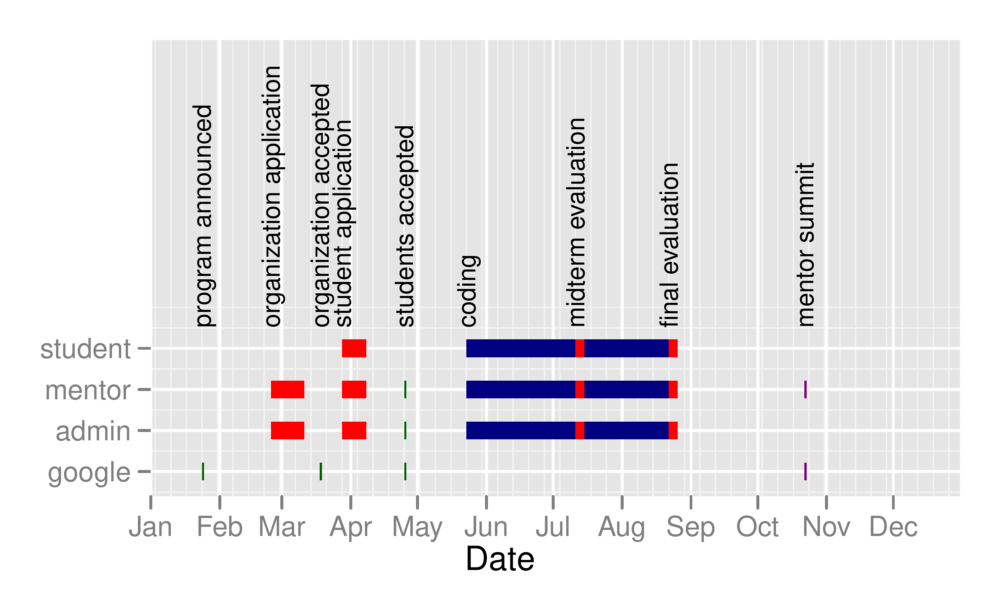

::: article
# Essential elements of GSoC

Google has structured the GSoC to provide student resources for coding
to open source software projects. While results can be used as part of a
thesis or article, the focus is *coding*. Students receive a stipend of
US\$ 5000 paid in 3 installments, which are only paid after each of the
student's proposal, mid-term and final work has passed an evaluation.
The open source projects, of which the R Foundation for Statistical
Computing is one, are required to provide mentors for each student who
makes a proposal, and the mentoring organization is given a gratuity of
US\$ 500 per student who is funded.

The task of proposing coding projects falls to the mentoring
organizations, and can be initiated by either prospective mentors or
prospective students. Mentoring organizations "appoint" administrators
for the GSoC activity. This year (2011) was the first we have had two
people as co-admins. We can both attest that without this sharing, R's
effort this year would very likely have foundered due to events in our
lives that would have prevented critical tasks from being completed. The
administrators shepherd the development of proposals from either mentors
or students, try to encourage students to rework these proposals (the
final proposals must come from the students), and guide the process of
ranking them. Google has provided a web-based system (Melange) to manage
the several thousand proposals, their ranking, and awarding of "slots"
(funded students).

Google decides the number of slots each mentoring organization will
receive. In 2008 and 2009, R got 4 slots, in 2010 we got 5, but in 2011
we were offered 15. The workload for the mentors and administrators grew
similarly, as we had to rank approximately 40 proposals from which the
funded 15 were chosen. It is possible for a student to propose more than
one activity and be ranked highly by two mentoring organizations. The
administrators (including us) were therefore required to participate in
an online chat "Deduplication" meeting, though there have not been such
conflicts with the R GSoC student candidates.

# Completed proposals in 2011

Sadly, one of our students did not carry out the proposed work but
vanished for weeks without satisfactory explanation. This is not
unknown; in the past 10--20% of GSoC students failed to complete their
work (this year: 12%) [@GSoC-statistics]. We had one out of five in
2010. However, we did get 14 projects to a satisfactory state of
completion this year. Seven of these related to graphical user
interfaces (GUIs), images or visualization, four were related to
optimization (two of these were also in the GUI/visualisation category),
and one was related to OpenMP. We will very briefly summarize these,
naming the students and mentors.

Andrew Rich:

:   *Manipulating RStudio Graphics Towards Creating Intuitive
    Mathematical Comprehension*\
    (mentored by Daniel Kaplan & J. J. Allaire)\
    Extends the popular RStudio infrastructure to provide some
    interactive graphical tools useful in teaching mathematical and
    statistical concepts.

Sebastian Mellor:

:   *Developing a hyperSpec GUI*\
    (mentored by Claudia Beleites and ColinGillespie)\
    developed [*hyperSpecGUI*](http://hyperSpec.r-forge.r-project.org)
    with a graphical user interface to guide spike filtering for Raman
    spectra as demo application.

Xiaoyue Cheng:

:   *Cranvastime: Interactive longitudinal and temporal data plots*\
    (mentored by Di Cook and Heike Hofmann)\
    is part of [*cranvas*](https://github.com/ggobi/cranvas),
    interactive plots in R. Tools to explore for irregular periodicity
    by wrapping and folding time series, zoom and pan to focus details,
    link to other statistical plots and explore cross-correlation in
    multiple series, and individual patterns in longitudinal data.

Yixuan Qiu:

:   *A GUI based package to assist optimization problems in R*\
    (mentored by John Nash and Ben Bolker)\
    The `optimgui` package from this project is directed towards the
    task of writing the objective function and related functions used by
    R `optim ()` and related tools. Users frequently find writing such
    objective functions is prone to errors or numerical instabilities.

Paula Moraga:

:   *DClusterm: Model-based detection of disease clusters*\
    (mentored by Virgilio Gómez-Rubio and Barry Rowlingson)\
    produced package
    [*DClusterm*](http://dclusterm.r-forge.r-project.org/) implements
    several methods for the detection of disease clusters in spatial and
    spatio-temporal data.

    The methods implemented in the package allow the use of GLM, GLMM
    and zero-inflated models for modelling the data.

Kåre Jacobsen:

:   *Exploratory visualization of dynamic stochastic processes.*\
    (mentored by Niels Richard Hansen)\
    wrote *processDataAnim*.

Tuo Zhao:

:   *HUGE: High-dimensional Undirected Graph Estimation*\
    (mentored by Kathryn Roeder and Han Liu)\
    produced package [*huge*](https://CRAN.R-project.org/package=huge).

Sunil Kumar:

:   *Image Analysis in R*\
    (mentored by Ian Fellows)\
    lead to [*RImageJ*](https://CRAN.R-project.org/package=RImageJ).

Lei Jiang:

:   *OpenMP parallel framework for R*\
    (mentored by Ferdinand Jamitzky, George Ostruchov, and
    Pragneshkumar B. Patel)\
    Packages *ROpenMP* and *forpar* implement sequential-to-parallel
    source code transformation based on user-added OpenMP style
    directives (as comments in the code) using existing parallel
    packages in R and load the desired parallel backend in an on-the-fly
    manner for more ease in benchmarking, respectively.

Alexander 

:   *`optile` Category order optimization for graphical displays of
    categorical data*\
    (mentored by Antony Unwin)\
    produced package
    [*extracat*](https://CRAN.R-project.org/package=extracat).

Yu Chen:

:   *TradeAnalytics toolchain enhancements*\
    (mentored by Brian Peterson)\
    The toolchain is used for forensic analysis of trades on financial
    markets.

Jennifer Feder Bobb:

:   *Convergence acceleration of the Expectation-Maximization (EM)
    algorithms in computational statistics: A suite of cutting-edge
    acceleration schemes*\
    (mentored by Ravi Varadhan)\
    This work extended
    [*SQUAREM*](https://CRAN.R-project.org/package=SQUAREM) to build the
    *turboEM* package, for which different algorithms and documentation
    were developed in the following work.

Hui Zhao:

:   *R-EM-Accelerator---Smarter Iterative Schemes Save Your Time*\
    (mentored by Roger Peng and Ravi Varadhan)\
    implemented EM accelerator and benchmark examples in package
    *turboEM*.

Juemin Yang:

:   *SpAM: an implementation of the Sparse Additive Models (SpAM)*\
    (mentored by Han Liu)\
    The package *SpAM* provides an implementation of the Sparse Additive
    Models (SpAM) and Greedy Sparse Additive Models (G-SpAM). Both the
    models are modern nonparametric predictive methods. They
    simultaneously conduct prediction (e.g. regression/classification),
    function estimation (e.g. smoothing and curve fitting), and feature
    selection. We targeted high-dimensional data analysis d \>\> n.

The packages can be accessed at
<http://code.google.com/p/google-summer-of-code-2011-r/>.

# Outcomes, benefits and costs

The main outcome of a GSoC student effort should be the code that
becomes part of the mentoring organization's project, in our case,
R packages. However, the short duration of the GSoC "Summer" means that
it is more realistic to view the contribution as advancing the
particular project of the student or mentor. An important adjunct to
this is that the student is introduced into the developer community. In
the longer term, we may see some impact from the code, as, for example,
with the `roxygen` package. Furthermore, we have had GSoC students in
one year return as mentors in another (e.g., I. Fellows, F.

The very presence of R in the GSoC list of mentoring organizations is a
benefit in bringing student attention to the R Foundation and its work.
The student stipends and modest gratuity are more concrete benefits.

There are considerable costs associated with these benefits of course.
The mentors and administrators, as well as the students, are under a
fairly tight timeline dictated by Google. This timeline is really only
sensible in the context of the North American -- possibly even
Californian -- academic calendar. Several of our 2011 students had major
exams in the middle of their work period. The timeline is shown in the
figure below.

{width="100%" alt="graphic without alt text"}

Before the organization can apply to participate in GSoC, mentors have
to prepare a statement of "project ideas". Students can later respond to
these or propose others, then after communicating with the mentors
prepare a project proposal. Due to the tight and strict deadlines,
mentors should start to develop ideas and possibly also to look out for
students early (thin line in the time graph). It is strongly encouraged
that the mentors pose some form of test or other evaluation of the
capability of the student to do the coding.

Once the student proposals are submitted (this is done on the Melange
system), the mentors must then rank them over a roughly two-week period.
This is, in our opinion, one of the least pleasant aspects of GSoC. In
some cases, we noted good projects from students that did not find a
suitable mentor. And mentors really are the champions of particular
proposals. We also saw several good proposals for one topic, and only
weaker ones for another. Choosing was not easy.

Besides the quality of the proposal, more parameters for the selection
were needed. While these could have been challenged by mentors, there
was very little criticism of them. They were:

-   To favour projects with a primary and alternate mentor over those
    with just one mentor.

-   To allow only one project to be funded per primary mentor.

-   To try to find a level of balance between topic areas.

-   To accept complete proposals only.

As administrators, our most troubling issue was a mentor proposal that
received almost unanimous criticism from other mentors as scientifically
unsound and the project was subsequently rejected. Our main concern is
less with an unhappy prospective mentor than with the student who put in
effort to prepare a proposal that is rejected through misjudgement or
misdirection of the mentor rather than bad quality of the student's
proposal. Possibly we could benefit from a separate committee to review
mentor ideas before these are suggested for student consideration.
However, the time line is very tight, and our resources are already very
limited.

We managed communications for the collective of students and mentors
with the Google Groups mailing list
[gsoc-r@googlegroups.com](gsoc-r@googlegroups.com){.uri}. For
mentors-only communication, a separate mailing list
[gsoc-mentors@r-project.org](gsoc-mentors@r-project.org){.uri} is
available. In addition, Melange automatically put students on a student
GSoC mailing list, and mentors on the list
[google-summer-of-code-mentors-list@googlegroups.com](google-summer-of-code-mentors-list@googlegroups.com){.uri}.
While traffic on the gsoc-r list was relatively light, the
google-summer-of-code-mentors-list was quite "noisy", with many trivial
or non-GSoC items.

The Melange system Google chose to use for managing the GSoC effort is
an in-house Google project, and is constantly being developed. This made
it at times unstable. While Google staff was very friendly and replied
promptly to our problems, mentors as well as students had to ask for
assistance more than once.

Once the projects are going, we encouraged mentors and students to keep
in regular communication. Some were lucky enough to be able to have
face-to-face meetings. For the rest, we had email, Skype, and instant
messaging, but for at least one of us, there were issues of time-zone
differences which made it critical to agree when to communicate.

For the administrators, it was important to hear from the mentors and
their students, and in this we are less satisfied. Essentially, we need
a "status board" that has green, yellow and red lights to let us know
which projects are going well, possibly in difficulty, or moribund
respectively.

As mentioned, we had one "vanishing mentor" who turned up just in time
for both mid-term and final evaluations, and this for a project with but
one mentor. In that case, the mentor was having to relocate -- ordinary
life got in the way of GSoC. For the student, however, this is not a
very good situation, and we were fortunate to have a student who was
self-reliant and competent. In future, we would push harder to ensure
that each project is well supported by at least two mentors. In addition
we would wish the student had contacted us earlier when he did not get
response from the mentor. The "status board" idea, however implemented,
would be high on our priorities for such reasons.

We had one student who did very little work and did not reply for an
extended period and was failed at the mid-term point. This is, of
course, extremely unfortunate, but seems to be an anticipated occurrence
in that the overall GSoC failure rate appears to be between 10 and 20%
and related traffic at the GSoC mentors mailing list refers to it as a
known issue. While it is recommended that proposals from mentors include
a "test" to demonstrate student capability, there is little to assess
reliability. Possibly proposals from students would have a higher chance
of avoiding such drop-outs.

On the other hand, we were very happy when one of the high-ranked
students told us promptly that he had got a proper job offer and would
like to withdraw his proposal. This was early enough so that the slot
could be awarded to another student.

# Advice for future students, mentors and administrators

Our main piece of advice to all is to begin early. The project ideas,
initial communications between students and mentors to organize good
proposals, and the preparation and refinement of student proposals all
benefit from as much time as possible. In fact it is now the time to
fill in the GSoC2012 project idea page at the R-Wiki
(<http://rwiki.sciviews.org/doku.php?id=developers:projects:gsoc2012>).

Prospective mentors should arrange for backup in the form of a
co-mentor. As administrators, we would recommend that the R GSoC effort
not qualify any proposal without both a primary and backup mentor.
Mentors should also recognize that the GSoC coding and a research
practicum or thesis work are not the same. Our understanding is that
Google regards the stipend as for coding, not as a general scholarship
or bursary. The very name "Summer of Code" connotes a view that the
coding is a form of summer employment. Mentors should also be aware that
students can range in level from a first-year undergraduate to a PhD
student about to defend.

As we have already suggested, we have particular concerns that students
who make proposals based on mentors' ideas appear to have a large
advantage over students with their own proposal. It is clear we need to
find mentors for students with their own proposal. At the time when the
proposals are being refined, it is late in the day to arrange suitable
support and guidance for students who we cannot expect to be
well-connected to our R community. Can we ask for volunteer potential
mentors who are willing to work with students who bring their own
proposal? If so, we need to work out how to match such students with
appropriate prospective mentors.

Next year's admins will be Toby Dylan Hocking and John C. Nash with
Virgilio Gómez-Rubio as backup.

\

\
:::
