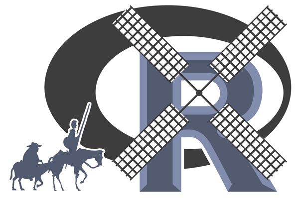

::: article
The ninth R user conference will take place at the University of
Castilla-La Mancha, Albacete, Spain from Wednesday 10 July 2013 to
Friday 12 July 2013. Following previous *useR!* conferences, this
meeting of the R user community will

-   focus on R as the 'lingua franca' of data analysis and statistical
    computing;

-   provide a platform for R users to discuss and exchange ideas on how
    R can be used for statistical computation, data analysis,
    visualization and exciting applications in various fields;

-   give an overview of the new features of the ever evolving R project.

As with the predecessor conferences, the program consists of two parts:

-   invited talks discussing new R developments and exciting
    applications of R

-   user-contributed presentation reflecting the wide range of fields in
    which R is used to analyze data.

A major goal of the useR! conference is to bring users from various
fields together and provide a platform for discussion and exchange of
ideas: both in the formal framework of presentations as well as in the
informal times surrounding the conference sessions.

# Invited speakers

The invited talks represent the spectrum of interest from important
technical developments to exciting applications of R, presented by
experts in the field:

-   *María Jesús Bayarri*: New challenges and Bayes: The world of
    computer models.

-   *José Manuel Benítez-Sánchez*: Computational Intelligence in R.

-   *Duncan Murdoch*: What's new in R3.0.X.

-   *Havard Rue*: Bayesian computing with INLA and the R-INLA package.

-   *Steve Scott*: Bayesian computation in C++ with R as an interface.

-   *Hadley Wickham*: BigR data

# User-contributed sessions

In the contributed sessions, presenters will share innovative and
interesting uses of R, covering topics such as:

-   Bayesian statistics

-   Bioinformatics

-   Chemometrics and computational physics

-   Data mining

-   Econometrics & finance

-   Environmetrics & ecological modeling

-   High performance computing

-   Imaging

-   Interfaces with other languages/software

-   Machine learning

-   Multivariate statistics

-   Nonparametric statistics

-   Pharmaceutical statistics

-   Psychometrics

-   Spatial statistics

-   Statistics in the social and political sciences

-   Teaching

-   Visualization & graphics

The poster session will be a major social event on the evening of the
first day of the conference. Contributed talks will be organised in the
following types of session:

-   *useR! Kaleidoscope*: These sessions give a broad overview of the
    many different applications of R and should appeal to a wide
    audience.

-   *useR! Focus Session*: These sessions cover topics of special
    interest and may be more technical.

In both cases presentations will be allowed 17 minutes, followed by 3
minutes discussion. In addition to the regular contributed talks, all
participants are invited to present a *Lightning Talk*, for which no
abstract is required. These talks provide a 5-minute platform to speak
on any R-related topic and should particularly appeal to R newbies.
Participants wishing to give such a talk must provide an informative
title.

# Pre-conference tutorials

Before the start of the official program, the following half-day
tutorials will be offered on Tuesday, July 9th:

-   *Esteban Alfaro, Matías Gámez and Noelia García*: Classification
    with Individual and Ensemble Trees

-   *Jason Bryer and Robert Pruzek*: Introduction to Propensity Score
    Methods with R

-   *Romain François and Hadley Wickham*: C++ and Rcpp for beginners

-   *Markus Gesmann and Diego de Castillo*: Interactive web graphics
    with R and googleVis

-   *Garrett Grolemund*: Data visualization with ggplot2

-   *Stephanie A. Kovalchik*: Performing Meta-Analysis with R

-   *Mark van der Loo and Edwin de Jonge*: An introduction to data
    cleaning with R

-   *Martin Morgan*: R/Bioconductor for Analysis and Comprehension of
    High-throughput Genomic Data

-   *George Ostrouchov and Drew Schmidt*: Programming with Big Data in R

-   *Xavier de Pedro*: Web 2.0 interfaces for R with Tiki

-   *Havard Rue*: Bayesian computing with INLA: An introduction item

-   *Roger Bivand*: Using Spatial Data

-   *Karim Chine*: R and Cloud Computing for Higher Education and
    Research

-   *Andrea Dessi, Enrico Branca, Federico Figus*: Applied Financial
    Analysis and Human Capital Risk Management

-   *Marco Scutari*: Learning Bayesian Networks in R: an Example in
    Systems Biology

-   *Max Kuhn*: Predictive Modeling with R and the caret Package

-   *Rui Paulo and Jesús Palomo*: Statistical Analysis of Computer
    Models using R

-   *Josh Paulson and Joe Cheng*: Developing web applications with R and
    shiny

-   *Pete Philipson*: Joint Modelling of Repeated Measurements and
    Time-to-Event Data

-   *Andy South*: Making beautiful world maps with country-referenced
    data using rworldmap and other R packages

-   *Tobias Verbeke and Stephan Wahlbrink*: Eclipse/StatET and Architect
    for Professional R Development

-   *Alex Zolotovitski*: How to work with large R projects

# Data analysis contest

We are pleased to announce the Data Analysis Contest for useR! 2013
attendants: <http://www.edii.uclm.es/~useR-2013/#contest>. Check the
rules, download the data and send your proposal to win the prize!

# Location & surrounding area

The University of Castilla-La Mancha is the only university in the
region and it is divided into several campuses. The conference will take
place at the campus in Albacete. Information and useful links on the
numerous and famous attractions in the area surrounding the University
of Castilla-La Mancha in Albacete can be found at the Castilla-La Mancha
Tourism website <http://www.visitclm.com/>.

# Further information

A web page offering more information on *useR! 2013*, including details
regarding registration, is available at
<http://www.r-project.org/useR-2013/>

We hope to meet you in Albacete!

Esteban Alfaro-Cortés, José Luis Alfaro-Navarro, María Teresa
Alonso-Martínez, Emilio L. Cano, Gonzalo García-Donato, Matías
Gámez-Martínez, Noelia García-Rubio, Virgilio Gómez-Rubio and Francisco
Parreño-Torres.

The organizing committee,
[useR-2013@R-project.org](useR-2013@R-project.org){.uri}

{width="5cm" alt="useR 2013 logo"}
:::
