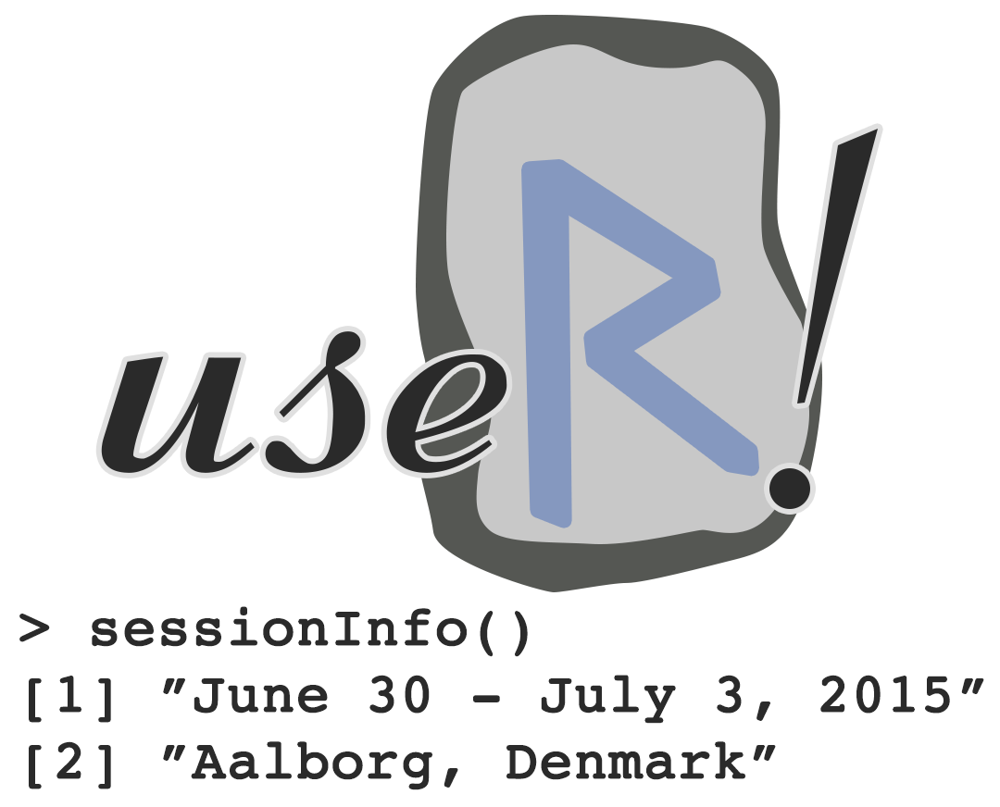

::: article
The 11th international R user conference, useR! 2015, took place in
Aalborg, Denmark, 1--3 July 2015. The Department of Mathematical
Sciences, Aalborg University, hosted the conference, which took place in
Aalborg Congress and Culture Centre.

We had originally hoped for 300--400 participants and some support from
sponsors. The meeting attracted a total of 660 participants from 42
countries with an almost uniform split on academia and industry.
Furthermore, the industry's generous support made it possible to provide
free meals, drinks and a well-suited venue for the conference.

{width="90.0%"}

Our social events included welcome reception at the waterfront in the
House of Music, a poster session with free bar and food, and a trip to
Denmark's second largest forest (Rold Forest) where we held the
conference dinner. During the conference dinner competitive games took
place such as long sawing, axe hurling and archery.

We received more than 250 abstracts of which some 220 were accepted
either as posters, lightning talks or oral presentations. The final
programme consisted of six invited talks, 126 oral presentations, 14
lightning talks and 77 posters were presented at the conference.

## Pre-conference tutorials {#sec:tutorials}

Inspired by the initiative of useR! 2014 in Los Angeles we decided to
provide the tutorials free of charge to useR! participants. This reduced
the book-keeping load and allowed people to attend tutorials without
considering the additional cost per tutorial. Based on the submitted
tutorial proposal, the programme committee elected tutorials below:

-   Applied Spatial Data Analysis with R (*Virgilio Gómez Rubio*)

-   Bayesian Networks and Graphical Models with R (*Søren Højsgaard and
    Therese Graversen*)

-   Data Manipulation with
    [*dplyr*](https://CRAN.R-project.org/package=dplyr) (*Hadley
    Wickham*)

-   Efficient Statistical Consulting using R Workflow for Data Analysis
    Projects (*Peter Baker*)

-   Handling Missing Values with a Special Focus on the Use of Principal
    Components Methods (*François Husson*)

-   RHadoop (*Andrie de Vries and Simon Field*)

-   Rocker: Using R on Docker (*Dirk Eddelbuettel*)

-   Statistical Analysis of Network Data (*Gabor Csardi*)

-   Analysis and Visualization of Large Complex Data with Tessera (*Ryan
    Hafen and Stephen Elston*)

-   Applied Machine Learning and Efficient Model Selection with
    [*mlr*](https://CRAN.R-project.org/package=mlr) (*Bernd Bischl and
    Michel Lang*)

-   Bioconductor for High-Throughput Sequence Analysis (*Martin Morgan*)

-   Getting to Know *grid* Graphics (*Paul Murrell*)

-   Introduction to Bayesian Data Analysis with R (*Rasmus Bååth*)

-   [*spatstat*](https://CRAN.R-project.org/package=spatstat): An R
    Package for Analysing Spatial Point Patterns (*Adrian Baddeley and
    Ege Rubak*)

-   Testing R Code (*Richard J. Cotton*)

-   Using Pandoc's Markdown with R (*Gergely Daróczi*)

More than 80% of the conference participants registered at Tutorial
Tuesday and most of these participated in one or two tutorials making
the "open source" offer of free participation a success.

## Invited talks

With the aim of getting the "use" of useR! in focus we invited speakers
with varying backgrounds to give the six plenary talks of useR! 2015.
Most of the presented topics were also discussed in the submitted
sessions.

-   *Thomas Lumley*: How Flexible Computing Expands What an Individual
    Can Do

-   *Adrian Baddeley*: How R Has Changed Spatial Statistics

-   *Steffen Lauritzen*: Linear Estimating Equations for Gaussian
    Graphical Models with Symmetry

-   *Di Cook*: A Survey of Two Decades of Efforts to Build Interactive
    Graphics Capacity in R

-   *Romain François*: My R Adventures

-   *Susan Holmes*: Multitype Data Integration: Challenges from the
    Human Microbiome

## Contributed sessions

After the selection of submitted abstracts we attempted to group the
contributed talks in sessions of similar talks. The overall headings of
the five parallel sessions were:

-   Ecology

-   Networks

-   Reproducibility

-   Interfacing

-   Case study

-   Clustering

-   Data management

```{=html}
<!-- -->
```
-   Computational\
    performance

-   Business

-   Spatial

-   Databases

-   Medicine

-   Regression

```{=html}
<!-- -->
```
-   Commercial offerings

-   Interactive graphics

-   Teaching

-   Statistical methodology

-   Machine learning

-   Visualisation

These themes were also represented in the poster session and in the six
kaleidoscope sessions. In addition to posters and presentations, there
were 14 Lightning Talks, a 5-minute presentation on any R-related topic
aimed particularly at those new to R. Participants seemed to appreciate
this fast-paced introduction to a wide range of topics.

## Organisers

The selection of abstracts for presentations would not have been
possible without the thorough review process of the programme committee.
We are grateful to the programme committee of useR! 2015: Peter
Dalgaard, Dirk Eddelbuettel, Poul Svante Eriksen, Julie Josse, Martin
Maechler, Katharine Mullen, Helle Sørensen, Heather Turner, Hadley
Wickham, Achim Zeileis, and Søren Højsgaard (chair).

The local "green shirt" heroes making the useR! 2015 in Aalborg possible
consisted of several students and local statisticians: Mikkel Meyer
Andersen, Anders Ellern Bilgrau, Claus Dethlefsen, Mateusz 'Matt'
Dziubinski, Poul Svante Eriksen, Søren Højsgaard, Rikke Nørmark
Mortensen, Maria Rodrigo-Domingo, Ege Rubak, and Torben Tvedebrink
(chair).

## Further information

The useR! 2015 website,
[www.R-project.org/useR-2015](http://www.R-project.org/useR-2015)
provides a record of the conference. Where authors have made them
available, slides are accessible via the online conference schedule
(Oral Sessions).

A blog post summarising the planning and execution of useR! 2015 can be
found at the [Revolution Analytics'
blog](http://blog.revolutionanalytics.com/2015/07/planning-of-and-some-stats-from-user-2015-aalborg.html).
:::
