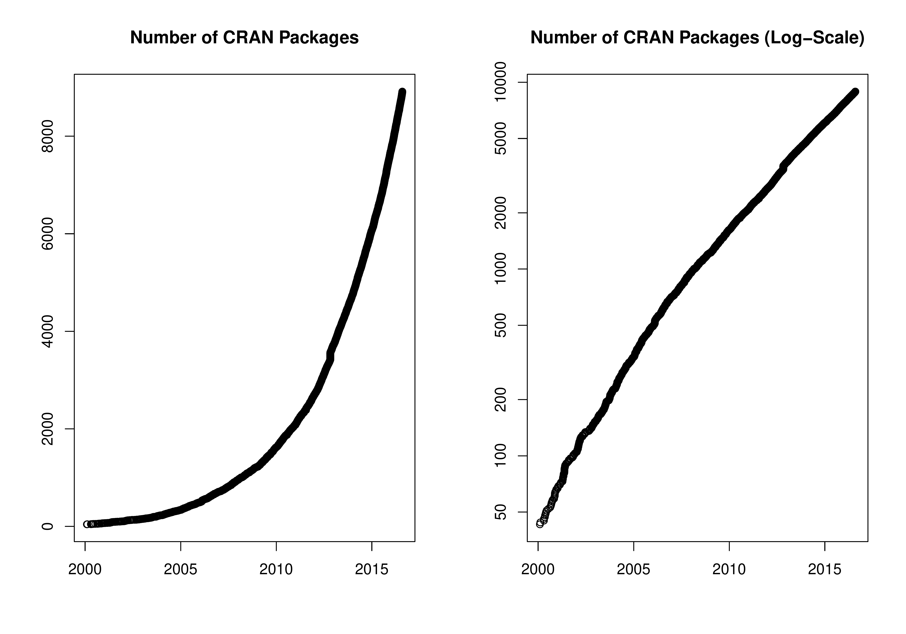

::: article
In the past 8 months, 1322 new packages were added to the CRAN package
repository. 43 packages were unarchived, 48 archived, 1 package had to
be removed. The following shows the growth of the number of active
packages in the CRAN package repository:

{width="100%" alt="graphic without alt text"}

At the R Foundation's General Assembly after UseR! 2016 in Stanford, the
CRAN team asked for help, in particular for processing package
submissions. Dirk Eddelbüttel, Duncan Murdoch, Deepayan Sarkar, and
Duncan Temple Lang volunteered. Duncan Murdoch is already actively
processing incoming CRAN submissions; expect other changes over the
coming months.

## New packages in CRAN task views

[*ChemPhys*](https://CRAN.R-project.org/view=ChemPhys)

:   *EEM*, *titrationCurves*, *webchem*.

[*Cluster*](https://CRAN.R-project.org/view=Cluster)

:   *evclust*, *genie*, *treeClust*.

[*Distributions*](https://CRAN.R-project.org/view=Distributions)

:   *EnvStats*, *KScorrect*, *bridgedist*, *extraDistr*, *extremefit*,
    *marg*, *mclust*.

[*Econometrics*](https://CRAN.R-project.org/view=Econometrics)

:   *rUnemploymentData*, *wbstats*.

[*Finance*](https://CRAN.R-project.org/view=Finance)

:   *FRAPO*, *XBRL*, *bootTimeInference*, *derivmkts*, *finreportr*,
    *obAnalytics*.

[*HighPerformanceComputing*](https://CRAN.R-project.org/view=HighPerformanceComputing)

:   *LaF*, *RcppParallel*, *doFuture*, *future.BatchJobs*, *gpuR*,
    *h2o*, *randomForestSRC*, *sprint*.

[*MachineLearning*](https://CRAN.R-project.org/view=MachineLearning)

:   *OneR*, *SIS*, *SuperLearner*, *evclass*, *h2o*, *hdm*.

[*MetaAnalysis*](https://CRAN.R-project.org/view=MetaAnalysis)

:   *altmeta*, *bayesmeta*, *bmeta*, *gmeta*, *hetmeta*, *metansue*,
    *weightr*.

[*NumericalMathematics*](https://CRAN.R-project.org/view=NumericalMathematics)

:   *conicfit*, *madness*, *matrixcalc*, *permutations*.

[*OfficialStatistics*](https://CRAN.R-project.org/view=OfficialStatistics)

:   *convey*, *icarus*.

[*Optimization*](https://CRAN.R-project.org/view=Optimization)

:   *cmaesr*, *nlmrt*, *parma*, *psoptim*, *rCMA*, *rLindo*, *scs*,
    *smoof*.

[*Psychometrics*](https://CRAN.R-project.org/view=Psychometrics)

:   *ShinyItemAnalysis*, *blavaan*$^*$, *bpca*, *difNLR*, *dualScale*,
    *metaSEM*, *quickpsy*, *wCorr*.

[*ReproducibleResearch*](https://CRAN.R-project.org/view=ReproducibleResearch)

:   *DT*, *HTMLUtils*, *Kmisc*, *RefManageR*, *ReporteRs*,
    *SortableHTMLTables*, *apaStyle*, *archivist*, *checkpoint*,
    *compareGroups*, *connect3*, *formatR*, *formattable*, *highlight*,
    *highr*, *htmlTable*, *htmltools*, *humanFormat*, *kfigr*,
    *knitLatex*, *knitcitations*, *latex2exp*, *lazyWeave*, *lubridate*,
    *miniCRAN*, *packrat*, *prettyunits*, *rbundler*, *resumer*,
    *rmarkdown*, *rprintf*, *tufterhandout*, *ztable*.

[*Robust*](https://CRAN.R-project.org/view=Robust)

:   *roahd*.

[*Spatial*](https://CRAN.R-project.org/view=Spatial)

:   *HSAR*, *ProbitSpatial*, *RNetCDF*, *S2sls*, *SpatialPosition*,
    *Watersheds*, *cartography*, *cleangeo*, *diseasemapping*,
    *gdalUtils*, *geoaxe*, *geostatsp*, *igraph*, *ipdw*, *lawn*,
    *lctools*, *magclass*, *mapmisc*, *mapview*, *ncdf4*, *quickmapr*,
    *recmap*, *shp2graph*, *spanel*, *statebins*, *stplanr*.

[*SpatioTemporal*](https://CRAN.R-project.org/view=SpatioTemporal)

:   *VTrack*, *trackeR*.

[*TimeSeries*](https://CRAN.R-project.org/view=TimeSeries)

:   *ForecastCombinations*, *M4comp*, *VARsignR*, *ZRA*, *carx*,
    *sleekts*, *stlplus*, *tsPI*.

[*WebTechnologies*](https://CRAN.R-project.org/view=WebTechnologies)

:   *ApacheLogProcessor*, *AzureML*, *FastRWeb*, *GAR*, *RAdwords*,
    *RGoogleFit*, *ROpenWeatherMap*, *RSclient*, *RYandexTranslate*,
    *RZabbix*, *Rblpapi*, *Rexperigen*, *Rmonkey*, *Rserve*, *V8*,
    *WikiSocio*, *WikidataR*, *WufooR*, *abbyyR*, *aws.signature*,
    *backblazer*, *bigrquery*, *boxr*, *captr*, *clarifai*,
    *curlconverter*, *cymruservices*, *ddeploy*, *discgolf*, *fbRads*,
    *fitbitScraper*, *fitcoach*, *genderizeR*, *geocodeHERE*, *git2r*,
    *gitlabr*, *googlesheets*, *graphTweets*, *gsheet*, *httpcache*,
    *httping*, *instaR*, *jug*, *livechatR*, *longurl*, *lucr*, *mime*,
    *oai*, *osrm*, *pdftables*, *rLTP*, *randNames*, *rdatacite*,
    *request*, *restimizeapi*, *rgeolocate*, *rio*, *rorcid*, *rrefine*,
    *rvest*, *searchConsoleR*, *sendmailR*, *soql*, *telegram*,
    *threewords*, *tidyjson*, *transcribeR*, *tweet2r*, *urlshorteneR*,
    *webreadr*, *webshot*, *wikipediatrend*, *xml2*, *yummlyr*.

(\* = core package)
:::
