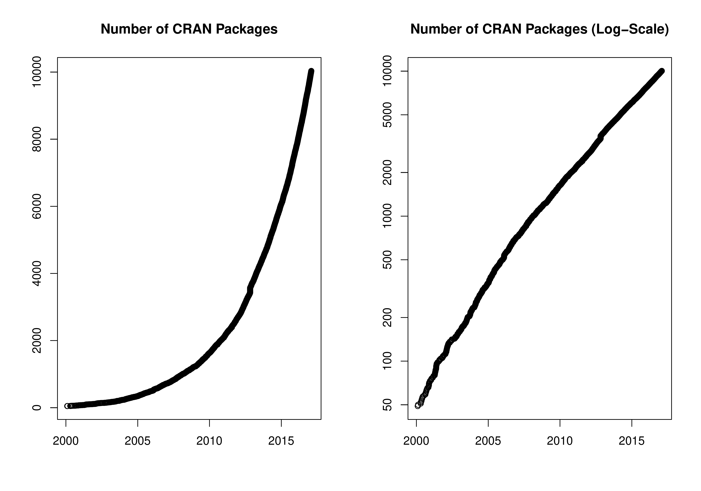

::: article
# CRAN growth

In the past 6 months, 1169 new packages were added to the CRAN package
repository. 18 packages were unarchived and 36 archived. The following
shows the growth of the number of active packages in the CRAN package
repository:

{width="100%" alt="cran growth"}

Around 2017-01-27, the number of active packages went above 10000!

# New CRAN task views

[*ExtremeValue*](https://CRAN.R-project.org/view=ExtremeValue)

:   Topic: Extreme Value Analysis. Maintainer: Christophe Dutang, Kevin
    Jaunatre. Packages: *QRM*, *RTDE*, *ReIns*, *SpatialExtremes*,
    *VGAM*, *copula*, *evd*$^*$, *evdbayes*, *evir*$^*$, *extRemes*,
    *extremeStat*, *extremefit*, *fExtremes*, *ismev*, *lmom*,
    *lmomRFA*, *lmomco*, *mev*, *texmex*.

(\* = core package)

# New packages in CRAN task views

[*Bayesian*](https://CRAN.R-project.org/view=Bayesian)

:   *BAS*, *Boom*, *BoomSpikeSlab*, *LaplacesDemon*, *abn*,
    *bayesImageS*, *bayesmeta*, *bsts*, *nimble*.

[*ChemPhys*](https://CRAN.R-project.org/view=ChemPhys)

:   *enpls*, *wccsom*.

[*ClinicalTrials*](https://CRAN.R-project.org/view=ClinicalTrials)

:   *ThreeGroups*.

[*Cluster*](https://CRAN.R-project.org/view=Cluster)

:   *ADPclust*, *CEC*, *bmixture*, *clustMixType*, *edci*, *largeVis*.

[*DifferentialEquations*](https://CRAN.R-project.org/view=DifferentialEquations)

:   *Sim.DiffProc*.

[*Distributions*](https://CRAN.R-project.org/view=Distributions)

:   *Compositional*, *QRM*, *ReIns*, *bmixture*.

[*Econometrics*](https://CRAN.R-project.org/view=Econometrics)

:   *ExtremeBounds*, *clubSandwich*, *clusterSEs*, *decompr*, *gvc*,
    *pwt9*, *rdd*, *rddtools*, *rdrobust*.

[*ExperimentalDesign*](https://CRAN.R-project.org/view=ExperimentalDesign)

:   *BOIN*, *BayesMAMS*, *CombinS*, *GroupSeq*, *ICAOD*, *JMdesign*,
    *OBsMD*, *OptimaRegion*, *OptimalDesign*, *PGM2*, *PwrGSD*,
    *RPPairwiseDesign*, *SLHD*, *ThreeArmedTrials*, *VNM*, *acebayes*,
    *binseqtest*, *choiceDes*, *crmPack*, *designGLMM*, *designmatch*,
    *desplot*, *dfcomb*, *dfcrm*, *dfmta*, *dfpk*, *docopulae*,
    *dynaTree*, *easypower*, *ez*, *gset*, *hiPOD*, *ibd*,
    *minimaxdesign*, *optDesignSlopeInt*, *ph2bayes*, *ph2bye*, *pid*,
    *powerAnalysis*, *powerGWASinteraction*, *powerbydesign*,
    *qualityTools*, *seqDesign*, *ssize.fdr*, *ssizeRNA*, *vdg*.

[*Finance*](https://CRAN.R-project.org/view=Finance)

:   *Dowd*, *FinancialMath*, *GetHFData*, *GetTDData*, *InfoTrad*,
    *MSGARCH*, *NetworkRiskMeasures*, *PortfolioEffectHFT*,
    *QuantTools*, *factorstochvol*, *fmdates*, *pinbasic*, *ragtop*,
    *sharpeRratio*, *tidyquant*.

[*HighPerformanceComputing*](https://CRAN.R-project.org/view=HighPerformanceComputing)

:   *batchtools*, *pbapply*, *permGPU*.

[*MachineLearning*](https://CRAN.R-project.org/view=MachineLearning)

:   *biglasso*, *gmum.r*, *rnn*, *spa*.

[*MedicalImaging*](https://CRAN.R-project.org/view=MedicalImaging)

:   *Morpho*$^*$, *RNifti*$^*$, *Rvcg*$^*$, *adaptsmoFMRI*,
    *bayesImageS*, *divest*$^*$, *edfReader*$^*$, *eegkit*$^*$.

[*MetaAnalysis*](https://CRAN.R-project.org/view=MetaAnalysis)

:   *MetaAnalyser*, *MetaIntegrator*, *esc*, *metaplotr*.

[*NaturalLanguageProcessing*](https://CRAN.R-project.org/view=NaturalLanguageProcessing)

:   *PGRdup*, *gutenbergr*, *hunspell*, *monkeylearn*, *mscstexta4r*,
    *mscsweblm4r*, *phonics*, *quanteda*, *tesseract*, *text2vec*,
    *tidytext*, *tokenizers*.

[*NumericalMathematics*](https://CRAN.R-project.org/view=NumericalMathematics)

:   *RSpectra*, *rmumps*, *schumaker*.

[*OfficialStatistics*](https://CRAN.R-project.org/view=OfficialStatistics)

:   *BIFIEsurvey*, *CalibrateSSB*, *Frames2*, *GeomComb*, *MBHdesign*,
    *PracTools*, *RRTCS*, *RcmdrPlugin.sampling*, *gridsample*,
    *mapStats*, *panelaggregation*, *quantification*, *rpms*, *rspa*,
    *samplesize4surveys*, *srvyr*, *surveybootstrap*, *surveydata*,
    *surveyoutliers*, *svyPVpack*.

[*Phylogenetics*](https://CRAN.R-project.org/view=Phylogenetics)

:   *outbreaker*, *phyext2*, *phyloTop*, *rmetasim*, *rotl*.

[*Psychometrics*](https://CRAN.R-project.org/view=Psychometrics)

:   *BayesFM*, *BayesLCA*, *BigSEM*, *CAvariants*, *ClustVarLV*,
    *DistatisR*, *GDINA*, *IRTpp*, *LNIRT*, *LVMMCOR*, *LatentREGpp*,
    *MCAvariants*, *MLCIRTwithin*, *SEMID*, *SOD*,
    *SparseFactorAnalysis*, *TestDataImputation*, *aspect*, *cIRT*,
    *cabootcrs*, *cds*, *cncaGUI*, *cocor*, *covLCA*, *ctsem*, *dlsem*,
    *edstan*, *elasticnet*, *emIRT*, *esaBcv*, *faoutlier*, *fourPNO*,
    *gSEM*, *gtheory*, *immer*, *influence.SEM*, *irtDemo*, *lba*,
    *lcda*, *lsl*, *ltbayes*, *nsprcomp*, *optiscale*, *paran*,
    *piecewiseSEM*, *plotSEMM*, *regsem*, *rsem*, *semGOF*, *semdiag*,
    *semtree*, *smds*, *soc.ca*, *sparseSEM*, *subscore*, *superMDS*,
    *xxIRT*.

[*SocialSciences*](https://CRAN.R-project.org/view=SocialSciences)

:   *optmatch*.

[*Spatial*](https://CRAN.R-project.org/view=Spatial)

:   *ExceedanceTools*, *RQGIS*, *dggridR*$^*$, *gear*, *geojson*,
    *geojsonio*, *ggsn*, *postGIStools*, *rgbif*, *rpostgis*, *sf*$^*$,
    *smacpod*, *smerc*, *spacom*, *spselect*.

[*SpatioTemporal*](https://CRAN.R-project.org/view=SpatioTemporal)

:   *CARBayesST*, *GeoLight*, *SimilarityMeasures*.

[*Survival*](https://CRAN.R-project.org/view=Survival)

:   *AHR*, *APtools*, *AdapEnetClass*, *BayesPiecewiseICAR*, *Biograph*,
    *CFC*, *Coxnet*, *Cyclops*, *ELYP*, *FamEvent*, *GORCure*, *GSSE*,
    *ICBayes*, *ICGOR*, *InformativeCensoring*, *JointModel*,
    *LTRCtrees*, *LexisPlotR*, *PenCoxFrail*, *SSRMST*, *SimHaz*,
    *SimSCRPiecewise*, *SurvCorr*, *SurvLong*, *SurvRank*,
    *SurvRegCensCov*, *TP.idm*, *TransModel*, *addhazard*, *asaur*,
    *bnnSurvival*, *cmprskQR*, *compareC*, *condSURV*, *controlTest*,
    *coxsei*, *crrp*, *crskdiag*, *discSurv*, *emplik2*, *fastpseudo*,
    *flexPM*, *flexrsurv*, *frailtySurv*, *gcerisk*, *glmnet*, *gte*,
    *hdnom*, *icRSF*, *icenReg*, *imputeYn*, *intercure*, *isoph*,
    *jackknifeKME*, *joint.Cox*, *landest*, *mexhaz*, *miCoPTCM*,
    *msmtools*, *npsurv*, *pch*, *plac*, *popEpi*, *ranger*, *reReg*,
    *reda*, *rstpm2*, *smcure*, *survMisc*, *survRM2*, *survminer*,
    *tdROC*, *thregI*, *tranSurv*, *uniah*.

[*TimeSeries*](https://CRAN.R-project.org/view=TimeSeries)

:   *BETS*, *BigVAR*, *GAS*, *GeomComb*, *InspectChangepoint*, *Tcomp*,
    *WaveletComp*, *cointReg*, *dCovTS*, *dynr*, *ecm*,
    *factorstochvol*, *forecastHybrid*, *gdpc*, *ggseas*, *mclcar*,
    *onlineCPD*, *opera*, *pcdpca*, *pdc*, *robets*, *roll*, *rucrdtw*,
    *scoringRules*, *seasonalview*, *smooth*, *sparsevar*, *spectral*,
    *stR*, *thief*, *tsdisagg2*, *tswge*, *uroot*, *x13binary*.

[*WebTechnologies*](https://CRAN.R-project.org/view=WebTechnologies)

:   *ROpenFIGI*, *RSmartlyIO*, *RStripe*, *anametrix*, *dataone*,
    *datarobot*, *europepmc*, *fiery*, *geoparser*, *googleAnalyticsR*,
    *googleCloudStorageR*, *htmltab*, *jqr*, *jsonvalidate*,
    *mscstexta4r*, *mscsweblm4r*, *nomadlist*, *openadds*, *opencage*,
    *osi*, *osmplotr*, *placement*, *plumber*, *rgeospatialquality*,
    *rosetteApi*, *uaparserjs*.

(\* = core package)
:::
