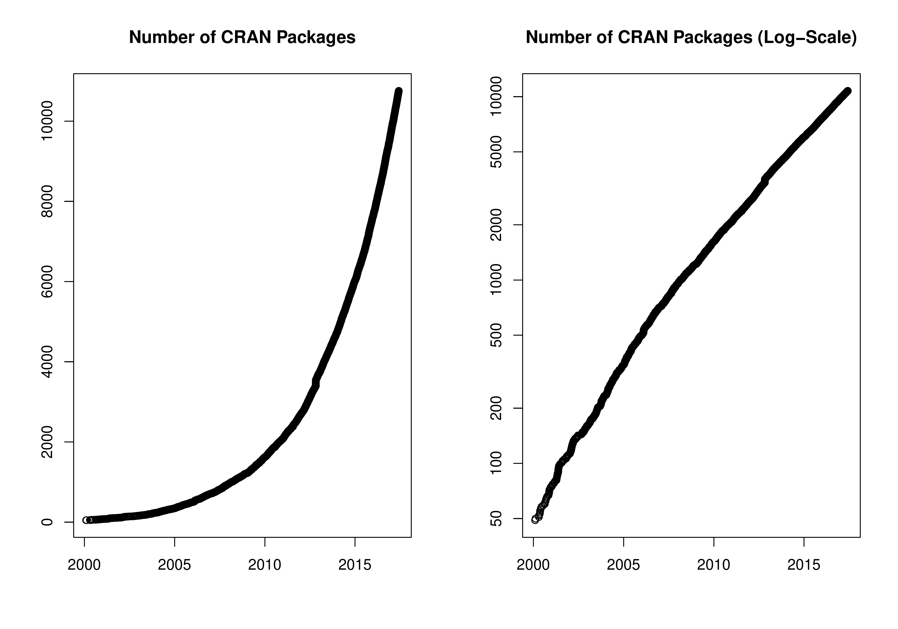

::: article
In the past 4 months, 794 new packages were added to the CRAN package
repository. 16 packages were unarchived, 98 archived and 1 removed. The
following shows the growth of the number of active packages in the CRAN
package repository:

{width="100%" alt="graphic without alt text"}

On 2017-05-31, the number of active packages was around 10727.

## Changes in the CRAN checks

In addition to the results for the regular check runs and the valgrind,
ASAN and UBSAN tests of memory access errors provided by Brian Ripley,
the package check pages now also show additional issues found by tests
without long double (also provided by Brian Ripley) and checks of native
code (C/C++) based on static code analysis, currently reporting
potential errors in the use of PROTECT (provided by Tomáš Kalibera).

## Changes in the CRAN submission pipeline

In the light of the many submissions of new and updated packages
received every day, CRAN is in transition to a more and more automated
submission system. Package maintainers may experience that their
packages are auto-accepted in case a well established package without
other packages depending on it passes the checks without problems. Some
packages will undergo a manual inspection as before, but it may also
happen a package is auto-rejected in case problems occur. In case you
strongly believe the auto-rejection is a false positive, the procedure
of contacting the CRAN team is explained in the rejection message.

## Changes in the CRAN Repository Policy

The following items were added to the
[Policy](https://CRAN.R-project.org/web/packages/policies.html):

-   CRAN versions of packages should work with the current CRAN and
    Bioconductor releases of dependent packages and not anticipate nor
    recommend development versions of such packages on other
    repositories.

-   Downloads of additional software or data as part of package
    installation or startup should only use secure download mechanisms
    (e.g., `https` or `ftps`).

## CRAN mirror security

Currently, there are 97 official CRAN mirrors, 51 of which provide both
secure downloads via `https` *and* use secure mirroring from the CRAN
master (via rsync through ssh tunnels). Since the R 3.4.0 release,
`chooseCRANmirror()` offers these mirrors in preference to the others
which are not fully secured (yet).

## CRAN tools

Since R 3.4.0, package *tools* exports function `CRAN_package_db()` for
obtaining information about current packages in the CRAN package
repository, and several functions for obtaining the check status of
these packages. See `?tools::CRAN_package_db` for more information.

## Hyperlinks in package DESCRIPTION files on CRAN

The CRAN package web page shows important information about the package
and gives the package's Description. Package maintainers are now
encouraged to insert web links and links to relevant publications they
want to cite in order to explain the package's content by using the
following formats (all enclosed in `<...>`) that will cause automatical
insertions of the corresponding links:

Classical web hyperlinks

:   should be given as the URL enclosed in `<...>`, e.g., write
    `<https://www.R-project.org>`.

Digital Object Identifier System (DOI)

:   entries to link to a publication should be given in the form
    `<DOI:10.xxxx...>`.

arXiv.org

:   e-prints without a DOI (yet) should be referred to using their arXiv
    identifier enclosed in `<...>`, e.g., `<arXiv:1501.00001>` or
    `<arXiv:0706.0001v2>`.

## New CRAN task views

[*FunctionalData*](https://CRAN.R-project.org/view=FunctionalData)

:   Topic: Functional Data Analysis. Maintainer: Fabian Scheipl.
    Packages: *FDboost*$^*$, *Funclustering*, *GPFDA*, *MFPCA*,
    *RFgroove*, *classiFunc*, *dbstats*, *fda*$^*$, *fda.usc*$^*$,
    *fdaPDE*, *fdakma*, *fdapace*$^*$, *fdasrvf*$^*$, *fdatest*,
    *fdcov*, *fds*, *flars*, *fpca*, *freqdom*, *ftsa*$^*$, *funData*,
    *funFEM*, *funHDDC*, *funcy*$^*$, *geofd*, *growfunctions*,
    *pcdpca*, *rainbow*, *refund*$^*$, *refund.shiny*, *refund.wave*,
    *roahd*, *sparseFLMM*, *switchnpreg*, *warpMix*.

(\* = core package)

## New packages in CRAN task views

[*Bayesian*](https://CRAN.R-project.org/view=Bayesian)

:   *BayesVarSel*, *NetworkChange*, *bridgesampling*, *deBInfer*,
    *gRain*, *revdbayes*.

[*Cluster*](https://CRAN.R-project.org/view=Cluster)

:   *idendr0*, *prcr*.

[*Distributions*](https://CRAN.R-project.org/view=Distributions)

:   *Renext*, *kernelboot*, *revdbayes*.

[*Econometrics*](https://CRAN.R-project.org/view=Econometrics)

:   *REndo*, *margins*, *pco*, *rdlocrand*.

[*ExtremeValue*](https://CRAN.R-project.org/view=ExtremeValue)

:   *Renext*, *revdbayes*.

[*Finance*](https://CRAN.R-project.org/view=Finance)

:   *BCC1997*, *BLModel*, *PortfolioOptim*, *RcppQuantuccia*,
    *Sim.DiffProc*, *rpatrec*, *rpgm*.

[*MachineLearning*](https://CRAN.R-project.org/view=MachineLearning)

:   *LTRCtrees*, *MXM*, *RLT*, *RcppDL*, *darch*, *deepnet*,
    *gradDescent*, *opusminer*, *wsrf*, *xgboost*.

[*MetaAnalysis*](https://CRAN.R-project.org/view=MetaAnalysis)

:   *CPBayes*, *metafuse*, *metavcov*, *metaviz*, *surrosurv*.

[*OfficialStatistics*](https://CRAN.R-project.org/view=OfficialStatistics)

:   *haven*, *micEconIndex*, *missForest*.

[*Pharmacokinetics*](https://CRAN.R-project.org/view=Pharmacokinetics)

:   *NonCompart*, *PKNCA*, *PKgraph*, *PKreport*, *cpk*, *dfpk*,
    *mrgsolve*, *ncappc*, *ncar*, *nmw*, *pkr*, *scaRabee*.

[*Phylogenetics*](https://CRAN.R-project.org/view=Phylogenetics)

:   *idendr0*, *nLTT*, *phylocanvas*.

[*Psychometrics*](https://CRAN.R-project.org/view=Psychometrics)

:   *AnalyzeFMRI*, *BTLLasso*, *ThreeWay*, *eegkit*, *ica*, *multiway*,
    *munfold*.

[*Spatial*](https://CRAN.R-project.org/view=Spatial)

:   *FRK*, *sperrorest*, *spind*, *spmoran*, *starma*.

[*TimeSeries*](https://CRAN.R-project.org/view=TimeSeries)

:   *dataseries*, *mafs*, *prophet*, *robustarima*.

[*WebTechnologies*](https://CRAN.R-project.org/view=WebTechnologies)

:   *RMixpanel*.

[*gR*](https://CRAN.R-project.org/view=gR)

:   *DiagrammeR*.

(\* = core package)
:::
