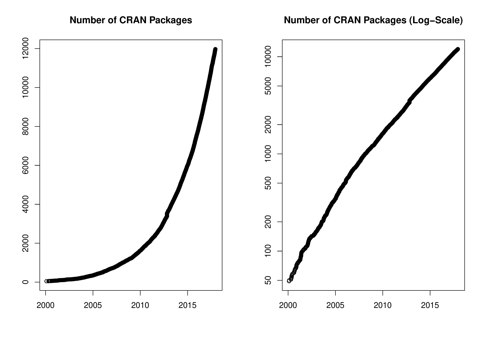

::: article
In the past 6 months, 1244 new packages were added to the CRAN package
repository. 19 packages were unarchived, 55 archived and 3 removed. The
following shows the growth of the number of active packages in the CRAN
package repository:

{width="100%" alt="graphic without alt text"}

On 2017-11-30, the number of active packages was around 11875.

## Changes in the CRAN checks

The package check pages now also show issues found by checks of
corruption of constants (provided by Tomáš Kalibera).

## Changes in the CRAN submission pipeline

Package maintainers who submitted packages this year found the automated
submission system accepted or rejected some packages automatically while
other packages went into a manual inspection queue. The number of false
positives that led to wrong rejections has been reduced. Given the
system is pretty stable now, we will go a step further and also
auto-accept packages with reverse dependencies where the check status of
all reverse dependencies checked is not worse than before. So far
incoming checks in CRAN have been performed on a single platform (Linux
or Windows) only. While (incoming) checks are improved all the time, we
will shortly have both Linux and Windows systems analyzing packages
before publishing automatically.

CRAN received 2087 package submissions in November 2017, i.e., around 70
submissions a day. Hence the CRAN team is no longer able to respond to
individual help requests or be involved in lengthy discussions for
exceptions. Please really use the corresponding mailing lists such as
R-package-devel (see <https://www.r-project.org/mail.html>).

## Changes in the CRAN Repository Policy

The [Policy](https://CRAN.R-project.org/web/packages/policies.html) now
says the following:

-   CRAN packages should use only the public API. Hence they should not
    use entry points not declared as API in installed headers nor
    `.Internal()` nor `.Call()` etc. calls to base packages. Also, `:::`
    should not be used to access undocumented/internal objects in base
    packages (nor should other means of access be employed).

-   Packages should not attempt to disable compiler diagnostics.

-   All correspondence with CRAN must be sent to
    [CRAN-submissions@R-project.org](CRAN-submissions@R-project.org){.uri}
    (not members of the team) and be in plain text ASCII (and not HTML).

In addition, the Policy now also points to a new [Checklist for CRAN
submissions](https://cran.r-project.org/web/packages/submission_checklist.html).

## CRAN mirror security

Currently, there are 95 official CRAN mirrors, 58 of which (about 61%)
provide both secure downloads via `https` *and* use secure mirroring
from the CRAN master (via rsync through ssh tunnels). Since the R 3.4.0
release, `chooseCRANmirror()` offers these mirrors in preference to the
others which are not fully secured (yet).

## Hyperlinks in package DESCRIPTION files on CRAN

For package authors specified via an `Authors@R` field in the
DESCRIPTION file, ORCID identifiers (see <https://orcid.org/> for more
information) can be provided via elements named `ORCID` in the `comment`
argument of the `person()` calls, e.g.,
`person("Achim", "Zeileis", comment = c(ORCID = "0000-0003-0918-3766"))`.
These identifiers will then be hyperlinked in the CRAN package web pages
to the corresponding ORCID pages. See, e.g., the page for package *ctv*.

## Windows binaries

Starting with R 3.4.3, [Jeroen Ooms](https://github.com/jeroen)
maintains the Windows base R binaries and the toolchain for building
both R and contributed packages on Windows.

## New packages in CRAN task views

[*Bayesian*](https://CRAN.R-project.org/view=Bayesian)

:   *openEBGM*, *tRophicPosition*.

[*ClinicalTrials*](https://CRAN.R-project.org/view=ClinicalTrials)

:   *InformativeCensoring*, *Mediana*, *ThreeArmedTrials*,
    *clusterPower*, *crmPack*, *dfped*, *dfpk*, *ewoc*, *gsbDesign*.

[*DifferentialEquations*](https://CRAN.R-project.org/view=DifferentialEquations)

:   *QPot*, *cOde*, *dMod*, *phaseR*, *rODE*, *rodeo*, *rpgm*.

[*Distributions*](https://CRAN.R-project.org/view=Distributions)

:   *MittagLeffleR*, *coga*, *hyper2*.

[*Econometrics*](https://CRAN.R-project.org/view=Econometrics)

:   *OrthoPanels*, *dlsem*, *pder*, *wooldridge*, *zTree*.

[*ExperimentalDesign*](https://CRAN.R-project.org/view=ExperimentalDesign)

:   *DoE.MIParray*, *FMC*, *MBHdesign*, *PBIBD*, *bioOED*, *edesign*,
    *idefix*, *minimalRSD*, *odr*, *optbdmaeAT*, *optrcdmaeAT*,
    *rsurface*, *sFFLHD*, *skpr*$^*$, *soptdmaeA*, *unrepx*.

[*ExtremeValue*](https://CRAN.R-project.org/view=ExtremeValue)

:   *POT*.

[*FunctionalData*](https://CRAN.R-project.org/view=FunctionalData)

:   *covsep*, *denseFLMM*, *freqdom.fda*, *ftsspec*.

[*HighPerformanceComputing*](https://CRAN.R-project.org/view=HighPerformanceComputing)

:   *Sim.DiffProc*, *drake*, *parSim*.

[*MachineLearning*](https://CRAN.R-project.org/view=MachineLearning)

:   *ICEbox*, *effects*, *ggRandomForests*, *pdp*, *plotmo*,
    *tensorflow*.

[*MetaAnalysis*](https://CRAN.R-project.org/view=MetaAnalysis)

:   *CIAAWconsensus*, *ConfoundedMeta*, *MetaSubtract*, *RandMeta*,
    *TFisher*, *clubSandwich*, *effsize*, *forestmodel*,
    *getmstatistic*, *metaBMA*, *metacart*, *metaforest*, *nmaINLA*,
    *psychmeta*, *ratesci*, *rma.exact*.

[*NaturalLanguageProcessing*](https://CRAN.R-project.org/view=NaturalLanguageProcessing)

:   *alineR*, *ore*, *rel*, *stm*, *stringdist*.

[*NumericalMathematics*](https://CRAN.R-project.org/view=NumericalMathematics)

:   *PythonInR*, *SnakeCharmR*, *XR*, *XRJulia*, *XRPython*, *expint*,
    *feather*, *findpython*, *fourierin*, *interp*, *logOfGamma*,
    *reticulate*, *tripack*.

[*Optimization*](https://CRAN.R-project.org/view=Optimization)

:   *ABCoptim*, *CVXR*, *ManifoldOptim*, *Rtnmin*, *SACOBRA*, *colf*,
    *coneproj*, *ecr*, *flacco*, *metaheuristicOpt*, *mize*, *n1qn1*,
    *ompr*, *optimr*, *optimsimplex*, *quadprogXT*, *sdpt3r*.

[*Pharmacokinetics*](https://CRAN.R-project.org/view=Pharmacokinetics)

:   *RxODE*.

[*Phylogenetics*](https://CRAN.R-project.org/view=Phylogenetics)

:   *treeplyr*.

[*Psychometrics*](https://CRAN.R-project.org/view=Psychometrics)

:   *CTTShiny*, *EFAutilities*, *MIIVsem*, *PLmixed*, *dexter*, *umx*.

[*Spatial*](https://CRAN.R-project.org/view=Spatial)

:   *spm*, *spsann*.

[*SpatioTemporal*](https://CRAN.R-project.org/view=SpatioTemporal)

:   *FLightR*, *sf*, *sigloc*.

[*TimeSeries*](https://CRAN.R-project.org/view=TimeSeries)

:   *dLagM*, *fpp2*, *freqdom*, *freqdom.fda*, *ftsa*, *funtimes*,
    *influxdbr*, *odpc*, *sweep*, *timetk*, *tscount*, *wktmo*.

[*WebTechnologies*](https://CRAN.R-project.org/view=WebTechnologies)

:   *gtrendsR*.
:::
