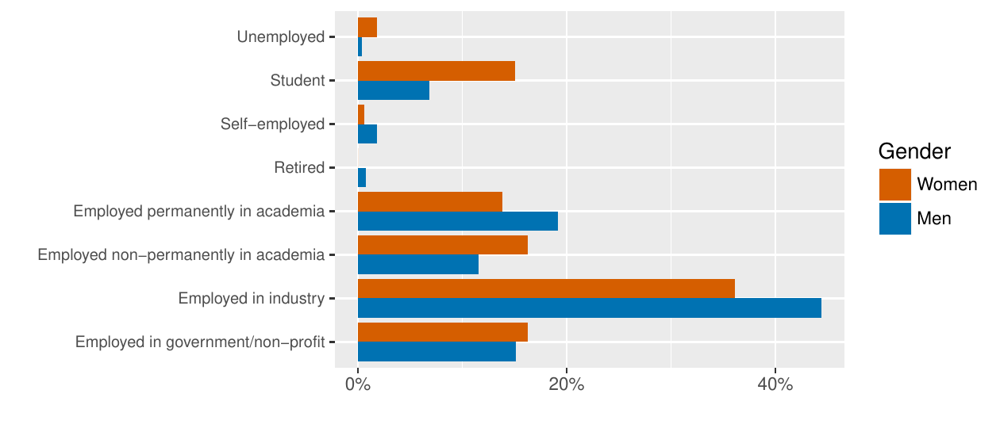
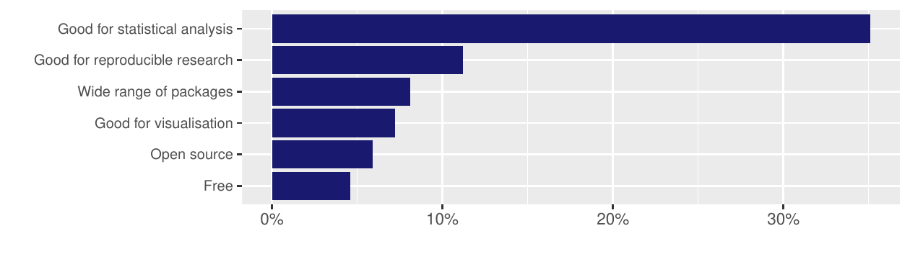
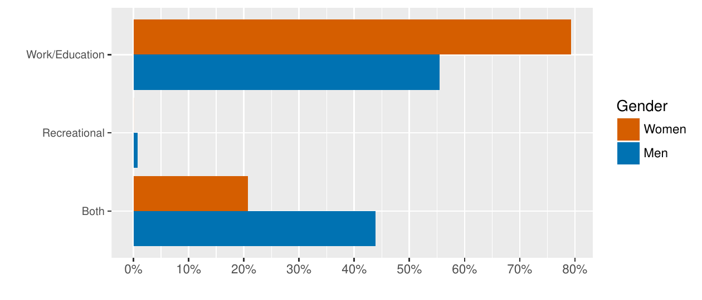
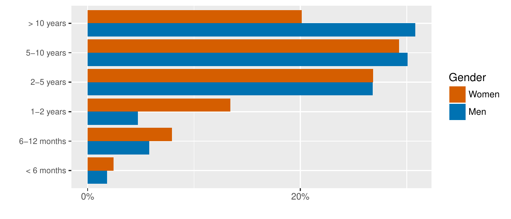
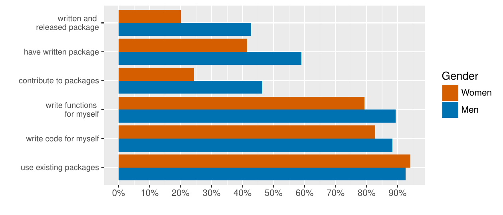

::: article
Forwards is a task force that was set up by the R Foundation in 2015 to
address the under-representation of women that has since widened its
scope to encompass other under-represented groups. The task force is
organised as a core team comprising leaders from a number of sub-teams
that focus on particular aspects:

Community

:   General outreach to help people from under-represented groups get
    into R and develop as useRs. Members have represented the task force
    at events such as [AlterConf](https://alterconf.com), [Trans\*Code
    International Transgender Day of Visibility
    Hackathon](https://wearetechwomen.wearethecity.com/transcode-international-transgender-day-visibility-hackathon-pictures/),
    [National Federation of the Blind
    Convention](https://nfb.org/convention), and [Society for
    Advancement of Chicanos/Hispanics and Native Americans in
    Science](http://sacnas.org/). The team promotes outreach schemes
    such as [NASA Datanauts](https://open.nasa.gov/explore/datanauts/)
    and works alongside others in the R community seeking to widen
    participation, such as [R-Ladies](https://rladies.org) or other
    sub-teams, for example co-ordinating the diversity scholarship
    scheme for useR! 2017.

Conferences

:   With a particular focus on R Foundation conferences, this team
    liaises with the organizers/program committee on policies and
    inclusion initiatives. For example this team initiated the
    conference buddy scheme for useR! 2017 and collaborated with
    R-Ladies to host a special session for newcomers.

On-ramps

:   Creating paths for useRs to develop their skills and make
    contributions to the R/Bioconductor package ecosystem. Activities
    have included speaking at the useR! 2017 newcomer session and
    R-Ladies meetings on collaborative coding.

Social Media

:   Managing the [Twitter](https://twitter.com/r_forwards) account and
    the recently started
    [Facebook](https://www.facebook.com/groups/163371137549666/) group
    to support people from under-represented groups. Maintaining the
    [website](http://forwards.github.io) and co-ordinating the blog.

Surveys

:   Running and analysing community surveys; publishing corresponding
    reports and data. For example, this team ran a survey at useR! 2016
    to find out about the demographics, programming experience and
    community involvement of useR! attendees.

Teaching

:   Working on methodology, materials and workshops designed for
    under-represented groups. In particular, this team have developed
    materials for two workshops: one aimed at high school girls, on
    creating a data analysis web application and another aimed at women,
    on package development. So far these workshops have been run in
    Australia and New Zealand, with repeats planned for Europe and North
    America.

This new column provides an outlet for news about the work of the task
force as well as more detailed reports. This inaugural column presents
an article on the results of the useR! 2016 survey.

# A First Survey on the Diversity of the R Community

The R environment for statistical computing is an open-source project
for data analysis. It provides an opportunity for users worldwide to
benefit from an extensive number of software tools for a wide spectrum
of data analysis and also allows users to participate in the project.
This participation may take many forms. Beginners may attend tutorials
on data analysis with R and contribute through their feedback while
advanced users may write their own code and even publish it on one of
the public repositories. As a whole, we will refer to the participants
of the R project as the "R community" -- but be assured of our awareness
that this community is very hard to grasp.

Several studies have already investigated important aspects of the R
community. A central place in the development of R is taken by the R
Core Team. It is responsible for the development of the basic R software
and the maintenance of infrastructure which is necessary for its
distribution. Several interesting aspects of the organization and work
of the R Core Team have been summarized by @fox2009, who conducted a
series of interviews with its members. @mair2015 investigated the
motivation and values of the authors of R software packages published on
the CRAN, Bioconductor and R-Forge repositories by the means of a
questionnaire. Like the R Core Team, package authors are a well-defined
subgroup of the R community that is quite easily accessible because
their names are made public. However, very little is known about the
remaining part of the R community, which consists of regular R users as
well as developers who have not published R packages on public
repositories so far. They are usually anonymous and can not be directly
addressed.

Therefore, in a first attempt to start gathering information on the R
community, we turned to a subsample of the community that was more
clearly defined, namely the attendees of the useR! conference 2016, held
in Stanford, CA. The advantage of the useR! conference as a platform for
the survey -- besides feasibility -- was that it is attended by both R
users and R developers, which is an important prerequisite for getting a
broader insight than the previous studies on R Core members and CRAN
package developers.

Yet we are fully aware that the useR! attendees are not a representative
sample from the R community as a whole, because conference attendance
itself depends on a variety of resources. This is particularly true for
an expensive location like Stanford. Therefore, in this study we don't
claim that our results can be generalized to other parts of the R
community -- nevertheless they tell us something about a quite relevant
part of this community.

Speaking in terms of study design, we can only consider the useR!
attendees -- not the R community as a whole -- as the population, from
which again only a sample answered the questionnaire. We did, however,
achieve a rather high return rate of 455/904 and also checked the
representativeness of this sample as compared to the population of useR!
attendees with respect to demographic information provided at or derived
from registration[^1]. Like most studies, we found that women were
slightly more willing to participate in the survey compared to men,
however this imbalance only becomes relevant when men and women differ
in their responses, in which case we present results for men and women
separately.

All attendees of the useR! conference 2016 received an invitation to
participate in the survey. The questionnaire was presented online and
contained 26 questions, which concerned demographic information,
experience with and opinions about R, and involvement in the R
community. Our results will be presented in two sections: In the first
section, we report results on the demographic data. In the second
section, we summarize the responses concerning the participants' usage
of R and their involvement in the R community.

The main goal of the survey was to obtain information from R users and
developers that may help in setting up more inclusive infrastructure for
the usage, development and teaching of R. The results may also point out
prerequisites for successfully developing R expertise and hopefully
initiate a dialogue with under-represented subgroups of the R community
in order to help them formulate their needs.

While the initial focus of the survey, as well as the task force itself,
was on addressing the under-representation of women, we did also
investigate the representation of minority groups identified by race and
sexuality. We will show that these minorities are severely
under-represented. However, for a detailed statistical analysis the
group sizes were so small that conclusions would have been questionable
and identifiability of individual respondents would have become an
issue.

Given that this survey was the first attempt towards addressing a
broader part of the R community, both the structure of the questionnaire
and its analysis are of a rather explorative nature. This, together with
the above-mentioned fact that the respondents are a representative
sample from the attendees, but not necessarily from the R community as a
whole, has led us to formulate any conclusions carefully and emphasize
effect sizes rather than significance in our statistical analysis.

Based on the work of @cohen1988, we calculated Cohen's Omega as an
effect size measure for describing associations between categorical
variables. Cohen also provided guidelines for interpreting these
measures: For Cohen's Omega, values around 0.1 correspond to a small
effect, values around 0.3 correspond to a medium effect, and values
around 0.5 correspond to a large effect. For all results presented here,
a Cohen's Omega of 0.13 or higher also corresponded to a p-value below
0.05.

## Demographic information

The sample consists of 455 respondents. We first investigated the basic
characteristics of this sample, which include the age of the
respondents, the number of women and men respondents, and the
educational level of the respondents, as well as variables related to
under-represented groups. Unless noted otherwise, all reported
percentages refer to the relative size compared to the entire sample of
455 respondents.

Most respondents identified as men or women: an extremely small number
of attendees had a gender outside the binary, but are not included in
this analysis to avoid risking identifying them without their consent.
Of the remaining respondents, 169 (37.22%) identified as women. 27
respondents (5.93%) reported to identify as members of the LGBT
community, whereas 11 respondents (2.42%) did not reply to this
question. When asked about their ethnicity and country of origin, a wide
array of responses was given. We used a free text field in order to
avoid deficiencies in standard race classification systems, which may
not represent the respondents' identity. The open answer format does,
however, make summarizing the results more difficult, so for this
analysis we did compare the free answers to a standard classification
system. There were 409 responses on the subject of racial identity. This
number was used as the reference for the following percentages: 302
respondents (73.83%) identified as White/Caucasian. Only 7 attendees
(1.71%) identified as Black, Native American (including Pacific
Islanders) or Middle Eastern.

To put this in context, more respondents identified primarily as Jewish
(8 responses, corresponding to 1.96%), than as Black, Middle Eastern or
Native American combined. Of the other attendees, 67 (16.38%) fell
within what the standard American Federal criteria would class as Asian,
12 (2.93%) as Hispanic/Latinx, and the remainder as mixed-race.

Given these results, there appears to be a severe under-representation
of non-white attendees compared to the general population. These results
might further indicate an under-representation of members of the LGBT
community, although this question is more difficult to address. In the
adult population of the United States, around 3.5% of the adult
population consider themselves as part of the LBGT community, as was
shown in the report of @gates2011. However, these figures might
constitute a severe underestimation, as was argued by @nber. We are not
able to further investigate these minorities and their possible reasons
for not attending the conference for two reasons: First, the small
sample sizes of the under-represented groups would make it difficult to
generalize any conclusions. Still we do not find it justified to merge
ethnic minorities into larger groups just for the sake of the analysis.
Second, if a group consists of very few attendees, reporting more
detailed findings could compromise the anonymity of individual
respondents. Therefore, the remaining analysis will focus only on gender
differences.

We do, however, want to point out that the under-representation of
non-white attendees we found in the useR! survey was more severe than we
would have expected and led to a broadening of the focus of the task
force to represent not only the concerns of women but also of other
under-represented groups, be they identified by race, gender, sexuality,
class, or disability.

With respect to gender differences, we found that women and men
respondents differed with regard to their age (approximated from their
birth year, see Figure [1](#fig:age_gender)), but not with regard to
their educational level (with response options "max. secondary school",
"undergraduate degree", "Masters degree", "Doctorate" and "Professional
degree").

{#fig:age_gender width="100%" alt="graphic without alt text"}

The median birth year of men respondents was earlier than that of women
respondents, with men respondents on average being in their early 40s
and women respondents being in their mid-30s.

Therefore, when comparing women and men respondents in the remainder of
the analysis, care should be taken with the interpretation of gender
differences in bivariate analyses, because they might be confounded with
age differences.

Gender differences were indeed found in the reported employment status
of the respondents (see Figure [2](#fig:employment)): A higher rate of
men respondents tended to be employed in industry or to be permanently
employed in academia. On the other hand, a higher rate of women
respondents tended to be students. Part of these differences might be
due to the age differences reported earlier.

Note that here and in all following figures comparing the answers of men
and women respondents, the graphs display conditional relative
frequencies of answering in a certain category given the gender.
Accordingly, the percentages within one gender add up to 100% (missing
values are not considered).

{#fig:employment
width="100%" alt="graphic without alt text"}

116 respondents (25.49%) reported to be caregivers for children or adult
dependents on a regular basis, with men attendees being more likely to
be caregivers than women attendees. 28.97% of the men respondents
reported to be caregivers, while only 21.83% of the women respondents
did. Even though this difference was relatively small (Omega = 0.08), we
decided to report it since it demonstrates the self-selection effect
inherent in this study: Our sample contained only those members of the R
community who were able to attend the useR! conference in Stanford (and
were also willing to answer the questionnaire).

At first glance, the fact that men respondents were more likely than
women to be caregivers may sound like the R community might have
overcome traditional role models already. But the more probable
interpretation, that is also supported by the free text answers, is that
traditional role models do still make it easier for men to leave
children at home with their partner (if applicable) than for women to do
the same, resulting in a self-selection effect in which women with
children are less likely to be able to attend -- and as a result women
who do attend are less likely to be caregivers.

This again reflects the general problem of this survey: We cannot draw
any conclusion about reasons why women or other under-represented groups
did not attend the conference, since we do not have any information on
them.

## Opinion on R

After having reported demographical information about the useR! sample,
we now report our findings on the opinions reported by the respondents
towards R and working with R. Since the demographic information reported
in the last section suggested that women respondents came from a
different professional background than men respondents, we were
particularly interested in further gender differences in their opinion
towards R.

A first question was whether the respondents would recommend R to
friends or colleagues as a programming language to learn. This was
agreed to by 418 (91.87%) respondents, while 21 (4.62%) respondents
disagreed and 19 (4.18%) respondents did not answer. Asked about their
number one argument for or against learning R by selecting one argument
from a list, numerous responses were given. We summarized these reponses
discarding all answers that were given less than 10 times -- this left
only arguments for using R. Figure [3](#fig:argument) summarizes these
most frequently given answers.

{#fig:argument
width="100%" alt="graphic without alt text"}

These data seem to suggest that the respondents would recommend learning
R because of it being a good tool for statistical analyses, followed by
its use as a tool for reproducible research. Men and women respondents
did not differ in their willingness to recommend to learn R, or in their
arguments for or against R (note, however, that for the arguments the
cell frequencies may have been too small for a valid analysis).

Further questions of the survey asked the respondents to indicate to
what extent they agreed with certain statements about R.
Figure [4](#fig:opinions) summarizes the responses to the statements
that

1.  Writing R is fun.

2.  Writing R is considered cool or interesting by my peers.

3.  Writing R is difficult.

4.  Writing R is a monotonous task.

Percentages are in reference to the number of all given answers to the
respective question.

{#fig:opinions width="100%" alt="graphic without alt text"}

We did not find any gender differences in these questions. Attendees of
the useR! conference -- unsurprisingly -- regard R mostly as something
fun and interesting and not very monotonous or difficult.

It seems interesting to note that a large part (160 respondents, 35.16%)
of the sample reported to use R not only in a professional or
educational setting, but also in their free time. When compared with men
respondents, women respondents tend to use R less often in their free
time, and more often in an educational or professional setting (see
Figure [5](#fig:purpose)). Percentages again add up to 100% for each
gender respectively, while missing values are not considered.

{#fig:purpose
width="100%" alt="graphic without alt text"}

In a chi square test, we found a medium effect size (Cohen's Omega =
0.25) for this gender difference.

Given that the higher share of R usage in their free time might also
correspond to longer exposure times for men, which might again affect
subjective or objective expertise as well as self-confidence for
actively participating in activities like package writing, it might be
worth investigating the factors behind this different usage behavior --
be they motivational or due to structural differences like inequal
distributions of household or childcare duties -- in future research.

## Experience with R

A significant part of the survey concerned the respondents' experience
of working with R. Generally, the respondents tended to be rather
experienced R users. 369 respondents (81.10%) reported that they had
already worked with R for 2 years or longer, with 338 respondents
(74.29%) stating that they had already had programming experience before
working with R.

Since women respondents tended to be younger, it could be expected that
they would also have shorter experience in working with R. As can be
seen in Figure [6](#fig:time), our analysis shows that this is indeed
the case (Omega = 0.19). Again, percentages add up to 100 per gender.

{#fig:time width="100%" alt="graphic without alt text"}

There were also gender differences when the respondents were asked about
their previous programming experience before using R (Omega = 0.18).
While 82.25% of the men who answered this question reported to have
previous programming experience, the corresponding percentage among
women was 66.06%.

A related question concerned whether the respondents use only existing
functions of R or whether they also write and publish their own
functions. A majority of the respondents (389, 85.49%) reported to have
written R functions for their own use. A smaller part of the sample
(253, 55.60% of the respondents who answered) reported to have written
their own R package or have contributed to an R package. 155 respondents
(33.07% of the respondents who answered) reported to have published
their own R packages on CRAN. These results are further illustrated in
Figure [7](#fig:usage). Percentages in this plot are in reference to the
respective gender again. They do not add up to 100% for each group
though because multiple answers per person were possible. Notably, men
were more predominant when it comes to R package development.

{#fig:usage width="100%" alt="graphic without alt text"}

So far, our results indicate that women respondents tended to be younger
and have used R for a shorter amount of time than men respondents.
Furthermore, we found that women respondents have contributed to R
packages less often. From these bivariate analyses, however, we cannot
assess whether the gender difference in package development is
confounded with the usage length and programming experience, or whether
there are gender differences beyond these effects, that may again be
confounded with the younger age of the women participants. Therefore, in
the next section we conduct a multiple logistic regression model to
assess the partial effects of gender and the experience variables on
package writing.

## Modeling gender differences in contribution to R packages

As was outlined in the previous sections, women respondents were less
likely to contribute to R packages, but also tended to have less
programming experience and a shorter length of R usage. The observed
gender differences in the contribution to R packages could be confounded
with these variables.

In order to assess the partial effects of these and further variables,
we employed a logistic regression model. It should be clearly stated
that this was a fully exploratory analysis, as no clear hypotheses about
the factors affecting R package contributions in the general R community
were available to guide the design of the survey or this statistical
anlysis. As will be outlined in the following, we explored the
association between package contributions and those survey variables
that seemed plausible.

In the logistic regression models, we predicted whether someone had
contributed to an R package in any form (i.e., the categories
"contribute to packages", "have written package" and "written and
released package" from Figure [7](#fig:usage) were combined to form
response category 1). Different models were compared, with *contribution
to R packages* as outcome variable and *gender*, *length of R usage* and
*previous programming experience* as a first set of candidate
predictors. *Length of R usage* was coded as an ordered factor variable
that consists of 5 response categories that correspond to less than 1
year, 1-2 years, 2-5 years, 5-10 years, and 10 or more years. *Previous
programming experience* was coded as a dichotomous variable indicating
whether someone had previous programming experience before using R or
not.

The results were inconclusive as to whether gender differences remain
after accounting for the differences in length of R usage. With respect
to AIC, the model with *length of R usage* and *gender* as predictors
was the best model, whereas the BIC and the Likelihood ratio test
preferred the model with only *length of R usage* as a predictor. The
variable *previous programming experience* had no additional effect and
was excluded by all criteria. From this first logistic regression
analysis, it looked like a large part -- but maybe not all -- of the
gender differences in the contribution to R packages were caused by
differences in the length of R usage (with women showing shorter usage
lengths, as displayed in Figure  [6](#fig:time)).

To explore potential effects of additional survey variables, we also
included *employment status*, *purpose of R usage* and *community* in
the analysis. *Employment status* was coded as a factor variable with
eight different categories like in Figure [2](#fig:employment). *Purpose
of R usage* is the factor variable from Figure [5](#fig:purpose), and
*community* is a binary variable indicating whether someone stated to
feel as part of the R community or not (with descriptive statistics for
this variable presented in the next section).

The logistic regression model with *gender*, *length of R usage*,
*employment status* and *community* had the lowest AIC and was also the
best model according to the Likelihood ratio test. The BIC again
preferred the more sparse model without *gender*. *Purpose of R usage*
did not improve model fit for any of the criteria.

With respect to the interpretation of the effects of the additional
variables included in this model, for *employment status* we find that
people working permanently and non-permanently in academia contribute
most to R packages, whereas those working in government/non-profit and
industry are slightly less likely to contribute to R packages. Feeling
as part of the R *community* goes along with contributing more to R
packages. Of course, the direction of this association may also be the
other way round, since people who have already contributed to R packages
are more likely to feel as part of the R community.

Again, the analysis does not give a clear answer to the question whether
any gender differences in package contributions remain beyond the
differences already captured by the other predictor variables. Any
remaining differences might depend on a variety of other individual and
structural factors, such as differences in motivation or
self-confidence, in access to information, or in networking and peer
support for contributing to R packages. After this first exploratory
study, it would be very interesting to further question women R users
that are on the verge of becoming R developers what might be keeping
them back -- as well as asking men R users that did cross over and
become developers what helped them take that step.

## The respondents as part of the R community

A final set of questions in the survey concerned the role of the
respondents as part of the R community. Asked whether they considered
themselves to be part of the R community, 361 (79.34%) respondents
agreed, whereas 69 (15.16%) respondents disagreed and 28 (6.15%)
respondents did not answer. Men and women respondents did feel as part
of the R community to a comparable extent.

The respondents further reported to use a variety of resources to
support their work with R. The respective question in the survey
provided a list of possible resources, and also allowed the respondents
to enter additional resources that were not listed as free text. Among
the listed resources, StackOverflow and the R mailing list were the most
frequently used resources. We found no gender differences here.
Reporting only given answers that were chosen more than 4 times for
brevity, the results are displayed in Figure [8](#fig:resources).

{#fig:resources width="100%" alt="graphic without alt text"}

Further asked about their preferred medium for R community news, the
respondents most frequently chose the website (24.18%) and the mailing
lists (21.10%). Other selected options were blog (18.02%), Twitter
(15.16%) and Facebook (4.62%). Given these preferences, communication
across a range of media is necessary to be confident in reaching a large
proportion of R users and developers. A sizeable proportion (7.91%) did
not select any option, so does not have a preference or is not
interested in R community news. Nonetheless, as conference participants,
they may receive some news in person.

We further investigated whether men and women respondents differed with
regard to their preference of individual resources. Therefore, we tested
for every single response category of the previous question whether the
relative frequency with which it was selected differed between men and
women respondents. When correcting for multiple testing, none of them
was statistically significant.

Among the 455 respondents of the survey, 163 (35.82%) respondents
reported that they attend meetings of a R user group, whereas 268
(58.90%) responded that they did not, and 27 (5.93%) respondents did not
reply. Among the 163 respondents attending R user group meetings, 134
(82.21%) respondents indicated that they attended a general user group,
whereas 16 (9.82%) respondents reported that they visited a user group
within a university. Other types of user groups were less often named.

The respondents who did not visit R user group meetings were further
asked about their reasons for this decision. Again, the respondents
could answer this question by either selecting statements from a list or
by entering new statements. The arguments that were chosen most
frequently were that the respondents were too busy or that no active
user group was available.

Finally, we investigated whether men and women respondents differed with
respect to their attendance of R user group meetings, and how these
meetings could be made more attractive for new attendees. In a first
step, we found gender differences with regard to the reported attendance
of R user group meetings. Men respondents reported to attend R user
group meetings more often than women respondents with a small to medium
effect (Omega = 0.21).

In a second step, we investigated gender differences to the question
what measure would make the respondent more likely to attend user group
meetings. For the individual response options, the following differences
were found (only those answers are listed that were chosen by at least
10 respondents, with n indicating the total number of respondents that
chose the respective option):

-   New R user group near me (n = 122): no gender differences (Omega =
    0.02)

-   New R user group near me aimed at my demographic (n = 31): More
    positive responses by women respondents with a small effect (Omega =
    0.19)

-   Free local introductory R workshops (n = 61): no gender differences
    (Omega = 0.02)

-   Paid local advanced R workshops (n = 61): no gender differences
    (Omega = 0.08)

-   R workshop at conference in my domain (n = 73): no gender
    differences (Omega = 0.08)

-   R workshop aimed at my demographic (n = 20): More positive responses
    by women respondents with a small effect (Omega = 0.12)

-   Mentoring (e.g. first CRAN submission/useR! abstract
    submission/GitHub contribution) (n = 87): no gender differences
    (Omega = 0.09)

-   Online forum to discuss R-related issues (n = 62): More positive
    responses by women respondents with a small effect (Omega = 0.14)

-   Online support group for my demographic (n = 18): More positive
    responses by women respondents with a small effect (Omega = 0.15)

These answers indicate that most people who do not attend user group
meetings do not have a user group near them or (as was suggested by free
text answers) do not know that there are user groups. Other measures
that could help to make people attend user group meetings would be R
workshops at conferences in their domain, an online forum or local R
workshops of different kinds. When it comes to gender differences, women
might be more attracted by user groups explicitly aiming at women, but
might also hint in the direction of women being less willing or less
able or both to spend their free time with R, as we have seen in an
earlier question.

## Discussion

Our results draw a complex picture of the sample of attendees who agreed
to respond to our survey. When looking at the sample as a whole, the
respondents to this survey tended to have programming experience prior
to working with R, and usually used R for 2 or more years. Most
respondents further wrote their own R code, either to create functions
for their own work or to contribute to R packages. Moreover, the average
respondent had a positive opinion towards working with R. These results
are not very surprising, given that this sample was collected among the
attendants of a useR! conference. However, as no comparable results on
the community of R users have been published so far, these findings are
nevertheless valuable. Future studies could use the results reported
here as a benchmark for the evaluation of long-term developments in the
R community.

In accordance with the initial question of the taks force, we did find
that women were under-represented at the useR! conference 2016 -- but
even more strikingly, that non-white users were even more severely
under-represented.

When looking at gender differences in more detail, results from three
areas of the questionnaire stand out, that may however be confounded as
discussed above. First, women respondents tended to be younger and have
shorter experience in R usage than men respondents. Second, women used R
less in their free time and contributed less to R packages. Third, women
agreed less to feeling part of the R community.

The results of the exploratory logistic regression analysis suggest that
the survey questions captured some factors associated with gender
differences in contributions to R packages, such as the length of R
usage, employment in academia and a feeling of belonging to the R
community, that were positively associated with contributing to R
packages. Yet the results were not conclusive as to whether there may be
further gender differences, for example due to personal or structural
factors, that may discourage women from writing R packages and would be
important to investigate.

An additional hierarchical cluster analysis of the same data found three
different groups of people: The first group (around 38% of the sample)
are experienced R users, who tend to be men, from academia and people
with doctorate. They use R not only in a professional setting, but also
for recreational purposes. The second group (around 57% of the sample)
are intermediately experienced users who use R for less than 2 years and
mainly apply existing packages. They tend to be female, and are either
undergraduates or have a master degree. They are using R mainly in
professional or educational settings. The last group (around 3% of the
sample) are the least experienced users who are using R during their
free time. Details on this analysis as well as further multivariate
analyses of the data can be found at [UseR! 2016 R community: a
multivariate
analysis](http://forwards.github.io/docs/mca_community_user2016_survey/)
and [UseR! 2016 participants: a multivariate
analysis](http://forwards.github.io/docs/mca_programming_user2016_survey/).

An anonymised form of the survey data, which minimises disclosure risk
by excluding some demographic variables and recoding others, is
available on CRAN
([*forwards*](https://CRAN.R-project.org/package=forwards)). This data
set includes aggregated versions of all demographic variables used in
the logistic regression analysis and the majority of demographic
variables used to aid interpretation in the multivariate analysis. Apart
from the suppression of a small number of data values and a few free
text variables that contained sensitive/identifying information, the
responses to the programming and community questions are provided as
recorded.

As stated already in the beginning of this text, due to the limitations
of the study design, the results from the conference sample might not
generalize to other subgroups of the R community, in particular not to
those individuals who could not attend the conference due to factors
associated with their being part of an under-represented group. Further
studies are necessary to try to obtain a better picture of the R
community as a whole.

Moreover, several topics which could be of further interest for the
support of R users had not yet been included in the survey in order to
keep it as short as possible. Further potentially interesting questions
include, besides the ones already mentioned above, for example, what
programming languages R users had already used before they started
working with R, whether being in contact with other users that
contribute to R packages makes it more likely to contribute to R
packages oneself, etc.

Still the answers from this questionnaire give some indication to
measures that could be taken to advance the participation of women, for
example that user groups and other means of exchange explicitly
targeting women might make them more accessible. Even though this would
be methodologically challenging both due to the unspecific nature of the
R community and the confounding of any interventions with different
developments over time, it would be important to evaluate the
development of under-represented groups over time.

The fact that women useR! attendees are on average younger and have
lower R usage lengths might stimulate the hope that, once they reach the
age and experience of their men counterparts, any gender differences
might disappear automatically. However, this may not be the case, since
multivariate analyses (see for instance @josse2017) tend to suggest that
after adjusting for the age, women are still less involved in the R
community. We still expect that if the R community and the opportunities
to contribute are not equally attractive for women, they will not have
the motivation to develop the skills to become contributors.

Although our initial framing looked specifically at gender as an axis of
exclusion, the results show that race, not gender, is the area where
there is the greatest disparity, and it is vital that inclusivity
efforts factor this in. While the survey results give some ideas for
improving inclusion in general, specific efforts should be made to reach
out to people from under-represented races, for example through
diversity scholarships, invited conference contributions, or invitations
to serve in community roles. Further information on who is
under-represented, and for what reason, would support such efforts.
:::

[^1]: For more detail see our supplementary report [Non-Responses in the
    UseR! 2016
    Survey](http://forwards.github.io/docs/nonresponse_useR2016_survey/)
