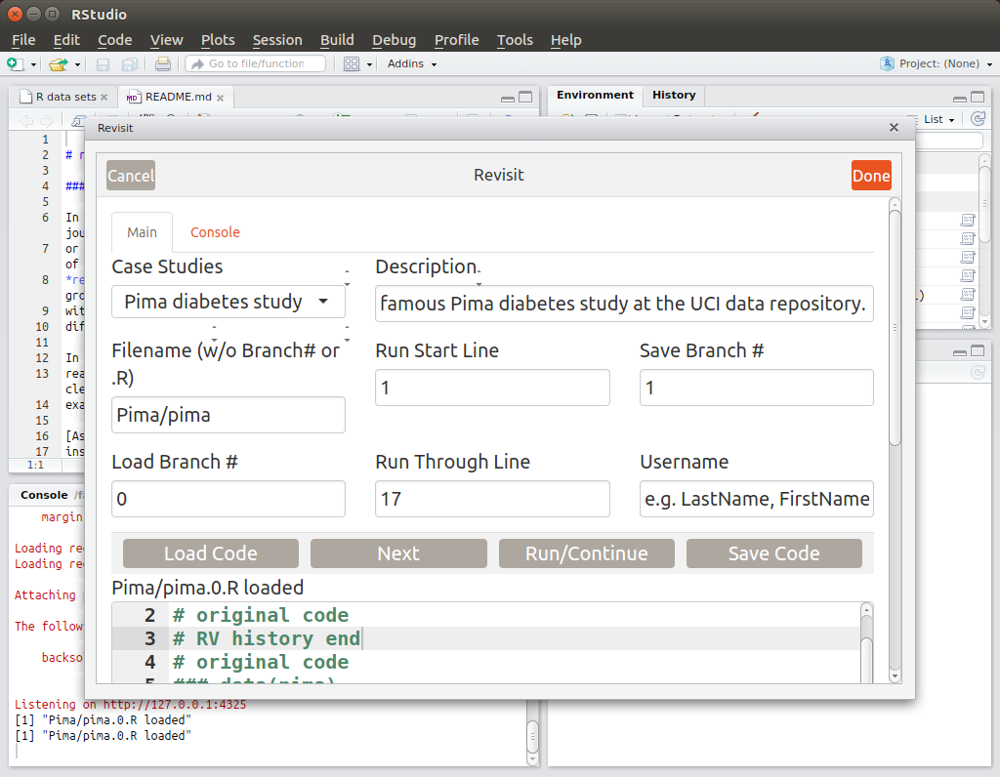
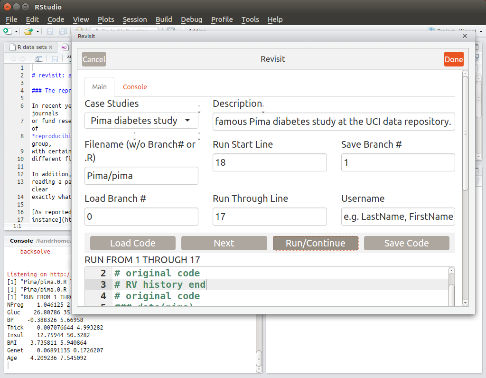
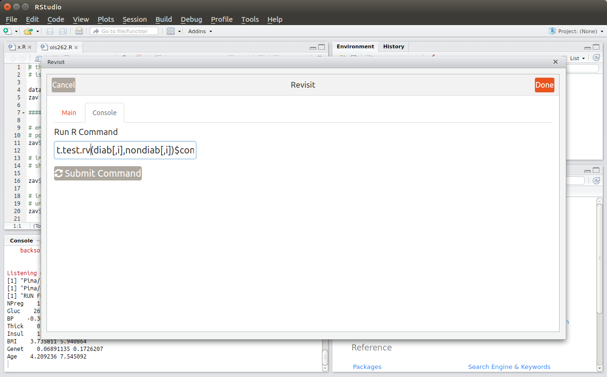
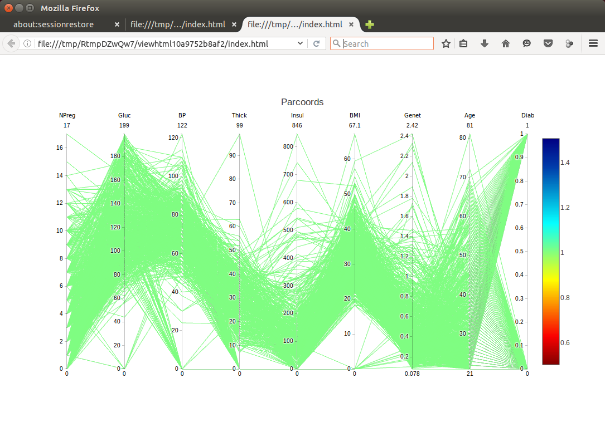

::: article
# Invitation to collaborate

With this issue of the R Journal, there will be a section for teaching R
and teaching using R as well as for empirical research on teaching R.

## Teaching material

A GitHub repository will be setup where the teaching material can be
accessed. All material should be under some licence of Creative Commons
to allow re-use. Please prepare a short text describing your material.
For a sample, see the description by Norman Matloff et al. (below) of
class room material he is using.

## Research on teaching R

Some research is considering the relative success of different
approaches to teaching R and teaching statistics with R. For example,
see some contributions on the recent useR!2017 in Brussels (Gert
Janssenwill et al., [The analysis of R learning styles with
R](http://sched.co/Axqp), Matthias Gehrke and Karsten Luebke, [A
quasi-experiment for the influence of the user interface on the
acceptance of R](http://sched.co/Axqj)). The R Journal is interested in
receiving such submissions.

## Technical details

This column will appear before this GitHub repository is established, so
only links to an existing cooperating
[repository](https://github.com/talgalili/R-teaching-materials) and
[mailing list](https://stat.ethz.ch/mailman/listinfo/r-sig-teaching) can
be provided at this time. Subsequent columns will provide full technical
details or links to such details.

# The 'revisit' Package As a Teaching Tool

## Overview

The R package *revisit* was developed in response to the recent concern
over *reproducibility* in research, especially problems related to
statistical analysis [@pima.paper]. The motivation and methods are
detailed in @arxiv, but in this paper we turn to teaching.

The package has both text and GUI versions, the latter being based on
the RStudio integrated development environment for R. It is currently at
an early stage of development, with more features and refinements being
added continuously. It may be downloaded from
<https://github.com/matloff/revisit>.

One can obtain a quick introduction to the package by starting it and
running one of the case studies. To start the package in GUI form, click
Addins in RStudio, and choose "Revisit". The text version is not
colorful, but is more flexible. To run it, simply run
`library(revisit)`. Use of the case studies will be introduced later in
this paper.

## An excellent motivator: the Reinhart/Rogoff study controversy

The package includes a number of examples for student examination and
participation. One of the case studies involves the controversial paper
by Harvard economists C. Reinhart and K. Rogoff [@cassidy]. They had
found that nations with high budget deficits average a $-0.1$% growth
rate in GDP. This finding had major impact on policymakers, with the
paper attracting particular interest from the "deficit hawks" in the
U.S. Congress. The *Washington Post* took to describing the finding as
"consensus among economists."

But when later researchers tried alternate analysis, the picture changed
entirely. Some data had been excluded from the initial published
analysis, for what arguably were weak reasons. The original analysis
also had the flaw of giving equal weights to all nations, regardless of
size, as well as other aspects that some researchers considered flaws.
When the alternate analysis was run, the figure $-0.1$% changed to
+2.2%. Thus the original findings on deficit spending now seem
questionable. This leads to the theme in the present paper, use of
*revisit* for teaching.

At a talk given by one of the authors of the present paper [@stanfordr],
the author was stunned at student reaction to the Reinhart/Rogoff
example. The students, all doing graduate work in science and
engineering, were captivated by the fact that the study, which had had
such influence on policy, may have been seriously flawed, with alternate
analyses of the same data yielding starkly different results. The
potential of *revisit* as a teaching tool had been suggested earlier by
one of the other authors of the present paper, but the strong student
reaction here dramatized the point.

## General structure of the package

The package is structured as follows:

-   A set of case studies for students to explore and modify (and to
    which instructors can add their own examples).

-   "Statistical audit" warnings/advice given to students regarding
    statistical best practices as they proceed in their analyses.

-   A code management infrastructure to facilitate exploration of
    alternative analyses.

## The case study approach

The package includes various case studies, consisting of data and code.
The latter comprises a complete, though possibly brief, analysis of the
data from start to finish --- the code may include data configuration,
data cleaning, preliminary graphical analysis, predictor variable/model
selection, and so on. Students can then try their own alternative
analyses. Most of the case studies are not as dramatic as Reinhart and
Rogoff, but each illustrates important concepts in data analysis.

There are just a few case studies included in the package currently, but
more are being added, and instructors will often prefer to use their own
data anyway. In many cases, the code will be minimal, affording the
students even more opportunity for nonpassive thought and exploration.

Assignments centered on the use of *revisit* can be very specific or
more open-ended, according to the instructor's preference. Here are
possible samples:

-   "This assignment involves the Reinhart and Rogoff data, included in
    the *revisit* package. Revisit the analysis with different
    weightings for the nations based on various factors."

-   "This assignment involves the famous Pima diabetes study. Some later
    inspection suggested that the data includes a number of erroneous
    values, such as impossible 0 values. Investigate this, say using
    graphical means. Run a logistic regression model, with and without
    the suspect data points, and compare the results. Also, the authors
    of the study used a neural network approach. Try using random
    forests, and compare to the authors' level of predictive ability."

-   "This assignment analyzes the famous Forest Cover dataset, in which
    one of seven cover types is predicted from variables such as
    Hillside Shade at Noon. The given code tries prediction using, of
    course, the random forests method. The first 10 predictors are used.
    In your alternate analysis, try using all 54 predictors. That is
    quite a bit, and even with over 500,000 observations, one must
    always worry about overfitting; investigate that here."

-   "This assignment analyzes the Fong-Ouliaria currency data. The
    supplied code fits a linear regression model, with a respectable
    $R^2$ value. However, one can do better. First, explore this with
    some of the graphical methods in the
    [*regtools*](https://CRAN.R-project.org/package=regtools) package,
    and then try adding some quadratic and interaction terms to the
    model, and/or try a nonparametric regression approach."

-   "Here you will work with data from the 2000 Census, involving
    salaries of programmers and engineers in Silicon Valley. One aspect
    of interest is the gender issue --- are women paid less than
    comparable men? A preliminary regression analysis indicates a
    difference of over \$10,000, for fixed age and educational level.
    But much more needs to be done. For instance, what happens when
    occupation is factored in, and when the non-monotonic relation of
    wage and age is accounted for? Investigate such questions."

We are continuing to add case studies. At this early stage, the list
includes:

-   UCI Pima diabetes data [@lichman]

-   Zavodny guestworker data [@zav]

-   Reinhart and Rogoff [@cassidy]

-   MovieLens [@ml]

-   Fong-Ouliaria currency data [@fong]

-   UCI forest cover data [@lichman]

-   Salary data on programmers and engineers, Silicon Valley, 2000
    Census

We anticipate that instructors will typically develop their own case
studies. We encourage them to contribute these to *revisit*.

To load a case study in the GUI, just select the desired one from the
Case Studies window. The code will then be loaded, ready to run. For the
text version, at present this is done as in this example, for the
Currency data:

``` r
fname <- system.file('CaseStudies/Currency/currency.R',package='revisit')
loadb(fname) 
```

## A "statistical audit"

One of the most important features of *revisit* is that it plays the
role of a "statistical audit," in much the same way that tax preparation
software might warn of questionable claims in a tax return.

Much of this is accomplished by wrapper functions provided by *revisit*.
For instance, if the student wishes to form a confidence interval for a
mean in R, she might use `t.test()`. But in *revisit* she can instead
use `t.test.rv()`. Instead of **lm()** she can call `lm.rv()`, a wrapper
for `lm()` that adds "statistical audit" functionality.

### The wrapper lm.rv()

As noted, this function calls `lm()` and returns an object of class
`"lm"`, but with additional functionality. At present this takes on two
forms:

-   It checks whether the response variable takes on only two values, in
    which case the function suggests a logistic model using **glm()**:

    ``` r
    > y <- c(1,0,1)
    > x <- 1:3
    > d <- data.frame(y,x)
    > lm.rv(y ~ x,d)
    ...
    Coefficients:
    (Intercept)            x  
         0.6667       0.0000  

    Warning message:
    In lm.rv(y ~ x, user.data = d) :
      only 2 distinct Y values; consider a logistic model
    ```

-   It runs a parallel analysis, i.e. with the same formula and data as
    the `lm()` call, but with median (Minimum Absolute Deviation)
    regression, implemented with `rq()` from the
    [*quantreg*](https://CRAN.R-project.org/package=quantreg) package.
    For instance, with the salary case study, one might run:

    ``` r
    > lm.rv(wageinc ~ age+sex+ms+phd,user.data=pe)
    max. prop. difference, linear median regression: 0.3221592 
    larger values, may indicate outlier or model fit issues

    Call:
    lm(formula = formula, data = user.data)

    Coefficients:
    (Intercept)          age          sex           ms          phd  
        53286.4        441.4     -12343.6      18363.6      27770.3  
    ```

    There is more than a 32% difference in the two model fits, which
    turns out to be in the age coefficient. (The `rq()` coefficients are
    available as a component `$rqc` of the `"lm"` object returned by
    `lm.rv()`.) As noted, this may indicate issues with outliers or
    model fit.

## "Audits" of signficance testing

The package aims to reduce p-hacking by monitoring the number of
inference actions --- p-values, confidence intervals --- the student has
accumulated in his/her analysis, and may issue a warning that the
student should consider employing multiple-inference methods. For the
latter, at present the package offers just Bonferroni's Method, but more
will be added [@hsu].

Moreover, the package responds to the dramatic 2016 announcement by the
American Statistical Assocation [@ronw], which warned on the overuse of
p-values. Though this problem had been common knowledge for many years
[@ziliak; @freedman; @jones], the ASA announcement gave new urgency to
the issue. The *revisit* package takes an active role in encouraging
students not to rely much on p-values in the first place. Confidence
interval-based analysis is preferred.

Here is the code for `t.test.rv()`:

``` r
> t.test.rv
function (x, y, alpha = 0.05, bonf = 1) 
{
    alpha <- alpha/bonf
    tout <- t.test(x, y, conf.level = 1 - alpha)
    muhat1 <- tout$estimate[1]
    muhat2 <- tout$estimate[2]
    tout$p.value <- tout$p.value * bonf
    rvenv$pcount <<- rvenv$pcount + 1
    if (tout$p.value < alpha && muhat1 != 0) {
        if (abs(muhat1 - muhat2)/abs(muhat1) < rvenv$smalleffect) 
            warning(paste("small p-value but effect size", 
            "could be of little practical interest"))
    }
    tout
}
```

Here the argument `bonf` is a multiplicative factor used to expand
confidence interval widths for Bonferroni corrections, as seen in the
above code.

Note the incrementing of `rvenv$pcount`. This is the global count (which
includes potential confidence intervals) alluded to earlier, to be used
in the warning that the user should consider multiple inference
methods.[^1] Note too that the code may warn the student that there was
a "small p-value but effect size could be of little practical interest."

## Other wrappers

Steering students (and their instructors) to confidence intervals
instead of p-values can be difficult not only in terms of breaking
habits, but also in technical terms. Consider the log-linear model. for
instance. Most packages perform log-lin solely from a hypothesis testing
point of view. R's `stats::loglin()` function, for instance, will not
provide standard errors, and only provides point estimates on request.
Our package will go further, offering point estimates and standard
errors for estimated cell probabilities. As the user steps through the
model hierarchy, at a certain point it will become clear that the
estimates are not changing in important ways, and one can stop the model
selection process. This will be accomplished by the "Poisson
trick"[@pois], in conjunction with R's `glm()` function.

## Generating and managing alternative analyses

After a student selects an example from the Case Study menu, the package
loads the desired code and data, and enters the code into the package's
visual text editor. The student can now edit and run the revised code,
*including just a partial run, up to a given line*.

The latter capability is especially useful. Say the code consists of 32
lines, and line 11 is of interest to the student. The student can direct
*revisit* to run lines 1-10 of the code, then pause. At that point the
student can try executing an alternative to line 11, by executing the
alternative line in the Console box, which provides direct access to the
RStudio R console in which execution takes place. The student can then
resume execution of the code starting from line 12. This allows the
student to quickly try alternative code without actually changing the
contents of the text editor.

In generating various alternative analyses, the student can save the
interesting ones, each version in a different file, but all managed
conveniently by *revisit*. Borrowing from software engineering
terminology, each of these files is called a *branch*.

## Example: Pima diabetes study

Let's start with a simple and quite well-known example, the Pima
diabetes data. The authors [@pima.paper] used a form of neural networks
to predict diabetes from variables such as BMI and insulin. To keep
things simple, though, we will not engage in prediction analysis here.

Upon launching *revisit* in the GUI, a new window associated with the
RStudio session then pops up, and the screen then looks like Figure
[1](#pima.start). Pima is the first case study listed.

The included code here consists of just forming confidence intervals
comparing diabetic and nondiabetic groups, on each of the eight
predictor variables. The student can choose to run the entire code or
just a part; say she chooses the former. The confidence intervals can
then be seen in the R console portion of the RStudio window (Figure
[2](#pima.cis)).

At this point, the student may ask, "What if we make the Bonferroni
correction here?" Although she could edit line 15 in the *revisit* text
editor window to

``` r
tmp <- t.test.rv(diab[ ,i], nondiab[ ,i])$conf.int
```

and then re-run, if this is just a tentative change, she could avoid
changing the code, by entering the above into the Console box, as seen
in Figure [3](#pima.console). As expected, the confidence intervals
become wider (not shown). If the student wishes to make further changes,
she may now wish to make the above change in the text editor, and
possibly save the new code into a new branch.

After the Pima dataset was curated, there were reports of erroneous
values in some data points. To investigate this, one might run the
`discparcoord()` function from the package
[*cdparcoord*](https://CRAN.R-project.org/package=cdparcoord), included
in *revisit*:

``` r
discparcoord(pima,k=769)
```

Here the second argument specifies forming the graph on all 769 records
in the data.[^2]

The resulting graph will be displayed in the Viewer pane in the RStudio
window. In the text version, the student would run the above directly,
in which case the graph appears in the student's Web browser.

The result is shown in Figure [4](#pima.parcoord). This is a *parallel
coordinates* plot [@inselberg]. Each data point is displayed as a
segmented line connecting dots at heights given by the values of the
variables in that data point.[^3]

The results are rather striking. We see that there are data points
having the impossible value of 0 for variables such as glucose and blood
pressure. Indeed, there are some data points with multiple 0s. Clearly
the student will need to remove some of the data points, and re-run the
analyses.

The student may wish to create multiple versions of the code, e.g. in
this case, code with and without the erroneous points. The *revisit*
package facilitates this, creating branches 0, 1, 2 and so on of the
code.

## Future development

As mentioned, a number of wrapper functions are planned, as well as
expanding the "statistical audit" features of existing wrappers. Much
more graphical analyis is slated.

The number of case studies will continue to grow.

## Conclusions

The *revisit* package facilitates nonpassive, hands-on exploration of
statistical and data analytic methodology on real data. The students
learn that even published data is not sacrosanct, and that alternate
analysis can yield additional insight into the phenomena under study.

Statistical methodology pervades almost every conceivable aspect of our
world today. In addition to the students' possible future usage of
statistics in professional roles, educators should prepare them to act
as informed, critical thinkers in their roles as citizens and consumers.
We hope that *revisit* can play a part in achieving such goals.

It is also hoped that instructors and students will contribute
suggestions for improvement, including pull requests on GitHub. These,
and of course new datasets, would be highly appreciated.

## Acknowledgements

We are grateful to Bohdan Khomtchouk for inviting one of the authors to
speak on *revisit* at the inaugural meeting of the Stanford R Group, and
to Karen Wu for a careful reading of the manuscript.

{#pima.start width="100%" alt="graphic without alt text"}

{#pima.cis width="100%" alt="graphic without alt text"}

{#pima.console width="100%" alt="graphic without alt text"}

{#pima.parcoord
width="100%" alt="graphic without alt text"}
:::

[^1]: Technically switching to multiple inference methods midstream like
    this does not fully solve the problem, as the probabilistic behavior
    of the analysis now is conditional on having made the switch.
    However, this is a general problem in statistical analysis, far
    beyond the scope of *revisit*. For instance, typically an analyst
    will perform graphical analysis of the data before embarking on
    formal inference analysis, again resulting in a conditional setting.

[^2]: The *cdparcoord* package generally displays only the most
    frequently-appearing tuples, rather than the full dataset of all
    tuples.

[^3]: Various functions for parallel coordinates plotting are available
    in both base R and CRAN. As noted, what sets these apart from
    *cdparcoord* and its "cousin"
    [*freqparcoord*](https://CRAN.R-project.org/package=freqparcoord) is
    that the latter two display only frequently-appearing points. This
    is aimed at avoiding the "black screen problem," which occurs when
    we have so many data points that their representations fill the
    screen, rendering the graph useless.
