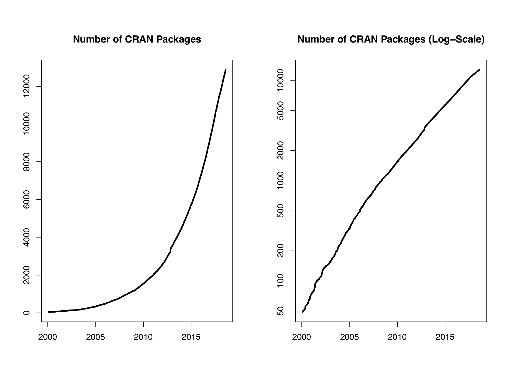

::: article
\

In the past 7 months, 1178 new packages were added to the CRAN package
repository. 18 packages were unarchived, 493 archived and none removed.
The following shows the growth of the number of active packages in the
CRAN package repository:

{width="100%" alt="graphic without alt text"}

On 2018-06-30, the number of active packages was around 12582.

## Changes in the CRAN checks

The package check pages now also show issues found by checks with
alternative BLAS/LAPACK implementations (ATLAS, MKL and OpenBLAS),
provided by Brian D. Ripley (see
<https://www.stats.ox.ac.uk/pub/bdr/Rblas/README.txt> for more
information).

## Changes in the CRAN submission pipeline

Package maintainers who submitted packages this year found the automated
submission system has been extended again. Incoming packages are
automatically checked under both Linux and Windows. Based on these
checks, the auto-check service (and in later steps possibly a CRAN team
member) will take one of several actions:

archive

:   reject the package, if the package does not pass the checks cleanly
    and the problem are not likely to be false positives.

inspect

:   triggers a manual inspection of the package, this always happens for
    first time submissions and also for packages that show possible
    problems that are likely to be false positives. In both cases some
    human action is required.

pending

:   if a decision is pending a response from the package maintainer: If
    an additional issue was present in the package that we cannot check
    for in the incoming checks (such as the BLAS issues mentioned in the
    section above), the maintainer is automatically asked whether these
    issues have been fixed. Same is true for change of maintainer (or
    maintainer's mail address) where the old maintainer (old address) is
    automatically asked to confirm the maintainer change. The answers
    have to be processed manually.

pretest

:   during a manual inspection, a human may trigger a new auto-check of
    the package for various reasons, e.g., after problems in the initial
    check or after updates of dependencies.

publish

:   publish the package, if the package is already well established on
    CRAN, passes the checks cleanly, and does not have any reverse
    dependencies.

recheck

:   if the package cleanly passes the checks and has at least one
    reverse dependency, this action moves the package into a queue for
    auto-checking the package's reverse dependencies. If the check
    status of at least one of the package's reverse dependencies changes
    to a worse state, the maintainer is asked whether this is expected
    and the other maintainers of affected packages have been informed
    and hence action *pending* is triggered. If no change to a worse
    state is discovered, the next action is *publish*.

All these actions include an informative e-mail message to the package
maintainer. The package is also moved to a corresponding subdirectory of
the incoming directory on CRAN. Once an action is *inspect* or
*pending*, a CRAN team member will trigger the next action. The
additional directory *pretest* is the one that contains the yet
unprocessed packages.

During June 2018, CRAN received 2122 package submissions. For these,
3571 actions took place of which 2433 (68.1%) were auto processed
actions and 1138 (31.9%) manual actions.

Minus some special cases, a summary of the auto-processed and manually
triggered actions follows:

::: center
  --------------------------------------------------------------------
  action     archive   inspect   pending   pretest   publish   recheck
  -------- --------- --------- --------- --------- --------- ---------
  auto           530       890       118         0       664       231

  manual         412        36        81        50       449       110
  --------------------------------------------------------------------

  : 
:::

These include the final decisions for the submissions which were as
follows:

::: center
  ------------------------------------
  action         archive       publish
  -------- ------------- -------------
  auto       470 (23.6%)   578 (29.0%)

  manual     410 (20.6%)   535 (26.8%)
  ------------------------------------

  : 
:::

where we only count those as *auto* processed whose publication happened
automatically in all steps.

The large number of 1467 manual action items (not counting additional
mail communication) shows that even more automation is needed and will
follow.

As the CRAN team is no longer able to respond to individual help
requests or being involved in lengthy discussions for exceptions, please
really use the corresponding mailing lists such as R-package-devel (see
<https://www.r-project.org/mail.html>).

## Changes in the CRAN Repository Policy

The [Policy](https://CRAN.R-project.org/web/packages/policies.html) now
says the following:

-   CRAN hosts packages in publication quality and is not a development
    platform. A package's contribution has to be non-trivial.

-   Packages should not write in the user's home filespace (including
    clipboards), nor anywhere else on the file system apart from the R
    session's temporary directory (or during installation in the
    location pointed to by `TMPDIR`: and such usage should be cleaned
    up). Installing into the system's R installation (e.g., scripts to
    its `bin` directory) is not allowed.

-   Packages should not attempt to disable compiler diagnostics.

-   Uploads must be source tarballs created by `R CMD build` and
    following the `PACKAGE``_``VERSION``.tar.gz` naming scheme. *This
    should be done with current R-patched or the current release of R.*

-   For packages which have recently been archived, a snapshot of the
    CRAN results page at the time of archival may be available under
    <https://cran-archive.r-project.org/web/checks/>. (Note that only a
    few of the links from the snapshot will work: normally those to
    listed 'Alternative issues' will.)

## CRAN package repository archive

As of 2018-07, a full CRAN mirror takes about 176 G, which is quite a
lot, in particular taking into account that a considerable part is not
needed for current versions of R and contributed packages. CRAN mirrors
already only provide Mac and Windows binaries for R versions not older
than 5 years (currently, from R 3.0 onwards), with disk usages of 65 G
(about 39%) and 46 G (about 26%), respectively, for Mac and Windows.
Older versions are available from the CRAN archive service available at
<https://CRAN-archive.R-project.org> (but not the CRAN mirrors). For the
CRAN package repository, sources currently use 52 G, with 44 G used for
archived (non-current) versions. Given that the source archive area
takes up about 25% of the whole CRAN mirror area, with material most
likely needed only very occasionally, we will thus move the source
archive area to the CRAN archive server during 2018-08. Archived source
packages can then be obtained directly via
<https://CRAN-archive.R-project.org/src/contrib/Archive>, and of course
via the "Old sources" download links on the package web pages on every
CRAN mirror.

## CRAN mirror security

Currently, there are 100 official CRAN mirrors, 66 of which provide both
secure downloads via `https` *and* use secure mirroring from the CRAN
master (via rsync through ssh tunnels). Since the R 3.4.0 release,
`chooseCRANmirror()` offers these mirrors in preference to the others
which are not fully secured (yet).

## New packages in CRAN task views

[*Bayesian*](https://CRAN.R-project.org/view=Bayesian)

:   [***openEBGM***](https://CRAN.R-project.org/package=openEBGM),
    [***tRophicPosition***](https://CRAN.R-project.org/package=tRophicPosition).

[*ClinicalTrials*](https://CRAN.R-project.org/view=ClinicalTrials)

:   [***InformativeCensoring***](https://CRAN.R-project.org/package=InformativeCensoring),
    [***Mediana***](https://CRAN.R-project.org/package=Mediana),
    [***ThreeArmedTrials***](https://CRAN.R-project.org/package=ThreeArmedTrials),
    [***clusterPower***](https://CRAN.R-project.org/package=clusterPower),
    [***crmPack***](https://CRAN.R-project.org/package=crmPack),
    [***dfped***](https://CRAN.R-project.org/package=dfped),
    [***dfpk***](https://CRAN.R-project.org/package=dfpk),
    [***ewoc***](https://CRAN.R-project.org/package=ewoc),
    [***gsbDesign***](https://CRAN.R-project.org/package=gsbDesign).

[*DifferentialEquations*](https://CRAN.R-project.org/view=DifferentialEquations)

:   [***QPot***](https://CRAN.R-project.org/package=QPot),
    [***cOde***](https://CRAN.R-project.org/package=cOde),
    [***dMod***](https://CRAN.R-project.org/package=dMod),
    [***phaseR***](https://CRAN.R-project.org/package=phaseR),
    [***rODE***](https://CRAN.R-project.org/package=rODE),
    [***rodeo***](https://CRAN.R-project.org/package=rodeo),
    [***rpgm***](https://CRAN.R-project.org/package=rpgm).

[*Distributions*](https://CRAN.R-project.org/view=Distributions)

:   [***MittagLeffleR***](https://CRAN.R-project.org/package=MittagLeffleR),
    [***coga***](https://CRAN.R-project.org/package=coga),
    [***hyper2***](https://CRAN.R-project.org/package=hyper2).

[*Econometrics*](https://CRAN.R-project.org/view=Econometrics)

:   [***OrthoPanels***](https://CRAN.R-project.org/package=OrthoPanels),
    [***dlsem***](https://CRAN.R-project.org/package=dlsem),
    [***pder***](https://CRAN.R-project.org/package=pder),
    [***wooldridge***](https://CRAN.R-project.org/package=wooldridge),
    [***zTree***](https://CRAN.R-project.org/package=zTree).

[*ExperimentalDesign*](https://CRAN.R-project.org/view=ExperimentalDesign)

:   [***DoE.MIParray***](https://CRAN.R-project.org/package=DoE.MIParray),
    [***FMC***](https://CRAN.R-project.org/package=FMC),
    [***MBHdesign***](https://CRAN.R-project.org/package=MBHdesign),
    [***PBIBD***](https://CRAN.R-project.org/package=PBIBD),
    [***bioOED***](https://CRAN.R-project.org/package=bioOED),
    [***edesign***](https://CRAN.R-project.org/package=edesign),
    [***idefix***](https://CRAN.R-project.org/package=idefix),
    [***minimalRSD***](https://CRAN.R-project.org/package=minimalRSD),
    [***odr***](https://CRAN.R-project.org/package=odr),
    [***optbdmaeAT***](https://CRAN.R-project.org/package=optbdmaeAT),
    [***optrcdmaeAT***](https://CRAN.R-project.org/package=optrcdmaeAT),
    [***rsurface***](https://CRAN.R-project.org/package=rsurface),
    [***sFFLHD***](https://CRAN.R-project.org/package=sFFLHD),
    [***skpr***](https://CRAN.R-project.org/package=skpr)$^*$,
    [***soptdmaeA***](https://CRAN.R-project.org/package=soptdmaeA),
    [***unrepx***](https://CRAN.R-project.org/package=unrepx).

[*ExtremeValue*](https://CRAN.R-project.org/view=ExtremeValue)

:   [***POT***](https://CRAN.R-project.org/package=POT).

[*FunctionalData*](https://CRAN.R-project.org/view=FunctionalData)

:   [***covsep***](https://CRAN.R-project.org/package=covsep),
    [***denseFLMM***](https://CRAN.R-project.org/package=denseFLMM),
    [***freqdom.fda***](https://CRAN.R-project.org/package=freqdom.fda),
    [***ftsspec***](https://CRAN.R-project.org/package=ftsspec).

[*HighPerformanceComputing*](https://CRAN.R-project.org/view=HighPerformanceComputing)

:   [***Sim.DiffProc***](https://CRAN.R-project.org/package=Sim.DiffProc),
    [***drake***](https://CRAN.R-project.org/package=drake),
    [***parSim***](https://CRAN.R-project.org/package=parSim).

[*MachineLearning*](https://CRAN.R-project.org/view=MachineLearning)

:   [***ICEbox***](https://CRAN.R-project.org/package=ICEbox),
    [***effects***](https://CRAN.R-project.org/package=effects),
    [***ggRandomForests***](https://CRAN.R-project.org/package=ggRandomForests),
    [***pdp***](https://CRAN.R-project.org/package=pdp),
    [***plotmo***](https://CRAN.R-project.org/package=plotmo),
    [***tensorflow***](https://CRAN.R-project.org/package=tensorflow).

[*MetaAnalysis*](https://CRAN.R-project.org/view=MetaAnalysis)

:   [***CIAAWconsensus***](https://CRAN.R-project.org/package=CIAAWconsensus),
    [***ConfoundedMeta***](https://CRAN.R-project.org/package=ConfoundedMeta),
    [***MetaSubtract***](https://CRAN.R-project.org/package=MetaSubtract),
    [***RandMeta***](https://CRAN.R-project.org/package=RandMeta),
    [***TFisher***](https://CRAN.R-project.org/package=TFisher),
    [***clubSandwich***](https://CRAN.R-project.org/package=clubSandwich),
    [***effsize***](https://CRAN.R-project.org/package=effsize),
    [***forestmodel***](https://CRAN.R-project.org/package=forestmodel),
    [***getmstatistic***](https://CRAN.R-project.org/package=getmstatistic),
    [***metaBMA***](https://CRAN.R-project.org/package=metaBMA),
    [***metacart***](https://CRAN.R-project.org/package=metacart),
    [***metaforest***](https://CRAN.R-project.org/package=metaforest),
    [***nmaINLA***](https://CRAN.R-project.org/package=nmaINLA),
    [***psychmeta***](https://CRAN.R-project.org/package=psychmeta),
    [***ratesci***](https://CRAN.R-project.org/package=ratesci),
    [***rma.exact***](https://CRAN.R-project.org/package=rma.exact).

[*NaturalLanguageProcessing*](https://CRAN.R-project.org/view=NaturalLanguageProcessing)

:   [***alineR***](https://CRAN.R-project.org/package=alineR),
    [***ore***](https://CRAN.R-project.org/package=ore),
    [***rel***](https://CRAN.R-project.org/package=rel),
    [***stm***](https://CRAN.R-project.org/package=stm),
    [***stringdist***](https://CRAN.R-project.org/package=stringdist).

[*NumericalMathematics*](https://CRAN.R-project.org/view=NumericalMathematics)

:   [***PythonInR***](https://CRAN.R-project.org/package=PythonInR),
    [***SnakeCharmR***](https://CRAN.R-project.org/package=SnakeCharmR),
    [***XR***](https://CRAN.R-project.org/package=XR),
    [***XRJulia***](https://CRAN.R-project.org/package=XRJulia),
    [***XRPython***](https://CRAN.R-project.org/package=XRPython),
    [***expint***](https://CRAN.R-project.org/package=expint),
    [***feather***](https://CRAN.R-project.org/package=feather),
    [***findpython***](https://CRAN.R-project.org/package=findpython),
    [***fourierin***](https://CRAN.R-project.org/package=fourierin),
    [***interp***](https://CRAN.R-project.org/package=interp),
    [***logOfGamma***](https://CRAN.R-project.org/package=logOfGamma),
    [***reticulate***](https://CRAN.R-project.org/package=reticulate),
    [***tripack***](https://CRAN.R-project.org/package=tripack).

[*Optimization*](https://CRAN.R-project.org/view=Optimization)

:   [***ABCoptim***](https://CRAN.R-project.org/package=ABCoptim),
    [***CVXR***](https://CRAN.R-project.org/package=CVXR),
    [***ManifoldOptim***](https://CRAN.R-project.org/package=ManifoldOptim),
    [***Rtnmin***](https://CRAN.R-project.org/package=Rtnmin),
    [***SACOBRA***](https://CRAN.R-project.org/package=SACOBRA),
    [***colf***](https://CRAN.R-project.org/package=colf),
    [***coneproj***](https://CRAN.R-project.org/package=coneproj),
    [***ecr***](https://CRAN.R-project.org/package=ecr),
    [***flacco***](https://CRAN.R-project.org/package=flacco),
    [***metaheuristicOpt***](https://CRAN.R-project.org/package=metaheuristicOpt),
    [***mize***](https://CRAN.R-project.org/package=mize),
    [***n1qn1***](https://CRAN.R-project.org/package=n1qn1),
    [***ompr***](https://CRAN.R-project.org/package=ompr),
    [***optimr***](https://CRAN.R-project.org/package=optimr),
    [***optimsimplex***](https://CRAN.R-project.org/package=optimsimplex),
    [***quadprogXT***](https://CRAN.R-project.org/package=quadprogXT),
    [***sdpt3r***](https://CRAN.R-project.org/package=sdpt3r).

[*Pharmacokinetics*](https://CRAN.R-project.org/view=Pharmacokinetics)

:   [***RxODE***](https://CRAN.R-project.org/package=RxODE).

[*Phylogenetics*](https://CRAN.R-project.org/view=Phylogenetics)

:   [***treeplyr***](https://CRAN.R-project.org/package=treeplyr).

[*Psychometrics*](https://CRAN.R-project.org/view=Psychometrics)

:   [***CTTShiny***](https://CRAN.R-project.org/package=CTTShiny),
    [***EFAutilities***](https://CRAN.R-project.org/package=EFAutilities),
    [***MIIVsem***](https://CRAN.R-project.org/package=MIIVsem),
    [***PLmixed***](https://CRAN.R-project.org/package=PLmixed),
    [***dexter***](https://CRAN.R-project.org/package=dexter),
    [***umx***](https://CRAN.R-project.org/package=umx).

[*Spatial*](https://CRAN.R-project.org/view=Spatial)

:   [***spm***](https://CRAN.R-project.org/package=spm),
    [***spsann***](https://CRAN.R-project.org/package=spsann).

[*SpatioTemporal*](https://CRAN.R-project.org/view=SpatioTemporal)

:   [***FLightR***](https://CRAN.R-project.org/package=FLightR),
    [***sf***](https://CRAN.R-project.org/package=sf),
    [***sigloc***](https://CRAN.R-project.org/package=sigloc).

[*TimeSeries*](https://CRAN.R-project.org/view=TimeSeries)

:   [***dLagM***](https://CRAN.R-project.org/package=dLagM),
    [***fpp2***](https://CRAN.R-project.org/package=fpp2),
    [***freqdom***](https://CRAN.R-project.org/package=freqdom),
    [***freqdom.fda***](https://CRAN.R-project.org/package=freqdom.fda),
    [***ftsa***](https://CRAN.R-project.org/package=ftsa),
    [***funtimes***](https://CRAN.R-project.org/package=funtimes),
    [***influxdbr***](https://CRAN.R-project.org/package=influxdbr),
    [***odpc***](https://CRAN.R-project.org/package=odpc),
    [***sweep***](https://CRAN.R-project.org/package=sweep),
    [***timetk***](https://CRAN.R-project.org/package=timetk),
    [***tscount***](https://CRAN.R-project.org/package=tscount),
    [***wktmo***](https://CRAN.R-project.org/package=wktmo).

[*WebTechnologies*](https://CRAN.R-project.org/view=WebTechnologies)

:   [***gtrendsR***](https://CRAN.R-project.org/package=gtrendsR).
:::
