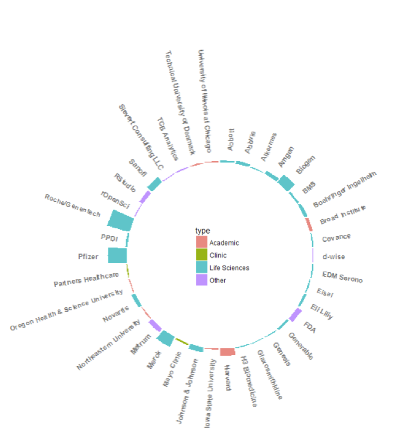

::: article
The R / Pharma conference began as grass-roots initiative led by data
scientists working in the pharmaceutical industry to promote the use of
R in Pharma, and to establish and share best practices. The founding
members organized the project as an R Consortium working group, and
undertook the ambitious task of launching an annual conference
envisioned as a relatively small, collegial, industry-oriented event
with a strong scientific program.

## Inaugural Conference

The inaugural conference, R / Pharma 2018 (<https://bit.ly/2RVKKI8>)
held on August 16th and 17th at Harvard University attracted a
representatives from academia, government, and industry.

{#fig:R-Pharma
width="100%" alt="graphic without alt text"}

Keynotes (<https://bit.ly/2SdvMNd>) were presented by Lilliam Rosario of
the FDA's Center for Drug Evaluation and Research, Michael Lawrence
Genentech/Roche and the R Core Group, and Max Kuhn and Joe Cheng from
RStudio.

Over forty-five talks and workshops were delivered with topics ranging
from reproducible research, regulatory constraints and considerations,
and package administration to scaling R for production. A considerable
number of talks emphasized the development of production-grade Shiny
applications. Although considerably larger than most of the Shiny
applications developed, Roche's 500,000 line application, which was
presented at the conference and subsequently written up in a post
(<https://bit.ly/2NeXKFJ>), reflects a common use case. Abstracts for
the talks are available (<https://bit.ly/2CUTEeG>).

### Organizing Committee

Melvin Munsaka - AbbVie; Bella Fang and Min Lee - Amgen; Eric Nantz -
Eli Lilly; Elena Rantou and Paul Schuette - FDA; Elizabeth Hess -
Harvard; James Black, Reinhold Koch, and Michael Lawrence - Genentech /
Roche; Edward Louzier - Merck; Michael Blanks - PPD; Phil Bowsher -
RStudio; and Harvey Lieberman - Sanofi.

### Program Committee

Co-chairs for the program committee were Bella Feng - Amgen, John Sims -
Pfizer, and Ryan Benz - SocalBioinformatics.

Program committee leads included: Melvin Munsaka - AbbVie; Robert
Engle - Biogen; Elena Rantou and Paul Schuette - FDA; Elizabeth Hess -
Harvard University; James Black and Reinhold Koch - Genentech/Roche;
Paulo Bargo - Johnson & Johnson; Eric Nantz - Eli Lilly; Edward
Lauzier - Merck; Xiao Ni- Novartis; Thomas Tensfeldt - Pfizer; and
Harvey Lieberman - Sanofi.

## R / Pharma 2019

R / Pharma 2019 will be held on August 21, 22, and 23, 2019 at Harvard
University. In a response to attendee feedback, a third day is being
planned for workshops. Please watch the conference website for more
information as it becomes available.

R / Pharma 2019 conference website: <http://rinpharma.com/>

Twitter: [#rinpharma](#rinpharma){.uri}
:::
