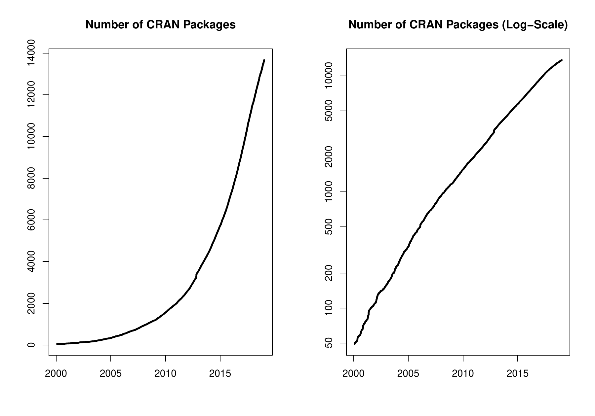

::: article
In the past 6 months, 1029 new packages were added to the CRAN package
repository. 68 packages were unarchived, 122 archived, and one removed.
The following shows the growth of the number of active packages in the
CRAN package repository:

{width="100%" alt="graphic without alt text"}

On 2018-12-31, the number of active packages was around 13592.

## Changes in the CRAN Repository Policy

The [Policy](https://CRAN.R-project.org/web/packages/policies.html) now
says the following:

-   Packages which use Internet resources should fail gracefully with an
    informative message if the resource is not available (and not give a
    check warning nor error).

## CRAN package submissions

During the last 6 months (July to December 2018), CRAN received 10259
package submissions. For these, 16830 actions took place of which 11618
(69%) were auto processed actions and 5212 (31%) manual actions.

Minus some special cases, a summary of the auto-processed and manually
triggered actions follows:

  --------------------------------------------------------------------
  action     archive   inspect   pending   pretest   publish   recheck
  -------- --------- --------- --------- --------- --------- ---------
  auto          2731      4341       460         0      3148       938

  manual        1902        70       286       145      2262       547
  --------------------------------------------------------------------

  : 

These include the final decisions for the submissions which were

  --------------------------------------
  action          archive        publish
  -------- -------------- --------------
  auto       2562 (26.1%)   2779 (28.3%)

  manual     1861 (18.9%)   2620 (26.7%)
  --------------------------------------

  : 

where we only count those as *auto* processed whose publication happened
automatically in all steps.

## CRAN mirror security

Currently, there are 100 official CRAN mirrors, 68 of which provide both
secure downloads via `https` *and* use secure mirroring from the CRAN
master (via rsync through ssh tunnels). Since the R 3.4.0 release,
`chooseCRANmirror()` offers these mirrors in preference to the others
which are not fully secured (yet).

## New CRAN task views

[*Databases*](https://CRAN.R-project.org/view=Databases)

:   Topic: Databases with R. Maintainer: Yuan Tang. Packages:
    [*DBI*](https://CRAN.R-project.org/package=DBI)$^*$,
    [*DBItest*](https://CRAN.R-project.org/package=DBItest),
    [*MonetDBLite*](https://CRAN.R-project.org/package=MonetDBLite),
    [*R4CouchDB*](https://CRAN.R-project.org/package=R4CouchDB),
    [*RCassandra*](https://CRAN.R-project.org/package=RCassandra),
    [*RGreenplum*](https://CRAN.R-project.org/package=RGreenplum),
    [*RH2*](https://CRAN.R-project.org/package=RH2),
    [*RJDBC*](https://CRAN.R-project.org/package=RJDBC),
    [*RMariaDB*](https://CRAN.R-project.org/package=RMariaDB),
    [*RMySQL*](https://CRAN.R-project.org/package=RMySQL),
    [*ROracle*](https://CRAN.R-project.org/package=ROracle),
    [*RPostgreSQL*](https://CRAN.R-project.org/package=RPostgreSQL),
    [*RPostgres*](https://CRAN.R-project.org/package=RPostgres),
    [*RPresto*](https://CRAN.R-project.org/package=RPresto),
    [*RSQLite*](https://CRAN.R-project.org/package=RSQLite),
    [*RcppRedis*](https://CRAN.R-project.org/package=RcppRedis),
    [*TScompare*](https://CRAN.R-project.org/package=TScompare),
    [*bigrquery*](https://CRAN.R-project.org/package=bigrquery),
    [*dbfaker*](https://CRAN.R-project.org/package=dbfaker),
    [*dbplyr*](https://CRAN.R-project.org/package=dbplyr),
    [*dplyr*](https://CRAN.R-project.org/package=dplyr),
    [*dplyr.teradata*](https://CRAN.R-project.org/package=dplyr.teradata),
    [*elastic*](https://CRAN.R-project.org/package=elastic),
    [*filehashSQLite*](https://CRAN.R-project.org/package=filehashSQLite),
    [*implyr*](https://CRAN.R-project.org/package=implyr),
    [*influxdbr*](https://CRAN.R-project.org/package=influxdbr),
    [*liteq*](https://CRAN.R-project.org/package=liteq),
    [*mongolite*](https://CRAN.R-project.org/package=mongolite),
    [*odbc*](https://CRAN.R-project.org/package=odbc)$^*$,
    [*pivot*](https://CRAN.R-project.org/package=pivot),
    [*pointblank*](https://CRAN.R-project.org/package=pointblank),
    [*pool*](https://CRAN.R-project.org/package=pool),
    [*redux*](https://CRAN.R-project.org/package=redux),
    [*rpostgis*](https://CRAN.R-project.org/package=rpostgis),
    [*sqldf*](https://CRAN.R-project.org/package=sqldf),
    [*tidyr*](https://CRAN.R-project.org/package=tidyr),
    [*uptasticsearch*](https://CRAN.R-project.org/package=uptasticsearch).

[*MissingData*](https://CRAN.R-project.org/view=MissingData)

:   Topic: Missing Data. Maintainer: Julie Josse, Nicholas Tierney and
    Nathalie Vialaneix (r-miss-tastic team). Packages:
    [*Amelia*](https://CRAN.R-project.org/package=Amelia)$^*$,
    [*BaBooN*](https://CRAN.R-project.org/package=BaBooN),
    [*BaylorEdPsych*](https://CRAN.R-project.org/package=BaylorEdPsych),
    [*CALIBERrfimpute*](https://CRAN.R-project.org/package=CALIBERrfimpute),
    [*CMF*](https://CRAN.R-project.org/package=CMF),
    [*CRTgeeDR*](https://CRAN.R-project.org/package=CRTgeeDR),
    [*CVThresh*](https://CRAN.R-project.org/package=CVThresh),
    [*CoImp*](https://CRAN.R-project.org/package=CoImp),
    [*DMwR*](https://CRAN.R-project.org/package=DMwR),
    [*DTWBI*](https://CRAN.R-project.org/package=DTWBI),
    [*DTWUMI*](https://CRAN.R-project.org/package=DTWUMI),
    [*DescTools*](https://CRAN.R-project.org/package=DescTools),
    [*DiffusionRimp*](https://CRAN.R-project.org/package=DiffusionRimp),
    [*DrImpute*](https://CRAN.R-project.org/package=DrImpute),
    [*FHDI*](https://CRAN.R-project.org/package=FHDI),
    [*FamEvent*](https://CRAN.R-project.org/package=FamEvent),
    [*FastImputation*](https://CRAN.R-project.org/package=FastImputation),
    [*ForImp*](https://CRAN.R-project.org/package=ForImp),
    [*GSE*](https://CRAN.R-project.org/package=GSE),
    [*GenForImp*](https://CRAN.R-project.org/package=GenForImp),
    [*Haplin*](https://CRAN.R-project.org/package=Haplin),
    [*HardyWeinberg*](https://CRAN.R-project.org/package=HardyWeinberg),
    [*Hmisc*](https://CRAN.R-project.org/package=Hmisc),
    [*HotDeckImputation*](https://CRAN.R-project.org/package=HotDeckImputation),
    [*JointAI*](https://CRAN.R-project.org/package=JointAI),
    [*MissMech*](https://CRAN.R-project.org/package=MissMech),
    [*MixedDataImpute*](https://CRAN.R-project.org/package=MixedDataImpute),
    [*NNLM*](https://CRAN.R-project.org/package=NNLM),
    [*NPBayesImputeCat*](https://CRAN.R-project.org/package=NPBayesImputeCat),
    [*OpenMx*](https://CRAN.R-project.org/package=OpenMx),
    [*PSIMEX*](https://CRAN.R-project.org/package=PSIMEX),
    [*PSM*](https://CRAN.R-project.org/package=PSM),
    [*PST*](https://CRAN.R-project.org/package=PST),
    [*QTLRel*](https://CRAN.R-project.org/package=QTLRel),
    [*Qtools*](https://CRAN.R-project.org/package=Qtools),
    [*RNAseqNet*](https://CRAN.R-project.org/package=RNAseqNet),
    [*ROptSpace*](https://CRAN.R-project.org/package=ROptSpace),
    [*Rmagic*](https://CRAN.R-project.org/package=Rmagic),
    [*Rphylopars*](https://CRAN.R-project.org/package=Rphylopars),
    [*SNPassoc*](https://CRAN.R-project.org/package=SNPassoc),
    [*StAMPP*](https://CRAN.R-project.org/package=StAMPP),
    [*StatMatch*](https://CRAN.R-project.org/package=StatMatch),
    [*StratifiedRF*](https://CRAN.R-project.org/package=StratifiedRF),
    [*TAM*](https://CRAN.R-project.org/package=TAM),
    [*TAR*](https://CRAN.R-project.org/package=TAR),
    [*TVsMiss*](https://CRAN.R-project.org/package=TVsMiss),
    [*TestDataImputation*](https://CRAN.R-project.org/package=TestDataImputation),
    [*TippingPoint*](https://CRAN.R-project.org/package=TippingPoint),
    [*TreePar*](https://CRAN.R-project.org/package=TreePar),
    [*TreeSim*](https://CRAN.R-project.org/package=TreeSim),
    [*VIM*](https://CRAN.R-project.org/package=VIM)$^*$,
    [*VIMGUI*](https://CRAN.R-project.org/package=VIMGUI),
    [*VarSelLCM*](https://CRAN.R-project.org/package=VarSelLCM),
    [*WaverR*](https://CRAN.R-project.org/package=WaverR),
    [*accelmissing*](https://CRAN.R-project.org/package=accelmissing),
    [*ade4*](https://CRAN.R-project.org/package=ade4),
    [*alleHap*](https://CRAN.R-project.org/package=alleHap),
    [*brlrmr*](https://CRAN.R-project.org/package=brlrmr),
    [*cat*](https://CRAN.R-project.org/package=cat),
    [*cdparcoord*](https://CRAN.R-project.org/package=cdparcoord),
    [*cobalt*](https://CRAN.R-project.org/package=cobalt),
    [*cutoffR*](https://CRAN.R-project.org/package=cutoffR),
    [*dejaVu*](https://CRAN.R-project.org/package=dejaVu),
    [*denoiseR*](https://CRAN.R-project.org/package=denoiseR),
    [*dils*](https://CRAN.R-project.org/package=dils),
    [*dlookr*](https://CRAN.R-project.org/package=dlookr),
    [*eigenmodel*](https://CRAN.R-project.org/package=eigenmodel),
    [*experiment*](https://CRAN.R-project.org/package=experiment),
    [*extracat*](https://CRAN.R-project.org/package=extracat),
    [*fastLink*](https://CRAN.R-project.org/package=fastLink),
    [*filling*](https://CRAN.R-project.org/package=filling),
    [*forecast*](https://CRAN.R-project.org/package=forecast),
    [*gapfill*](https://CRAN.R-project.org/package=gapfill),
    [*gsynth*](https://CRAN.R-project.org/package=gsynth),
    [*hmi*](https://CRAN.R-project.org/package=hmi),
    [*hot.deck*](https://CRAN.R-project.org/package=hot.deck)$^*$,
    [*icdGLM*](https://CRAN.R-project.org/package=icdGLM),
    [*icenReg*](https://CRAN.R-project.org/package=icenReg),
    [*idealstan*](https://CRAN.R-project.org/package=idealstan),
    [*idem*](https://CRAN.R-project.org/package=idem),
    [*imputePSF*](https://CRAN.R-project.org/package=imputePSF),
    [*imputeTS*](https://CRAN.R-project.org/package=imputeTS)$^*$,
    [*imputeTestbench*](https://CRAN.R-project.org/package=imputeTestbench),
    [*ipw*](https://CRAN.R-project.org/package=ipw),
    [*jomo*](https://CRAN.R-project.org/package=jomo)$^*$,
    [*lavaan*](https://CRAN.R-project.org/package=lavaan),
    [*ltm*](https://CRAN.R-project.org/package=ltm),
    [*mdmb*](https://CRAN.R-project.org/package=mdmb),
    [*memisc*](https://CRAN.R-project.org/package=memisc),
    [*mi*](https://CRAN.R-project.org/package=mi),
    [*mice*](https://CRAN.R-project.org/package=mice)$^*$,
    [*miceFast*](https://CRAN.R-project.org/package=miceFast),
    [*miceMNAR*](https://CRAN.R-project.org/package=miceMNAR),
    [*miceadds*](https://CRAN.R-project.org/package=miceadds),
    [*micemd*](https://CRAN.R-project.org/package=micemd),
    [*mirt*](https://CRAN.R-project.org/package=mirt),
    [*missForest*](https://CRAN.R-project.org/package=missForest),
    [*missMDA*](https://CRAN.R-project.org/package=missMDA)$^*$,
    [*mitml*](https://CRAN.R-project.org/package=mitml),
    [*mitools*](https://CRAN.R-project.org/package=mitools),
    [*mix*](https://CRAN.R-project.org/package=mix),
    [*naniar*](https://CRAN.R-project.org/package=naniar)$^*$,
    [*nipals*](https://CRAN.R-project.org/package=nipals),
    [*norm*](https://CRAN.R-project.org/package=norm),
    [*padr*](https://CRAN.R-project.org/package=padr),
    [*pan*](https://CRAN.R-project.org/package=pan),
    [*phylin*](https://CRAN.R-project.org/package=phylin),
    [*plsRglm*](https://CRAN.R-project.org/package=plsRglm),
    [*powerlmm*](https://CRAN.R-project.org/package=powerlmm),
    [*prefmod*](https://CRAN.R-project.org/package=prefmod),
    [*prophet*](https://CRAN.R-project.org/package=prophet),
    [*pseval*](https://CRAN.R-project.org/package=pseval),
    [*randomForest*](https://CRAN.R-project.org/package=randomForest),
    [*reddPrec*](https://CRAN.R-project.org/package=reddPrec),
    [*robCompositions*](https://CRAN.R-project.org/package=robCompositions),
    [*robustrao*](https://CRAN.R-project.org/package=robustrao),
    [*rsem*](https://CRAN.R-project.org/package=rsem),
    [*rtop*](https://CRAN.R-project.org/package=rtop),
    [*samon*](https://CRAN.R-project.org/package=samon),
    [*sbart*](https://CRAN.R-project.org/package=sbart),
    [*sbgcop*](https://CRAN.R-project.org/package=sbgcop),
    [*scorecardModelUtils*](https://CRAN.R-project.org/package=scorecardModelUtils),
    [*simputation*](https://CRAN.R-project.org/package=simputation),
    [*sjlabelled*](https://CRAN.R-project.org/package=sjlabelled),
    [*sjmisc*](https://CRAN.R-project.org/package=sjmisc),
    [*smcfcs*](https://CRAN.R-project.org/package=smcfcs),
    [*softImpute*](https://CRAN.R-project.org/package=softImpute)$^*$,
    [*spacetime*](https://CRAN.R-project.org/package=spacetime),
    [*sptemExp*](https://CRAN.R-project.org/package=sptemExp),
    [*stlplus*](https://CRAN.R-project.org/package=stlplus),
    [*swgee*](https://CRAN.R-project.org/package=swgee),
    [*tabplot*](https://CRAN.R-project.org/package=tabplot),
    [*tidyimpute*](https://CRAN.R-project.org/package=tidyimpute),
    [*timeSeries*](https://CRAN.R-project.org/package=timeSeries),
    [*tsibble*](https://CRAN.R-project.org/package=tsibble),
    [*wNNSel*](https://CRAN.R-project.org/package=wNNSel),
    [*wrangle*](https://CRAN.R-project.org/package=wrangle),
    [*xts*](https://CRAN.R-project.org/package=xts),
    [*yaImpute*](https://CRAN.R-project.org/package=yaImpute)$^*$,
    [*zCompositions*](https://CRAN.R-project.org/package=zCompositions),
    [*zoo*](https://CRAN.R-project.org/package=zoo).

(\* = core package)

## New packages in CRAN task views

[*ChemPhys*](https://CRAN.R-project.org/view=ChemPhys)

:   [*ATmet*](https://CRAN.R-project.org/package=ATmet),
    [*MALDIrppa*](https://CRAN.R-project.org/package=MALDIrppa),
    [*NISTunits*](https://CRAN.R-project.org/package=NISTunits),
    [*constants*](https://CRAN.R-project.org/package=constants),
    [*errors*](https://CRAN.R-project.org/package=errors),
    [*fingerprint*](https://CRAN.R-project.org/package=fingerprint),
    [*measurements*](https://CRAN.R-project.org/package=measurements),
    [*metRology*](https://CRAN.R-project.org/package=metRology),
    [*spectralAnalysis*](https://CRAN.R-project.org/package=spectralAnalysis),
    [*units*](https://CRAN.R-project.org/package=units).

[*Cluster*](https://CRAN.R-project.org/view=Cluster)

:   [*MixAll*](https://CRAN.R-project.org/package=MixAll).

[*DifferentialEquations*](https://CRAN.R-project.org/view=DifferentialEquations)

:   [*diffeqr*](https://CRAN.R-project.org/package=diffeqr),
    [*sundialr*](https://CRAN.R-project.org/package=sundialr).

[*Distributions*](https://CRAN.R-project.org/view=Distributions)

:   [*Wrapped*](https://CRAN.R-project.org/package=Wrapped),
    [*bivariate*](https://CRAN.R-project.org/package=bivariate),
    [*pgdraw*](https://CRAN.R-project.org/package=pgdraw).

[*Econometrics*](https://CRAN.R-project.org/view=Econometrics)

:   [*bife*](https://CRAN.R-project.org/package=bife),
    [*nse*](https://CRAN.R-project.org/package=nse).

[*Finance*](https://CRAN.R-project.org/view=Finance)

:   [*PeerPerformance*](https://CRAN.R-project.org/package=PeerPerformance),
    [*crseEventStudy*](https://CRAN.R-project.org/package=crseEventStudy),
    [*riskParityPortfolio*](https://CRAN.R-project.org/package=riskParityPortfolio).

[*HighPerformanceComputing*](https://CRAN.R-project.org/view=HighPerformanceComputing)

:   [*bigstatsr*](https://CRAN.R-project.org/package=bigstatsr),
    [*qsub*](https://CRAN.R-project.org/package=qsub).

[*MetaAnalysis*](https://CRAN.R-project.org/view=MetaAnalysis)

:   [*MetaStan*](https://CRAN.R-project.org/package=MetaStan),
    [*MetaSubtract*](https://CRAN.R-project.org/package=MetaSubtract),
    [*dfmeta*](https://CRAN.R-project.org/package=dfmeta),
    [*metamedian*](https://CRAN.R-project.org/package=metamedian),
    [*ofGEM*](https://CRAN.R-project.org/package=ofGEM),
    [*puniform*](https://CRAN.R-project.org/package=puniform).

[*NumericalMathematics*](https://CRAN.R-project.org/view=NumericalMathematics)

:   [*chebpol*](https://CRAN.R-project.org/package=chebpol),
    [*freegroup*](https://CRAN.R-project.org/package=freegroup).

[*OfficialStatistics*](https://CRAN.R-project.org/view=OfficialStatistics)

:   [*BayesSAE*](https://CRAN.R-project.org/package=BayesSAE),
    [*RRreg*](https://CRAN.R-project.org/package=RRreg),
    [*SmallCountRounding*](https://CRAN.R-project.org/package=SmallCountRounding),
    [*census*](https://CRAN.R-project.org/package=census),
    [*censusGeography*](https://CRAN.R-project.org/package=censusGeography),
    [*emdi*](https://CRAN.R-project.org/package=emdi),
    [*idbr*](https://CRAN.R-project.org/package=idbr),
    [*ipumsr*](https://CRAN.R-project.org/package=ipumsr),
    [*noncensus*](https://CRAN.R-project.org/package=noncensus),
    [*sae*](https://CRAN.R-project.org/package=sae),
    [*tidycensus*](https://CRAN.R-project.org/package=tidycensus).

[*Optimization*](https://CRAN.R-project.org/view=Optimization)

:   [*caRamel*](https://CRAN.R-project.org/package=caRamel),
    [*lbfgsb3c*](https://CRAN.R-project.org/package=lbfgsb3c),
    [*nilde*](https://CRAN.R-project.org/package=nilde),
    [*osqp*](https://CRAN.R-project.org/package=osqp).

[*Phylogenetics*](https://CRAN.R-project.org/view=Phylogenetics)

:   [*apex*](https://CRAN.R-project.org/package=apex),
    [*aphid*](https://CRAN.R-project.org/package=aphid),
    [*brms*](https://CRAN.R-project.org/package=brms),
    [*brranching*](https://CRAN.R-project.org/package=brranching),
    [*ecospat*](https://CRAN.R-project.org/package=ecospat),
    [*entropart*](https://CRAN.R-project.org/package=entropart),
    [*enveomics.R*](https://CRAN.R-project.org/package=enveomics.R),
    [*hisse*](https://CRAN.R-project.org/package=hisse),
    [*metacoder*](https://CRAN.R-project.org/package=metacoder),
    [*nodiv*](https://CRAN.R-project.org/package=nodiv),
    [*picante*](https://CRAN.R-project.org/package=picante),
    [*warbleR*](https://CRAN.R-project.org/package=warbleR).

[*Psychometrics*](https://CRAN.R-project.org/view=Psychometrics)

:   [*NetworkToolbox*](https://CRAN.R-project.org/package=NetworkToolbox),
    [*TreeBUGS*](https://CRAN.R-project.org/package=TreeBUGS),
    [*cNORM*](https://CRAN.R-project.org/package=cNORM),
    [*equateMultiple*](https://CRAN.R-project.org/package=equateMultiple),
    [*ifaTools*](https://CRAN.R-project.org/package=ifaTools),
    [*mudfold*](https://CRAN.R-project.org/package=mudfold).

[*Spatial*](https://CRAN.R-project.org/view=Spatial)

:   [*RPostgreSQL*](https://CRAN.R-project.org/package=RPostgreSQL),
    [*cartogram*](https://CRAN.R-project.org/package=cartogram),
    [*geogrid*](https://CRAN.R-project.org/package=geogrid),
    [*geometa*](https://CRAN.R-project.org/package=geometa),
    [*geonapi*](https://CRAN.R-project.org/package=geonapi),
    [*geosapi*](https://CRAN.R-project.org/package=geosapi),
    [*inlmisc*](https://CRAN.R-project.org/package=inlmisc),
    [*landscapemetrics*](https://CRAN.R-project.org/package=landscapemetrics),
    [*leaflet*](https://CRAN.R-project.org/package=leaflet),
    [*lwgeom*](https://CRAN.R-project.org/package=lwgeom),
    [*ows4R*](https://CRAN.R-project.org/package=ows4R),
    [*rnaturalearth*](https://CRAN.R-project.org/package=rnaturalearth),
    [*stars*](https://CRAN.R-project.org/package=stars).

[*TimeSeries*](https://CRAN.R-project.org/view=TimeSeries)

:   [*ARCensReg*](https://CRAN.R-project.org/package=ARCensReg),
    [*FKF*](https://CRAN.R-project.org/package=FKF),
    [*GNAR*](https://CRAN.R-project.org/package=GNAR),
    [*NTS*](https://CRAN.R-project.org/package=NTS),
    [*RTransferEntropy*](https://CRAN.R-project.org/package=RTransferEntropy),
    [*TSEntropies*](https://CRAN.R-project.org/package=TSEntropies),
    [*changepoint.mv*](https://CRAN.R-project.org/package=changepoint.mv),
    [*dsa*](https://CRAN.R-project.org/package=dsa),
    [*ggTimeSeries*](https://CRAN.R-project.org/package=ggTimeSeries),
    [*gmvarkit*](https://CRAN.R-project.org/package=gmvarkit),
    [*graphicalVAR*](https://CRAN.R-project.org/package=graphicalVAR),
    [*imputePSF*](https://CRAN.R-project.org/package=imputePSF),
    [*imputeTestbench*](https://CRAN.R-project.org/package=imputeTestbench),
    [*mgm*](https://CRAN.R-project.org/package=mgm),
    [*multDM*](https://CRAN.R-project.org/package=multDM),
    [*rollRegres*](https://CRAN.R-project.org/package=rollRegres),
    [*sugrrants*](https://CRAN.R-project.org/package=sugrrants),
    [*sym.arma*](https://CRAN.R-project.org/package=sym.arma),
    [*tbrf*](https://CRAN.R-project.org/package=tbrf).

[*WebTechnologies*](https://CRAN.R-project.org/view=WebTechnologies)

:   [*HIBPwned*](https://CRAN.R-project.org/package=HIBPwned),
    [*LendingClub*](https://CRAN.R-project.org/package=LendingClub),
    [*OpenML*](https://CRAN.R-project.org/package=OpenML),
    [*RSauceLabs*](https://CRAN.R-project.org/package=RSauceLabs),
    [*RSocrata*](https://CRAN.R-project.org/package=RSocrata),
    [*Rcrawler*](https://CRAN.R-project.org/package=Rcrawler),
    [*WikidataQueryServiceR*](https://CRAN.R-project.org/package=WikidataQueryServiceR),
    [*ZillowR*](https://CRAN.R-project.org/package=ZillowR),
    [*ajv*](https://CRAN.R-project.org/package=ajv),
    [*analogsea*](https://CRAN.R-project.org/package=analogsea),
    [*aws.polly*](https://CRAN.R-project.org/package=aws.polly),
    [*aws.s3*](https://CRAN.R-project.org/package=aws.s3),
    [*aws.sns*](https://CRAN.R-project.org/package=aws.sns),
    [*banR*](https://CRAN.R-project.org/package=banR),
    [*birdnik*](https://CRAN.R-project.org/package=birdnik),
    [*brandwatchR*](https://CRAN.R-project.org/package=brandwatchR),
    [*colourlovers*](https://CRAN.R-project.org/package=colourlovers),
    [*crminer*](https://CRAN.R-project.org/package=crminer),
    [*crplyr*](https://CRAN.R-project.org/package=crplyr),
    [*crul*](https://CRAN.R-project.org/package=crul)$^*$,
    [*crunch*](https://CRAN.R-project.org/package=crunch),
    [*crunchy*](https://CRAN.R-project.org/package=crunchy),
    [*docuSignr*](https://CRAN.R-project.org/package=docuSignr),
    [*duckduckr*](https://CRAN.R-project.org/package=duckduckr),
    [*facebook.S4*](https://CRAN.R-project.org/package=facebook.S4),
    [*fauxpas*](https://CRAN.R-project.org/package=fauxpas),
    [*feedeR*](https://CRAN.R-project.org/package=feedeR),
    [*fulltext*](https://CRAN.R-project.org/package=fulltext),
    [*ganalytics*](https://CRAN.R-project.org/package=ganalytics),
    [*gdns*](https://CRAN.R-project.org/package=gdns),
    [*geonapi*](https://CRAN.R-project.org/package=geonapi),
    [*geosapi*](https://CRAN.R-project.org/package=geosapi),
    [*gh*](https://CRAN.R-project.org/package=gh),
    [*giphyr*](https://CRAN.R-project.org/package=giphyr),
    [*googleComputeEngineR*](https://CRAN.R-project.org/package=googleComputeEngineR),
    [*googleLanguageR*](https://CRAN.R-project.org/package=googleLanguageR),
    [*htm2txt*](https://CRAN.R-project.org/package=htm2txt),
    [*htmltidy*](https://CRAN.R-project.org/package=htmltidy),
    [*htmltools*](https://CRAN.R-project.org/package=htmltools),
    [*httpcode*](https://CRAN.R-project.org/package=httpcode),
    [*httptest*](https://CRAN.R-project.org/package=httptest),
    [*internetarchive*](https://CRAN.R-project.org/package=internetarchive),
    [*iptools*](https://CRAN.R-project.org/package=iptools),
    [*js*](https://CRAN.R-project.org/package=js),
    [*jstor*](https://CRAN.R-project.org/package=jstor),
    [*languagelayeR*](https://CRAN.R-project.org/package=languagelayeR),
    [*mapsapi*](https://CRAN.R-project.org/package=mapsapi),
    [*mathpix*](https://CRAN.R-project.org/package=mathpix),
    [*ndjson*](https://CRAN.R-project.org/package=ndjson),
    [*notifyme*](https://CRAN.R-project.org/package=notifyme),
    [*owmr*](https://CRAN.R-project.org/package=owmr),
    [*ows4R*](https://CRAN.R-project.org/package=ows4R),
    [*pivotaltrackR*](https://CRAN.R-project.org/package=pivotaltrackR),
    [*plotly*](https://CRAN.R-project.org/package=plotly),
    [*postlightmercury*](https://CRAN.R-project.org/package=postlightmercury),
    [*radiant*](https://CRAN.R-project.org/package=radiant),
    [*rapiclient*](https://CRAN.R-project.org/package=rapiclient),
    [*rcoreoa*](https://CRAN.R-project.org/package=rcoreoa),
    [*rcrossref*](https://CRAN.R-project.org/package=rcrossref),
    [*rdpla*](https://CRAN.R-project.org/package=rdpla),
    [*rdrop2*](https://CRAN.R-project.org/package=rdrop2),
    [*refimpact*](https://CRAN.R-project.org/package=refimpact),
    [*reqres*](https://CRAN.R-project.org/package=reqres),
    [*rerddap*](https://CRAN.R-project.org/package=rerddap),
    [*restfulr*](https://CRAN.R-project.org/package=restfulr),
    [*rhub*](https://CRAN.R-project.org/package=rhub),
    [*rjsonapi*](https://CRAN.R-project.org/package=rjsonapi),
    [*roadoi*](https://CRAN.R-project.org/package=roadoi),
    [*robotstxt*](https://CRAN.R-project.org/package=robotstxt),
    [*routr*](https://CRAN.R-project.org/package=routr),
    [*rpinterest*](https://CRAN.R-project.org/package=rpinterest),
    [*rtweet*](https://CRAN.R-project.org/package=rtweet),
    [*rwars*](https://CRAN.R-project.org/package=rwars),
    [*securitytxt*](https://CRAN.R-project.org/package=securitytxt),
    [*seleniumPipes*](https://CRAN.R-project.org/package=seleniumPipes),
    [*sparkbq*](https://CRAN.R-project.org/package=sparkbq),
    [*spiderbar*](https://CRAN.R-project.org/package=spiderbar),
    [*swagger*](https://CRAN.R-project.org/package=swagger),
    [*tidyRSS*](https://CRAN.R-project.org/package=tidyRSS),
    [*trelloR*](https://CRAN.R-project.org/package=trelloR),
    [*tuber*](https://CRAN.R-project.org/package=tuber),
    [*tubern*](https://CRAN.R-project.org/package=tubern),
    [*ubeR*](https://CRAN.R-project.org/package=ubeR),
    [*udapi*](https://CRAN.R-project.org/package=udapi),
    [*validatejsonr*](https://CRAN.R-project.org/package=validatejsonr),
    [*vcr*](https://CRAN.R-project.org/package=vcr)$^*$,
    [*vkR*](https://CRAN.R-project.org/package=vkR),
    [*webmockr*](https://CRAN.R-project.org/package=webmockr)$^*$,
    [*xslt*](https://CRAN.R-project.org/package=xslt).

(\* = core package)
:::
