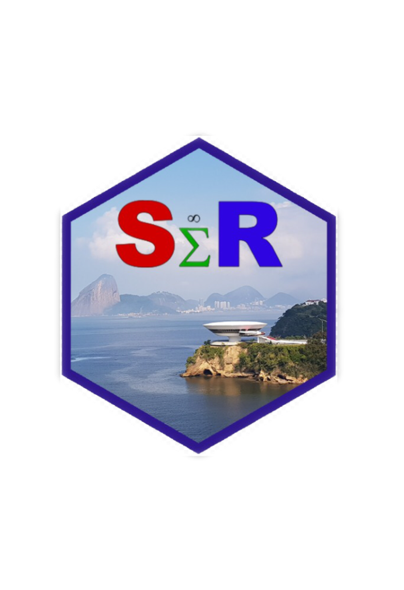

::: article
# Introduction {#introduction .unnumbered}

SER is a multidisciplinary event, which integrates professionals,
students, and practioners from most diversified knowledge areas who make
use of data analysis. The first edition took place on May 2016 as the
initiative of a group of professors from the Fluminense Federal
University, partners of other Institutions, and was supported by CAPES
(Coordination for higher Education Staff Development). SER event was
recognized by the R foundation (2018)[^1] for its pioneering in Latin
America in bringing together an expressive number of R users.

From its very first beginning, the motivation was to bring together
those who wish to learn, R users, and to spread R language knowledge
through the Federal Fluminense University, UFF. Organizers came up with
the first event title: SER, Seminários de Estatística com R, notice that
*ser* means to be in Portuguese. Soon, they discovered the borders of
their ambition were too shy, as some other institutions, even from
abroad, joined the project. The event name had changed but the acronym
was kept.

After the resounding success of the two prior editions the third
International Seminars of Statistics with R, III SER, took place, may,
$22^{nd}$ - $24^{th}$, 2018 at Federal Fluminense University - Niterói -
Rio de Janeiro. In this issue the event call was: R for Science
Integration Challenge. A high level event program was presented,
diversified in themes, and with a remarkable feminine touch, represented
in talks by Julia Silge, Jesse Maegan, Gabriela de Queiroz, Luciane
Alcoforado, Becky Pattinson, Nicole Barros, Cristiane Ramos, and Karla
Esquerre.

The program had 517 attendees, 357 freebies for beginners in the R basic
mini-course, 27 speakers from different regions and countries, 7
authorities present among coordinators, pro-rectors, and unit directors.
Fifty papers were selected by the scientific committee and presented
during the oral contributor and poster sessions, in the morning of the
third day, involving about 144 authors from 31 institutions.

# Pre-conference Tutorials {#pre-conference-tutorials .unnumbered}

The first day of the event occurred at the Administration Faculty in
Valonguinho Campus, consisted of nine, sold out, R tutorials in
diversified themes:

-   Jurimetry - Julio Trecenti, ABJ;
-   Importing and Wrangling Financial Data in R - Wilson Freitas, B3;
-   Interactive 2D and 3D Graphics in R using OpenGL Tools - Alex Laier
    Bordingon, UFF;
-   Dynamic Reports - Cassio Freitas, ENCE;
-   My first R package - Steven Dutt Ross, UNIRIO;
-   Bayesian Inference - Alexandre Silva, UNIRIO;
-   Regression Models for Politomous Data - José Rodrigo de Morais, UFF;
-   Web Scrapping Using *rvest* Package - Karla Esquerre & Adelmo Filho,
    UFBA;
-   Mining and Modeling Text Using Tidy Data Principles - Julia Silge,
    Stack Overflow.

# The Conference {#the-conference .unnumbered}

The opening day, at the Praia Vermelha Campus, began with Prof. Levy and
guests in a relaxed warm-up where they discussed how they learn and
teach R. After showing and commenting on several books, articles,
courses, and posts on twitter and slack, the message left was: "In R we
are all apprentices in different stages."

The event opening was attended by officials from UFF and ENCE. Prof.
Vitor Francisco Ferreira, currently Research Pro-Rector and
representative of UFF Rector, as well as authorities, congratulated
Luciane Alcoforado and the other organizers for their excellent work at
event organization. Prof. Fábio Barboza Passos, current director of the
Engineering Faculty, reinforced the importance for a market culture
change over free software usage, which is to be achieved by its
dissemination over the academic community. He also pointed out that data
wrangling and reports reaches all areas of knowledge in which R language
stands out. He concludes that this event is to be shown as a positive
result on how a relationship between at least 3 faculties within UFF and
several other Universities and Institutions demonstrates that
collaboration works.

The keynote opening talk was given by prof. Luciane Alcoforado, SER
General Coordinator, exposing how the event organizer team has been
working on the challenge of integrating the community around the
dissemination of the R language. The main target audience for this
project are beginners in the R language, most of them undergraduate
students for whom the project mission is to embrace, and for which
several courses and activities all developed in Portuguese. One of these
activities, within this event issue, was a free online mini course with
400 attendees. This concluded by inviting the public to visit the event
site where several articles and code bases that have been produced since
the first event issue is deposited.

The following talks dealt with varied topics with strong interaction
between the speakers and the audience.

Jesse Mostipak, Teaching Trust, brought up one of the biggest
shortcomings for both teachers and learners of data science in R: the
often unspoken prerequisite skills and content knowledge necessary to
successfully apply R to data science problems. She taught us strategies
to more effectively bring learners up to speed, while, for learners, how
to develop strategies to identify and address their own knowledge gaps.
She shared strategies from a data-driven culture that can be immediately
implemented with groups of any size in order to more quickly develop
data science skills in R.

R-Ladies project was the subject for Gabriela de Queiroz talk. She was
so emphatic in presenting the spread throughout the world, seeking to
defend and encouraging the increase of women's participation in the
field of data science with the use of the R-language, that succeeded in
motivating Noelle Camello in establishing the new Niterói chapter[^2].

Becky Pattinson, Lancaster University and UFF, approached the ageing
population problem which is faced by many countries in the world,
including Brazil. Using a nationally representative sample from the 2008
PNAD, she demonstrated how they developed measurement models for the
health and economic well-being of older people (aged 60+ years old).
Clustering older individuals by sector, multilevel structural equation
modeling provided greater understanding of the challenges for the older
people of Brazil. This understanding allows for the development of
policies that are efficient in the application of resources in the care
of older people. Analyses were conducted using the *MplusAutomation*
package in R for data formatting and estimation of the multilevel SEM in
Mplus (Version 6); a commercial SEM program. In clustering individuals
by sector, the model had a different structure of latent variables at
the sector level. Strong associations existed between health and
economic well-being and demographic variables of both individuals and
sectors had significant effect on health and economic well-being.

Daniel Takata, researcher from ENCE/IBGE, discuss how to handle
distributions that present heavy tail, without assumptions on the
presence of moments, by introducing procedures for applications in R and
the *stable* package.

Gareth McCray, Keele University, followed in video conference explaining
the rationale behind and the utility of Item Response Theory (IRT), a
specific family of psychometric models for creating continuous score
variables from binary or ordinal responses to sets of test items or
questionnaire questions. IRT models have distinct advantages for score
creation over other scale creation methods, e.g., Classical Test Theory
(CTT). Different data structures call for different types of IRT model
and the presenter briefly sketched out the landscape of this family of
models. Following, he discussed how to apply the various models using
various R packages.

In sequence, the most antecipated lecture of the day, Julia Silge, data
scientist at Stack Overflow, with her brilliance, taught us how to
manipulate, summarize, and visualize text characteristics using the
methods and R packages from the tidy tool ecosystem. These tools are
highly effective for many analytical questions that allow analysts to
integrate natural language processing into effective workflows already
in wide use. We explored how to implement approaches such as sentiment
analysis of texts, measuring tf-idf, and finding word vectors.

Surprising the audience and closing the second day talks, Rodrigo
Hartmann, a practitioner data scientist at Casa & Video, showed us the
evolution in the use of the Shiny package with several set up details
for installations and some business applications.

The activities ended with the evening of autographs, Julia Silge signing
\"Text Mining with R\", Pedro Ferreira autographing \"Analysis of Time
Series in R\", and Luciane Alcoforado autographing \"Introduction to R
using Basic Statistics.\"

The second day morning was reserved for the poster and the oral
contributors sections.

The afternoon started with Prof. Maysa Magalhães (ENCE) as the
spokesperson for the honor to the illustrious Prof. Djalma Pessoa, one
of the precursors of the use of the R language in Brazil. Currently
retired, Prof. Djalma Pessoa says that R is the only computational tool
that he knows how to use and that has always resisted the use of other
statistical programs, attracting other people to R. After his retirement
he thought he would do nothing else, but today he works even harder due
to the help he provides to R users.

In sequence, the contributors awards section took place, almost a
tradition in our events.

The third day presentations begun with Leonardo and Jonatha, UFF
Statistical students, who reported on their experience in the academic
world by encouraging colleagues to study R every day, search for new
packages, look at available documentation, participate in projects and
events such as SER. Followed by Prof. Marcelo Perlin (UFRGS), he
introduced his *GetHFData* package, which downloads and aggregates high
frequency trading data for Brazilian instruments directly from B3, the
Brazilian stock exchange.

Closing the III SER lectures, Prof. Karla Esquerre quickly introduced
the GAMMA Group, an extension project for data analysis in UFBA. Tassio
Barreto showed how to communicate with R codes through the *tidyverse*
package using his passion, cinema. His presentation was permeated by
movie quotes.

The event closure was made official by Prof. Orlando Longo current
coordinator of the Post-Graduation Program in Civil Engineering at UFF,
who highlighted the importance of new partnerships for the continuation
of the next SER.

# The awards {#the-awards .unnumbered}

**Poster Section**

1.  Hugo Henrique Oliveira, Adriane Caroline Portela, Denise Nunes
    Viola - Use of Software R as a Tool for Teaching and Learning of
    Combinatory Analysis.

2.  Luiz Fernando Guilhem Nassif Maia, Alinne de Carvalho Veiga, Renata
    Souza Bueno - Brazilian Musical Genres Similarity Analysis Using Web
    Scraping and Text Mining with R.

3.  Lucas José Gonçalves Freitas, Marcelo dos Santos Ventura -
    Cryptocurrency and an Application for Linear Hyperbolic Models.

**Oral Contributors Section**

1.  Andrea Ugolini and Juan Carlos Reboredo - Multivariate Conditional
    Quantile Dependence Between Energy Prices and Clean Energy Stock
    Returns.

2.  Silvio Augusto Jr. and Vinícius Basseto Félix - Brazilian Spotify
    Rankings Survival Analysis: Differences Between Domestic and Foreign
    Artists.

3.  Arthur Rios de Azevedo, Anderson Ara, Mariana Yukari Noguti and
    Angela Ernestina Cardoso de Brito - Shiny Application: Intersection
    Between Gender, Class and Race in 2016 ENEM.

# Testimonials {#testimonials .unnumbered}

\"Beyond programming and statistics, SER was a bright moment to meet and
be inspired by people who make our praxis so challenging and
pleasurable. This kind of connection is what makes difference for the
new ones and builds a strong foundation for data science culture in
Brazil\" Adelmo FIlho.

\"I was so happy to be introduced to the vibrant R community in Brazil
via SER. It was a pleasure to meet professors, industry professionals,
and students using R in their daily work and context\" Julia Silge.

\"Participating in SER was an absolutely joyful experience. The event
was well-organized, the presentations covered a wide variety of topics,
and the networking opportunities were a wonderful time to share a
passion for R amongst peers\" Jesse Mostipak.

\"I had difficulty in the beginning, I had never installed any program
in my life, I needed help but I was winning the challenge gradually,
being encouraged by my daughter. I confess that I enjoyed the joke and
for me it was a possibility to keep the mind active and break the
routine. I am retired, I am over 70 years old, and I like challenges.
The usefulness of the course for me is to show that it does not matter
the age but the desire to search for the new one always\" ( An anonymous
student of the basic course).

# Organizing Committee  {#organizing-committee .unnumbered}

Orlando Celso Longo - PPGEC/UFF, Luciane Ferreira Alcoforado -
PPGEC/UFF, Ariel Levy - PPGAD/UFF, José Rodrigo de Moraes - IME/UFF,
Alex Laier Bordingon - IME/UFF, Manuel Febrero Bande - Un. de Santiago
de Compostela/ Spain, Steven Dutt Ross - UNIRIO

# Scientific Committee {#scientific-committee .unnumbered}

Wenceslao Gonzalez Manteiga - Un. Santiago de Compostela - SP, Manuel
Febrero Bande - Un. Santiago de Compostela - SP, Luís Torgo - Un. do
Porto - PT, Jorge Passamani Zubelli - IMPA - BR, Orlando Celso Longo -
UFF - BR, Luciane Ferreira Alcoforado - UFF - BR, Ariel Levy - UFF - BR,
Steven Dutt Ross - UNIRIO - BR, Pedro Costa Ferreira - FGV/IBRE - BR,
Maysa Sacramento de Magalhães - ENCE/IBGE - BR, Djalma Galvão Carneiro
Pessoa - ENCE/IBGE - BR, José Rodrigo de Moraes - UFF - BR, Ludmilla da
Silva Viana Jacobson - UFF - BR, Carlos Alberto Pereira Soares - UFF -
BR, Assed Naked Haddad - UFRJ - BR

# Further Information {#further-information .unnumbered}

Several pictures and more can be seen in our home page or in facebook.

-    Conference homepage: <http://www.ser.uff.br>
-   Facebook page: <https://www.facebook.com/eventoser.uff/>
-   e-mail: [ser.uff.br@gmail.com](ser.uff.br@gmail.com){.uri}

# Next SER {#next-ser .unnumbered}

Next SER will take place in May 21-23rd 2019, we require(You).

{#figure:ser_logo
width="49.0%" alt="graphic without alt text"}
:::

[^1]: https://rforwards-auto.github.io/blog/2018/02/05/r-in-latin-america/

[^2]: A week after SER, we wish her success.
