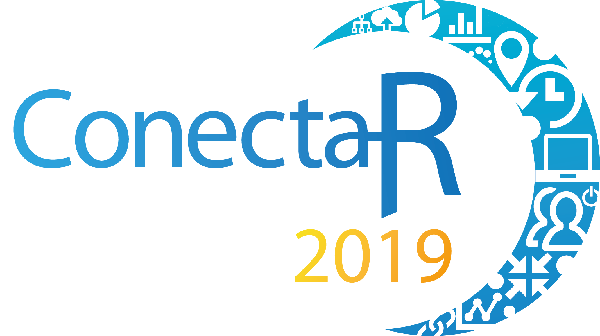

::: article
# About the event

ConectaR 2019: Encuentro de Usuarios R en Latinoamérica, took place
during January 24-26, 2019 at the University of Costa Rica, in San José,
Costa Rica. It was the first event in Central America endorsed by The R
Foundation, and it was held completely in Spanish. The majority of the
attendants were from Costa Rica (85%), but we had participants from 12
countries: Costa Rica, Guatemala, Peru, Colombia, Mexico, Argentina,
Uruguay, Chile, Spain, the Netherlands, France and the USA. The
three-day event consisted of talks, workshops, and poster sessions.

The primary purpose of ConectaR conference was to provide a space to
create a community among R users in industry, academia, citizen science
and teaching. In this way, we aim to encourage the use of R, promote
learning and advance the development of R packages adapted to our
regional needs.

ConectaR 2019 was organized by the University of Costa Rica -through the
School of Statistics, the Development Observatory, and the Research
Center for Pure and Applied Mathematics- the company ixpantia, and the
research institution Bioversity International. The initiative originated
thanks to the encouragement of Heather Turner, who contacted several
networks in the region, through the R Users Groups, R-ladies groups and
other connections.

From the 150 registered participants, $33\%$ were female and $23\%$ were
full time students. Professionals from finance, government and data
companies were present, as well as faculty members from all four major
universities in the country. The event was possible thanks to the effort
of a team of about 50 people including 4 chairs, a 23-member scientific
committee and a motivated group of 23 volunteers.

{#figure:rlogo-news
width="6cm"}

# Conference program

The first two days of the conference were dedicated to talks (invited
and contributed) and poster presentations. On the third day of the event
(a Saturday) four workshops ran in parallel: two during the morning and
two during the afternoon.

{#figure:rsala-news width="100%"
alt="graphic without alt text"}

The event had four invited talks: two that were in person and two via
video conference. Edgar Ruiz from RStudio, was the first keynote. He
gave a remarkably clear explanation about how to use R and Spark for
Data Science. During the afternoon, Maëlle Salmon from rOpenSci and
Locke Data, presented the second keynote (remote), where she talked
about the ROpenSci initiative (<https://ropensci.org/>), and about her
experience curating R packages. She gave the audience tips on how to
write R packages, a clear explanation on the importance of citing,
curating and recognizing R packages as part of the scientific process.

During the second day of the event, Robert Hijmans from UC Davis,
explained the use of R for spatial data science, and talked about his
experience using R for scientific production and teaching, including the
creation of new packages. His talk ended with an invitation to translate
the material from his web page into Spanish: <https://rspatial.org/>. To
close the last day of talks, Antonio Vasquez Brust from Buenos Aires
University (UBA), Argentina gave a detailed description on how to use R
and Open Data to understand our cities. His discussion encouraged good
practices in visualization as well as a conversation about city planning
using R when Open Data is available.

A panel named "Connecting data innovation initiatives in Latin America
with R" was facilitated by Diego May (ixpantia) during the second day of
the event. The intention of the panel was to have professionals talk
about the opportunities and challenges around the use of R in their
different work contexts. Alexia Pacheco of ICE, the largest utility
company in Costa Rica, explained how data science and R has pervaded
their work since its origin. Jacob van Etten (Bioversity International)
explained how R is used in a multi-country team in an international
agricultural research institute. It has provided important opportunities
for quick methodological innovation to support a large citizen science
initiative. Alvaro Pabón of Finsocial Colombia, explained how he has set
up a data science team in a Colombian company, the challenges to build
this capacity and the support needed for it.

Eleven contributed talks and fourteen posters were presented during the
event. The selection process had two stages: during the first one, the
reviewers gave recommendations to the authors on how to improve their
abstract, and during the second stage, the talks that had a satisfactory
level were accepted. The posters were then reviewed by the chairs to
ensure all of them had a satisfactory level. Two out of the eleven
contributed talks and six out of the fourteen posters were presented by
women.

The topics of the contributed talks followed the four themes of the
conference. First government and citizen science, where we saw how shiny
apps are used at the Costa Rican national comptroller's office. We also
heard how the national statistics office is transitioning from SPSS to
R. In the industry track a talk about the transition from Excel to R at
the national insurance institute showed how this has lead to significant
reduction in time spent on data processing. In academia the
visualization and analysis of complex climate data took center stage in
two separate talks. The teaching track included a fun example of how to
predict the outcome of soccer matches, and showcased experiences from
Mexico of the power of R as a didactic tool in statistics and
mathematics.

After the last break of the first day, the poster session was opened and
accompanied by the conference cocktail reception. As organizers we felt
strongly about including sufficient opportunities for people to mingle
and talk. The posters were well visited and led to spirited discussions.
The conference dinner had a lower attendance than the reception, but
served its purpose just as well in offering an opportunity for people in
the community to connect and re-connect.

During the last day of the event four workshops were held, each of which
managed to attract full classrooms:

-   Crear API's con código R usando plumber by Frans van Dunné.
-   Documentos dinámicos, trabajo colaborativo y control de versiones
    con Rmarkdown y GitHub by Natalia da Silva.
-   Análisis de texto by Riva Quiroga.
-   Introducción al análisis Bayesiano con aplicaciones en STAN by
    Ignacio Álvarez-Castro.

ConectaR served to connect different communities, announce exciting
projects and to create new ones. Examples are the visit and help of two
of the three chairs of LatinR to teach workshops and their LatinR2019
announcement during the closing remarks of ConectaR. Also, Riva Quiroga
explained details about the R4DS translation project
(<https://es.r4ds.hadley.nz>) to the community, and Frans van Dunné
asked for volunteers to start the (already advanced) Plumber translation
project (<https://github.com/fontanero-api/>).

Communities outside R were also involved, such as Women in Engineering,
who organized an introduction to R workshop for its members two months
after the event, with the help of Marcela Alfaro Córdoba. DataLatam did
several interviews for their [podcast](https://www.datalatam.com) thanks
to the connections established during ConectaR, and the School of
Statistics made the first arrangements to invite Edgar Ruiz to give a
week of workshops to its students and faculty in June.

# Evaluation

An evaluation questionnaire was circulated after the event, and $70\%$
of the participants filled it out. The results were overwhelmingly
positive, having a median rate of 5 (on a scale from 1=bad job to 5=good
job) for all the questions, with very small variability in each
distribution. A word cloud of the comment section of the questionnaire
was constructed and is shown in Figure [3](#figure:eval-news), where it
is clear that positive words such as excellent (excelente), good (bien,
bueno) and quality (calidad) were among the most used in the comments.

{#figure:eval-news width="100%"
alt="graphic without alt text"}

# Corporate Sponsors

ConectaR was possible thanks to the main sponsors: INCAE Business
School, R Consortium, RStudio, Inc., Hivos Latinoamerica, The Trust for
the Americas. Also, a small job fair was organized parallel to the
conference, in which the some of the main sponsors participated, along
with companies like McKinsey $\&$ Company, Alteryx, Growth Acceleration
and Partners, ThermoFisher Scientific and ixpantia.

# Other Events and Future Steps

Future plans for the chairs of ConectaR include ConectaR 2021, where the
expectation is to improve the network with communities in Mexico,
Colombia, Panamá, and search for funding sources to overcome our most
important limitation for this edition: lack of funding to cover travel
expenses. Also, the organization of more local events such as a Datathon
for 2020, is on the agenda. The idea is to gather momentum to get
different R communities from the region to participate in a
visualization competition, inspired in Open Data from the Costa Rican
Government.

# Further information

-   ConectaR materials: <https://github.com/ConectaR2019>.
-   Twitter account: [\@conecta_R](http://www.twitter.com/conecta_R),
    [#ConectaR2019](https://twitter.com/hashtag/ConectaR2019?src=hash).
-   Webpage: <http://www.conectar2019.ucr.ac.cr>
-   Facebook account:
    [conectar2019](https://www.facebook.com/conectar2019/)
:::
