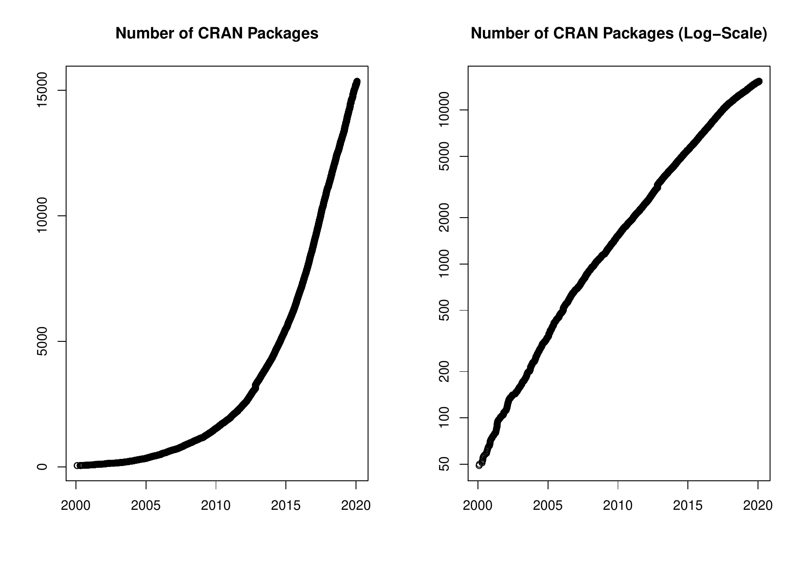

::: article
\

In the past 4 months, 632 new packages were added to the CRAN package
repository. 27 packages were unarchived and 182 were archived. The
following shows the growth of the number of active packages in the CRAN
package repository:

{width="100%" alt="graphic without alt text"}

On 2019-12-31, the number of active packages was around 15227.

## Changes in the CRAN Repository Policy

The [Checklist for CRAN
submissions](https://CRAN.R-project.org/web/packages/submission_checklist.html)
now says the following:

-   Make the Description as informative as possible for potential new
    users of your package. If in doubt, make the Description longer
    rather than shorter, but try to avoid redundancies such as
    repetitions of the package name.
-   Write function names including parentheses as in `foo()` but without
    quotes.

## CRAN package submissions

## CRAN mirror security

Currently, there are 97 official CRAN mirrors, 67 of which provide both
secure downloads via `https` *and* use secure mirroring from the CRAN
master (via rsync through ssh tunnels). Since the R 3.4.0 release,
`chooseCRANmirror()` offers these mirrors in preference to the others
which are not fully secured (yet).

## New CRAN task views

[*Tracking*](https://CRAN.R-project.org/view=Tracking)

:   Topic: Processing and Analysis of Tracking Data. Maintainer: Rocío
    Joo, Matthew E. Boone, Michael Sumner and Mathieu Basille. Packages:
    [*BBMM*](https://CRAN.R-project.org/package=BBMM),
    [*BayesianAnimalTracker*](https://CRAN.R-project.org/package=BayesianAnimalTracker),
    [*EMbC*](https://CRAN.R-project.org/package=EMbC),
    [*FLightR*](https://CRAN.R-project.org/package=FLightR),
    [*GGIR*](https://CRAN.R-project.org/package=GGIR),
    [*GeoLight*](https://CRAN.R-project.org/package=GeoLight),
    [*PhysicalActivity*](https://CRAN.R-project.org/package=PhysicalActivity),
    [*SDLfilter*](https://CRAN.R-project.org/package=SDLfilter),
    [*SiMRiv*](https://CRAN.R-project.org/package=SiMRiv),
    [*SimilarityMeasures*](https://CRAN.R-project.org/package=SimilarityMeasures),
    [*TrackReconstruction*](https://CRAN.R-project.org/package=TrackReconstruction),
    [*TrajDataMining*](https://CRAN.R-project.org/package=TrajDataMining),
    [*VTrack*](https://CRAN.R-project.org/package=VTrack),
    [*acc*](https://CRAN.R-project.org/package=acc),
    [*accelerometry*](https://CRAN.R-project.org/package=accelerometry),
    [*adehabitatHR*](https://CRAN.R-project.org/package=adehabitatHR),
    [*adehabitatLT*](https://CRAN.R-project.org/package=adehabitatLT)$^*$,
    [*amt*](https://CRAN.R-project.org/package=amt),
    [*animalTrack*](https://CRAN.R-project.org/package=animalTrack),
    [*anipaths*](https://CRAN.R-project.org/package=anipaths),
    [*argosfilter*](https://CRAN.R-project.org/package=argosfilter),
    [*bcpa*](https://CRAN.R-project.org/package=bcpa),
    [*bsam*](https://CRAN.R-project.org/package=bsam),
    [*caribou*](https://CRAN.R-project.org/package=caribou),
    [*crawl*](https://CRAN.R-project.org/package=crawl),
    [*ctmcmove*](https://CRAN.R-project.org/package=ctmcmove),
    [*ctmm*](https://CRAN.R-project.org/package=ctmm),
    [*diveMove*](https://CRAN.R-project.org/package=diveMove),
    [*foieGras*](https://CRAN.R-project.org/package=foieGras),
    [*m2b*](https://CRAN.R-project.org/package=m2b),
    [*marcher*](https://CRAN.R-project.org/package=marcher),
    [*mkde*](https://CRAN.R-project.org/package=mkde),
    [*momentuHMM*](https://CRAN.R-project.org/package=momentuHMM),
    [*move*](https://CRAN.R-project.org/package=move)$^*$,
    [*moveHMM*](https://CRAN.R-project.org/package=moveHMM),
    [*moveVis*](https://CRAN.R-project.org/package=moveVis),
    [*moveWindSpeed*](https://CRAN.R-project.org/package=moveWindSpeed),
    [*nparACT*](https://CRAN.R-project.org/package=nparACT),
    [*pawacc*](https://CRAN.R-project.org/package=pawacc),
    [*recurse*](https://CRAN.R-project.org/package=recurse),
    [*rpostgisLT*](https://CRAN.R-project.org/package=rpostgisLT),
    [*rsMove*](https://CRAN.R-project.org/package=rsMove),
    [*segclust2d*](https://CRAN.R-project.org/package=segclust2d),
    [*smam*](https://CRAN.R-project.org/package=smam),
    [*spatsoc*](https://CRAN.R-project.org/package=spatsoc),
    [*trackdem*](https://CRAN.R-project.org/package=trackdem),
    [*trackeR*](https://CRAN.R-project.org/package=trackeR),
    [*trajectories*](https://CRAN.R-project.org/package=trajectories),
    [*trajr*](https://CRAN.R-project.org/package=trajr),
    [*trip*](https://CRAN.R-project.org/package=trip),
    [*tripEstimation*](https://CRAN.R-project.org/package=tripEstimation),
    [*wildlifeDI*](https://CRAN.R-project.org/package=wildlifeDI).

(\* = core package)

## New packages in CRAN task views

[*ChemPhys*](https://CRAN.R-project.org/view=ChemPhys)

:   [*RadData*](https://CRAN.R-project.org/package=RadData),
    [*radsafer*](https://CRAN.R-project.org/package=radsafer).

[*Distributions*](https://CRAN.R-project.org/view=Distributions)

:   [*MomTrunc*](https://CRAN.R-project.org/package=MomTrunc),
    [*OwenQ*](https://CRAN.R-project.org/package=OwenQ),
    [*TruncatedNormal*](https://CRAN.R-project.org/package=TruncatedNormal),
    [*distr6*](https://CRAN.R-project.org/package=distr6),
    [*distributions3*](https://CRAN.R-project.org/package=distributions3),
    [*parameters*](https://CRAN.R-project.org/package=parameters),
    [*spam*](https://CRAN.R-project.org/package=spam),
    [*truncdist*](https://CRAN.R-project.org/package=truncdist).

[*Econometrics*](https://CRAN.R-project.org/view=Econometrics)

:   [*durmod*](https://CRAN.R-project.org/package=durmod),
    [*lpirfs*](https://CRAN.R-project.org/package=lpirfs).

[*HighPerformanceComputing*](https://CRAN.R-project.org/view=HighPerformanceComputing)

:   [*RxODE*](https://CRAN.R-project.org/package=RxODE).

[*Hydrology*](https://CRAN.R-project.org/view=Hydrology)

:   [*FedData*](https://CRAN.R-project.org/package=FedData),
    [*VICmodel*](https://CRAN.R-project.org/package=VICmodel),
    [*baseflow*](https://CRAN.R-project.org/package=baseflow),
    [*echor*](https://CRAN.R-project.org/package=echor),
    [*nasapower*](https://CRAN.R-project.org/package=nasapower),
    [*openair*](https://CRAN.R-project.org/package=openair).

[*MachineLearning*](https://CRAN.R-project.org/view=MachineLearning)

:   [*mlr3*](https://CRAN.R-project.org/package=mlr3).

[*MetaAnalysis*](https://CRAN.R-project.org/view=MetaAnalysis)

:   [*BayesCombo*](https://CRAN.R-project.org/package=BayesCombo),
    [*CopulaDTA*](https://CRAN.R-project.org/package=CopulaDTA),
    [*EValue*](https://CRAN.R-project.org/package=EValue),
    [*GENMETA*](https://CRAN.R-project.org/package=GENMETA),
    [*GMCM*](https://CRAN.R-project.org/package=GMCM),
    [*HSROC*](https://CRAN.R-project.org/package=HSROC),
    [*KenSyn*](https://CRAN.R-project.org/package=KenSyn),
    [*MBNMAdose*](https://CRAN.R-project.org/package=MBNMAdose),
    [*MBNMAtime*](https://CRAN.R-project.org/package=MBNMAtime),
    [*NMAoutlier*](https://CRAN.R-project.org/package=NMAoutlier),
    [*PRISMAstatement*](https://CRAN.R-project.org/package=PRISMAstatement),
    [*PublicationBias*](https://CRAN.R-project.org/package=PublicationBias),
    [*RBesT*](https://CRAN.R-project.org/package=RBesT),
    [*RcmdrPlugin.MA*](https://CRAN.R-project.org/package=RcmdrPlugin.MA),
    [*SingleCaseES*](https://CRAN.R-project.org/package=SingleCaseES),
    [*baggr*](https://CRAN.R-project.org/package=baggr),
    [*catmap*](https://CRAN.R-project.org/package=catmap),
    [*effectsize*](https://CRAN.R-project.org/package=effectsize),
    [*harmonicmeanp*](https://CRAN.R-project.org/package=harmonicmeanp),
    [*jarbes*](https://CRAN.R-project.org/package=jarbes),
    [*mc.heterogeneity*](https://CRAN.R-project.org/package=mc.heterogeneity),
    [*metaBLUE*](https://CRAN.R-project.org/package=metaBLUE),
    [*metacart*](https://CRAN.R-project.org/package=metacart),
    [*metapro*](https://CRAN.R-project.org/package=metapro),
    [*mixmeta*](https://CRAN.R-project.org/package=mixmeta),
    [*nmadb*](https://CRAN.R-project.org/package=nmadb).

[*MissingData*](https://CRAN.R-project.org/view=MissingData)

:   [*MatchThem*](https://CRAN.R-project.org/package=MatchThem).

[*NumericalMathematics*](https://CRAN.R-project.org/view=NumericalMathematics)

:   [*HypergeoMat*](https://CRAN.R-project.org/package=HypergeoMat),
    [*SQUAREM*](https://CRAN.R-project.org/package=SQUAREM),
    [*calculus*](https://CRAN.R-project.org/package=calculus),
    [*commonsMath*](https://CRAN.R-project.org/package=commonsMath),
    [*daarem*](https://CRAN.R-project.org/package=daarem),
    [*freealg*](https://CRAN.R-project.org/package=freealg),
    [*jack*](https://CRAN.R-project.org/package=jack),
    [*kubik*](https://CRAN.R-project.org/package=kubik),
    [*matlib*](https://CRAN.R-project.org/package=matlib),
    [*mbend*](https://CRAN.R-project.org/package=mbend),
    [*turboEM*](https://CRAN.R-project.org/package=turboEM),
    [*wedge*](https://CRAN.R-project.org/package=wedge).

[*OfficialStatistics*](https://CRAN.R-project.org/view=OfficialStatistics)

:   [*MatchThem*](https://CRAN.R-project.org/package=MatchThem),
    [*RJDemetra*](https://CRAN.R-project.org/package=RJDemetra),
    [*diyar*](https://CRAN.R-project.org/package=diyar),
    [*simPop*](https://CRAN.R-project.org/package=simPop),
    [*tidyqwi*](https://CRAN.R-project.org/package=tidyqwi).

[*Optimization*](https://CRAN.R-project.org/view=Optimization)

:   [*GPareto*](https://CRAN.R-project.org/package=GPareto),
    [*Jaya*](https://CRAN.R-project.org/package=Jaya),
    [*OOR*](https://CRAN.R-project.org/package=OOR),
    [*SCOR*](https://CRAN.R-project.org/package=SCOR),
    [*nonneg.cg*](https://CRAN.R-project.org/package=nonneg.cg),
    [*roptim*](https://CRAN.R-project.org/package=roptim).

[*Pharmacokinetics*](https://CRAN.R-project.org/view=Pharmacokinetics)

:   [*RxODE*](https://CRAN.R-project.org/package=RxODE),
    [*nlmixr*](https://CRAN.R-project.org/package=nlmixr).

[*Psychometrics*](https://CRAN.R-project.org/view=Psychometrics)

:   [*conquestr*](https://CRAN.R-project.org/package=conquestr),
    [*jrt*](https://CRAN.R-project.org/package=jrt),
    [*psychonetrics*](https://CRAN.R-project.org/package=psychonetrics).

[*ReproducibleResearch*](https://CRAN.R-project.org/view=ReproducibleResearch)

:   [*DataPackageR*](https://CRAN.R-project.org/package=DataPackageR),
    [*ProjectTemplate*](https://CRAN.R-project.org/package=ProjectTemplate),
    [*RSuite*](https://CRAN.R-project.org/package=RSuite),
    [*RepoGenerator*](https://CRAN.R-project.org/package=RepoGenerator),
    [*adapr*](https://CRAN.R-project.org/package=adapr),
    [*cabinets*](https://CRAN.R-project.org/package=cabinets),
    [*drake*](https://CRAN.R-project.org/package=drake),
    [*exreport*](https://CRAN.R-project.org/package=exreport),
    [*here*](https://CRAN.R-project.org/package=here),
    [*madrat*](https://CRAN.R-project.org/package=madrat),
    [*makeProject*](https://CRAN.R-project.org/package=makeProject),
    [*orderly*](https://CRAN.R-project.org/package=orderly),
    [*prodigenr*](https://CRAN.R-project.org/package=prodigenr),
    [*projects*](https://CRAN.R-project.org/package=projects),
    [*renv*](https://CRAN.R-project.org/package=renv),
    [*repo*](https://CRAN.R-project.org/package=repo),
    [*reports*](https://CRAN.R-project.org/package=reports),
    [*represtools*](https://CRAN.R-project.org/package=represtools),
    [*storr*](https://CRAN.R-project.org/package=storr),
    [*tinyProject*](https://CRAN.R-project.org/package=tinyProject),
    [*usethis*](https://CRAN.R-project.org/package=usethis),
    [*workflowr*](https://CRAN.R-project.org/package=workflowr),
    [*zoon*](https://CRAN.R-project.org/package=zoon).

[*SpatioTemporal*](https://CRAN.R-project.org/view=SpatioTemporal)

:   [*AtmRay*](https://CRAN.R-project.org/package=AtmRay),
    [*EMbC*](https://CRAN.R-project.org/package=EMbC),
    [*SDLfilter*](https://CRAN.R-project.org/package=SDLfilter),
    [*SiMRiv*](https://CRAN.R-project.org/package=SiMRiv),
    [*SpaTimeClus*](https://CRAN.R-project.org/package=SpaTimeClus),
    [*amt*](https://CRAN.R-project.org/package=amt),
    [*anipaths*](https://CRAN.R-project.org/package=anipaths),
    [*bsam*](https://CRAN.R-project.org/package=bsam),
    [*caribou*](https://CRAN.R-project.org/package=caribou),
    [*eyelinker*](https://CRAN.R-project.org/package=eyelinker),
    [*eyetracking*](https://CRAN.R-project.org/package=eyetracking),
    [*eyetrackingR*](https://CRAN.R-project.org/package=eyetrackingR),
    [*foieGras*](https://CRAN.R-project.org/package=foieGras),
    [*gazepath*](https://CRAN.R-project.org/package=gazepath),
    [*marcher*](https://CRAN.R-project.org/package=marcher),
    [*mdftracks*](https://CRAN.R-project.org/package=mdftracks),
    [*momentuHMM*](https://CRAN.R-project.org/package=momentuHMM),
    [*mousetrack*](https://CRAN.R-project.org/package=mousetrack),
    [*mousetrap*](https://CRAN.R-project.org/package=mousetrap),
    [*moveVis*](https://CRAN.R-project.org/package=moveVis),
    [*moveWindSpeed*](https://CRAN.R-project.org/package=moveWindSpeed),
    [*movecost*](https://CRAN.R-project.org/package=movecost),
    [*oce*](https://CRAN.R-project.org/package=oce),
    [*opentraj*](https://CRAN.R-project.org/package=opentraj),
    [*psyosphere*](https://CRAN.R-project.org/package=psyosphere),
    [*rerddapXtracto*](https://CRAN.R-project.org/package=rerddapXtracto),
    [*riverdist*](https://CRAN.R-project.org/package=riverdist),
    [*rpostgisLT*](https://CRAN.R-project.org/package=rpostgisLT),
    [*rsMove*](https://CRAN.R-project.org/package=rsMove),
    [*saccades*](https://CRAN.R-project.org/package=saccades),
    [*spatsoc*](https://CRAN.R-project.org/package=spatsoc),
    [*stampr*](https://CRAN.R-project.org/package=stampr),
    [*stplanr*](https://CRAN.R-project.org/package=stplanr),
    [*trackdem*](https://CRAN.R-project.org/package=trackdem),
    [*trackdf*](https://CRAN.R-project.org/package=trackdf),
    [*trackeRapp*](https://CRAN.R-project.org/package=trackeRapp),
    [*trajectories*](https://CRAN.R-project.org/package=trajectories),
    [*trajr*](https://CRAN.R-project.org/package=trajr).

[*TeachingStatistics*](https://CRAN.R-project.org/view=TeachingStatistics)

:   [*BetaBit*](https://CRAN.R-project.org/package=BetaBit),
    [*DALEX*](https://CRAN.R-project.org/package=DALEX),
    [*HH*](https://CRAN.R-project.org/package=HH),
    [*car*](https://CRAN.R-project.org/package=car),
    [*carData*](https://CRAN.R-project.org/package=carData),
    [*effects*](https://CRAN.R-project.org/package=effects),
    [*regtools*](https://CRAN.R-project.org/package=regtools),
    [*resampledata*](https://CRAN.R-project.org/package=resampledata).

[*TimeSeries*](https://CRAN.R-project.org/view=TimeSeries)

:   [*VARshrink*](https://CRAN.R-project.org/package=VARshrink),
    [*fable*](https://CRAN.R-project.org/package=fable)$^*$,
    [*feasts*](https://CRAN.R-project.org/package=feasts)$^*$,
    [*forecastML*](https://CRAN.R-project.org/package=forecastML),
    [*fpp3*](https://CRAN.R-project.org/package=fpp3),
    [*nsarfima*](https://CRAN.R-project.org/package=nsarfima),
    [*sazedR*](https://CRAN.R-project.org/package=sazedR).

[*gR*](https://CRAN.R-project.org/view=gR)

:   [*bnclassify*](https://CRAN.R-project.org/package=bnclassify),
    [*mgm*](https://CRAN.R-project.org/package=mgm),
    [*qgraph*](https://CRAN.R-project.org/package=qgraph),
    [*sna*](https://CRAN.R-project.org/package=sna).

(\* = core package)
:::
