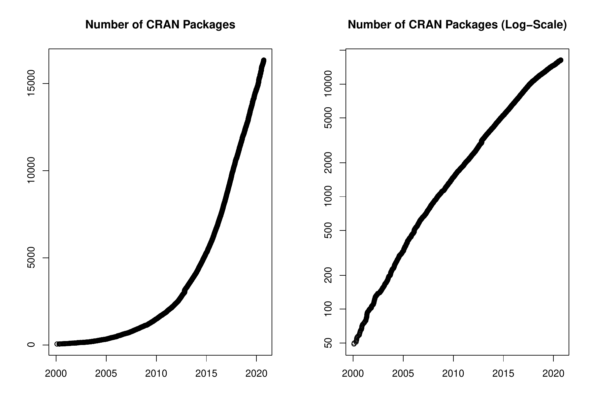

::: article
In the past 8 months, 1554 new packages were added to the CRAN package
repository. 96 packages were unarchived and 843 were archived. The
following shows the growth of the number of active packages in the CRAN
package repository:

{width="100%" alt="graphic without alt text"}

On 2020-08-31, the number of active packages was around 16174.

## Changes in the CRAN Repository Policy

The [Policy](https://CRAN.R-project.org/web/packages/policies.html) now
says the following:

-   All correspondence with CRAN must be sent to
    [CRAN-submissions@R-project.org](CRAN-submissions@R-project.org){.uri}
    (for submissions) or [CRAN@R-project.org](CRAN@R-project.org){.uri}
    (for published packages) and not to members of the team, in plain
    text ASCII and not HTML.
-   A package listed in 'Suggests' or 'Enhances' should be used
    conditionally in examples or tests if it cannot straightforwardly be
    installed on the major R platforms. ('Writing R Extensions'
    recommends that they are *always* used conditionally.)
-   Orphaned CRAN packages should not be strict requirements (in the
    'Depends', 'Imports' or 'LinkingTo' fields, including indirectly).
    They are allowed in 'Suggests' if used conditionally, although this
    is discouraged.
-   Packages which use Internet resources should fail gracefully with an
    informative message if the resource is not available or has changed
    (and not give a check warning nor error).
-   Compiled code should never terminate the R process within which it
    is running. Thus C/C++ calls to
    `assert`/`abort`/`exit`/`std::terminate`, Fortran calls to STOP and
    so on must be avoided.
-   Updates to previously-published packages must have an increased
    version. Increasing the version number at each submission reduces
    confusion so is preferred even when a previous submission was not
    accepted.

## CRAN package submissions

During the first 8 months of 2020 (January to August), CRAN received
22020 package submissions. For these, 38551 actions took place of which
25063 (65%) were auto processed actions and 13488 (35%) manual actions.

Minus some special cases, a summary of the auto-processed and manually
triggered actions follows:

  ----------------------------------------------------------------------------------------
             archive   inspect   newbies   pending   pretest   publish   recheck   waiting
  -------- --------- --------- --------- --------- --------- --------- --------- ---------
  auto          5710      4300      5269         0         0      6216      1987      1581

  manual        5437        95       936       783       291      4532      1181       233
  ----------------------------------------------------------------------------------------

  : 

These include the final decisions for the submissions which were

  --------------------------------------
  action          archive        publish
  -------- -------------- --------------
  auto       5401 (25.2%)   5258 (24.5%)

  manual     5315 (24.8%)   5449 (25.4%)
  --------------------------------------

  : 

where we only count those as *auto* processed whose publication or
rejection happened automatically in all steps.

The CRAN team has changed. Martina Schmirl and Jelena Saf left the team.
Thanks a lot to both of you! New members are Gregor Seyer who is very
actively processing *newbies* submissions and Julia Haider who just
joined the team. Welcome to CRAN!

## CRAN mirror security

Currently, there are 101 official CRAN mirrors, 65 of which provide both
secure downloads via `https` *and* use secure mirroring from the CRAN
master (via rsync through ssh tunnels). Since the R 3.4.0 release,
`chooseCRANmirror()` offers these mirrors in preference to the others
which are not fully secured (yet).

## New packages in CRAN task views

[*Bayesian*](https://CRAN.R-project.org/view=Bayesian)

:   [*BEST*](https://CRAN.R-project.org/package=BEST),
    [*BVAR*](https://CRAN.R-project.org/package=BVAR),
    [*BayesPostEst*](https://CRAN.R-project.org/package=BayesPostEst),
    [*Bergm*](https://CRAN.R-project.org/package=Bergm),
    [*NGSSEML*](https://CRAN.R-project.org/package=NGSSEML),
    [*acebayes*](https://CRAN.R-project.org/package=acebayes),
    [*bbricks*](https://CRAN.R-project.org/package=bbricks),
    [*conting*](https://CRAN.R-project.org/package=conting),
    [*mcmcse*](https://CRAN.R-project.org/package=mcmcse),
    [*stableGR*](https://CRAN.R-project.org/package=stableGR).

[*ChemPhys*](https://CRAN.R-project.org/view=ChemPhys)

:   [*spectrino*](https://CRAN.R-project.org/package=spectrino).

[*Cluster*](https://CRAN.R-project.org/view=Cluster)

:   [*DatabionicSwarm*](https://CRAN.R-project.org/package=DatabionicSwarm),
    [*ProjectionBasedClustering*](https://CRAN.R-project.org/package=ProjectionBasedClustering),
    [*genieclust*](https://CRAN.R-project.org/package=genieclust).

[*Databases*](https://CRAN.R-project.org/view=Databases)

:   [*RClickhouse*](https://CRAN.R-project.org/package=RClickhouse),
    [*dbx*](https://CRAN.R-project.org/package=dbx),
    [*dplyr*](https://CRAN.R-project.org/package=dplyr),
    [*sparklyr*](https://CRAN.R-project.org/package=sparklyr).

[*Econometrics*](https://CRAN.R-project.org/view=Econometrics)

:   [*REndo*](https://CRAN.R-project.org/package=REndo),
    [*collapse*](https://CRAN.R-project.org/package=collapse),
    [*fixest*](https://CRAN.R-project.org/package=fixest),
    [*mfx*](https://CRAN.R-project.org/package=mfx),
    [*mhurdle*](https://CRAN.R-project.org/package=mhurdle),
    [*mnlogit*](https://CRAN.R-project.org/package=mnlogit),
    [*skedastic*](https://CRAN.R-project.org/package=skedastic).

[*Environmetrics*](https://CRAN.R-project.org/view=Environmetrics)

:   [*PMCMRplus*](https://CRAN.R-project.org/package=PMCMRplus),
    [*dsm*](https://CRAN.R-project.org/package=dsm),
    [*rioja*](https://CRAN.R-project.org/package=rioja).

[*Finance*](https://CRAN.R-project.org/view=Finance)

:   [*copulaData*](https://CRAN.R-project.org/package=copulaData),
    [*nvmix*](https://CRAN.R-project.org/package=nvmix),
    [*qrmdata*](https://CRAN.R-project.org/package=qrmdata),
    [*qrmtools*](https://CRAN.R-project.org/package=qrmtools).

[*FunctionalData*](https://CRAN.R-project.org/view=FunctionalData)

:   [*fdANOVA*](https://CRAN.R-project.org/package=fdANOVA),
    [*fdaACF*](https://CRAN.R-project.org/package=fdaACF).

[*HighPerformanceComputing*](https://CRAN.R-project.org/view=HighPerformanceComputing)

:   [*pbdBASE*](https://CRAN.R-project.org/package=pbdBASE).

[*Hydrology*](https://CRAN.R-project.org/view=Hydrology)

:   [*AWAPer*](https://CRAN.R-project.org/package=AWAPer),
    [*RNRCS*](https://CRAN.R-project.org/package=RNRCS),
    [*climate*](https://CRAN.R-project.org/package=climate),
    [*fasstr*](https://CRAN.R-project.org/package=fasstr),
    [*metScanR*](https://CRAN.R-project.org/package=metScanR),
    [*stationaRy*](https://CRAN.R-project.org/package=stationaRy).

[*MetaAnalysis*](https://CRAN.R-project.org/view=MetaAnalysis)

:   [*NMADiagT*](https://CRAN.R-project.org/package=NMADiagT),
    [*SPAtest*](https://CRAN.R-project.org/package=SPAtest),
    [*getspres*](https://CRAN.R-project.org/package=getspres),
    [*metagam*](https://CRAN.R-project.org/package=metagam),
    [*metapower*](https://CRAN.R-project.org/package=metapower),
    [*metarep*](https://CRAN.R-project.org/package=metarep),
    [*metawho*](https://CRAN.R-project.org/package=metawho),
    [*miniMeta*](https://CRAN.R-project.org/package=miniMeta),
    [*poolr*](https://CRAN.R-project.org/package=poolr),
    [*publipha*](https://CRAN.R-project.org/package=publipha).

[*MissingData*](https://CRAN.R-project.org/view=MissingData)

:   [*CircSpaceTime*](https://CRAN.R-project.org/package=CircSpaceTime),
    [*ClustImpute*](https://CRAN.R-project.org/package=ClustImpute),
    [*ECLRMC*](https://CRAN.R-project.org/package=ECLRMC),
    [*EditImputeCont*](https://CRAN.R-project.org/package=EditImputeCont),
    [*FSMUMI*](https://CRAN.R-project.org/package=FSMUMI),
    [*IPWboxplot*](https://CRAN.R-project.org/package=IPWboxplot),
    [*NPBayesImputeCat*](https://CRAN.R-project.org/package=NPBayesImputeCat),
    [*RBtest*](https://CRAN.R-project.org/package=RBtest),
    [*RMixtComp*](https://CRAN.R-project.org/package=RMixtComp),
    [*StempCens*](https://CRAN.R-project.org/package=StempCens),
    [*areal*](https://CRAN.R-project.org/package=areal),
    [*biclustermd*](https://CRAN.R-project.org/package=biclustermd),
    [*bootImpute*](https://CRAN.R-project.org/package=bootImpute),
    [*cassandRa*](https://CRAN.R-project.org/package=cassandRa),
    [*iai*](https://CRAN.R-project.org/package=iai),
    [*impimp*](https://CRAN.R-project.org/package=impimp),
    [*imputeFin*](https://CRAN.R-project.org/package=imputeFin),
    [*imputeR*](https://CRAN.R-project.org/package=imputeR),
    [*isotree*](https://CRAN.R-project.org/package=isotree),
    [*lodi*](https://CRAN.R-project.org/package=lodi),
    [*metasens*](https://CRAN.R-project.org/package=metasens),
    [*miWQS*](https://CRAN.R-project.org/package=miWQS),
    [*miceRanger*](https://CRAN.R-project.org/package=miceRanger),
    [*mipred*](https://CRAN.R-project.org/package=mipred),
    [*misaem*](https://CRAN.R-project.org/package=misaem),
    [*missSBM*](https://CRAN.R-project.org/package=missSBM),
    [*missingHE*](https://CRAN.R-project.org/package=missingHE),
    [*naivebayes*](https://CRAN.R-project.org/package=naivebayes),
    [*plsRbeta*](https://CRAN.R-project.org/package=plsRbeta),
    [*psfmi*](https://CRAN.R-project.org/package=psfmi),
    [*robustrank*](https://CRAN.R-project.org/package=robustrank),
    [*rrcovNA*](https://CRAN.R-project.org/package=rrcovNA),
    [*rsparse*](https://CRAN.R-project.org/package=rsparse),
    [*sievePH*](https://CRAN.R-project.org/package=sievePH),
    [*tensorBF*](https://CRAN.R-project.org/package=tensorBF),
    [*ui*](https://CRAN.R-project.org/package=ui).

[*ModelDeployment*](https://CRAN.R-project.org/view=ModelDeployment)

:   [*RestRserve*](https://CRAN.R-project.org/package=RestRserve).

[*NaturalLanguageProcessing*](https://CRAN.R-project.org/view=NaturalLanguageProcessing)

:   [*BTM*](https://CRAN.R-project.org/package=BTM),
    [*LexisNexisTools*](https://CRAN.R-project.org/package=LexisNexisTools),
    [*corporaexplorer*](https://CRAN.R-project.org/package=corporaexplorer),
    [*crfsuite*](https://CRAN.R-project.org/package=crfsuite),
    [*ruimtehol*](https://CRAN.R-project.org/package=ruimtehol),
    [*textplot*](https://CRAN.R-project.org/package=textplot),
    [*tokenizers.bpe*](https://CRAN.R-project.org/package=tokenizers.bpe),
    [*topicdoc*](https://CRAN.R-project.org/package=topicdoc).

[*NumericalMathematics*](https://CRAN.R-project.org/view=NumericalMathematics)

:   [*Carlson*](https://CRAN.R-project.org/package=Carlson),
    [*JuliaConnectoR*](https://CRAN.R-project.org/package=JuliaConnectoR),
    [*RcppBigIntAlgos*](https://CRAN.R-project.org/package=RcppBigIntAlgos),
    [*caracas*](https://CRAN.R-project.org/package=caracas),
    [*clifford*](https://CRAN.R-project.org/package=clifford),
    [*dual*](https://CRAN.R-project.org/package=dual),
    [*polyMatrix*](https://CRAN.R-project.org/package=polyMatrix),
    [*rmatio*](https://CRAN.R-project.org/package=rmatio),
    [*symengine*](https://CRAN.R-project.org/package=symengine).

[*OfficialStatistics*](https://CRAN.R-project.org/view=OfficialStatistics)

:   [*cancensus*](https://CRAN.R-project.org/package=cancensus),
    [*cansim*](https://CRAN.R-project.org/package=cansim),
    [*collapse*](https://CRAN.R-project.org/package=collapse).

[*Optimization*](https://CRAN.R-project.org/view=Optimization)

:   [*mixsqp*](https://CRAN.R-project.org/package=mixsqp).

[*Psychometrics*](https://CRAN.R-project.org/view=Psychometrics)

:   [*BGGM*](https://CRAN.R-project.org/package=BGGM),
    [*EGAnet*](https://CRAN.R-project.org/package=EGAnet),
    [*IsingFit*](https://CRAN.R-project.org/package=IsingFit),
    [*IsingSampler*](https://CRAN.R-project.org/package=IsingSampler),
    [*NetworkComparisonTest*](https://CRAN.R-project.org/package=NetworkComparisonTest),
    [*SemNeT*](https://CRAN.R-project.org/package=SemNeT),
    [*TestDesign*](https://CRAN.R-project.org/package=TestDesign),
    [*bootnet*](https://CRAN.R-project.org/package=bootnet),
    [*edina*](https://CRAN.R-project.org/package=edina),
    [*edmdata*](https://CRAN.R-project.org/package=edmdata),
    [*elasticIsing*](https://CRAN.R-project.org/package=elasticIsing),
    [*errum*](https://CRAN.R-project.org/package=errum),
    [*gimme*](https://CRAN.R-project.org/package=gimme),
    [*glasso*](https://CRAN.R-project.org/package=glasso),
    [*graphicalVAR*](https://CRAN.R-project.org/package=graphicalVAR),
    [*iarm*](https://CRAN.R-project.org/package=iarm),
    [*irtplay*](https://CRAN.R-project.org/package=irtplay),
    [*lvnet*](https://CRAN.R-project.org/package=lvnet),
    [*mgm*](https://CRAN.R-project.org/package=mgm),
    [*mlVAR*](https://CRAN.R-project.org/package=mlVAR),
    [*networktools*](https://CRAN.R-project.org/package=networktools),
    [*networktree*](https://CRAN.R-project.org/package=networktree),
    [*thurstonianIRT*](https://CRAN.R-project.org/package=thurstonianIRT).

[*Robust*](https://CRAN.R-project.org/view=Robust)

:   [*rrcovNA*](https://CRAN.R-project.org/package=rrcovNA).

[*Spatial*](https://CRAN.R-project.org/view=Spatial)

:   [*cancensus*](https://CRAN.R-project.org/package=cancensus),
    [*gear*](https://CRAN.R-project.org/package=gear).

[*TeachingStatistics*](https://CRAN.R-project.org/view=TeachingStatistics)

:   [*arm*](https://CRAN.R-project.org/package=arm),
    [*msos*](https://CRAN.R-project.org/package=msos),
    [*wooldridge*](https://CRAN.R-project.org/package=wooldridge).

[*TimeSeries*](https://CRAN.R-project.org/view=TimeSeries)

:   [*BGVAR*](https://CRAN.R-project.org/package=BGVAR),
    [*BMTAR*](https://CRAN.R-project.org/package=BMTAR),
    [*BayesARIMAX*](https://CRAN.R-project.org/package=BayesARIMAX),
    [*DTSg*](https://CRAN.R-project.org/package=DTSg),
    [*EBMAforecast*](https://CRAN.R-project.org/package=EBMAforecast),
    [*NGSSEML*](https://CRAN.R-project.org/package=NGSSEML),
    [*ProbReco*](https://CRAN.R-project.org/package=ProbReco),
    [*UComp*](https://CRAN.R-project.org/package=UComp),
    [*bootUR*](https://CRAN.R-project.org/package=bootUR),
    [*changepoint.geo*](https://CRAN.R-project.org/package=changepoint.geo),
    [*collapse*](https://CRAN.R-project.org/package=collapse),
    [*data.table*](https://CRAN.R-project.org/package=data.table),
    [*disaggR*](https://CRAN.R-project.org/package=disaggR),
    [*fable.prophet*](https://CRAN.R-project.org/package=fable.prophet),
    [*fabletools*](https://CRAN.R-project.org/package=fabletools),
    [*fdaACF*](https://CRAN.R-project.org/package=fdaACF),
    [*fsMTS*](https://CRAN.R-project.org/package=fsMTS),
    [*garma*](https://CRAN.R-project.org/package=garma),
    [*gratis*](https://CRAN.R-project.org/package=gratis),
    [*gravitas*](https://CRAN.R-project.org/package=gravitas),
    [*mbsts*](https://CRAN.R-project.org/package=mbsts),
    [*mixAR*](https://CRAN.R-project.org/package=mixAR),
    [*pcts*](https://CRAN.R-project.org/package=pcts),
    [*rhosa*](https://CRAN.R-project.org/package=rhosa),
    [*runner*](https://CRAN.R-project.org/package=runner),
    [*scoringutils*](https://CRAN.R-project.org/package=scoringutils),
    [*seer*](https://CRAN.R-project.org/package=seer),
    [*slider*](https://CRAN.R-project.org/package=slider),
    [*smoots*](https://CRAN.R-project.org/package=smoots),
    [*statespacer*](https://CRAN.R-project.org/package=statespacer),
    [*testcorr*](https://CRAN.R-project.org/package=testcorr).

[*Tracking*](https://CRAN.R-project.org/view=Tracking)

:   [*rerddapXtracto*](https://CRAN.R-project.org/package=rerddapXtracto).

[*WebTechnologies*](https://CRAN.R-project.org/view=WebTechnologies)

:   [*dash*](https://CRAN.R-project.org/package=dash),
    [*rromeo*](https://CRAN.R-project.org/package=rromeo).

(\* = core package)
:::
