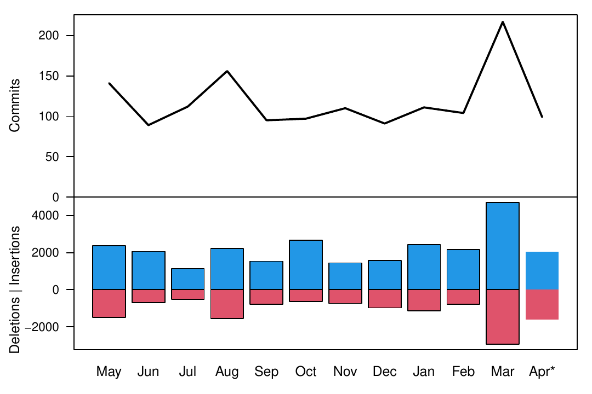
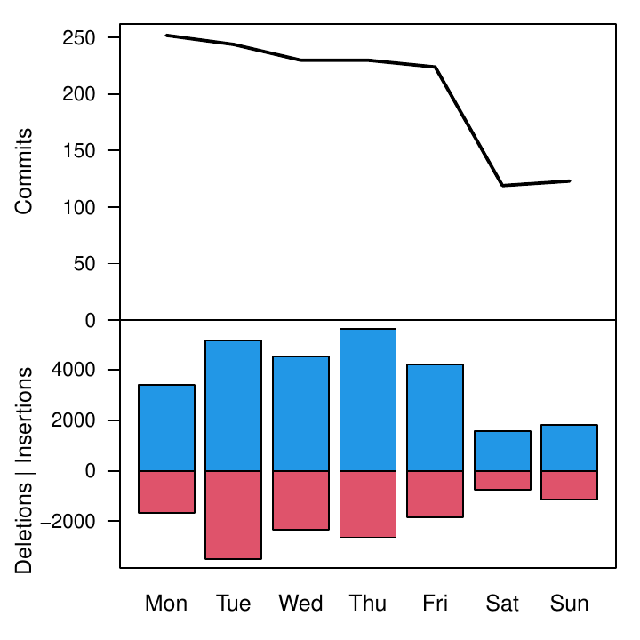
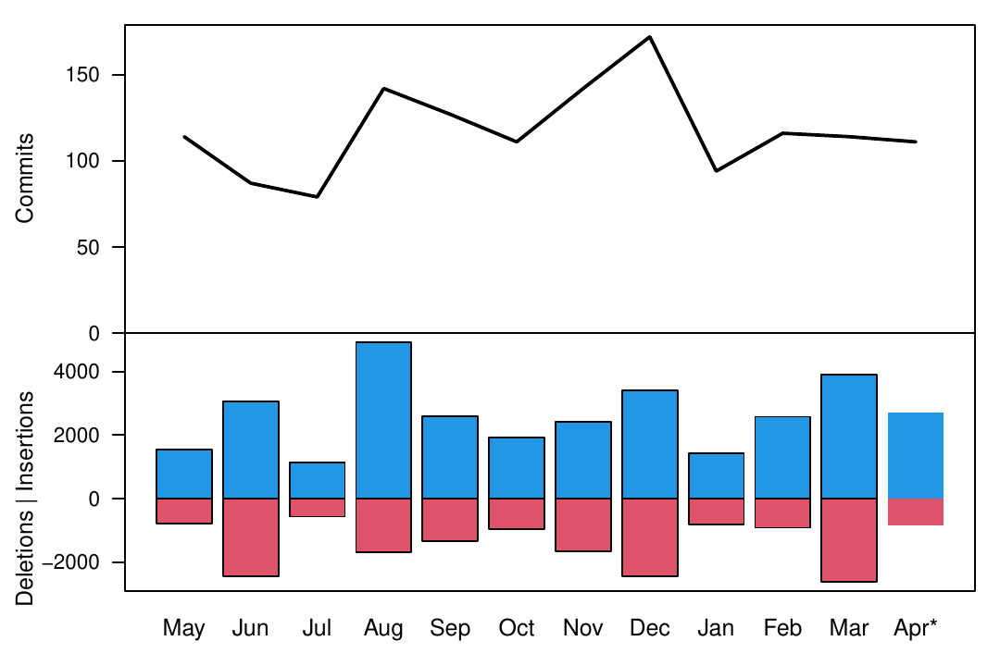
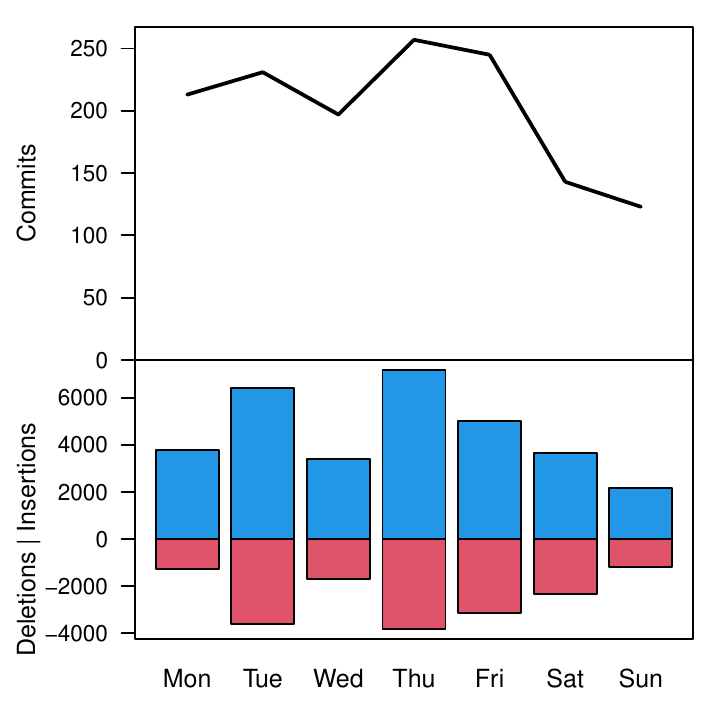
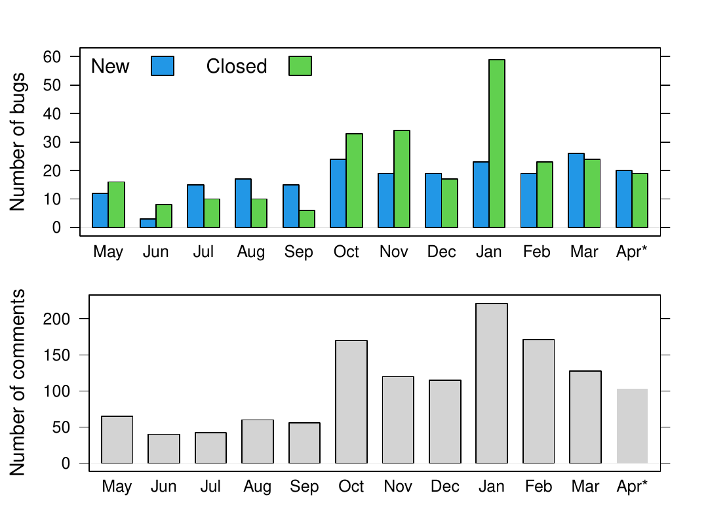
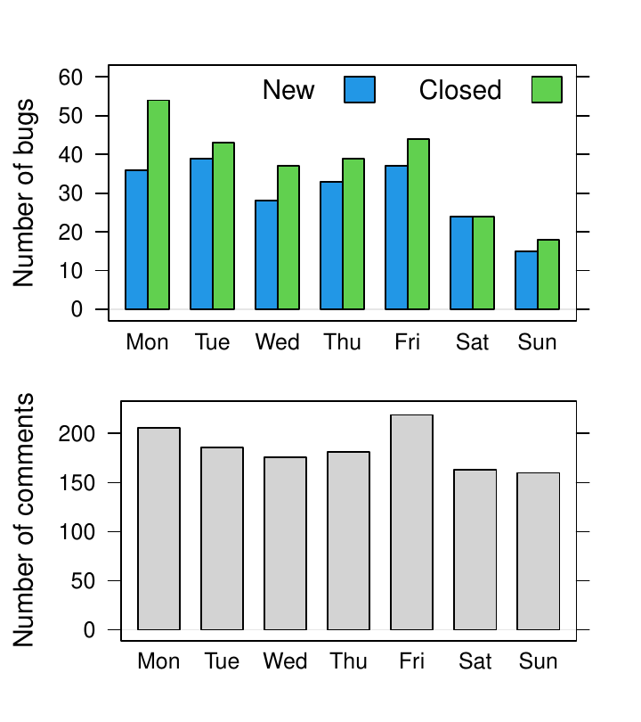
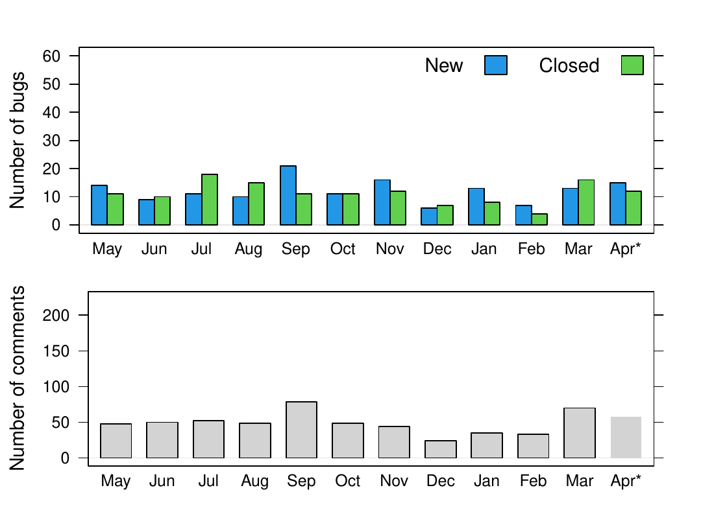
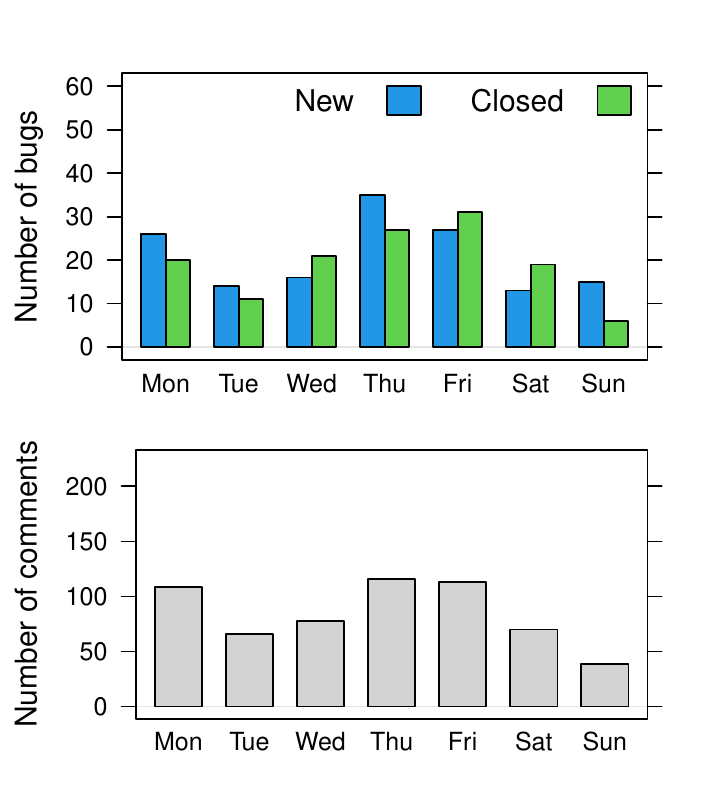

::: article
# R 4.0.0 selected changes

R 4.0.0 (codename "Arbor Day") was released on 2020-04-24. The following
gives a selection of the most important changes.

-   `matrix` objects now also inherit from class `"array"`, so e.g.,
    `class(diag(1))` is `c("matrix", "array")`. S3 methods for class
    `"array"` are now dispatched for `matrix` objects. This reduces the
    need of code duplication between `"array"` and `"matrix"` classes,
    but invalidates code incorrectly assuming that `class(matrix_obj))`
    has length one. In principle, to check whether an object inherits
    from (any) class, one should always use `inherits()` (or `is()`).
    See [Martin Maechler's blog
    post](https://developer.r-project.org/Blog/public/2019/11/09/when-you-think-class.-think-again)
    for more details.
-   There is a new syntax for specifying *raw* character constants
    similar to the one used in C++: `r"(...)"` with `...` any character
    sequence not containing the sequence `)"`. This makes it easier to
    write strings that contain backslashes and/or both single and double
    quotes:
    `r"(c:\Program files\R)"` specifies a Windows directory without
    escaping backslashes. `r"(use both "double" and 'single' quotes)"`
    mixes single and double quotes without the need to escape either of
    them. For more details see `?Quotes`.
-   R now uses a `stringsAsFactors = FALSE` default, and hence by
    default no longer converts strings to factors in calls to
    `data.frame()` and `read.table()`. Automatic conversion of strings
    to factors regardless of the context of the study at hand seems
    conceptually wrong. In addition, when the automatically applied
    order is lexicographical order, the result is locale dependent and
    even so when only ASCII characters are used. Historically, automatic
    conversions to factors could have been disabled on demand, but
    unfortunately that meant that all code dealing with data frames
    would have to support both ways. That was not the case, leading to
    surprising or unpredictable results. A large number of packages
    relied on the previous behavior and so have needed updating. Unlike
    in the case of matrices being treated as arrays, this was a change
    to documented behavior, so even correct package code was affected.
    See [Kurt Hornik's blog
    post](https://developer.r-project.org/Blog/public/2020/02/16/stringsasfactors)
    for more details.
-   Reference counting is now used instead of the `NAMED` mechanism for
    determining when objects can be safely mutated in base C code. This
    reduces the need for copying in some cases and should allow further
    optimizations in the future. It should help make the internal code
    easier to maintain. In principle, even the `NAMED` mechanism was a
    variant of reference counting, but a simple one where the number of
    references could only increase (up to a maximum value). Even as
    simple operations as passing an R object (value) to a function that
    would only read it would permanently increase the reference count of
    that object, even after that reading-only function would return. Any
    modification of that object later on would require a copy. This is
    one of the scenarios fixed by the new mechanism where the reference
    counts can and often do decrease as well, so that R knows much more
    often that some R values are in fact private and can be modified in
    place. This change should not impact existing code (does not break
    packages) using supported coding practices in C/C++. It has no
    direct impact on R code other than performance/memory usage.
-   R now has a listening server socket object which allows to accept
    multiple incoming socket connections. This simplifies implementation
    of servers and allows them to accept multiple connections much
    faster. The time needed to set up a PSOCK cluster has been reduced
    using this new API particularly for clusters with a large number of
    nodes. See [a blog
    post](https://developer.r-project.org/Blog/public/2020/03/17/socket-connections-update)
    of Tomas Kalibera and Luke Tierney for more details.
-   S3 method lookup now by default skips the elements of the search
    path between the global and base environments, and there is a new
    function `.S3method()` to register S3 methods in R scripts. See
    [Kurt Hornik's blog
    post](https://developer.r-project.org/Blog/public/2019/08/19/s3-method-lookup/index.html)
    for more details.
-   The `palette()` function has a new default set of colors which are
    less saturated and have better accessibility properties. There are
    also some new built-in palettes, which are listed by the new
    `palette.pals()` function. The new `palette.colors()` function
    allows a subset of colors to be selected from any of the built-in
    palettes. See [a blog
    post](https://developer.r-project.org/Blog/public/2019/11/21/a-new-palette-for-r)
    of Achim Zeileis, Paul Murrell, Martin Maechler, and Deepayan Sarkar
    for more details.
-   The internal implementation of *grid* units has changed, but the
    only visible effects at user-level should be a slightly different
    print format for some units (especially unit arithmetic), better
    performance (for unit operations) and two new functions `unitType()`
    and `unit.psum()`. Packages that were directly accessing elements of
    the unit implementation needed updating. See a [blog
    post](https://developer.r-project.org/Blog/public/2020/04/13/changes-to-grid-units)
    by Paul Murrell and Thomas Lin Pedersen for more details.
-   The support for symbol fonts in cairo-based graphics devices has
    been improved and one can now specify which symbol font to use. See
    [Paul Murrell's blog
    post](https://developer.r-project.org/Blog/public/2020/04/17/changes-to-symbol-fonts-for-cairo-graphics-devices)
    for more details.

See <https://CRAN.R-project.org/doc/manuals/r-patched/NEWS.html> for all
changes in the current release series of R, which at the time of this
writing is R 4.0.z. Overall, there are 156 news entries for the 4.0.0
release, including 5 significant user-visible changes, 65 new features
and 55 bug fixes.

# R 3.6.z selected changes

R 3.6.0 (codename "Planting of a Tree") was released on 2019-04-26 and
the R 3.6 series closed with the release of R 3.6.3 ("Holding the
Windsock") on 2020-02-29, marking the 20th anniversary of the R 1.0.0
release. The following gives a selection of the most important changes
in the 3.6 series.

-   The default method for generating from a discrete uniform
    distribution (used in `sample()`, for instance) has been changed.
    This addresses the fact, pointed out by [Ottoboni and
    Stark](https://arxiv.org/abs/1809.06520), that the previous method
    made `sample()` noticeably non-uniform on large populations. See
    [PR#17494](https://bugs.R-project.org/bugzilla3/show_bug.cgi?id=17494)
    for a discussion. The previous method can be requested using
    `RNGkind()` or `RNGversion()` if necessary for reproduction of old
    results. Thanks to Duncan Murdoch for contributing the patch and
    Gabe Becker for further assistance.
    The output of `RNGkind()` has been changed to also return the 'kind'
    used by `sample()`.
-   Serialization format version 3 becomes the default for serialization
    and saving of the workspace (`save()`, `serialize()`, `saveRDS()`,
    `compiler::cmpfile()`). Serialized data in format 3 cannot be read
    by versions of R prior to version 3.5.0. Serialization format
    version 2 is still supported and can be selected by `version = 2` in
    the save/serialization functions. The default can be changed back
    for the whole R session by setting environment variables
    `R_DEFAULT_SAVE_VERSION` and `R_DEFAULT_SERIALIZE_VERSION` to `2`.
    For maximal back-compatibility, files `vignette.rds` and
    `partial.rdb` generated by `R CMD build` are in serialization format
    version 2, and resave by default produces files in serialization
    format version 2 (unless the original is already in format version
    3). The new serialization format is already supported since R
    version 3.5.0. It allows compact representation of ALTREP objects,
    so that e.g. compact integer sequences are saved as compact. All
    elements of such sequence have to be enumerated in format version 2.
    The new serialization format also saves the current local encoding
    at the time of serialization and strings in native encoding are
    translated when de-serialized in an R session with different native
    encoding.
-   `library()` and `require()` now allow more control over handling
    search path conflicts when packages are attached. The policy is
    controlled by the new `conflicts.policy` option. See [Luke Tierney's
    blog
    post](https://developer.r-project.org/Blog/public/2019/03/19/managing-search-path-conflicts)
    for more details.
-   R now uses staged installation of R packages. A package is first
    installed into a temporary library invisible to other R sessions and
    then moved to the final library location. This reduces interference
    due to partially installed packages which has been observed
    particularly during parallel installation. See [Tomas Kalibera's
    blog
    post](https://developer.r-project.org/Blog/public/2019/02/14/staged-install)
    for more details.
-   New `hcl.colors()` function to provide wide range of HCL-based color
    palettes with much better perceptual properties than the existing
    RGB/HSV-based palettes like `rainbow()`. Also a new `hcl.pals()`
    function to list available palette names for `hcl.colors()`.
    Contributed by Achim Zeileis. See [blog
    post](https://developer.r-project.org/Blog/public/2019/04/01/hcl-based-color-palettes-in-grdevices)
    of Achim Zeileis and Paul Murrell for more details.
-   There are two new options, `keep.parse.data` and
    `keep.parse.data.pkgs`, which control whether parse data are
    included into source (source references) when `keep.source` or
    `keep.source.pkgs` is `TRUE`. By default, `keep.parse.data.pkgs` is
    now `FALSE`, which changes previous behavior and significantly
    reduces space and time overhead when sources are kept when
    installing packages. See [Tomas Kalibera's blog
    post](https://developer.r-project.org/Blog/public/2019/01/07/parser-speedups)
    for more details on this and other performance optimizations in the
    parser.
-   R 3.6.2 has been fixed to pass hidden string length arguments when
    calling LAPACK from C. Macros were provided also for packages that
    call LAPACK directly. This was urgently needed after a new GNU
    Fortran release introduced optimizations which caused crashes with
    code calling LAPACK (or other Fortran code) the "old way", yet
    widely used in numerical software including CBLAS and LAPACKE
    itself. GNU Fortran disabled again these optimizations by default in
    later releases as a result of these findings. For more details, see
    [Writing R
    Extensions](https://CRAN.R-project.org/doc/manuals/r-release/R-exts.html#Fortran-character-strings)
    and the
    [first](https://developer.r-project.org/Blog/public/2019/05/15/gfortran-issues-with-lapack)
    and
    [second](https://developer.r-project.org/Blog/public/2019/09/25/gfortran-issues-with-lapack-ii/)
    blog post by Tomas Kalibera on this issue (the changes in R were
    implemented and documented by Brian Ripley).
-   New pointer protection C functions `R_PreserveInMSet` and
    `R_ReleaseFromMSet` have been introduced to replace `UNPROTECT_PTR`,
    which is not safe to mix with `UNPROTECT` (and with
    `PROTECT_WITH_INDEX`). Intended for use in parsers only. See [Tomas
    Kalibera's blog
    post](https://developer.r-project.org/Blog/public/2018/12/10/unprotecting-by-value)
    for more details.
-   `S3method()` directives in `NAMESPACE` can now also be used to
    perform *delayed* S3 method registration. Again, see [Kurt Hornik's
    blog
    post](https://developer.r-project.org/Blog/public/2019/08/19/s3-method-lookup/index.html)
    for more details.

See <https://CRAN.R-project.org/doc/manuals/r-devel/NEWS.3.html> for all
changes in the R 3.y.z releases. Overall, there are 233 news entries for
the 3.6.z releases, including 2 significant user-visible changes, 75 new
features and 106 bug fixes.

# R 4.0.0 code statistics

From the source code Subversion repository, changes between April 27,
2019 and April 24, 2020, so the overall code change between R 3.6.0 and
R 4.0.0 was: over 24,000 added lines, 12,000 deleted lines and 900
changed files. This is rounded to thousands/hundreds and excludes
changes to common generated files, partially generated files, bulk
re-organizations, etc. (translations, parsers, autoconf, LAPACK,
R Journal bibliography, test outputs).

Figure [1](#fig:svn40) shows commits by month and weekday, respectively,
counting line-based changes in individual commits, excluding the files
as above. A noticeable increase of activity is in March, so right before
code freeze for the release. A secondary peak of the number of commits
can be observed in August. The low amount of changes in July 2019 may be
due to conferences and vacations.

<figure id="fig:svn40">

<figcaption>Figure 1: Commit statistics by month (left) and weekday
(right) during R 4.0.0 development. *Note that the counts for April
don’t correspond to a unique month.</figcaption>
</figure>

# R 3.6.0 code statistics

Changes between April 23, 2018 and April 26, 2019, so the overall code
change between R 3.5.0 and R 3.6.0 was: nearly 27,000 added lines, over
17,000 deleted lines and nearly 800 changed files. This is again rounded
to thousands/hundreds and excludes changes to common generated files.

Figure [2](#fig:svn36) again shows large changes in March before code
freeze and in August, and decreased activity in July during R
conferences and usual vacations. The right panel suggests that R Core
members work a lot even during the weekends and it was even more so when
working on R 3.6.0 than on R 4.0.0 (compare Saturday and Wednesday).

<figure id="fig:svn36">

<figcaption>Figure 2: Commit statistics by month (left) and weekday
(right) during R 3.6.0 development. *Note that the counts for April
don’t correspond to a unique month.</figcaption>
</figure>

# R 4.0.0 bugs statistics

Summaries of bug-related activities during the development of R 4.0.0
(from April 27, 2019 to April 24, 2020) were derived from the database
underlying [R's Bugzilla system](https://bugs.R-project.org/bugzilla3/).
Figure [3](#fig:bz40) shows statistics of reported/closed bugs and
number of added comments (on any bug report) by calendar month and
weekday, respectively.

<figure id="fig:bz40">

<figcaption>Figure 3: Bug tracking activity by month (left) and weekday
(right) during R 4.0.0 development. *Note that the counts for April
don’t correspond to a unique month.</figcaption>
</figure>

Comments are added by reporters of the bugs, R Core members and external
volunteers. When a bug report is closed, the bug is either fixed or the
report is found invalid. In principle, this can happen multiple times
for a single report, but those cases are rare. Hence the number of
comments is a measure of effort (yet a coarse one which does not
distinguish thorough analyses from one-liners) and the number of bug
closures is a measure of success in dealing with bugs.

The numbers were impacted by an increase in external contributions to
analyzing bugs following a [blog
post](https://developer.r-project.org/Blog/public/2019/10/09/r-can-use-your-help-reviewing-bug-reports)
of Tomas Kalibera and Luke Tierney, published October 9, 2019, asking
the R community for help, and to contribute those analyzes in the form
of comments to R bug reports. There was a considerable increase of
comments in October which has lasted (at least) until April. Note that
the April numbers don't cover a full month and are mostly from the 24
days of R 4.0 development in 2020, so after the blog post (4 days are
from April 2019). The rate of closing bugs has increased as well since
October. What the numbers don't show is that this is also due to
increased activity of R Core that followed increased input from external
volunteers. The numbers also seem to suggest that even new bug reports
are submitted at a higher rate once more external volunteers focus on
analyzing bugs in R.

From the numbers by weekday in the right panel of Figure [3](#fig:bz40)
we again see that the R community keeps working during the weekends.

# R 3.6.0 bugs statistics

Figure [4](#fig:bz36) summarizes bug tracking activities during the
development of R 3.6.0 (from April 23, 2018 to April 26, 2019). The
decline observed in coding activity in July does not exist in
bug-related activities; the number of closed bugs actually peaked in
July.

<figure id="fig:bz36">

<figcaption>Figure 4: Bug tracking activity by month (left) and weekday
(right) during R 3.6.0 development. *Note that the counts for April
don’t correspond to a unique month. For comparison with R 4.0.0, the
y-axes use the same scales as in Figure .</figcaption>
</figure>

# Acknowledgements

Tomas Kalibera's work on the article and R development has received
funding from the Czech Ministry of Education, Youth and Sports from the
Czech Operational Programme Research, Development, and Education, under
grant agreement No.CZ.02.1.01/0.0/0.0/15_003/0000421, and the European
Research Council (ERC) under the European Union's Horizon 2020 research
and innovation programme, under grant agreement No. 695412.
:::
