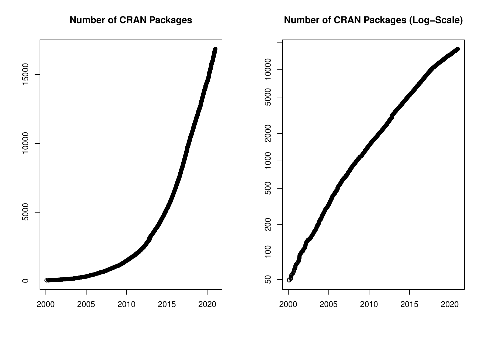

::: article
In the past 4 months, 818 new packages were added to the CRAN package
repository. 100 packages were unarchived and 248 were archived. The
following shows the growth of the number of active packages in the CRAN
package repository:

{width="100%" alt="graphic without alt text"}

On 2020-12-31, the number of active packages was around 16851.

## Changes in the CRAN Repository Policy

The [Policy](https://CRAN.R-project.org/web/packages/policies.html) now
says the following:

-   For R version 4.0 or later (hence a version dependency is required
    or only conditional use is possible), packages may store
    user-specific data, configuration and cache files in their
    respective user directories obtained from `tools::R_user_dir()`,
    provided that by default sizes are kept as small as possible and the
    contents are actively managed (including removing outdated
    material).
-   Security provisions must not be cicrumvented, for example by not
    verifying SSL certificates.
-   Downloads of additional \[.........\] For downloads of more than a
    few MB, ensure that a sufficiently large timeout is set.
-   For a package update, please check that any packages depending on
    this one still pass `R CMD check`: \[.........\] If possible, check
    reverse strong dependencies, reverse suggests and the recursive
    strong dependencies of these (by
    `tools::package_dependencies(reverse = TRUE, which = "most", recursive = "strong")`).

The [CRAN URL
checks](https://cran.r-project.org/web/packages/URL_checks.html) info
now says

-   The CRAN submission checks run by `R CMD check –as-cran` check the
    availability of URLs in files including `DESCRIPTION`, `CITATION`,
    `NEWS.Rd`, `NEWS.md`, `README.md`, and the `.Rd` help pages and HTML
    files in `inst/doc`.
-   A surprisingly large number of websites use redirection and the
    issues may apply to a site redirected to. \[.........\] Where
    redirection is permanent you should use the redirected URL (see [RFC
    7231](https://tools.ietf.org/html/rfc7231#section-6.4.2)).

## CRAN package submissions

## CRAN mirror security

Currently, there are 104 official CRAN mirrors, 77 of which provide both
secure downloads via `https` *and* use secure mirroring from the CRAN
master (via rsync through ssh tunnels). Since the R 3.4.0 release,
`chooseCRANmirror()` offers these mirrors in preference to the others
which are not fully secured (yet).

## New packages in CRAN task views

[*Bayesian*](https://CRAN.R-project.org/view=Bayesian)

:   [*BGVAR*](https://CRAN.R-project.org/package=BGVAR),
    [*LAWBL*](https://CRAN.R-project.org/package=LAWBL),
    [*bayestestR*](https://CRAN.R-project.org/package=bayestestR),
    [*blavaan*](https://CRAN.R-project.org/package=blavaan),
    [*loo*](https://CRAN.R-project.org/package=loo).

[*Cluster*](https://CRAN.R-project.org/view=Cluster)

:   [*FCPS*](https://CRAN.R-project.org/package=FCPS),
    [*crimCV*](https://CRAN.R-project.org/package=crimCV).

[*Distributions*](https://CRAN.R-project.org/view=Distributions)

:   [*CaDENCE*](https://CRAN.R-project.org/package=CaDENCE),
    [*DPQ*](https://CRAN.R-project.org/package=DPQ),
    [*Distributacalcul*](https://CRAN.R-project.org/package=Distributacalcul),
    [*ForestFit*](https://CRAN.R-project.org/package=ForestFit),
    [*MPS*](https://CRAN.R-project.org/package=MPS),
    [*NonNorMvtDist*](https://CRAN.R-project.org/package=NonNorMvtDist),
    [*PoissonBinomial*](https://CRAN.R-project.org/package=PoissonBinomial),
    [*QBAsyDist*](https://CRAN.R-project.org/package=QBAsyDist),
    [*ROOPSD*](https://CRAN.R-project.org/package=ROOPSD),
    [*betafunctions*](https://CRAN.R-project.org/package=betafunctions),
    [*cort*](https://CRAN.R-project.org/package=cort),
    [*dgumbel*](https://CRAN.R-project.org/package=dgumbel),
    [*distributional*](https://CRAN.R-project.org/package=distributional),
    [*distributionsrd*](https://CRAN.R-project.org/package=distributionsrd),
    [*elfDistr*](https://CRAN.R-project.org/package=elfDistr),
    [*ggamma*](https://CRAN.R-project.org/package=ggamma),
    [*mniw*](https://CRAN.R-project.org/package=mniw),
    [*scModels*](https://CRAN.R-project.org/package=scModels),
    [*tvgeom*](https://CRAN.R-project.org/package=tvgeom).

[*Econometrics*](https://CRAN.R-project.org/view=Econometrics)

:   [*NNS*](https://CRAN.R-project.org/package=NNS).

[*Finance*](https://CRAN.R-project.org/view=Finance)

:   [*FFdownload*](https://CRAN.R-project.org/package=FFdownload),
    [*bmgarch*](https://CRAN.R-project.org/package=bmgarch),
    [*garchx*](https://CRAN.R-project.org/package=garchx),
    [*simfinapi*](https://CRAN.R-project.org/package=simfinapi).

[*FunctionalData*](https://CRAN.R-project.org/view=FunctionalData)

:   [*FDboost*](https://CRAN.R-project.org/package=FDboost)$^*$,
    [*fdaoutlier*](https://CRAN.R-project.org/package=fdaoutlier),
    [*refund*](https://CRAN.R-project.org/package=refund)$^*$.

[*Genetics*](https://CRAN.R-project.org/view=Genetics)

:   [*SNPassoc*](https://CRAN.R-project.org/package=SNPassoc).

[*HighPerformanceComputing*](https://CRAN.R-project.org/view=HighPerformanceComputing)

:   [*flexiblas*](https://CRAN.R-project.org/package=flexiblas).

[*Hydrology*](https://CRAN.R-project.org/view=Hydrology)

:   [*weathercan*](https://CRAN.R-project.org/package=weathercan).

[*MachineLearning*](https://CRAN.R-project.org/view=MachineLearning)

:   [*mlr3proba*](https://CRAN.R-project.org/package=mlr3proba).

[*MetaAnalysis*](https://CRAN.R-project.org/view=MetaAnalysis)

:   [*boot.heterogeneity*](https://CRAN.R-project.org/package=boot.heterogeneity),
    [*clubSandwich*](https://CRAN.R-project.org/package=clubSandwich),
    [*concurve*](https://CRAN.R-project.org/package=concurve),
    [*estimraw*](https://CRAN.R-project.org/package=estimraw),
    [*gemtc*](https://CRAN.R-project.org/package=gemtc),
    [*metabolic*](https://CRAN.R-project.org/package=metabolic),
    [*multinma*](https://CRAN.R-project.org/package=multinma).

[*MissingData*](https://CRAN.R-project.org/view=MissingData)

:   [*SNPassoc*](https://CRAN.R-project.org/package=SNPassoc).

[*OfficialStatistics*](https://CRAN.R-project.org/view=OfficialStatistics)

:   [*reclin*](https://CRAN.R-project.org/package=reclin).

[*Optimization*](https://CRAN.R-project.org/view=Optimization)

:   [*irace*](https://CRAN.R-project.org/package=irace),
    [*qpmadr*](https://CRAN.R-project.org/package=qpmadr).

[*Psychometrics*](https://CRAN.R-project.org/view=Psychometrics)

:   [*EstimateGroupNetwork*](https://CRAN.R-project.org/package=EstimateGroupNetwork),
    [*LAWBL*](https://CRAN.R-project.org/package=LAWBL),
    [*betafunctions*](https://CRAN.R-project.org/package=betafunctions),
    [*cops*](https://CRAN.R-project.org/package=cops).

[*ReproducibleResearch*](https://CRAN.R-project.org/view=ReproducibleResearch)

:   [*ascii*](https://CRAN.R-project.org/package=ascii),
    [*flextable*](https://CRAN.R-project.org/package=flextable),
    [*flowr*](https://CRAN.R-project.org/package=flowr),
    [*groundhog*](https://CRAN.R-project.org/package=groundhog),
    [*liftr*](https://CRAN.R-project.org/package=liftr),
    [*mschart*](https://CRAN.R-project.org/package=mschart),
    [*officer*](https://CRAN.R-project.org/package=officer),
    [*openxlsx*](https://CRAN.R-project.org/package=openxlsx),
    [*readODS*](https://CRAN.R-project.org/package=readODS),
    [*switchr*](https://CRAN.R-project.org/package=switchr),
    [*trackr*](https://CRAN.R-project.org/package=trackr),
    [*tth*](https://CRAN.R-project.org/package=tth),
    [*worcs*](https://CRAN.R-project.org/package=worcs),
    [*xaringan*](https://CRAN.R-project.org/package=xaringan),
    [*zoon*](https://CRAN.R-project.org/package=zoon).

[*Robust*](https://CRAN.R-project.org/view=Robust)

:   [*rlme*](https://CRAN.R-project.org/package=rlme).

[*TeachingStatistics*](https://CRAN.R-project.org/view=TeachingStatistics)

:   [*bivariate*](https://CRAN.R-project.org/package=bivariate).

[*TimeSeries*](https://CRAN.R-project.org/view=TimeSeries)

:   [*FKF.SP*](https://CRAN.R-project.org/package=FKF.SP),
    [*FoReco*](https://CRAN.R-project.org/package=FoReco),
    [*RobKF*](https://CRAN.R-project.org/package=RobKF),
    [*TSA*](https://CRAN.R-project.org/package=TSA),
    [*TSdist*](https://CRAN.R-project.org/package=TSdist),
    [*breakfast*](https://CRAN.R-project.org/package=breakfast),
    [*diffusion*](https://CRAN.R-project.org/package=diffusion),
    [*fredr*](https://CRAN.R-project.org/package=fredr),
    [*greybox*](https://CRAN.R-project.org/package=greybox),
    [*ifultools*](https://CRAN.R-project.org/package=ifultools),
    [*modeltime*](https://CRAN.R-project.org/package=modeltime),
    [*modeltime.ensemble*](https://CRAN.R-project.org/package=modeltime.ensemble),
    [*mssm*](https://CRAN.R-project.org/package=mssm),
    [*portes*](https://CRAN.R-project.org/package=portes),
    [*readabs*](https://CRAN.R-project.org/package=readabs),
    [*tfarima*](https://CRAN.R-project.org/package=tfarima),
    [*tsibbletalk*](https://CRAN.R-project.org/package=tsibbletalk),
    [*tsutils*](https://CRAN.R-project.org/package=tsutils).

[*WebTechnologies*](https://CRAN.R-project.org/view=WebTechnologies)

:   [*Rlinkedin*](https://CRAN.R-project.org/package=Rlinkedin),
    [*ipaddress*](https://CRAN.R-project.org/package=ipaddress),
    [*rdrop2*](https://CRAN.R-project.org/package=rdrop2).

[*gR*](https://CRAN.R-project.org/view=gR)

:   [*spectralGraphTopology*](https://CRAN.R-project.org/package=spectralGraphTopology).

(\* = core package)
:::
