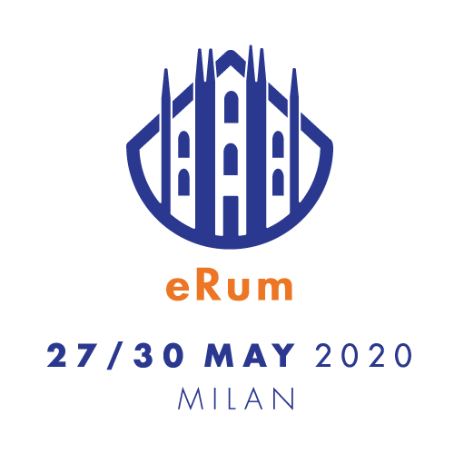

::: article
# Introduction

The European R Users Meeting (eRum) is a series of international
conferences that aims to bring together members of the R Community from
all over Europe. Hallmarks of this conference are its openness to both
the academic and the business world, and low registration fees that aim
to minimize the financial burden required to attend the conference.

The first two editions of eRum, eRum2016 and eRum2018, were hosted in
Poznan, Poland, in October 2016 [@erum2016], and in Budapest, Hungary,
in May 2018 [@erum2018]. The third edition of eRum, eRum2020, was
originally planned to be held in Milano, Italy, in May 2020. The
organization of the 2020 conference was already at an advanced stage in
February 2020, when the outburst of the COVID-19 pandemic in Northern
Italy casted serious doubts on the possibility to hold a physical event
in Milano in the upcoming months. After evaluating several alternative
options, the Organizing Committee took the decision to turn the event
into a free virtual conference to be held from June 17 to June 20, 2020.
To mark this change into a virtual event, the 2020 edition was renamed
e-Rum2020.

The organization of an international conference typically requires the
collaboration and coordination of several professionals, as well as
continuous interactions with many stakeholders and service providers. If
organizing a conference can already be considered a challenging
experience itself, having to quickly turn a physical meeting into a
virtual conference in the very middle of a pandemic and of an
unprecedented lockdown posed additional, unforeseen organizational
challenges.

With this article we would like not only to report how e-Rum2020 went,
but also to describe the challenges that we encountered during the
organization of the conference, and how we reacted to them. In doing so,
we aim to provide future conference organizers with useful information
on how to organize a successful virtual conference, and even to turn a
physical conference into a virtual meeting on a relatively short notice.

# Pre-pandemic arrangements

The original plan was to hold eRum2020 at two universities located in
Milano, Italy. The first three days (May, 27th-29th) of the conference
would have been hosted by the Università degli Studi di Milano-Bicocca,
and the last day (May, 30th), dedicated to workshops, by the Politecnico
di Milano. We planned a maximum capacity of 900 participants for the
event. The conference would have included a social event that was going
to take place at a facility located in Sempione Park, a park in the
historical centre of Milano, next to the Sforza Castle.

To facilitate attendance from professionals with parenting
responsibilities, at both venues we had arranged a childcare service for
kids aged 2-8 years old. An open call for travel grants was published,
resulting in 60 applications. A selection committee reviewed the
applications and selected 10 awardees based on criteria such as
financial need, potential career and development prospects, and expected
community impact.

# Decision to go virtual

In February 2020, Italy was the first European country to be hit by the
COVID-19 pandemic, with initial outbreaks right in Northern Italy, a few
kilometers away from Milano. At that time, the conference organization
was already at a fairly advanced stage. In addition to having set the
location (including catering facilities, childcare, social event, etc),
the scientific program was also being finalised: we had already closed
the call for contributions (which received about 220 submissions), we
were in the process of notifying authors of accepted contributions,
keynote and invited speakers, and we had already sold about 100 tickets.
Sixteen between sponsors and organizing partners had signed up for
specific sponsorship packages that relied on physical presence,
interaction and visibility during the event.

All throughout February and March, we closely monitored the pandemic
situation. We organized weekly meetings to discuss the steps to take
based on the daily evolution of the containment measures and of the
spread of COVID-19 itself. We initially considered three alternatives:
(1) cancelling eRum2020, (2) postponing it, or (3) turning the event
into a virtual conference. While we were preparing for the second
option, Italy was becoming the first country to progressively implement
a nationwide lockdown amid COVID-19, and the pandemic was hitting more
and more countries. The uncertainty around the possibility of organizing
large gatherings by the end of 2020 was growing, and postponing the
event was becoming too much of a risk: hence, on April 6th we announced
to our sponsors and organizing partners the intention of turning
eRum2020 into an online conference (e-Rum2020) and of postponing the
event by three weeks to allow more time to re-adjust the format.

Up until that moment, the conference had been completely conceived as an
in-person meeting, with several arrangements driven by the pursuit of
interaction and conviviality. Switching to an online format was the best
choice to preserve the work that we had done, but it also meant
additional work to completely rethink the event, and it required some
courage to dismantle the old conference structure that we had been
working on for a year. In rethinking e-Rum2020, we strived to provide a
virtual experience that could be as close as possible to the physical
one, and to make the transition as smooth as possible, living up to the
expectations of sponsors, speakers and attendees.

While buying time for re-organizing the format and exploring online
conferencing platforms, we needed to keep the attention high and the
possible audience engaged. We therefore increased the presence of
e-Rum2020 on social media (generating additional contents and creating a
dedicated YouTube channel) and organized a contest featuring
applications of R to data on the COVID-19 pandemic (CovidR contest). We
adapted the sponsorship package to the new format by replacing those
benefits that required physical interaction (e.g., physical sponsors'
booths during the event) with virtual equivalents. Additional visibility
was offered through social media, online pre-conference activities and
virtual banners, and we also included the possibility of organizing
virtual recruiting sessions. Given the reduced costs that the virtual
event entailed, we cancelled the registration fees, turning e-Rum2020 in
an event free of charge. We refunded previously purchased tickets, and
reduced the cost of sponsorship packages.

Following our "as close as possible to physical\" principle, we decided
that all talks were going to be presented live, with Q&A sessions
tailored to the different types of talks. In order to make up for the
absence of in-person interaction, we also decided to have dedicated
networking areas and to add yoga sessions at the beginning and at the
end of each day. In a few days, we realised that the online format was
actually a great opportunity to come up with new ideas, and that we
could leverage it to bring the conference to a worldwide reach.

In the remainder of the article, we present the technical solutions that
we adopted for the virtual conference, the promotion strategy that we
implemented to increase the reach of e-Rum2020, and the organization and
contents of e-Rum2020's scientific program.

# Technical solutions

A primary challenge in the organization of the virtual conference was
the identification of technological solutions that could be used to
connect participants throughout the event. After comparing several
alternative services, we chose to resort to an online conferencing
platform called Hopin (<https://hopin.to>). This choice was made because
Hopin could efficiently recreate the spaces of a live conference in
digital format (reception area, main stage, parallel sessions, sponsors
booths, etc). Key factors that motivated our choice were the possibility
to hold all sessions live, to have dedicated spaces for both plenary
events and parallel sessions, and networking spaces that made
interactions between speakers, attendees and sponsors possible.

The conference platform, however, was not the only technological tool
needed to provide a smooth conferencing experience. We soon realized
that none of the available conferencing platforms, including Hopin,
could provide us with a fully comprehensive set of tools, and therefore
we decided to complement it with additional tools.

For example, a limitation of Hopin was the lack of a system to
communicate effectively "behind the scenes". To address this problem, we
created a Slack channel to manage backstage communications between staff
members, speakers and session chairs, and to provide the attendees with
technical support. We also decided to manage the Q&A of keynote sessions
with sli.do, and to stream part of the event live on YouTube. We used
Voicemod to launch applauses and other sounds during the live streaming,
and restream.io to handle breaking times and slideshows in the YouTube
streaming.

An essential part of this technological setup was the need to explain
how it would have worked, and test it with our staff, speakers and
session chairs. Four mock events were held with the Organizing Committee
members to check that the setup was functional and could accommodate our
ideas. Furthermore, we decided to hold a pre-conference event, called
CovidR, that was used as dry-run for the event platform, structure and
backstage communication tools (we will come back to CovidR in a later
section). We wrote a set of guides with detailed instructions for
speakers, sponsors and sessions chairs. Lastly, we organized speaker
tests to train speakers and session chairs. These tests proved extremely
useful not only for the speakers, who learned to use a new and complex
tool, but also for us, because it helped us to identify the most common
problems and how to solve them before the virtual event took place.

To ensure that sessions ran smoothly, we complemented session chairs
with additional support staff: each session had an OC member assigned as
supervisor and a Q&A assistant who collected questions during the
sessions. We also planned back-ups for each role, in case of connection
problems or technical issues. Moreover, we organized technical
assistance throughout the whole event.

# Promotion of the event

The promotion e-Rum2020 was taken care of by a team of Organizing
Committee members, who were supported in their tasks by a graphic
designer. The first tasks involved the creation of a logo for the
conference, and of the conference website. The logo was initially
designed for the physical event that was to be held in Milano; for this
reason, it included a stylized representation of the Duomo di Milano,
one of the main landmarks of the city. When the decision to hold the
event virtually was announced, we decided to redesign the logo by
updating event name and dates, and adding a wifi symbol on top of the
cathedral (Figure [1](#fig:logo)).

<figure id="fig:logo">

<figcaption>Figure 1: The conference logos designed for the physical
conference (eRum2020) that should have been held in May 2020 (left) and
for the virtual event (e-Rum2020) that was held in June 2020
(right).</figcaption>
</figure>

The conference website (<https://2020.erum.io>) was developed using
Wordpress, using a color palette and graphical style in line with those
used in the conference logo. We opted for a multi-page design with
sections and subsections, with the purpose of easing information
retrieval. The website underwent frequent updates that reflected
important milestones (e.g., opening of submission period, opening of
registrations, announcement of virtual event, publication of the
program, etc.), with a major reorganization carried out to adapt it to
the virtual conference format.

The conference promotion strategy was designed to be fully virtual and
costless; it mostly relied on the use of social media (Twitter, Facebook
and LinkedIn), on the blog of the MilanoR foundation and on emails
spread on target mailing lists. The social media communication strategy
was organized using an editorial calendar, in which all announcements
and posts for each week were scheduled from the start, thereby making
sure that the style and content were uniform over different channels and
over time. After the decision to transition to an online conference, we
created a dedicated e-Rum2020 YouTube channel and we redrafted the
editorial calendar, including additional contents (video interviews with
keynote speakers, information about the CovidR pre-conference event,
etc.). Among the social networks used, we found Twitter to be the one
that generated the highest engagement; the number of followers of
eRum2020's Twitter page doubled in a year (growing from 1108 in June
2019 to 2313 in June 2020), with a steep increase observed when the
conference was turned into a virtual event (Figure [2](#fig:twitter)).

{#fig:twitter
width="100%" alt="graphic without alt text"}

The creation of the e-Rum2020 YouTube channel was instrumental to
support the virtual event. To increase e-Rum2020's outreach, we recorded
5 interviews with the keynote speakers that were published prior to the
conference. The interviews were intentionally informal and provided a
relaxed narration of personal experiences and R-related stories of the
speakers. The channel was also used to stream plenary sessions live
during the event, and to publish recordings of all conference sessions
after the end of the event. In total, the channel currently hosts 59
videos organized in 12 playlists, with a total of 36 hours of edited
material uploaded.

# Scientific Program

The Scientific Program of e-Rum2020 comprised several types of sessions,
which ranged from keynote and invited sessions to different types of
contributed sessions (workshops, regular talks, lightning talks, shiny
demos and posters). All sessions were organized around a 4-days
schedule, with the last day entirely dedicated to the workshops.
Moreover, the conference was preceded by two satellite events: the
CovidR pre-conference event, and a hackathon on spatial networks.

To ensure a balanced representation of the main fields of application of
R, we identified 6 tracks that were used to guide the selection of both
keynote and invited speakers, and of contributed sessions. The tracks
were: Machine Learning and Modelling, R World, Applications, Life
Sciences, Data Visualization and R in Production.

## Keynote and invited sessions

The invited part of the program comprised six keynote sessions of 45
minutes, and three invited sessions of 90 minutes each. Six keynote
speakers were selected to represent the 6 conference tracks. Of the 11
invited speakers, 9 were selected in representation of the 6 tracks, and
two were invited to present their work at eRum2020 after winning the
CovidR contest.

## Contributed sessions

The call for contributed sessions was opened on December 11, 2019, and
closed on January 29, 2020, well before the outbreak of the pandemic in
Europe. Abstracts were submitted through the Sessionize system, which
offered a number of features for handling mass communications with
users, but was lacking a simple yet efficient mechanism for evaluation,
with the widely used 1-5 notes for scoring each contribution. We
therefore decided to complement it by developing assessR
(<https://github.com/Milano-R/assessr>), a Shiny app that seamlessly
displayed the most relevant information for each abstract. The app kept
the author information hidden, as we believed that a blinded procedure
would encourage reviewers to assess the content in a fairer way.

For the evaluation of the submitted abstracts, we created a Program
Committee (PC) whose members were selected in representation of the
conference tracks, and were asked to score contributions specific to
their field of expertise. The PC members were: Aldo Solari, Enrico
Deusebio, Charlotte Soneson, Branko Kovac, Andrie De Vries, Fulvia
Pennoni, Goran Milovanović, Davide Cittaro, Hannah Frick, Adolfo Alvaro,
Olga Mierzwa-Sulima, Gergely Daróczi, Piercesare Secchi, Diane Beldame,
Xavier Adam, Davide Risso, Pier Luca Lanzi, Levi Waldron, Heather
Turner, Martin Mächler, Stefano Maria Iacus.

We received a total of 230 contributions (Figure [3](#fig:submissions)),
of which 32 for workshops. Of these, 94 (including 11 workshops) were
selected for presentation at e-Rum2020. All contributed sessions, with
the exception of workshops, were organized in two parallel tracks (later
assigned to specific rooms in the system provided by Hopin), spread over
3 days. A separate day was dedicated to the workshops.

{#fig:submissions width="100%"
alt="graphic without alt text"}

## Definition of the final program

The final lineup of talks and contributions reflected a nice balance
across the six tracks. As we expected that due to the online format
participants might have been able to join and stay focused for shorter
stretches of time, we decided to shorten the length of all talks.

Each session type was linked to a specific room configuration for Q&As:
for example, invited speakers had the possibility to individually host
people at a virtual table, while panel Q&A sessions were organized for
regular and lightning talks. Considering the time zones of our speakers
was another important aspect to take into account. Most contributed
sessions were submitted from Europe, but we were also able to
accommodate late afternoon slots from the Pacific Time Zone.

Titles, abstracts and authors of each contribution, arranged by format,
were published as a booklet using *bookdown*
(<https://2020.erum.io/program/contributed-sessions>). That choice made
easy and flexible its updates, progressively following confirmations,
renunciations and possible changes. The final program of e-Rum2020,
comprehensive of the conference schedule, was then published as a
brochure (<https://2020.erum.io/program>).

## Hackathon on spatial networks

The beginning of e-Rum2020 was preceded by a satellite event on spatial
networks that was held the day before the conference. The event
comprised an online webinar and a hackathon, and it focused on
introducing and testing *sfnetworks*, a new R package for the analysis
of spatial networks. The satellite event was organized by Andrea
Gilardi, Lorena Abad, Robin Lovelace and Lucas van der Meer.

## CovidR pre-conference event

A significant addition to e-Rum2020, decided alongside with the
transition to a virtual conference, was CovidR: a contest and
pre-conference event featuring open-source R contributions around the
topic of the COVID-19 pandemic. Since the beginning of the pandemic, the
R community has been very active in using R for analyzing data,
developing models and providing useful visualizations. The idea behind
CovidR was to collect such contributions and motivate the community to
share and spread their work through a contest.

The CovidR submission process was based on a GitHub repository
(<https://github.com/Milano-R/erum2020-covidr-contest>) and a
streamlined Pull Request mechanism, from which we constructed an R
Markdown gallery website
(<https://milano-r.github.io/erum2020-covidr-contest>). The website
gallery was constructed using the R package *rmdgallery*
(<https://riccardoporreca.github.io/rmdgallery>), which was developed
alongside the contest. The gallery allowed community engagement through
the possibility of thumb-up voting submitted contributions.

Out of the 35 submissions to the contest, 15 were selected to be
presented at the CovidR pre-conference event, which was held on May 29,
2020. The event featured 5-minute-long presentations and virtual round
tables for Q&As, with awards granted based on the overall quality of the
contributions, as well as on community feedback. The two winners of the
contest were invited to give an extended presentation of their work at
e-Rum2020.

A secondary, but important aspect of this pre-conference was that it
enabled us to test the technical tools and the overall process of
running a large virtual event. The technical preparation and smoothness
of the main conference owe a lot to the lessons learned and confidence
gained during CovidR.

# e-Rum2020 in figures

Conference tickets were sold out, with 2000 registered participants.
After registration, 1379 participants actively attended the conference.
The CovidR pre-conference event and the workshops were respectively
attended by 171 and 513 participants. Figure [4](#fig:participants)
shows the geographic distribution of the conference attendees.

{#fig:participants width="100%"
alt="graphic without alt text"}

The program consisted of 104 speakers, among which 6 keynote speakers,
12 invited speakers, and 86 contributed talks. The contributed talk
included 39 regular talks, 23 lightning talks, 11 Shiny demos and 13
poster presentations.

The conference staff was entirely composed by volunteers. It counted 21
Organizing Committee members, 21 Program Committee members, 23 session
chairs, 7 Q&A assistants, 7 technical support assistants and 1 social
media assistant.

# Organizers

e-Rum2020 was jointly organized by the e-Rum2020 Organizing Committee,
the MilanoR association, two universities (Università di Milano-Bicocca
and Politecnico di Milano), and two data science firms (VanLog and Mirai
Solutions). The event received the patronage of Comune di Milano.

The Organizing Committee of e-Rum2020 consisted of 21 volunteers based
in 5 different European countries (Italy, Switzerland, Belgium, The
Netherlands and Germany): Mariachiara Fortuna, Francesca Vitalini,
Emanuela Furfaro, Mirko Signorelli, Federico Marini, Riccardo L. Rossi,
Roberta Sirovich, Andrea Meloncelli, Lorenzo Salvi, Riccardo Porreca,
Andrea Guzzo, Gert Janssenswillen, Serena Signorelli, Filippo Chiarello,
Matteo Pelagatti, Gabriele Orlando, Matteo Borrotti, Laura Terzera,
Marta Galvani, Matteo Fontana and Parvaneh Shafiei.

# Sponsors

We would like to thank all the sponsors that supported the organization
of e-Rum2020: RStudio, Open Analytics, cynkra, the R Consortium, the SDG
group, Revelo Datalabs, SolidQ, Appsilon Data Science, datahouse and
Kode, as well as our in-kind sponsors StickerMule and CRC Press.

# Acknowledgments

As members of the e-Rum2020 Organizing Committee, we would like to thank
all the volunteers that contributed to the success of e-Rum2020: the
Program Committee members, keynote, invited and contributed speakers,
and all the volunteers that helped as session chairs, or helped managing
the Q&A, technical support for attendees and social media coverage
during the event.

# Links

Further information about e-Rum2020 and the contributions presented
during the conference can be found at the following links:

1.  conference website: <https://2020.erum.io>

2.  e-Rum2020 Youtube channel: <https://www.youtube.com/c/eRum2020>

3.  conference materials:
    <https://github.com/Milano-R/erum2020program#readme>

4.  CovidR gallery with all submissions for the CovidR pre-conference
    event: <https://milano-r.github.io/erum2020-covidr-contest>

5.  AssessR shiny app: <https://github.com/Milano-R/assessr>
:::

[^1]: Corresponding author
