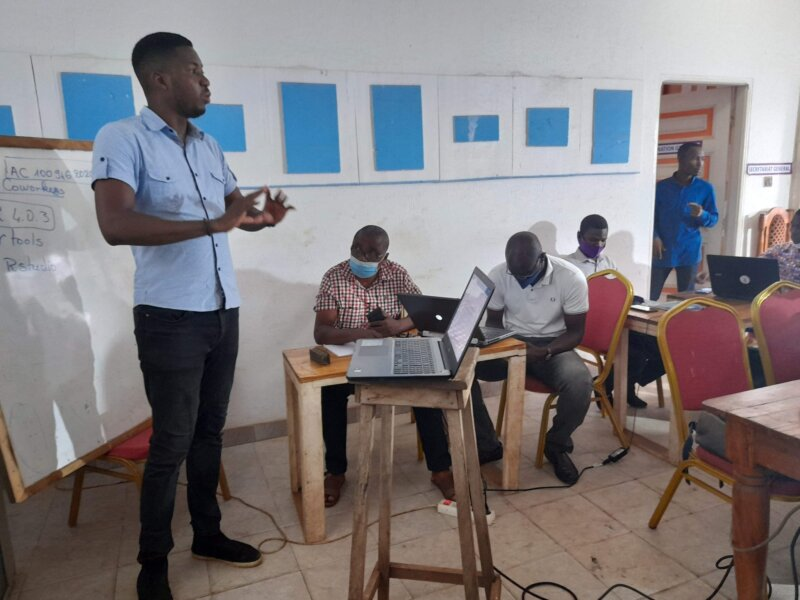
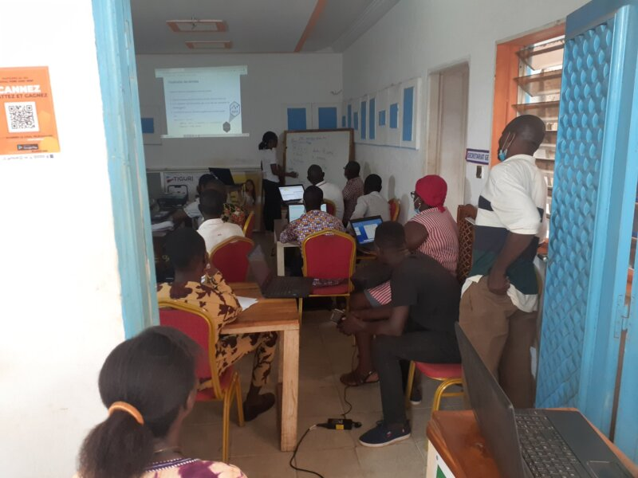

::: article
[Forwards](https://forwards.github.io/) is an R Foundation taskforce
working to widen the participation of under-represented groups in the R
project and in related activities, such as the *useR!* conference. This
report rounds up activities of the taskforce during the second half of
2020.

# *useR! 2020* breakout session: *Supporting diversity in the R community*

In this breakout session at *useR! 2020*, a panel shared their
experience as members of marginalized groups or as allies, then
responded to Q&A from *useR!* participants. The panel was chaired by
Laura Ación ([LatinR](https://latin-r.com/) co-founder) and Shelmith
Kariuki ([AfricaR](https://africa-r.org/) co-founder), and the panelists
were Yanina Bellini Saibene ([R-Ladies](https://rladies.org/) Global
Team and LatinR co-founder), Laís Carvalho (Python Ireland board
member), Richard Ngamita
([KampalaR](https://www.meetup.com/Kampala-R-Users-Group/) founder and
Forwards Community Team member), Danielle Smalls-Perkins
([MiR](https://www.mircommunity.com/) co-founder), Robin Williams
([Blind R User
Group](https://www.nfbnet.org/mailman/listinfo/blindrug_nfbnet.org)
member), and Greg Wilson (Software Carpentry co-founder and Education
team member at RStudio).

The panel discussed a range of barriers to participation, such as
language barriers, limited access to education and conferences, specific
challenges faced by visually impaired folk and feelings of isolation due
to location or identity. They highlighted some positive steps the R
community has made to promote inclusion, for example, founding groups
such as Forwards, R-Ladies, AfricaR, MiR and the Blind R User Group;
offering diversity scholarships at R conferences and developing
technical solutions to improve accessibility. However, the panel also
raised the need for greater inclusion of people from minority groups in
decision-making and for accessibility to be at the centre of R
development and R community events. Allies were recommended to work
closely with affinity groups and to base actions on established
research, for example following the [Ally Skills
Workshop](https://frameshiftconsulting.com/ally-skills-workshop/)
(material available under CC BY-SA 4.0). Further suggestions made in the
Q&A included offering more tutorials/materials in languages other than
English, subtitling videos and offering live streaming.

The full video of the session is available on
[YouTube](https://youtu.be/gDO1OphmF5Q) with live chat replay. This
session was organized by Forwards members Damiano Cerasuolo, Jonathan
Godfrey, Liz Hare, Tatjana Kecojevic, Imke Mayer, Kevin O'Brien, Noa
Tamir and Heather Turner.

# R Contribution Working Group

Partly in response to the useR! breakout session, Forwards established a
group to work on initiatives to encourage new contributors to R core,
with a focus on diversity and inclusion. The R Contribution Working
Group is open to anyone interested in working towards this goal and
representatives from R Core, the R Foundation, Forwards, R-Ladies, MiR,
the R Consortium Diversity and Inclusion Working Group, as well as
members of the general R community have joined in. The group has met
every 1-2 months since July 2020, alternating between the second Friday
of the month, 15:00 UTC and the second Tuesday of the month, 21:00 UTC.

The group recently created the [R Contribution
Site](https://forwards.github.io/rcontribution/) to host information for
people interested in contributing to R core, which has information on a
Slack group that people can join to discuss related issues and support
each other in progressing as R contributors. Other initiatives include
planning contributor-focused events for useR! 2021. Minutes of meetings
and work in progress is gathered in the public [rcontribution repository
on Forwards GitHub](https://github.com/forwards/rcontribution).

# Introduction to R Workshop, Lomé, Togo

A 2-day Introduction to R workshop in Lomé, Togo, was held on 16-17
December 2020. The workshop was organized by Anicet Ebou, a member of
the AfricaR leadership team based in Ivory Coast. The objective was to
introduce people to R and plant the seeds for a local R User Group (as
far as we are aware, there is no R-related meetup in Togo). The workshop
was co-taught by Audrey Addablah, a leader of Abidjan R User Group
(Ivory Coast) and supported by the Why R? Foundation and the R
Consortium, as well as Forwards and AfricaR.

<figure id="figure:rlogo">

<figcaption>Figure 1: Anicet Ebou (left) and Audrey Addablah (right)
teaching at the workshop in Lomé, Togo</figcaption>
</figure>

Audrey and Anicet introduced the workshop participants to handling and
visualising data in R. More than 20 people attended the event, including
students and professionals from a range of sectors. The participants
showed a real interest and we are hopeful that training will continue
online and in person in future months.

# Latin America Survey

Paola Corrales and Claudia Huaylla joined the Forwards survey team to
collaborate on a survey of R users that were born or currently live in
Latin America. The survey received close to 1000 responses and they are
currently working with other Latin American R users to analyse the
results, with a view to report further in 2021.

# Package Development Modules

The teaching team have been working on modularizing the Forwards package
development workshop materials (developed under a grant from the R
Consortium to run [Workshops for Women and
Girls](https://forwards.github.io/blog/2019/09/22/workshops-for-women-and-girls/)).
Emma Rand and Mine Çetinkaya-Rundel plan to teach the first three
modules online, February 1-3, 2021, at 14:30-15:30 UTC each day. You can
register for the modules on eventbrite: [Packages in a
nutshell](https://www.eventbrite.co.uk/e/r-forwards-package-development-module-packages-in-a-nutshell-tickets-132109351627),
[Setting up your
system](https://www.eventbrite.co.uk/e/r-forwards-package-development-module-setting-up-your-system-tickets-132115790887),
[Your first
package!](https://www.eventbrite.co.uk/e/r-forwards-package-development-module-your-first-package-tickets-132115738731).

# Changes in Membership

## New members

We welcome the following members to the taskforce:

-   Community team: s gwynn sturdevant.
-   Conferences team: Miljenka Vuko, Becca Wilson.
-   On-ramps team: Jyoti Bhogal, Michael Chirico, Maya Gans, Saranjeet
    Kaur Bhogal.
-   Social media team: Maria Prokofieva.
-   Surveys team: Pavitra Chakravarty, Paola Corrales, Claudia Huaylla,
    Anna Vasylytsya (co-leader).
-   Teaching team: Mine Çetinkaya-Rundel (co-leader).

## Previous members

The following members have stepped down:

-   Conferences team: Jesse Mostipak.
-   On-ramps team: Zhian N. Kamvar, Charlotte Wickham.
-   Social media team: David Smith.
-   Teaching team: Angela Li (co-leader), Dorris Scott.

We thank them for their contribution to the taskforce.
:::
