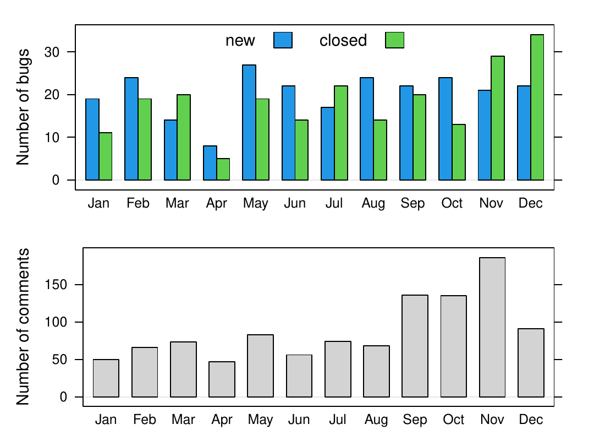
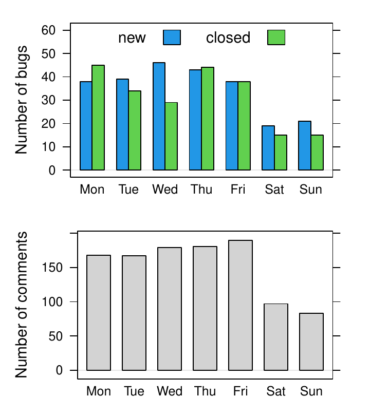

::: article
# R-devel selected changes

R 4.2.0 is due to be released around April 2022. The following gives a
selection of the most important changes in R-devel, which are likely to
appear in the new release.

## Native UTF-8 support and other changes on Windows

R on Windows now uses UTF-8 as the native encoding. This feature
requires recent Windows 10 or newer (or Windows Server 2022 or newer).
On older systems, a (non-Unicode) system locale encoding will be used as
in earlier versions of R. With this feature, it is now possible to work
with characters not representable in the locale encoding (e.g., with
Asian characters on European locales). Previously, such characters could
only be used with considerable care needed to prevent their
mis-representation or undesirable substitution. It is now possible to
use Unicode characters even in Rterm, the console front-end for R.

To make this possible, R switched to the Universal C Runtime (UCRT),
which is the new C library on Windows and has to be installed manually
on Windows 8.1 and older. The switch required a new toolchain targeting
UCRT. All code linked statically to R or R packages has to be rebuilt.
Therefore, a new toolchain bundle, Rtools42, has been created which
includes a recent GCC 10 compiler toolchain targeting 64-bit UCRT and a
set of pre-compiled static libraries for R packages. R and CRAN use this
new toolchain for R-devel (to become R 4.2.0). Older versions of R will
still use older toolchains. As from 4.2, R on Windows will no longer
support 32-bit builds. Rtools42, containing only the 64-bit toolchain,
is one step simpler to install for users than the earlier toolchain
bundle.

The change so far required updates of over 100 CRAN packages and several
of their Bioconductor dependencies. As these packages have a very large
number of reverse dependencies (packages depending recursively on them),
R gained support for automated installation-time patching of packages,
so that packages can be quickly patched and their reverse dependencies
tested, giving package authors more time to incorporate the updates.
This feature is experimental and may be removed in the future.

R allows package authors to maintain the same package sources for R 4.2
(Rtools42) and R 4.1 (Rtools40) by supporting `Makevars.ucrt` and other
make/configuration files with extension `.ucrt` which are used by R 4.2
in preference of their existing `.win` variants, but ignored by older
versions of R. Both toolchain bundles can coexist on the same machine.

The work on the toolchain and on testing CRAN packages has lead to the
discovery of new bugs in GCC: invalid unwind tables causing crashes (GCC
PR#103274), inconsistency in option handling related to unwind tables
(GCC PR#103465) and lack of support for UCRT/C99 format strings (GCC
PR#95130). Additional bugs were found that turned out to be fixed
already in later versions of GCC, but required a back-port (GCC
PR#101238, GCC PR#100402). Thanks to MinGW-W64 developer Martin Storsjo
and GCC developers Eric Botcazou and Martin Liska for their help with
identifying and resolving the issues. The Rtools42 toolchain bundle
includes patches for these and other, smaller, issues.

Following the philosophy that disruptive changes for users and package
authors should be rare, this seemed a good time to change also the
default personal library location. Now it is a subdirectory of the Local
Application Data directory (usually a hidden directory
`C:\\Users\\username\\AppData\\Local`). This is to follow Windows
conventions, but also to avoid problems users experienced with various
cloud backup/syncing services enabled by default for the personal
directory (usually `C:\\Users\\username\\Documents`). For the very same
reason, the default installation location for user-only installation has
been changed to `C:\\Users\\username\\AppData\\Local\\Programs`.

Additional bug fixes (e.g., for handling previously untested code paths
involving characters not representable in system locale encoding) and
improvements (e.g., removal of workarounds no longer needed with UCRT)
are being added following testing and reports from package authors and
are to appear in R 4.2.

More details on the changes in R for Windows and on what is required
from package authors are available in Tomas Kalibera et al. [blog
post](https://developer.r-project.org/Blog/public/2021/12/07/upcoming-changes-in-r-4.2-on-windows)
and material linked from there.

## Graphics changes

Support for isolated groups, compositing operators, affine
transformations, and stroking and filling paths has been added to the R
graphics engine. The existing support for masks has also been expanded
to include luminance masks. An R-level interface for these new features
has been added to the *grid* graphics package. See [Paul Murrell's blog
post](https://developer.r-project.org/Blog/public/2021/12/06/groups-and-paths-and-masks-in-r-graphics/index.html)
for more details. The changes to the R graphics engine mean that
packages that provide graphics devices, such as the *ragg* package, will
need to be reinstalled.

## Hash tables

Hash tables are data structures used to efficiently map *keys* to
*values*. Keys can be simple, such as strings or symbols, or more
complex objects, such as environments. Hash tables can be thought of as
generalizations of environments that allow more general key objects,
though without the notion of a parent table. Like environments, and
unlike most objects in R, hash tables are mutable.

Hash tables have been used internally in R for many years, in particular
in `match()`, `unique()`, and `duplicate()`, to improve the efficiency
of these functions. R-devel now provides an R level interface to the
hash table infrastructure used in these functions. The R level interface
is provided in package *utils*. New hash tables are created by
`hashtab()`; entries are created or modified by `sethash()`, and values
are retrieved with `gethash()`. More details are available in the help
page for `hashtab()`. The R level interface is based loosely on hash
table support in Common Lisp.

A C level interface will eventually be made available in the C API as
well. The details are still under development. Comparison of keys
typically is based on `identical()`, but can also be based on the memory
addresses of keys. Address-equality based tables are most likely to be
useful at the C level. For address-based hash tables it may be useful to
provide a weak version in which keys are not protected from garbage
collection and entries are scheduled for removal once keys are
determined to no longer be reachable.

## Other selected changes

-   `matrix(x, n, m)` now warns in more cases where `length(x)` differs
    from `n * m`, as suggested by Abby Spurdle and Wolfgang Huber in
    February 2021 on the R-devel mailing list. This warning can be
    turned into an error by setting environment variable
    `_R_CHECK_MATRIX_DATA_` to `TRUE`: `R CMD check –as-cran` does so
    unless it is already set.
-   `simplify2array()` gains an `except` argument for controlling the
    exceptions used by `sapply()`.
-   R on Windows now uses the system memory allocator. Doug Lea's
    allocator was used since R 1.2.0 to mitigate performance limitations
    seen with system allocators on earlier versions of Windows.
-   R gains more classed errors. Attempting to subset an object that is
    not subsettable now signals an error of class `notSubsettableError`,
    with the non-subsettable object contained in the `object` field of
    the error condition. Also, subscript-out-of-bounds and
    stack-overflow errors are now signaled as errors of class,
    respectively, `subscriptOutOfBoundsError` and `stackOverflowError`.
-   New partly experimental `Sys.setLanguage()` utility, solving the
    main problem of
    [PR #18055](https://bugs.r-project.org/show_bug.cgi?id=18055).
-   Deparsing no longer remaps attribute names `dim`, `dimnames`,
    `levels`, `names` and `tsp` to historical S-compatible names (which
    `structure()` maps back).

# Bug statistics for 2021

Summaries of bug-related activities over the past year were derived from
the database underlying [R's Bugzilla
system](https://bugs.R-project.org/). Overall, 244 new bugs or requests
for enhancements were reported, 220 reports were closed, and 1065
comments (on any report) were added by a total of 115 contributors. This
amounts to averages of about two new reports and two closures over three
days, and three comments per day. All totals are about 30% lower than in
2020, especially the number of closures. High bug activity in 2020 had
largely been driven by dedicated efforts of several contributors in
reviewing old reports.

<figure id="fig:bzstats">

<figcaption>Figure 1: Bug tracking activity by month (left) and weekday
(right) in 2021.</figcaption>
</figure>

Figure [1](#fig:bzstats) shows statistics for the numbers of new
reports, closures and comments by calendar month and weekday,
respectively, in 2021. The frequency of new reports was relatively
stable over the year except for a low in March/April. There tended to be
more new reports than closures, but this was reversed in
November/December in a revived effort to address old reports. The top 5
components reporters have chosen for their reports were "Low-level",
"Language", "Documentation", "Misc", and "Wishlist", which is the same
set as in 2020. Many reports are suggestions for enhancements and marked
as Wishlist but are sometimes also put in a specific component, ideally
with severity level "enhancement".

Bug discussions led to an average of 65 comments each month from January
to August 2021, which is less than in the same period of 2020 with an
average of 140 comments each month. Comment activity has increased again
in late 2021.

Last but not least, from the numbers by weekday in the right panels of
Figure [1](#fig:bzstats) we see that the R community is also active
during weekends, though at a lower frequency.

# Relaunch of search.R-project.org

A long time ago, Jonathan Baron (University of Pennsylvania, USA)
created an "R Site Search" database and has for many years provided a
web service for queries into this database, allowing the community to
search help files of CRAN packages, task views, vignettes, and initially
also the R-help mail archive. This web service was made available as
<https://search.R-project.org>, with simple and advanced R interfaces
provided by, respectively, functions `RSiteSearch()` in package *utils*
and CRAN package [*sos*](https://CRAN.R-project.org/package=sos) (see
the corresponding article on "Searching Help Pages of R Packages" in the
[R
Journal](https://journal.r-project.org/archive/2009/RJ-2009-017/index.html)).

The next generation of this web service was developed by Gennadiy
Starostin and is now hosted at Wirtschaftsuniversität Wien, Austria. In
doing so, there were two major changes.

First, the old service was based on the namazu search engine
(<http://www.namazu.org/>), which is no longer actively developed (last
release more than ten years old). After careful examination of available
open-source alternatives xapian-omega (<https://xapian.org/>) was chosen
as the new search engine, which provides the necessary versatility
alongside reasonable complexity. The most notable features of xapian are
ranked search, phrase and proximity searching, Boolean search operators,
Boolean filters, support for stemming of search terms, and allowing
simultaneous update and searching.

For compatibility reasons the server still supports requests in the
previously used namazu format (limited to the parameters used by the
former search engine). This compatibility feature may be dropped in the
future.

In addition to the human-readable output of search results, two other
formats are made available: "xml" and "opensearch". Simply change in the
URL `FMT=query` to either `FMT=xml` or `FMT=opensearch` when sending a
HTTP GET request to the server. One can tailor search queries using
additional parameters, see the query part of the URL in the default form
and the xapian-omega documentation.

Second, the covered CRAN content was expanded. Currently, there are
eight categories, any combination of which can be searched
simultaneously:

-   R manuals (currently based on the R-patched development branch)
-   Help pages of base packages (also from R-patched)
-   CRAN packages (5 categories): general info, news, readme files,
    vignettes, and help pages
-   CRAN task views

Although content of the majority of these categories is available on
CRAN to read and explore, two of them, the help pages of base and CRAN
packages, are additionally generated for `search.R-project.org`. As of
December 22, 2021, in terms of searchable documents they constitute
approximately 400,000 out of 450,000 total (about 89%).

Generating this content was not straightforward. HTML content is
preferable to PDF content for browsing search results, but the new R
help system works best for dynamic HTML (see the corresponding article
in the [R
Journal](http://journal.r-project.org/archive/2009-2/RJournal_2009-2_Murdoch+Urbanek.pdf)),
whereas for the search service, using static HTML is more appropriate.
The code for generating static HTML needed a bit of tweaking by Deepayan
Sarkar and Kurt Hornik, and now can (again) be used to provide help
files which are good for both searching and browsing.

In the future, `search.R-project.org` may be expanded with relevant
sources outside of CRAN, e.g., the Bioconductor project. Depending on
user feedback, which is always welcome, one can expect other
improvements.

# Acknowledgements

Tomas Kalibera's work on the article and R development has received
funding from the Czech Ministry of Education, Youth and Sports from the
Czech Operational Programme Research, Development, and Education, under
grant agreement No.CZ.02.1.01/0.0/0.0/15_003/0000421, from the European
Research Council (ERC) under the European Union's Horizon 2020 research
and innovation programme, under grant agreement No. 695412, and from the
National Science Foundation award 1925644.
:::
