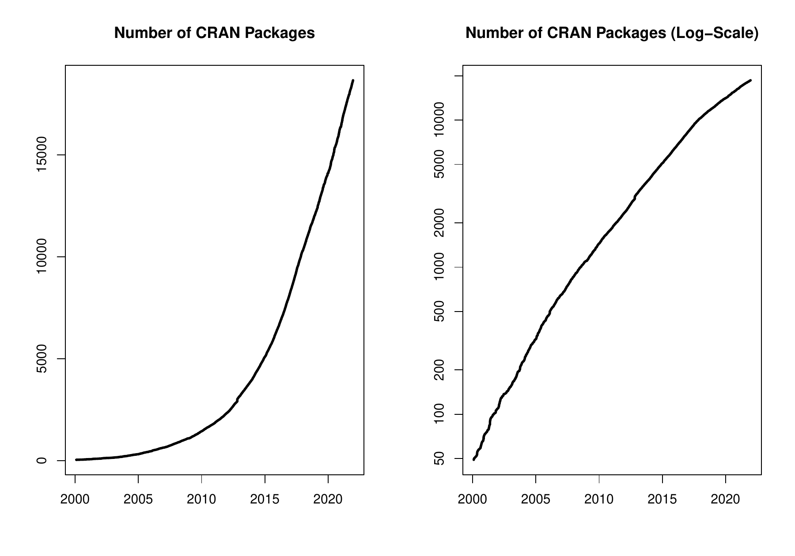

::: article
In the past 6 months, 1077 new packages were added to the CRAN package
repository. 113 packages were unarchived and 331 were archived. The
following shows the growth of the number of active packages in the CRAN
package repository:

{ width="100%" alt="graphic without alt-text"}

On 2021-12-31, the number of active packages was around 18650.

## Changes in the CRAN Repository Policy

The [Policy](https://CRAN.R-project.org/web/packages/policies.html) now
says the following:

-   You can check that the submission was received by looking at
    <https://CRAN.R-project.org/incoming/>.
-   A package showing issues for `macos-arm64` or an 'M1mac' additional
    issue should be checked using the
    [macbuilder](https://mac.r-project.org/macbuilder/submit.html)
    service prior to re-submission.

## CRAN package submissions

During the last half of 2021 (July 2021 to December 2021), CRAN received
12256 package submissions. For these, 21622 actions took place of which
14232 (66%) were auto processed actions and 7390 (34%) manual actions.

Minus some special cases, a summary of the auto-processed and manually
triggered actions follows:

::: center
  ----------------------------------------------------------------------------------------
             archive   inspect   newbies   pending   pretest   publish   recheck   waiting
  -------- --------- --------- --------- --------- --------- --------- --------- ---------
  auto          2748      2722      2577         0         0      3899      1362       924

  manual        2760       102       336       464        91      2797       671       169
  ----------------------------------------------------------------------------------------

  : 
:::

These include the final decisions for the submissions which were

::: center
  --------------------------------------
  action          archive        publish
  -------- -------------- --------------
  auto       2586 (21.5%)   3336 (27.8%)

  manual     2728 (22.7%)   3351 (27.9%)
  --------------------------------------

  : 
:::

where we only count those as *auto* processed whose publication or
rejection happened automatically in all steps.

Interestingly, for the first time in CRAN's history there was a decrease
in the number of submissions:

::: center
  ----------------------------
  Year     1st half   2nd half
  ------ ---------- ----------
  2018           NA      10259

  2019        13218      12938

  2020        17598      13510

  2021        16339      12256
  ----------------------------

  : 
:::

## CRAN mirror security

Currently, there are 101 official CRAN mirrors, 83 of which provide both
secure downloads via `https` *and* use secure mirroring from the CRAN
master (via rsync through ssh tunnels). Since the R 3.4.0 release,
`chooseCRANmirror()` offers these mirrors in preference to the others
which are not fully secured (yet).

## CRAN Task View Initiative

To facilitate the maintenance of established CRAN task views as well as
the proposal of new ones, a new improved and much more transparent
workflow has been established. It is overseen by the newly established
*CRAN Task View Editors*: Roger Bivand, Dirk Eddelbuettel, Rocío Joo,
David Meyer, Heather Turner, Nathalie Vialaneix, and Achim Zeileis. More
details can be found in the corresponding organization on GitHub:
<https://github.com/cran-task-views/ctv/>. Currently, the focus is on
the transition of the established task views to the new workflow which
also involves the archival of some task views which turned out to be too
broad to be maintainable (*Graphics* and *SocialSciences*). Also, the
*gR* task view has been renamed to *GraphicalModels*. When the
transition is completed, a more detailed introduction with further
details and instructions will be published soon.

## New packages in CRAN task views

[*Bayesian*](https://CRAN.R-project.org/view=Bayesian)

:   [*BayesianTools*](https://CRAN.R-project.org/package=BayesianTools),
    [*MHadaptive*](https://CRAN.R-project.org/package=MHadaptive),
    [*RoBMA*](https://CRAN.R-project.org/package=RoBMA).

[*Cluster*](https://CRAN.R-project.org/view=Cluster)

:   [*factoextra*](https://CRAN.R-project.org/package=factoextra).

[*Databases*](https://CRAN.R-project.org/view=Databases)

:   [*dittodb*](https://CRAN.R-project.org/package=dittodb).

[*DifferentialEquations*](https://CRAN.R-project.org/view=DifferentialEquations)

:   [*diffeqr*](https://CRAN.R-project.org/package=diffeqr).

[*Econometrics*](https://CRAN.R-project.org/view=Econometrics)

:   [*pdynmc*](https://CRAN.R-project.org/package=pdynmc),
    [*ssmrob*](https://CRAN.R-project.org/package=ssmrob).

[*Finance*](https://CRAN.R-project.org/view=Finance)

:   [*DOSPortfolio*](https://CRAN.R-project.org/package=DOSPortfolio),
    [*HDShOP*](https://CRAN.R-project.org/package=HDShOP),
    [*RTL*](https://CRAN.R-project.org/package=RTL),
    [*bidask*](https://CRAN.R-project.org/package=bidask),
    [*etrm*](https://CRAN.R-project.org/package=etrm),
    [*greeks*](https://CRAN.R-project.org/package=greeks),
    [*ichimoku*](https://CRAN.R-project.org/package=ichimoku),
    [*monobin*](https://CRAN.R-project.org/package=monobin),
    [*strand*](https://CRAN.R-project.org/package=strand).

[*FunctionalData*](https://CRAN.R-project.org/view=FunctionalData)

:   [*MFPCA*](https://CRAN.R-project.org/package=MFPCA),
    [*registr*](https://CRAN.R-project.org/package=registr).

[*Hydrology*](https://CRAN.R-project.org/view=Hydrology)

:   [*HBV.IANIGLA*](https://CRAN.R-project.org/package=HBV.IANIGLA),
    [*NPRED*](https://CRAN.R-project.org/package=NPRED),
    [*RavenR*](https://CRAN.R-project.org/package=RavenR),
    [*WASP*](https://CRAN.R-project.org/package=WASP),
    [*hydropeak*](https://CRAN.R-project.org/package=hydropeak),
    [*hydrotoolbox*](https://CRAN.R-project.org/package=hydrotoolbox),
    [*metR*](https://CRAN.R-project.org/package=metR),
    [*nhdR*](https://CRAN.R-project.org/package=nhdR),
    [*nhdplusTools*](https://CRAN.R-project.org/package=nhdplusTools),
    [*prism*](https://CRAN.R-project.org/package=prism).

[*MachineLearning*](https://CRAN.R-project.org/view=MachineLearning)

:   [*abess*](https://CRAN.R-project.org/package=abess)$^*$,
    [*islasso*](https://CRAN.R-project.org/package=islasso),
    [*joinet*](https://CRAN.R-project.org/package=joinet),
    [*mpath*](https://CRAN.R-project.org/package=mpath),
    [*torch*](https://CRAN.R-project.org/package=torch).

[*MetaAnalysis*](https://CRAN.R-project.org/view=MetaAnalysis)

:   [*amanida*](https://CRAN.R-project.org/package=amanida),
    [*metadat*](https://CRAN.R-project.org/package=metadat),
    [*nmarank*](https://CRAN.R-project.org/package=nmarank),
    [*ra4bayesmeta*](https://CRAN.R-project.org/package=ra4bayesmeta).

[*MissingData*](https://CRAN.R-project.org/view=MissingData)

:   [*BMTAR*](https://CRAN.R-project.org/package=BMTAR),
    [*Iscores*](https://CRAN.R-project.org/package=Iscores),
    [*MGMM*](https://CRAN.R-project.org/package=MGMM),
    [*cglasso*](https://CRAN.R-project.org/package=cglasso),
    [*cmfrec*](https://CRAN.R-project.org/package=cmfrec),
    [*mdgc*](https://CRAN.R-project.org/package=mdgc),
    [*mgm*](https://CRAN.R-project.org/package=mgm).

[*ModelDeployment*](https://CRAN.R-project.org/view=ModelDeployment)

:   [*lightgbm*](https://CRAN.R-project.org/package=lightgbm).

[*NumericalMathematics*](https://CRAN.R-project.org/view=NumericalMathematics)

:   [*FixedPoint*](https://CRAN.R-project.org/package=FixedPoint),
    [*GramQuad*](https://CRAN.R-project.org/package=GramQuad),
    [*bignum*](https://CRAN.R-project.org/package=bignum),
    [*rim*](https://CRAN.R-project.org/package=rim).

[*OfficialStatistics*](https://CRAN.R-project.org/view=OfficialStatistics)

:   [*SimSurvey*](https://CRAN.R-project.org/package=SimSurvey),
    [*eurostat*](https://CRAN.R-project.org/package=eurostat),
    [*insee*](https://CRAN.R-project.org/package=insee),
    [*rdhs*](https://CRAN.R-project.org/package=rdhs),
    [*tidyBdE*](https://CRAN.R-project.org/package=tidyBdE).

[*Optimization*](https://CRAN.R-project.org/view=Optimization)

:   [*gslnls*](https://CRAN.R-project.org/package=gslnls),
    [*stochQN*](https://CRAN.R-project.org/package=stochQN).

[*Psychometrics*](https://CRAN.R-project.org/view=Psychometrics)

:   [*DIFplus*](https://CRAN.R-project.org/package=DIFplus),
    [*semtree*](https://CRAN.R-project.org/package=semtree).

[*ReproducibleResearch*](https://CRAN.R-project.org/view=ReproducibleResearch)

:   [*Require*](https://CRAN.R-project.org/package=Require),
    [*gt*](https://CRAN.R-project.org/package=gt),
    [*huxtable*](https://CRAN.R-project.org/package=huxtable),
    [*makepipe*](https://CRAN.R-project.org/package=makepipe),
    [*pharmaRTF*](https://CRAN.R-project.org/package=pharmaRTF),
    [*r2rtf*](https://CRAN.R-project.org/package=r2rtf),
    [*reproducible*](https://CRAN.R-project.org/package=reproducible),
    [*styler*](https://CRAN.R-project.org/package=styler),
    [*unrtf*](https://CRAN.R-project.org/package=unrtf).

[*Robust*](https://CRAN.R-project.org/view=Robust)

:   [*RobStatTM*](https://CRAN.R-project.org/package=RobStatTM).

[*TimeSeries*](https://CRAN.R-project.org/view=TimeSeries)

:   [*BGVAR*](https://CRAN.R-project.org/package=BGVAR),
    [*GlarmaVarSel*](https://CRAN.R-project.org/package=GlarmaVarSel),
    [*STFTS*](https://CRAN.R-project.org/package=STFTS),
    [*brolgar*](https://CRAN.R-project.org/package=brolgar),
    [*esemifar*](https://CRAN.R-project.org/package=esemifar),
    [*mrf*](https://CRAN.R-project.org/package=mrf),
    [*mvLSW*](https://CRAN.R-project.org/package=mvLSW),
    [*profoc*](https://CRAN.R-project.org/package=profoc),
    [*rdbnomics*](https://CRAN.R-project.org/package=rdbnomics),
    [*synthesis*](https://CRAN.R-project.org/package=synthesis),
    [*tsBSS*](https://CRAN.R-project.org/package=tsBSS),
    [*tsdb*](https://CRAN.R-project.org/package=tsdb),
    [*tssim*](https://CRAN.R-project.org/package=tssim),
    [*uGMAR*](https://CRAN.R-project.org/package=uGMAR),
    [*ugatsdb*](https://CRAN.R-project.org/package=ugatsdb).

(\* = core package)
:::
