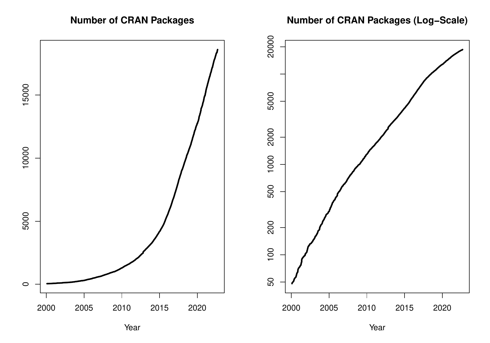

::: article
In the past 3 months, 485 new packages were added to the CRAN package
repository. 76 packages were unarchived, 1179 were archived and 3 had to
be removed. The following shows the growth of the number of active
packages in the CRAN package repository:

{width="100%" alt="graphic without alt text"}

On 2022-03-31, the number of active packages was around 18260.

## Changes in the CRAN Repository Policy

The [Policy](https://CRAN.R-project.org/web/packages/policies.html) now
says the following:

-   The ownership of copyright and intellectual property rights of all
    components of the package must be clear and unambiguous \[...\]
    ('All components' includes any downloaded at installation or during
    use.)
-   The package's `DESCRIPTION` file must show both the name and email
    address of a single designated maintainer (a person, not a mailing
    list). That contact address must be kept up to date, and be usable
    for information mailed by the CRAN team without any form of
    filtering, confirmation .... Forwarding mail from the maintainer
    address increasingly results in confusing non-delivery notifications
    to the original sender, so is best avoided.
-   Security provisions must not be circumvented, for example by not
    verifying SSL/TLS certificates.

[External Libraries for CRAN
packages](https://CRAN.R-project.org/web/packages/external_libs.html)
now says

-   For macOS: JAGS may or may not be available. There is an 'official'
    release for both architectures at
    <https://sourceforge.net/projects/mcmc-jags/files/JAGS/4.x/>.
-   For Windows: The build system for Windows changed with 4.2.0 and
    only that is considered here (and only 64-bit Windows is now
    supported).

## CRAN package submissions

In the second third of 2022 (May 2022 to August 2022), CRAN received
9860 package submissions. For these, 17476 actions took place of which
11354 (65%) were auto processed actions and 6122 (35%) manual actions.

Minus some special cases, a summary of the auto-processed and manually
triggered actions follows:

  ----------------------------------------------------------------------------------------
             archive   inspect   newbies   pending   pretest   publish   recheck   waiting
  -------- --------- --------- --------- --------- --------- --------- --------- ---------
  auto          2559      2660      1635         0         0      2830       933       737

  manual        2178       113       568       255        55      2226       595       132
  ----------------------------------------------------------------------------------------

  : 

These include the final decisions for the submissions which were

  --------------------------------------
  action          archive        publish
  -------- -------------- --------------
  auto       2462 (25.5%)   2311 (23.9%)

  manual     2156 (22.3%)   2735 (28.3%)
  --------------------------------------

  : 

where we only count those as *auto* processed whose publication or
rejection happened automatically in all steps.

A new team member, Benjamin Altmann, joined the CRAN submission team.
Welcome, Beni. Unfortunately, Gregor Seyer left the CRAN submission team
after processing 5482 incoming submissions. Thanks a lot!

## CRAN mirror security

Currently, there are 102 official CRAN mirrors, 80 of which provide both
secure downloads via `https` *and* use secure mirroring from the CRAN
master (via rsync through ssh tunnels). Since the R 3.4.0 release,
`chooseCRANmirror()` offers these mirrors in preference to the others
which are not fully secured (yet).

## CRAN Task View Initiative

There are three new task views:

[CausalInference](https://CRAN.R-project.org/view=CausalInference)

:   Maintained by Imke Mayer, Pan Zhao, Noah Greifer, Nick
    Huntington-Klein, and Julie Josse.

[Epidemiology](https://CRAN.R-project.org/view=Epidemiology)

:   Maintained by Thibaut Jombart, Matthieu Rolland, and Hugo Gruson.

[SportsAnalytics](https://CRAN.R-project.org/view=SportsAnalytics)

:   Maintained by Benjamin S. Baumer, Quang Nguyen, and Gregory J.
    Matthews.

Currently there are 39 task views (see
<https://cran.r-project.org/web/views/>), with median and mean numbers
of CRAN packages covered 101 and 112, respectively. Overall, these task
views cover 3668 CRAN packages, which is about 20% of all active CRAN
packages.
:::
