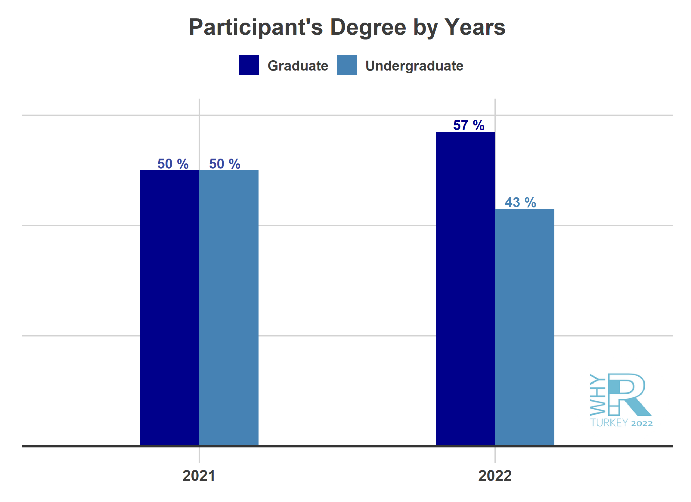

```{r setup, include=FALSE}
knitr::opts_chunk$set(echo = FALSE, warning = FALSE, message = FALSE)
```

# Motivation

The Why R? Turkey 2022 conference was a three-day online conference that was organized as a part of the Why R? Global conference series have been organized annually by the Why R? Foundation since 2017. It is known as one of the largest annual R conferences in Europe [@burdukiewicz2018; @burdukiewicz2019]. In addition to the main conference, pre-meetings are held in different cities from all over the world. One of these pre-meetings was organized with the invited speakers in Turkey in 2020. This online event was the first R conference in Turkey. In addition, as a result of the positive feedback received from the participants, the theme of the Why R? Turkey 2021 conference was determined immediately. Thereafter, the second R conference was organized in 2021 with invited speakers [@cavus2021]. The main objective was *to bring Turkish R users together from all over the world*, the second conference attracted a lot of attention with over 2000 registered participants.

```{r figure1, fig.align="center", echo=FALSE, fig.cap="The logo of Why R? Turkey 2022 Conference", out.width = '40%'}
knitr::include_graphics("figure1.png")
```

The main limitation of the conference in 2021 was that it consisted of invited speakers only. Upon the feedback from the participants, the conference structure was changed into having regular talks, lightning talks. In addition, the conference also had a practical side with workshops for both beginners and more experienced R users. In this way, the conference turned into a more participant-friendly format. The following subsections are summarizing the planning phase and the content of the events.

# Planning

After comparing several alternatives, it was decided to continue with *Zoom* ([zoom.us](zoom.us)) with one main account and six admins as the main platform for all events.

A mailing tool called *MailChimp*, which also has on admin account, was used to establish seamless communication with the scientific committee and all other participants in the organization.

Participation certificates for attendees, speakers, workshop tutors and panelists were prepared and delivered by using the *Sertifier* platform ([sertifier.com/tr/](sertifier.com/tr/)) at the end of the conference.

Numerous academic publishing houses were investigated for publishing proceeding book with E-ISBN and it was decided to work with *Nobel Publication House*. The electronic version of the proceeding book was provided by the international publishing house.

## Workshops

Five workshops ($\sim 1.5$ hour-long sessions), from beginner level to advanced level were organized. Three of the workshops were held in Turkish and two in English. Thus, it was ensured that participants from all over the world would benefit from them. Detailed contents provided by the tutors for the workshops. Each each workshop was recorded with the consent of the tutor and after the conference videos were published on Youtube. Details and Youtube links for each workshop can be found below.

1. [Introduction to R Programming](https://www.youtube.com/watch?v=jZTTjVNQRys) by [Ahmet Uraz Akgül](https://twitter.com/rpydaneogrendim) (Turkish):
R programming language is increasing its popularity day by day, including our country, and it has found use in almost every discipline. Being a free software, it has started to reach more people with its access to open source codes and the opportunities it offers. In such an environment, knowing the R programming language provides serious advantages. In the competitive software world, R can survive as a language worth learning; it may even be the language we use most often.

2. [Data Visualization with R](https://www.youtube.com/watch?v=cY8bBMKVizs) by [İnan Utku Türkmen](https://www.linkedin.com/in/inan-utku-turkmen/) and [Cansu Hürses](https://www.linkedin.com/in/cansu-h\%C3\%BCrses-7b7462176/) (Turkish):
As part of the data visualization workshop with R, we will cover basic visualization issues with the \CRANpkg{ggplot2} [@ggplot2] package, which is one of the most popular data visualization tools in the field of data science. Using this package we will practice how to create basic static chart types. We will see with examples how a chart can be customized by adding a title, specifying axis names, coloring according to certain categories, marking a specific region on the chart, and taking a section. During the workshop, we will create the interactive graphic in the link below, which is one of the famous visualizations of the *Gapminder* foundation, using R packages step by step: [https://www.gapminder.org/tag/map/](https://www.gapminder.org/tag/map/).

3. [Processing tabular data with tidyverse](https://www.youtube.com/watch?v=SzhnjbsFe4o) by [İmran Kocabıyık](https://www.linkedin.com/in/imrankocabiyik/) (Turkish):
Most of the data we use in practice are kept in tabular format. The purpose of use of these data, which are stored in databases and various types of files, may not always be analysis. For this reason, even if the data is kept in tabular form, it requires serious processing to model or analyze it. The \CRANpkg{dplyr} [@dplyr] and \CRANpkg{tidyr} [@tidyr] packages offer very simple and effective solutions for these processes.

4. [Introduction to Bioconductor](https://www.youtube.com/watch?v=r_X7_35aDMI) by [Nitesh Turaga](https://www.linkedin.com/in/niteshturaga/) (English):
This talk is an overview of the Bioconductor project which develops, supports, and disseminates free open source software, in the R programming language, that facilitates rigorous and reproducible analysis of data from current and emerging biological assays. The Bioconductor project has a large footprint around the world both in industry and academic research. We'll discuss the important aspects of project such as methods of contribution, programming paradigms - interoperability and data structure design, and differences to other projects to draw comparison. It will also include a brief introduction to essential genomics data structures that have been pillars to the Bioconductor ecosystem. We welcome participation as we are dedicated to building a diverse, collaborative, and welcoming community of developers and data scientists.

5. [Deep Learning using R](https://www.youtube.com/watch?v=Mg7e1B-J2Oo) by [Krystian Zielinski](https://www.linkedin.com/in/krystian-zieli\%C5\%84ski-53399a167/) (English):
Deep Learning is certainly not a future of technologies that surround us on a daily basis. It's too late -- it's already here. Just try to find a company that's not willing to enhance its products with AI driven algorithms. The data is there already, and the trust barrier is shrinking. It's to nobody's surprise -- if AI is used in very sensitive areas like banking, military or medicine, it can't be that bad. Netflix's recommendation algorithms, Google Lens, Self Driving cars -- you name it, Deep Learning is used everywhere. Thanks to many popular frameworks, training Neural Network model has never been so easy. You can find tutorials online, and based on them solve many problems. But after some time, the question arises: „How does this even work?" -- and you should really know the answer. In the workshops I'd like to show you how theory affects the practice. Based on many examples we will train DNN models, show its limits, check how parameters like e.g. activation function affect the training phase, suggest best practices in data preparation and DNN architecture, explain the model's predictions. If you're familiar with R -- this workshop is suited for you! If you're just starting with Deep Learning or already have some experience, come and join us - I bet you won't regret it!

## Short Tutorials

In addition to the workshops, short tutorials on three topics were organized. This type of event was planned to focus on more specific topics in longer duration than a regular talk. ($\sim 30$ mins each) Each workshop was recorded with the consent of the tutor and after the conference videos were published on Youtube. Details and Youtube links for each workshop can be found below.

1. [Spatial Analysis with R](https://www.youtube.com/watch?v=4LRYv36Ik2k) by [Fırat Gündem](https://www.linkedin.com/in/f\%C4\%B1rat-g\%C3\%BCndem-380496108/) (Turkish):
Open Data Portal applications of local governments both in America and Europe added a serious spatial dimension to data. The spatial dimension in question covers a wide area, from storing data in a way that includes spatial information (shape file, GeoJSON, etc.) to spatial data visualizations and analysis with spatial statistics and spatial econometric methods. The R program is constantly being renewed and expanded to include all spatial analysis techniques in the literature. Although there are many people who do spatial analysis with package programs such as ArcGIS, which are expensive and require personal licenses, RStudio allows to perform all spatial analyzes easily and free of charge with the libraries it contains. In this short study, all the basic steps of spatial analysis will be performed using a set of R libraries. For this, real spatial data from Turkey (GDP per capita on a provincial basis, etc.) will be used. Then, spatial data projection (sf, sp), neighborhood matrix creation and manipulation (rgdal), spatial data visualization and static and dynamic mapping \CRANpkg{ggplot2} [@ggplot2], \CRANpkg{tmap} [@tmap], \CRANpkg{leaflet} [@leaflet], three-dimensional mapping rayshader [@rayshader], spatial statistics \CRANpkg{rgeoda} [@rgeoda] in RStudio. and spatial econometric models will be introduced practically using the relevant R libraries. Thus, all necessary tools for spatial data science will be introduced in R and the use of R will be encouraged with user-friendly applications.

2. The R Application for Physics-Informed Neural Networks by [Melih Ağraz](https://www.linkedin.com/in/melih-agraz-5a45b737/) (Turkish): 
Physics-Informed Neural Networks (PINNs) is a deep learning framework designed to solve nonlinear differential equations using artificial neural networks, published in 2019. Simple deep feed-forward neural network architectures and automatic differentiation method are used to solve differential equations in PINNs method. The PINNs method was first developed with Python Tensorflow. In this study, we will show how the solution of the equation $y'-y=0$ for $y(0)=1$, $y(1)=e$ is solved by using \CRANpkg{reticulate} [@reticulate] library in R, with the help of PINNs method. This study is thought to find application area of PINNs method for R users as well. For this reason, a simple differential equation solution example such as $y' - y = 0$ is preferred.

3. [Serverless R in the Cloud - Deploying R into Production with AWS and Docker](https://www.youtube.com/watch?v=dgkm0QkWXag) by [İsmail Tigrek](https://www.linkedin.com/in/ismailtigrek/) (English):
This tutorial will walk through deploying R code, machine learning models, or Shiny applications in the cloud environment. With this knowledge, you will be able to take any local R-based project you've built on your machine or at your company and deploy it into production on AWS using modern serverless and microservices architectures. In order to do this, you will learn how to properly containerize R code using Docker, allowing you to create reproducible environments. You will also learn how to set up event-based and time-based triggers. We will build out a real example that reads in live data, processes it, and writes it into a data lake, all in the cloud.

## Panels

The panels were planned based on the sharing experience in an interactive environment, where the participants could come together with experts in different domains. *Biostatistics* and *R Education* were selected as major topics in these events. The links to the video recordings and detailed content of the panels are given below:

1. [Biostatistics and Applications in R](https://www.youtube.com/watch?v=ZDMXOOVqwI8) moderated by [Prof. Dr. Ergun Karaağaoğlu](https://www.linkedin.com/in/ergun-karaagaoglu-8960404b/) (Turkish):
[Prof. Dr. Recai Yücel](https://cph.temple.edu/about/faculty-staff/recai-yucel-tuo13025) (Temple University), [Prof. Dr. Mithat Gönen](https://www.mskcc.org/profile/mithat-gonen) (Memorial Sloan Kettering Cancer Center), and [Dr. Anıl Dolgun](https://www.linkedin.com/in/anildolgun) (CSL Limited) attended as the panelists. In this panel, current research studies on biostatistics and the importance of using R in this domain were discussed. In addition, information about how career development was positively affected by using R was shared by the panelists with the audience. Thus, it was ensured that the participants were informed about the importance of the R in this field.

2. [R Education](https://www.youtube.com/watch?v=z2gTRUO-G58) moderated by [Olgun Aydin](https://www.linkedin.com/in/olgun-aydin/) (Turkish): 
The main topic of the panel was how to teach R in academia. [Prof. Dr. Mine Çetinkaya-Rundel](https://www.linkedin.com/in/minec/) (Duke University), [Dr. Mine Doğucu](https://www.linkedin.com/in/minedogucu/) (University of California), and [Assoc. Prof. Dr. Kübra Kabasakal](https://www.linkedin.com/in/k\%C3\%BCbra-atalay-kabasakal-218a7131/) (Hacettepe University) attended as the panelists. The panelists shared their approach in terms of teaching R in different fields of academic stuides. Moreoever, the panelists shared examples from their teaching materials with the audience.


# Participants

The $1366$ participants were registered for the conference: $70\%$ of the participants were students and the rest were professionals who work for governmental institutions, companies from the private sector, and as academicians. The $43\%$ of the students are undergraduates, $26\%$ of them master studies and the $31\%$ are Ph.D. students.

```{r, fig.align="center", echo=FALSE, fig.cap="The percentage of the degree of the participant students by years", out.width = '60%'}

```

When the channels that the participants heard about the conference are examined, surprisingly, the percentage of participants who registered for the conference "on recommendation" was quite high ($26\%$), in addition to the social media channels (LinkedIn - $30\%$, Twitter - $26\%$, and Instagram - $12\%$) of which usage has increased in recent years.

```{r, fig.align="center", echo=FALSE, fig.cap="How did the participants hear about the conference?", out.width = '60%'}
knitr::include_graphics("figure3.png")
```

In the registration form, questions about participants' level of R knowledge and motivation of participants' to take part in Why R? Turkey 2022 were included to deeply analyze profile of the participants. The $69\%$ of the participants stated that they had taken or attended a course related to R before. They evaluated their R programming language usage levels as shown in Table 1.

```{r, eval = knitr::is_latex_output()}
d <- cbind(Level = c("Beginner", "Intermediate", "Advanced", "Never used"),
           Percent = c(38, 31, 9 ,22))
knitr::kable(d, caption = "The R Programming language usage levels of the participants")
```


It can be seen from Table 1 that $90\%$ of them did not attend a conference about R before. In this respect, the conference was held with an audience suitable for the purpose of expanding usage of R. The areas of their interest are *Data Visualization, Statistical Modeling, Big Data, Data Mining, Machine Learning, and Deep Learning*, respectively. The events planned for Why R? Turkey 2022 that motivated them register the conference are respectively: *Scientific Sessions* ($40\%$), *Workshops* ($35\%$) and *Panels* ($26\%$).


# Evaluation

An evaluation questionnaire was conducted after the event to measure the satisfaction with the conference and to collect suggestions future organizations [@cordoba2019]. The satisfaction part of the questionnaire consists of two questions: (1) general satisfaction and (2) the interaction level between the presenters and the listeners. The results of the questionnaire are quite positive in terms of the answer of the respondents. On a scale of $0-5$, the mean of the satisfaction score is $4.74$ with $0.46$ standard deviation. Besides that, the mean of the interaction score is $4.50$ with $0.69$ standard deviation.

The second part of the questionnaire consists of the questions related to the motivation of the respondents regarding attendance and being a presenter for the next edition of the conference. According to the responses, although nearly all of the respondents ($99\%$) plan to attend the conference in the next years, $30\%$ aim to participate to as a presenter.

The last part of the questionnaire is about the suggestions from the respondents. The suggestions generally focus on increasing the duration of regular talks and workshops. In addition, among the speakers, the higher number of private sector employees and the mention of sector or freelance job opportunities were among the most prominent suggestions. Respondents strongly mentioned that next events, which has been held online for two years, should be held face-to-face in the coming years to increase its effectiveness.


# Summary

Why R? Turkey 2022, as the next edition of Why R? Turkey 2021 conference, was the first R conference with call for papers held in Turkey. This conference aimed to encourage researchers and professionals, who are R users and developers, to share their work with a wider audience. This conference was organized as a user-friendly conference, taking into account the feedback received in the previous year's version. In addition to scientific sessions, workshops, short tutorials, and panels were organized to broaden the content of the event. According to the evaluation survey made right after the conference, the participants stated that they were very satisfied and they would like to participate as a presenter to Why R conferences in the upcoming years. This finding demonstrates that the organisers of the conference succeeded the goals.


# Organizers

The Organizing Committee of Why R? Turkey 2022 consisted of eight Turkish researchers from three different countries: Turkey, Poland, and United Kingdom. It consisted of [Mustafa Cavus](https://www.linkedin.com/in/mustafacavusphd/) (Warsaw University of Technology, Eskisehir Technical University), [Olgun Aydin](https://www.linkedin.com/in/olgun-aydin/) (Gdansk University of Technology, Why R? Foundation), [Filiz Karadag](https://www.linkedin.com/in/filizkaradag/) (Ege University), [Ugur Dar](https://www.linkedin.com/in/ugurdar/) (Eskisehir Technical University), [Ozan Evkaya](https://www.linkedin.com/in/ozanevkaya/) (University of Edinburgh), [Derya Turfan](https://www.linkedin.com/in/derya-turfan-460498229/) (Hacettepe University), [Ozancan Ozdemir](https://www.linkedin.com/in/ozancan-\%C3\%B6zdemir-40b94768/), [Deniz Bezer](https://www.linkedin.com/in/deniz-bezer-55ab7519b/) (Middle East Technical University).


# Acknowledgement

As an organization committee, we would like to thank \href{https://www.linkedin.com/in/mkosinski/}{Marcin Kosinski} for his suggestions and support during the preparation part of the conference, \href{https://www.linkedin.com/in/klaudia-korniluk/}{Klaudia Korniluk} for designing our graphics, and \href{https://www.microsoft.com/en-us/research/people/ercosgun/}{Erdal Cosgun}, \href{https://avesis.erciyes.edu.tr/gokmenzararsiz}{Gokmen Zararsiz} for their guidance in general and also organizing the some of the panels and workshops. Moreover, we would like to thank the sponsors that support the Why R? Turkey 2022, \href{https://www.rstudio.com/}{R Studio}, \href{https://visbanking.com/}{Visbanking} as gold sponsor, \href{https://www.routledge.com/go/crc-press}{CRC Press} as the award sponsor, \href{https://appsilon.com/}{Appsilon} and \href{https://www.jumpingrivers.com/}{Jumping Rivers} silver sponsor.


# Additional Information

Further information about the conference such as website of the conference, recordings for regular, lightning talks, workshops and panels, materials, proceeding book and social media accounts used for the conference can be reached out via following links:

* Website: [https://whyr.pl/2022/turkey/](https://whyr.pl/2022/turkey/)
* Abstract book: [https://www.nobelyayin.com/why-r-turkiye-2022-konferansi-18447.html](https://www.nobelyayin.com/why-r-turkiye-2022-konferansi-18447.html)
* YouTube channel: [https://www.youtube.com/c/WhyRTurkey](https://www.youtube.com/c/WhyRTurkey)
* Twitter: [https://twitter.com/whyrturkey](https://twitter.com/whyrturkey)
* LinkedIn: [https://www.linkedin.com/company/why-r-turkey/](https://www.linkedin.com/company/why-r-turkey/)
* Instagram: [https://www.instagram.com/whyrturkey/](https://www.instagram.com/whyrturkey/) 

