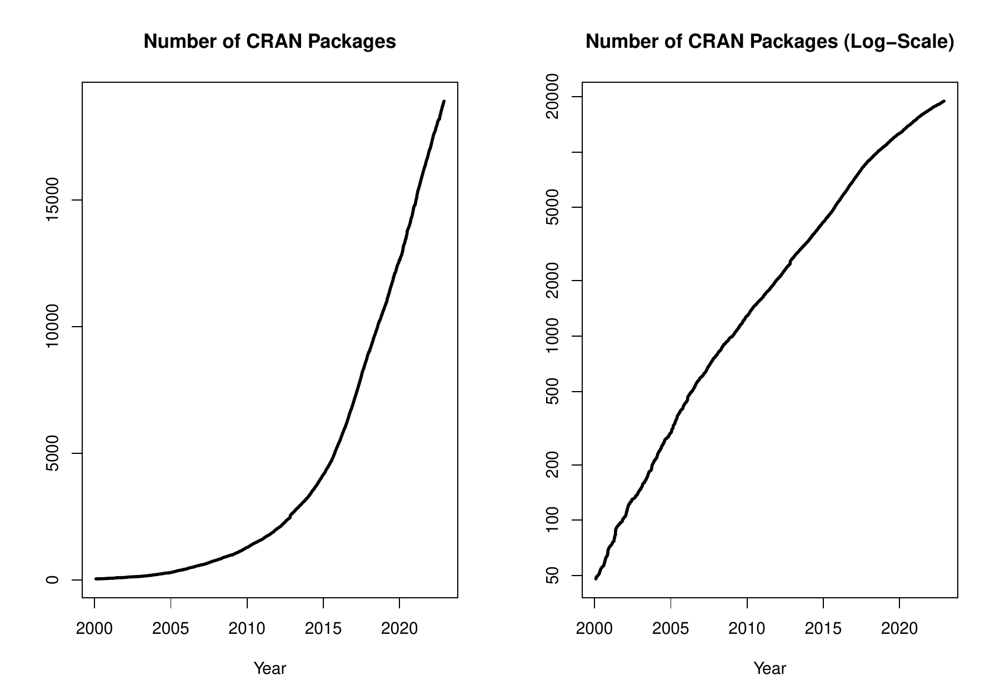

::: article
In the past 4 months, 664 new packages were added to the CRAN package
repository. 154 packages were unarchived, 353 were archived and 6 had to
be removed. The following shows the growth of the number of active
packages in the CRAN package repository:

{width="100%" alt="graphic without alt text"}

On 2022-10-31, the number of active packages was around 18730.

## CRAN package submissions

From September 2022 to October 2022 CRAN received 5227 package
submissions. For these, 9429 actions took place of which 6070 (64%) were
auto processed actions and 3359 (36%) manual actions.

Minus some special cases, a summary of the auto-processed and manually
triggered actions follows:

  ----------------------------------------------------------------------------------------
             archive   inspect   newbies   pending   pretest   publish   recheck   waiting
  -------- --------- --------- --------- --------- --------- --------- --------- ---------
  auto          1335      1211       926         0         0      1560       513       525

  manual        1250        35       325       232        39      1054       353        71
  ----------------------------------------------------------------------------------------

  : 

These include the final decisions for the submissions which were

  --------------------------------------
                  archive        publish
  -------- -------------- --------------
  auto       1283 (25.1%)   1239 (24.3%)

  manual     1222 (23.9%)   1361 (26.7%)
  --------------------------------------

  : 

where we only count those as *auto* processed whose publication or
rejection happened automatically in all steps.

## CRAN mirror security

Currently, there are 100 official CRAN mirrors, 81 of which provide both
secure downloads via `https` *and* use secure mirroring from the CRAN
master (via rsync through ssh tunnels). Since the R 3.4.0 release,
`chooseCRANmirror()` offers these mirrors in preference to the others
which are not fully secured (yet).

## CRAN Task View Initiative

There are three new task views:

[Agricultural Science](https://CRAN.R-project.org/view=Agriculture)

:   Maintained by Julia Piaskowski, Adam Sparks, and Janet Williams.

[Mixed, Multilevel, and Hierarchical Models in R](https://CRAN.R-project.org/view=MixedModels)

:   Maintained by Ben Bolker, Julia Piaskowski, Emi Tanaka, Phillip
    Alday, and Wolfgang Viechtbauer.

[Phylogenetics](https://CRAN.R-project.org/view=Phylogenetics)

:   Maintained by William Gearty, Brian O'Meara, Jacob Berv, Gustavo A.
    Ballen, Diniz Ferreira, Hilmar Lapp, Lars Schmitz, Martin R. Smith,
    Nathan S. Upham, and Jonathan A. Nations.

Currently there are 42 task views (see
<https://cran.r-project.org/web/views/>), with median and mean numbers
of CRAN packages covered 102 and 115, respectively. Overall, these task
views cover 4015 CRAN packages, which is about 21% of all active CRAN
packages.
:::
