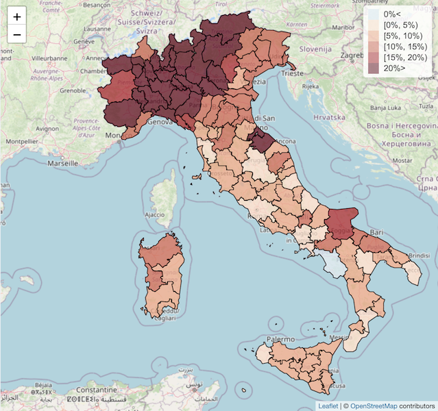

# Introduction

This Shiny App illustrates the use of the R programming language to estimate the excess mortality caused by the COVID-19 pandemic during 2020 in Italy. Hence, it provides a framework for estimating excess mortality for any other countries. The associated paper is currently available as a [pre-print](https://arxiv.org/abs/2201.06458) and it is a follow-up paper of papers *G. Konstantinoudis et al. (2022)*, published in [Nature Communications](https://doi.org/10.1038/s41467-022-28157-3), and *Riou et al. (2022)*, published in [Nature Communications](https://doi.org/10.1038/s41467-022-35770-9).

The excess of mortality has been estimated by comparing the average number of deaths under the alternative scenario of absence of the pandemic (estimated using Bayesian hierarchical models with population and mortality data from period 2015-2019) to the actual observed mortality data. The excess  mortality has been summarised using the following criteria:

* **Relative excess mortality (REM)**: The increased mortality (expressed as a proportion) as compared to the mean deaths under the alternative scenario of absence of the pandemic.

* **Number of excess deaths (NED)**: The actual number of excess deaths as compared to the mean deaths under the alternative scenario of absence of the pandemic.

To summarise these estimates the posterior mean, median and 95% credible intervals are reported in the results included in this App. Furthermore, it
has also been reported 
the posterior probability of REM being higher than 100 and
the posterior probability of NED being higher than zero. Both posterior probabilities are referred to as *posterior probability* throughout this App.

This App gives access to results at a finer resolution than the results presented in the paper. For this reason, for certain age and sex groups at certain NUTS3 areas the estimates may be unstable. Hence, you should interpret them with care or use a higher aggregation level instead.

'Inf' values may appear for some NUTS3 areas (or weeks in the temporal plots) for some combinations of age and sex when the expected number of deaths is zero. These values should be interpreted as that there is not enough information as to provide reliable estimates of the observed number of deaths.

# How to use the App?

Esentially, this App will allow you to navigate through the different excess mortality estimates discussed in the paper according to country, administrative level, age group and sex. The user can select these variables from the different drop-down menus on the left and the results can be accessed by clicking on the differnt tabs in the top-left part of the App. The different tabs are described below.

* **Introduction**: Provides a summary of the App.

* **Spatial Analysis**: Shows estimates at different administrative levels (national, NUTS2 and NUTS3).

  * *Summary*: A short summary of the values accross all administrative regions.

  * *Excess mortality*: Estimates of the REM and NED (including summary statistics).

* **Temporal Analysis**: Provides weekly estimates at national level.

  * *Summary*: A short summary of the values accross all administrative regions (in this case, only the national values are reported).

  * *Excess mortality*: Estimates of the REM and NED (including summary statistics).
  * *Observed and Excess mortality*: Observed number of deaths and estimates of the REM and NED (including summary statistics). 

* **Spatio-Temporal Analysis**: Shows weekly estimates at different administrative levels. These are shown after clicking on the area of interest.

  * *Summary*: A short summary of the values accross all administrative regions (in this case, only the national values are reported).

  * *Excess mortality*: Estimates of the REM and NED (including summary statistics).

# Data declaration

Italian data for the analyses included in the paper and this App have been obtained from [Instituto Nazionale di Statistica (ISTAT)](https://www.istat.it/en/). Note that data licenses allow us to distribute the actual mortality data. For more information about how to access these data please refer to the source linked before.

